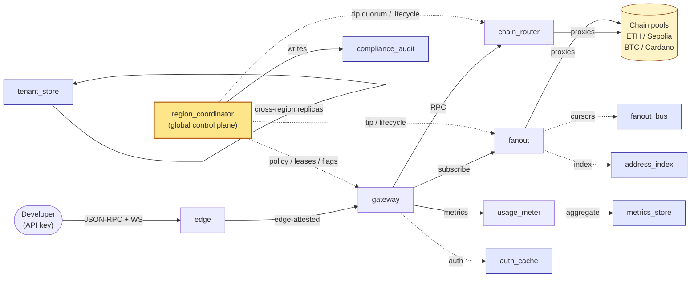
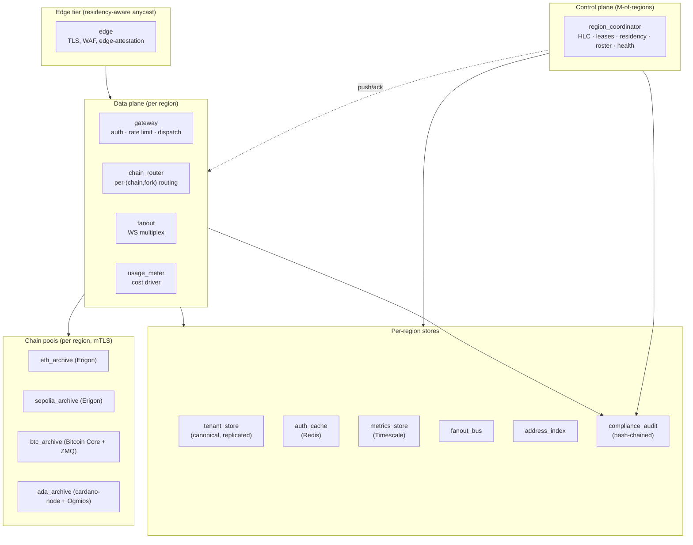
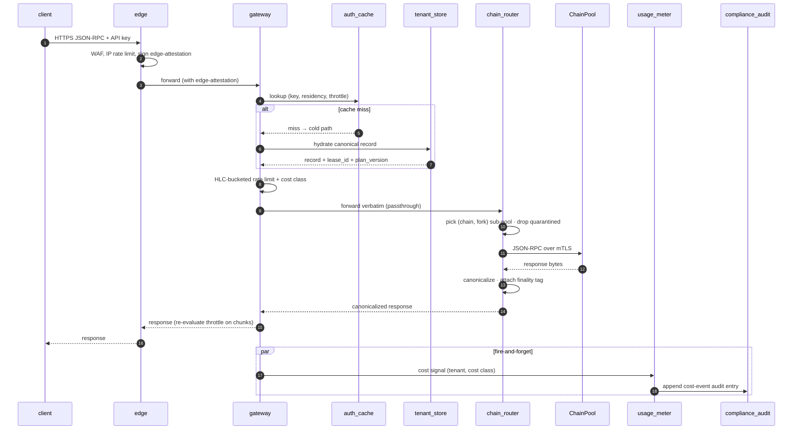
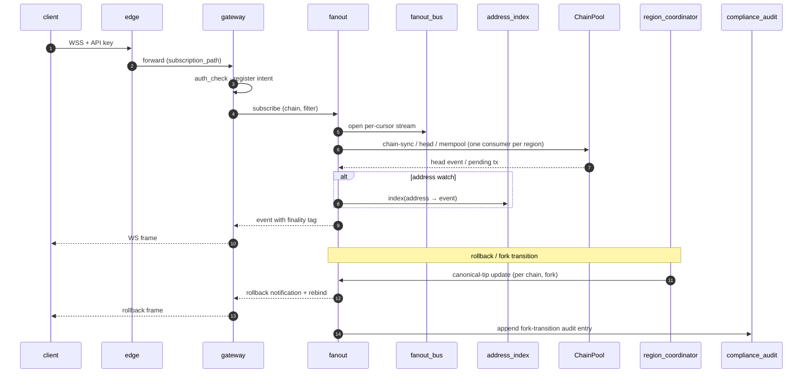
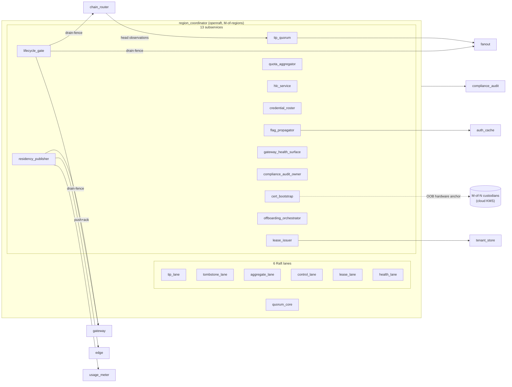
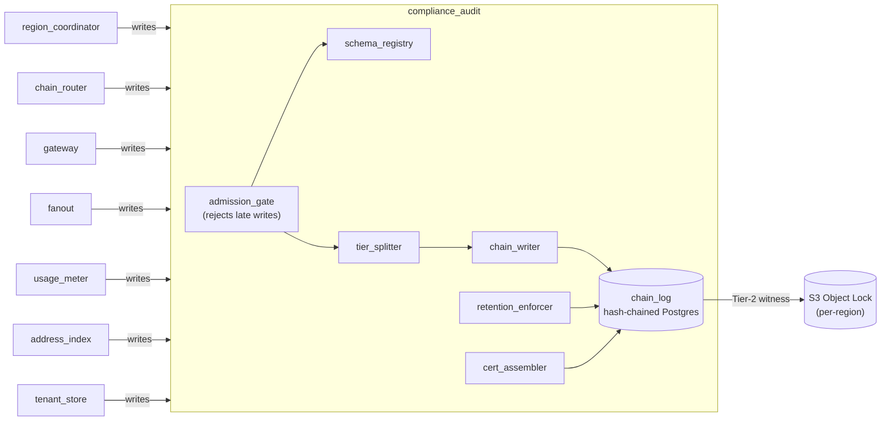
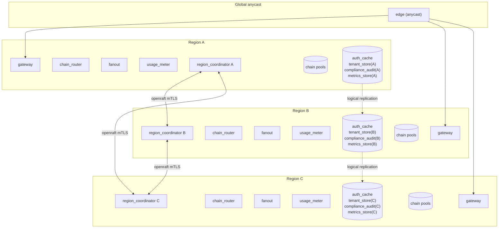

# Architecture overview — Blockchain Event Gateway

> A multi-tenant, multi-region API service that gives developers JSON-RPC + WebSocket access to Ethereum mainnet, Sepolia, Bitcoin, and Cardano on-chain data — current and historical — with reorg-safe semantics, per-key rate limits, residency-pinned tenant data, and crypto-shred compliance audit.

---

## At a glance

| | |
| --- | --- |
| Problem | Programmatic read access to four chains (ETH/Sepolia/BTC/ADA) over each chain's native JSON-RPC + WS surface, multi-tenant, reorg-safe |
| Spec version | `v10` (hardened) |
| Plan | `gateway-v1` — 71 implementation tasks across 10 dependency waves |
| Top-level nodes | **17** — 4 ChainPools, 6 Stores, 6 Services, 1 Client |
| Edges (root) | **39** — calls / reads_from / writes_to / proxies_to / connects_to |
| Languages | Rust everywhere (`tokio` + `axum` + `tonic` + `jsonrpsee`) |
| Substrate | Kubernetes 1.30+, **one cluster per region** |

---

## What it does, in one picture

The four major flows (request, subscribe, coordinate, audit) all share the same auth path and the same compliance trail.

---

## Component map

### Tiers

### Each box, in one line

| Component | Type | Role |
| --- | --- | --- |
| `edge` | Service | Anycast TLS terminator; signs **edge-attestation** every gateway request must carry |
| `gateway` | Service | Authenticates, rate-limits, dispatches RPC vs WS vs metrics; emits cost signals |
| `chain_router` | Service | Per-`(chain, fork)` routing across replicas; canonicalizes, quarantines, drains |
| `fanout` | Service | Consumes chain head/mempool **once per region**, multiplexes to N WS subscribers |
| `usage_meter` | Service | Per-tenant cost aggregation; cross-region delta reporting |
| `region_coordinator` | Service | Global control plane on **openraft** quorum across regions |
| `tenant_store` | Store | Canonical tenant + key + plan record; CAS-on-`(record_version, lease_id)` |
| `auth_cache` | Store | Redis credential / rate-limit cache; HLC-bounded pending markers |
| `metrics_store` | Store | TimescaleDB; ≥30d usage / error / latency / headroom |
| `fanout_bus` | Store | Redis Streams + Postgres cursors; in-region multiplex bus |
| `address_index` | Store | Per-chain `address → event` index for sub-linear address-watch matching |
| `compliance_audit` | Store | Append-only **hash-chained** Postgres (Tier-1) + S3 Object Lock (Tier-2) |
| `eth_archive` / `sepolia_archive` | ChainPool | Erigon archive + pruned tier StatefulSets |
| `btc_archive` | ChainPool | Bitcoin Core with `txindex` + ZMQ rawmempool publisher |
| `ada_archive` | ChainPool | cardano-node + Ogmios bridge (chain-sync / state-query / tx-monitor) |
| `client` | Client | Rust SDK on crates.io: JSON-RPC + WS with reconnect/cursor resumption |

---

## How a JSON-RPC request flows

Two things to notice:

- **Edge-attestation is mandatory.** Gateway rejects any request that doesn't carry one — there is no implicit network-position trust.
- **Hot path never blocks.** Cache miss spawns a cold-path hydration; the request either rejects with cache-miss or continues on a documented optimistic path.

---

## How a WebSocket subscription flows

Why fanout sits behind `fanout_bus`: chain-streams are consumed **once per region** (head + mempool). The bus then multiplexes to N gateway-side subscriber instances using portable cursors with chain-derived ordering, so reconnect storms don't fan out into the chain pool.

---

## The control plane (`region_coordinator`)

`region_coordinator` is the only component that runs as a true cross-region cluster — an `openraft` quorum with one replica per region, talking over `tonic` + `rustls` mTLS. Every per-region data-plane service treats it as the source of truth for global facts.

Each lane has a distinct retention class so high-volume tombstones can't starve low-volume control messages. Residency policy activation is a **2PC**: PREPARE requires a quarantine-and-relocate ack from `tenant_store`, then COMMIT activates `V+1` region-wide, with explicit ABORT semantics.

### Three governance properties worth knowing

1. **Single-writer-per-tenant** is enforced by `lease_issuer`: every tenant has an HLC-bounded lease token, and `tenant_store` writes are CAS on `(record_version, lease_id)`.
2. **M-of-N operator credentials** govern roster mutations, override admissions, and emergency anchor use. The roster itself is published through a 2PC with monotonic `roster_version`.
3. **Emergency cert recovery** is rooted in an out-of-band hardware anchor — cloud KMS keys held by geographically and organizationally distinct custodians — distinct from the day-to-day mTLS chain.

---

## The compliance audit

Every operational write plane writes directly to `compliance_audit` over an authenticated append-only RPC — never through a shared operational data path that an operational compromise could rewrite.

### Two-tier audit material

| Tier | What's in it | Key | Erasure behaviour |
| --- | --- | --- | --- |
| **Tier 1** | Full audit payload incl. tenant-identifying fields | Per-tenant audit-encryption key | **Crypto-shred** on tenant erasure (key destroyed) |
| **Tier 2** | Structural witness: event type, HLC, originating component, hash commitment to Tier-1 | Organizational long-lived (under OOB anchor) | **Never erased** |

After tenant erasure, the hash chain is intact, Tier-1 entries are unreadable, and a regulator can still verify _structure-and-presence_ of every event from Tier-2. The **certificate-of-deletion** is a typed entry (`full-ack` / `partial-with-witnesses` / `erasure-incomplete`) that vouches for this.

---

## Multi-region shape

- **Stateless services** (`gateway`, `edge`, `chain_router`, `fanout`, `usage_meter`) run per region and scale horizontally.
- **`region_coordinator`** is one cluster spanning regions — only place where Raft crosses region boundaries.
- **`tenant_store`** is canonical per region with logical replication for cross-region reads. Tenant data is **residency-pinned**: a tenant's records live in their assigned region(s) and writes are gated by the active `policy_version`.
- **`compliance_audit`** has per-region buckets and DBs; Tier-2 witnesses are also replicated to per-region S3 with Object Lock in compliance mode.

---

## Cross-cutting invariants worth internalizing

1. **Residency is a 2PC with cold-start pre-warm.** Every consumer (`edge`, `gateway`, `usage_meter`, `metrics_store`) must ack readiness before `residency_publisher` activates a tightening change. On cold-start, consumers pre-warm hydrate the active version inline before serving residency-pinned traffic.
2. **HLC everywhere.** Every operation is HLC-stamped. Skew above threshold → documented degraded mode. Lease TTLs, audit-key destruction fences, drain-fence ack windows are all clock-skew-bounded.
3. **Drain-fence-then-teardown.** When a tenant is offboarding **and** a node is being torn down, drain-fence flush comes first; the node either finishes its flush or writes a durable handoff record naming a successor. A drain-ack is never retracted once emitted.
4. **No resurrection.** After an erasure tombstone for tenant `T` at HLC `T_e`, any cascade with HLC > `T_e` is rejected with a documented reason. Late cascades with HLC < `T_e` apply only to a frozen audit-projection.
5. **Forks are explicit.** `chain_router` partitions every pool by `(chain, fork)` sub-pool. A fork transition is a handshake-ack between `region_coordinator`'s tip quorum, `chain_router`, and `fanout` — durable, with monotonic per-cursor ordering across rollback-then-forward-progress.

---

## Technology stack

| Concern | Tech |
| --- | --- |
| Service runtime | Rust + tokio + axum + tonic + jsonrpsee + tokio-tungstenite |
| OLTP | PostgreSQL 16 per region; sqlx + refinery; logical replication |
| Cache | Redis 7 cluster per region (TTL + Streams) |
| Audit | Postgres hash-chain (Tier-1) + S3 Object Lock compliance mode (Tier-2) |
| Time-series | Timescale extension on Postgres |
| Cross-region consensus | openraft + tonic + rustls mTLS |
| Substrate | Kubernetes 1.30+, **one cluster per region**, Helm charts per Service |
| Workload identity | SPIRE/SPIFFE; cert-manager |
| Secrets / PKI | cert-manager + cloud KMS; OOB anchor held by M-of-N custodians |
| Observability | OpenTelemetry → Prometheus + Grafana + Tempo + Loki per region |
| Chain nodes | Erigon (ETH/Sepolia) · Bitcoin Core + ZMQ (BTC) · cardano-node + Ogmios (ADA) |
| Tests | `cargo test` + `insta` (unit) · `testcontainers-rs` + `wiremock-rs` (integration) · `criterion` (perf) |
| Client SDK | `chain-gateway-client` Rust crate on crates.io |

---

## Build order (dependency waves)

The `gateway-v1` plan organizes 71 implementation tasks into **10 dependency waves**. Bottom of the stack is built first; integration tasks gate each service.

```mermaid
graph LR
    W1["Wave 1<br/>30 tasks<br/>(chain pools, stores,<br/>raft lanes, leaf services)"]
    W2["Wave 2<br/>15 tasks<br/>(per-service engines)"]
    W3["Wave 3<br/>12 tasks<br/>(coordinators,<br/>chain_router integration)"]
    W4["Wave 4<br/>3 tasks<br/>(compliance_audit,<br/>tenant_store integration)"]
    W5["Wave 5<br/>2 tasks<br/>(region_coordinator<br/>integration, auth_check)"]
    W6["Wave 6<br/>3 tasks<br/>(usage_meter, fanout, listener)"]
    W7["Wave 7<br/>3 tasks<br/>(gateway subroles)"]
    W8["Wave 8<br/>1 task<br/>(gateway integration)"]
    W9["Wave 9<br/>1 task (edge)"]
    W10["Wave 10<br/>1 task (client)"]

    W1 --> W2 --> W3 --> W4 --> W5 --> W6 --> W7 --> W8 --> W9 --> W10
```

---

## Where to look next

- [`tasks/README.md`](tasks/README.md) — full task tree + wave breakdown, every task linked
- [`tasks/<service>/README.md`](tasks/) — per-service integration task with internal architecture diagram and child tasks
- `archi plan show` — live plan summary
- `archi plan task show <id>` — canonical source for any single task
- `archi query visualize --layer epistatic` — full graph as Mermaid

---

_Generated from the `archi` spec at `gateway-v1` / `v10`. Diagrams are Mermaid; render in any GitHub-flavored Markdown viewer._
