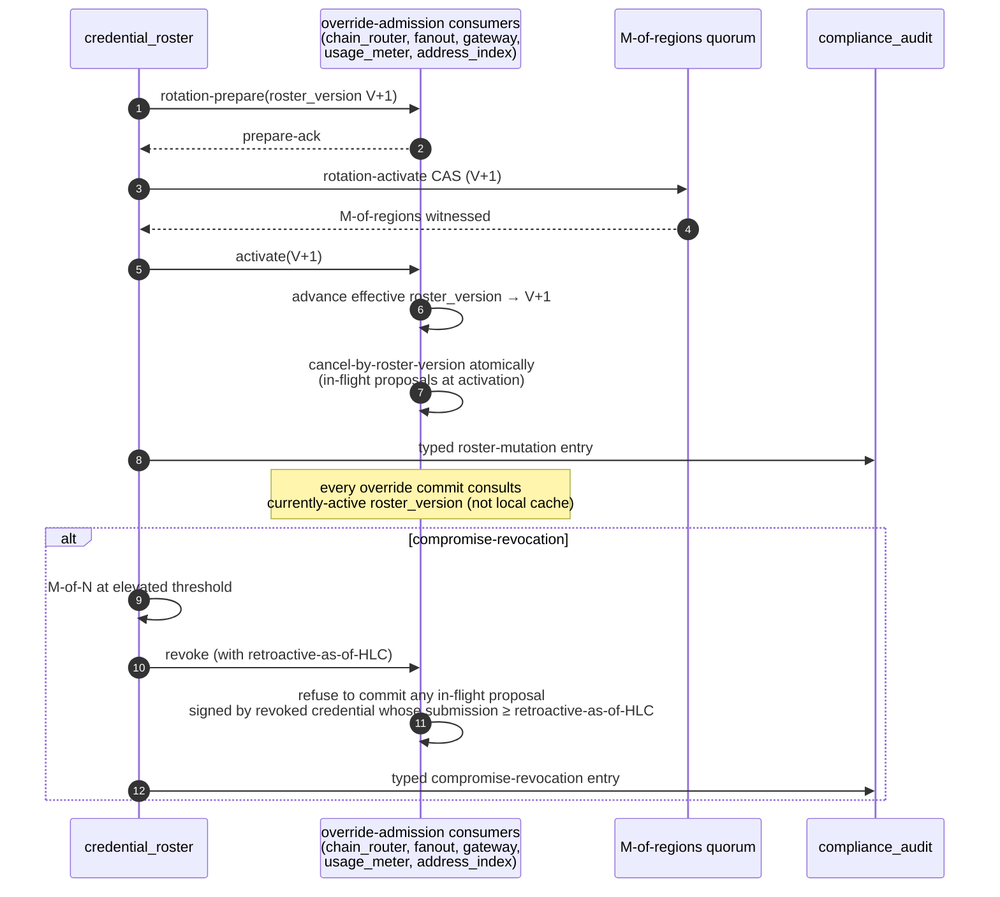
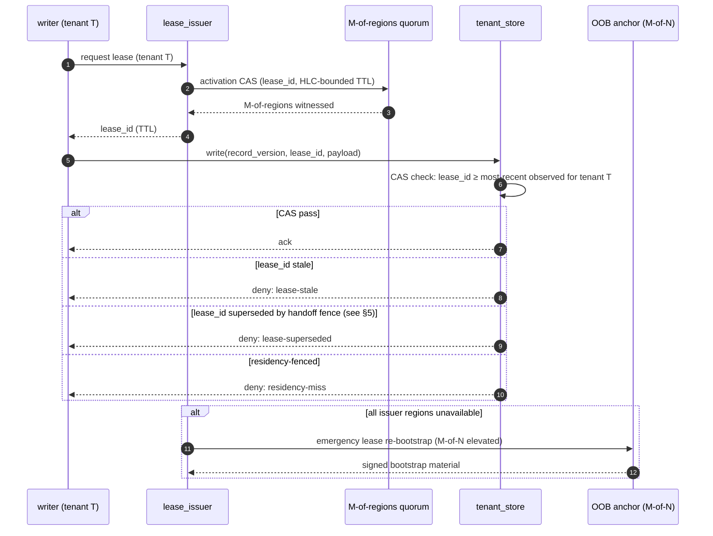
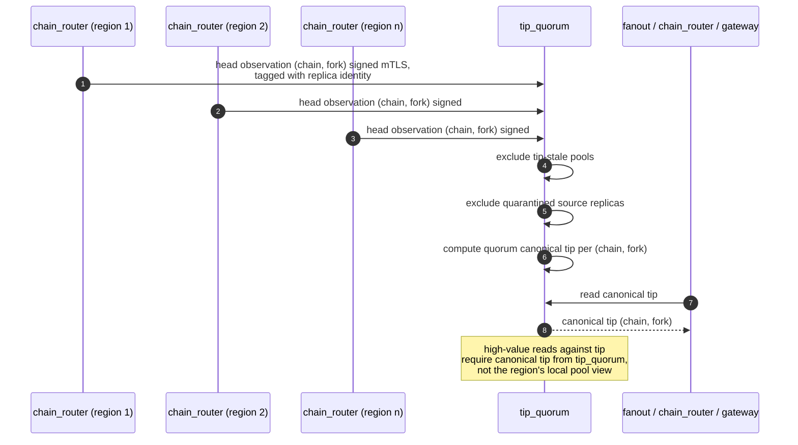
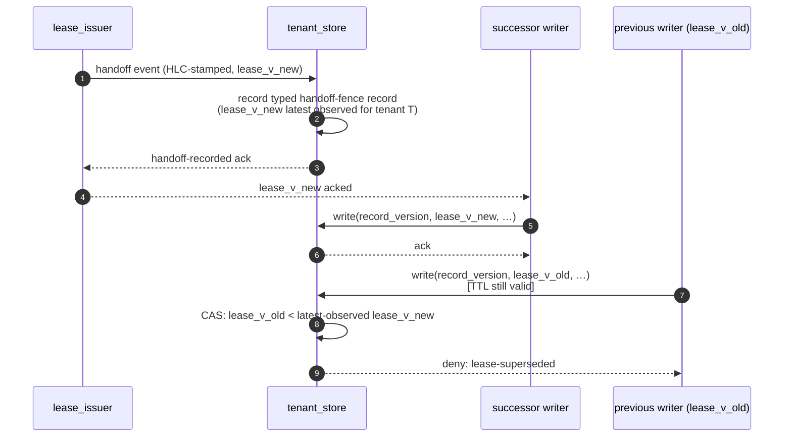
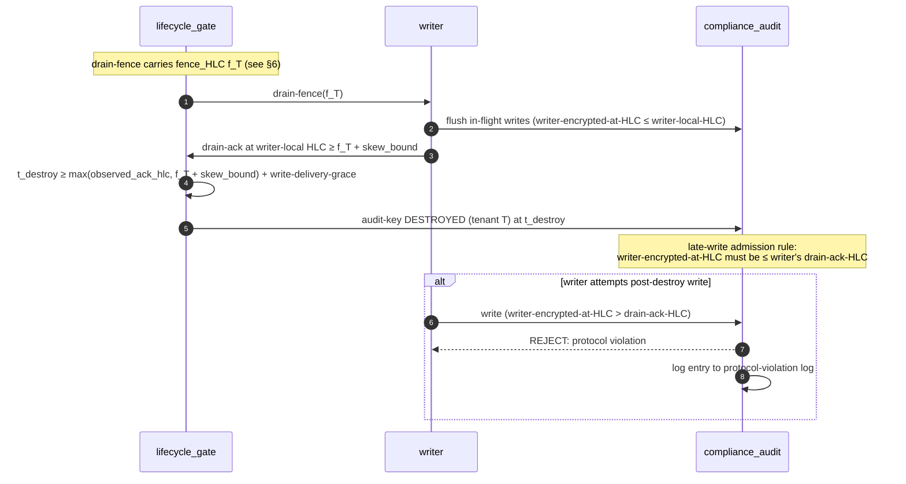
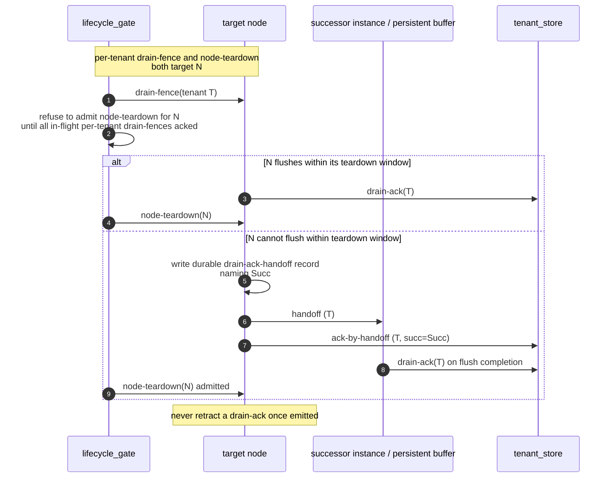
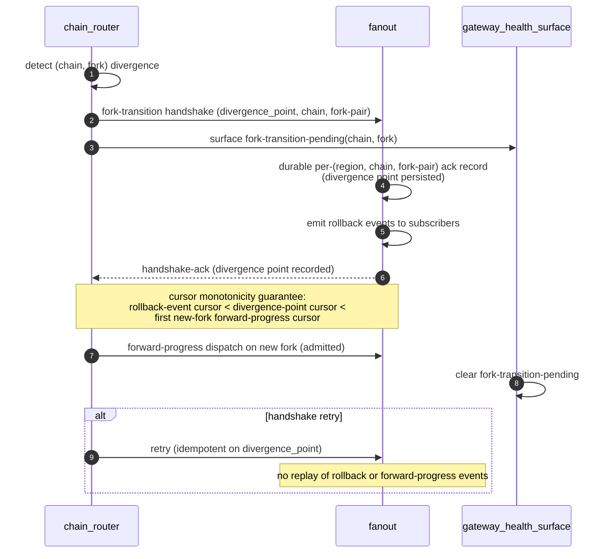
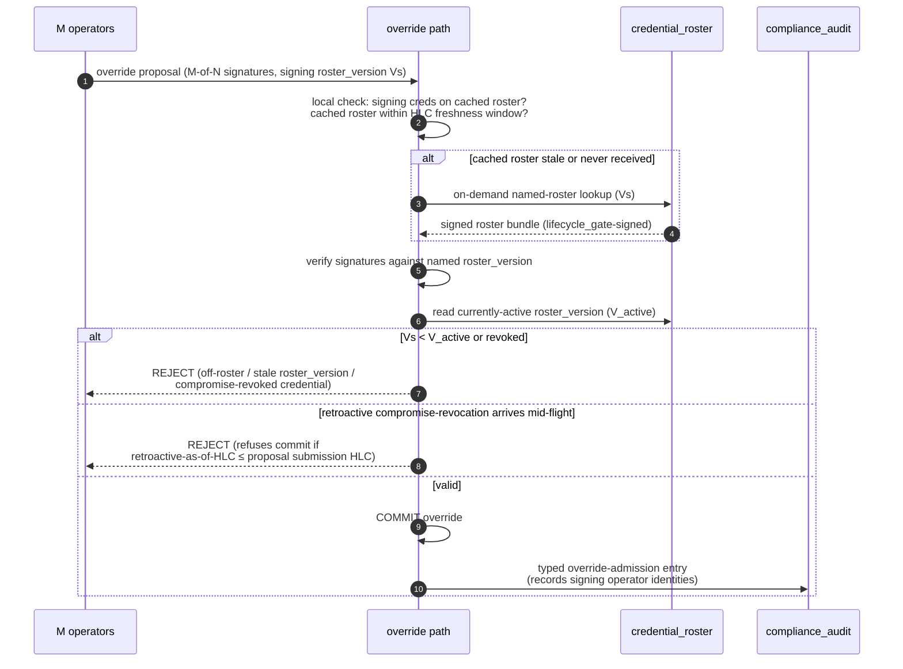
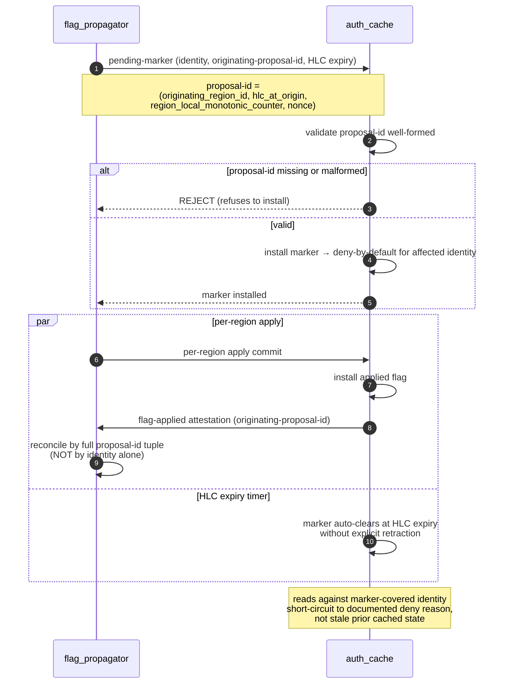
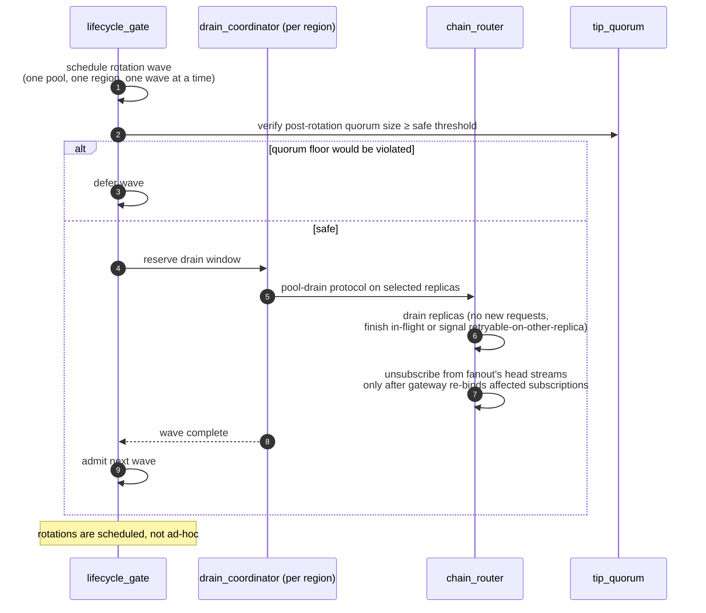

# Distributed Transactions & Coordination Protocols (v10)

Source: `archi` spec, root scope, version `v10`. Each section below names the protocol, its participants, the mermaid diagram, and step-by-step annotations grounded in the spec definitions.

Categories:
- **Strict 2PCs** — §1, §2
- **Quorum-witnessed activation CASs** — §3, §4
- **HLC-bounded fences** — §5, §6, §7, §8, §9
- **M-of-N authorization** — §10, §11
- **Composite attestation assembly** — §12
- **Pending-marker apply** — §13
- **Single-writer scheduling** — §14

---

## §1 — Residency policy_version 2PC

Atomically activate residency policy version `V+1` across all consumers, with `tenant_store` as the PREPARE-phase participant that must complete tenant quarantine-and-relocate before commit.

**Participants:** `region_coordinator.residency_publisher` (coordinator) · `tenant_store` (PREPARE participant) · `edge`, `gateway`, `usage_meter`, `metrics_store` (ack-ready consumers) · M-of-regions (witnesses)

```mermaid
sequenceDiagram
    autonumber
    participant RP as residency_publisher
    participant TS as tenant_store
    participant Q as M-of-regions quorum
    participant C as edge / gateway / usage_meter / metrics_store
    participant CA as compliance_audit

    RP->>TS: PREPARE(V+1)
    TS->>TS: quarantine + relocate tenant data
    TS-->>RP: PREPARE-ack (quarantine-and-relocate-complete)
    Note over TS: enters V+1-prepared,<br/>HLC-bounded prepared-window starts
    RP->>Q: COMMIT CAS (V+1)
    Q-->>RP: M-of-regions witnessed
    RP->>C: activate V+1 (push-and-acknowledge)
    C-->>RP: ack-ready V+1 (monotonic per consumer)

    alt window expires without commit/abort
        TS->>TS: PREPARED-ORPHAN degraded mode
        TS->>CA: typed prepared-orphan entry
        TS->>RP: alarm lifecycle_gate
        Note over TS: refuses further V+1 prepares;<br/>recovery requires M-of-N operator action
    else abort path
        RP->>Q: ABORT CAS with monotonic abort_id
        Q-->>RP: M-of-regions witnessed
        RP->>TS: rollback(V+1, attempt_id)
        TS->>TS: idempotent on (tenant_key, V+1, attempt_id)
        TS->>CA: typed abort entry
    end
```

**Annotated steps**
1. PREPARE: residency_publisher broadcasts the V+1 transition; tenant_store quarantines and relocates affected tenant data to comply with V+1.
2. PREPARE-ack: tenant_store enters `V+1-prepared` and acks; the prepared-window is HLC-bounded.
3. COMMIT: M-of-regions quorum witnesses the activation CAS.
4. Consumers (edge, gateway, usage_meter, metrics_store) ack-ready V+1 inline; ack-tracking is monotonic per `(consumer, policy_version)`.
5. **PREPARED-ORPHAN**: if the window expires without commit-or-abort, tenant_store enters degraded mode — no silent self-resolution; recovery requires explicit M-of-N operator action.
6. **ABORT**: also an M-of-regions quorum-witnessed CAS with monotonic `abort_id`. Rollback is idempotent on `(tenant_key, V+1, attempt_id)`; in-flight writes admitted under V+1-prepared that never observed commit are quarantined as `prepared-orphan-write`.

---

## §2 — Credential-roster rotation 2PC

Atomically advance the operator-credential `roster_version` across every override-admission consumer, with cancel-by-roster-version of in-flight proposals at activation.

**Participants:** `region_coordinator.credential_roster` (coordinator) · `chain_router`, `fanout`, `gateway`, `usage_meter`, `address_index` (override-admission consumers) · M-of-regions (witnesses)



**Annotated steps**
1. PREPARE: credential_roster broadcasts `rotation-prepare(V+1)` to every override-admission consumer.
2. PREPARE-ack: each consumer acks readiness on the push-and-acknowledge channel.
3. ACTIVATE CAS: rotation-activate is M-of-regions quorum-witnessed.
4. Consumers advance effective roster_version only on observing activation — not on prepare alone.
5. In-flight override proposals at activation are cancelled atomically by roster_version.
6. **Cross-component ordering invariant**: every override commit consults `region_coordinator`'s currently-active `roster_version` (not the locally-cached value), so a laggard local cache cannot admit a proposal the activated roster has invalidated.
7. **Compromise-revocation**: M-of-N at elevated threshold; carries `retroactive-as-of-HLC`; consumers refuse to commit in-flight proposals whose submission HLC ≥ retroactive-as-of-HLC.
8. Every roster mutation writes a typed entry to `compliance_audit`.

---

## §3 — Per-tenant single-writer lease (issuance / renewal / revocation)

Issue a per-tenant single-writer lease token via M-of-regions quorum-witnessed activation; tenant_store enforces uniform `CAS-on-(record_version, lease_id)`.

**Participants:** `region_coordinator.lease_issuer` (issuer) · `tenant_store` (CAS enforcer) · M-of-regions (witnesses) · OOB anchor (emergency re-bootstrap)



**Annotated steps**
1. Writer requests a lease for tenant T from `lease_issuer`.
2. lease_issuer activates the lease via M-of-regions quorum-witnessed CAS; the lease carries an HLC-bounded TTL.
3. Writer presents `(record_version, lease_id)` on every write.
4. tenant_store enforces uniform CAS across all sub-nodes (per-residency partition or per-key shard cannot diverge): a write whose `lease_id` is strictly older than the most-recently-observed `lease_id` for that tenant is rejected regardless of the writer's TTL.
5. Three distinct deny classes are surfaced: `lease-stale`, `lease-superseded` (set by handoff fence — see §5), `residency-miss`.
6. **Emergency re-bootstrap**: if all issuer regions are simultaneously unavailable, lease_issuer re-bootstraps rooted in the OOB anchor under M-of-N elevated authorization.

---

## §4 — Cross-region canonical-tip quorum

Compute a single canonical tip per `(chain, fork)` across regions by quorum over authenticated head observations, excluding tip-stale and quarantined sources.

**Participants:** `chain_router` replicas (per region, observation submitters) · `region_coordinator.tip_quorum` (aggregator) · `fanout`, `chain_router`, `gateway` (canonical-tip consumers)



**Annotated steps**
1. Each `chain_router` replica submits authenticated head observations per `(chain, fork)` over mTLS to `tip_quorum`, tagged with the source replica identity so adversarial sources can be quarantined.
2. tip_quorum excludes votes from chain pools currently in `tip-stale` state, so a stalled regional pool cannot anchor the global canonical-tip view.
3. tip_quorum excludes quarantined source replicas.
4. The canonical tip per `(chain, fork)` is computed by quorum across regions.
5. Consumers (fanout, chain_router itself for high-value reads, gateway) read the canonical tip; the region's local pool view is not authoritative for high-value tip reads.

---

## §5 — Lease-handoff fence

Atomically hand off the per-tenant single-writer lease from old writer to successor without admitting any in-flight TTL-valid old-lease writes after the fence.

**Participants:** `region_coordinator.lease_issuer` · `tenant_store`



**Annotated steps**
1. lease_issuer emits an HLC-stamped handoff event to tenant_store carrying `lease_v_new`.
2. tenant_store records a typed handoff-fence record before acking — the fence pins `lease_v_new` as the latest observed lease_id for tenant T.
3. Only after the handoff-recorded ack does lease_issuer ack `lease_v_new` to the successor writer.
4. The successor begins writing under `lease_v_new`.
5. A TTL-valid write under `lease_v_old` arriving after the fence is rejected with `lease-superseded` — a third deny class distinct from `lease-stale` (TTL expired) and `residency-miss`.

---

## §6 — Drain-fence broadcast-and-ack (per-tenant erasure)

Flush every operational write plane's in-flight audit writes for tenant T to `compliance_audit` and collect acks before tenant_store finalizes the erasure attestation.

**Participants:** `region_coordinator.lifecycle_gate` (originator) · writers: `region_coordinator`, `chain_router`, `gateway`, `fanout`, `address_index`, `usage_meter` · `tenant_store` (collector) · `compliance_audit` (sink)

```mermaid
sequenceDiagram
    autonumber
    participant LG as lifecycle_gate
    participant W as writer<br/>(region_coordinator / chain_router / gateway /<br/>fanout / address_index / usage_meter)
    participant CA as compliance_audit
    participant TS as tenant_store

    LG->>CA: drain-fence broadcast-emit attestation<br/>(fence_HLC f_T, signed, named roster_version)
    LG->>W: drain-fence(tenant T, f_T)
    W->>W: durable phase marker: RECEIVED
    W->>W: phase: FLUSH-IN-PROGRESS
    W->>CA: flush in-flight audit writes for T
    W->>W: phase: FLUSH-COMPLETE
    W->>TS: drain-ack(tenant T, writer-local HLC ≥ f_T + skew_bound)
    W->>W: phase: ACK-EMITTED → ATTESTATION-WRITTEN → TERMINAL
    W->>CA: attestation entry

    TS->>TS: collect drain-acks from every named writer

    alt all acked within HLC-bounded ack window
        TS->>CA: assemble certificate-of-deletion (full-ack) — see §12
    else retry-budget exhausted
        alt residency = STRICT
            TS->>CA: erasure-incomplete (operator remediation required)
        else residency = PARTIAL-WITH-WITNESSES
            TS->>CA: certificate (partial-with-witnesses)
            Note right of TS: witnesses = broadcast-emit attestation +<br/>in-region observer ack of missing writer reachable<br/>at broadcast-emit-time
        end
    end

    Note over LG,W: bulk-offboarding admitted in bounded waves<br/>with explicit per-writer back-pressure;<br/>per-tenant ack window starts at per-tenant ack-broadcast-emit-HLC,<br/>not bulk action HLC
```

**Annotated steps**
1. lifecycle_gate writes a broadcast-emit attestation to compliance_audit and broadcasts the drain-fence (HLC `f_T`, signed; broadcast carries its own named `roster_version`).
2. Each writer maintains a durable per-`(offboarding_id, component_id)` phase marker progressing through `RECEIVED → FLUSH-IN-PROGRESS → FLUSH-COMPLETE → ACK-EMITTED → ATTESTATION-WRITTEN → TERMINAL`.
3. Writer flushes in-flight audit writes for tenant T to compliance_audit.
4. Writer acks drain to tenant_store at writer-local HLC ≥ `f_T + skew_bound`. Writers never retract a drain-ack.
5. tenant_store collects drain-acks; retries unacked deliveries with exponential backoff bounded by per-tenant retry budget (in turn bounded by HLC offboarding window).
6. **STRICT** finalization: emit `erasure-incomplete` to compliance_audit; operator-driven remediation required.
7. **PARTIAL-WITH-WITNESSES** finalization: certificate is typed `partial-with-witnesses` (machine-distinguishable from `full-ack`), backed by broadcast-emit attestation + in-region observer ack of missing writer reachable at broadcast-emit-time. Best-effort-without-witnesses is **not** a permitted finalization mode.
8. Bulk-offboarding is admitted in bounded-size waves with documented `max-tenants-per-wave` and inter-wave spacing; per-writer bounded queues exert back-pressure to lifecycle_gate.

---

## §7 — Audit-key destruction fence (two-phase clock-skew-bounded)

Ensure no audit write encrypted under tenant T's audit-key can land after the key is destroyed, using HLC ordering bounded by the inter-region skew_bound.

**Participants:** `lifecycle_gate` · writers · `compliance_audit`



**Annotated steps**
1. The drain-fence broadcast (§6) carries `fence_HLC f_T`.
2. Writers must ack at writer-local HLC ≥ `f_T + skew_bound` — this guarantees that any write the writer will subsequently emit is encrypted at an HLC observably greater than `f_T`.
3. lifecycle_gate issues `audit-key DESTROYED` for tenant T at `t_destroy ≥ max(observed_ack_hlc, fence_HLC + skew_bound) + write-delivery-grace`, leaving room for in-flight writes to land.
4. compliance_audit's inbound admission check rejects any per-tenant write whose `writer-encrypted-at-HLC > writer's drain-ack-HLC` for the same tenant — a write that violates the ack-after-write contract is **not** silently shred by the missing key; it is rejected at admission and logged in the protocol-violation log.
5. The crypto-shred mechanism applies only to entries that landed *before* the writer's drain-ack-HLC; their decryption is impossible after key destruction by design.

---

## §8 — Teardown-overlap sequencing

Sequence per-tenant drain-fence flush before per-node teardown when both target the same node, using a durable handoff record when a node cannot complete the flush in its teardown window.

**Participants:** `lifecycle_gate` · target node · `tenant_store` · successor instance / persistent buffer



**Annotated steps**
1. lifecycle_gate refuses to admit node-teardown until *all* in-flight per-tenant drain-fences targeting that node have been acked.
2. Within the teardown window, the preferred ordering is **flush-then-ack-then-teardown**.
3. If the node cannot flush within its teardown window, it writes a durable `drain-ack-handoff` record naming a successor instance or persistent buffer.
4. The node sends `ack-by-handoff` to tenant_store; the successor completes the flush and emits the drain-ack on the node's behalf.
5. Once a drain-ack is emitted (direct or by handoff), it is **never** retracted.

---

## §9 — Fork-transition handshake

Atomically transition `chain_router` and `fanout` to a new `(chain, fork)` after divergence detection, preserving per-cursor monotonicity across the rollback-then-forward-progress sequence.

**Participants:** `chain_router` (origin) · `fanout` · `gateway_health_surface`



**Annotated steps**
1. chain_router detects an unannounced consensus split and emits a structured fork-transition handshake to fanout naming the divergence point.
2. fork-transition-pending is surfaced on gateway_health_surface per `(chain, fork)` so edge can shift routing.
3. fanout records a durable per-`(region, chain, fork-pair)` ack of the divergence point.
4. fanout emits rollback events to subscribers up to the divergence point.
5. fanout acks the handshake.
6. **Per-cursor monotonicity**: rollback-event cursor < divergence-point cursor < first new-fork forward-progress cursor. Forward-progress dispatch on the new fork is admitted only after the handshake-ack.
7. **Retry idempotency**: handshake retries do not replay rollback or forward-progress events.
8. Internal subscription rollback-and-rebind state machine is explicitly deferred to a future fanout zoom (Direction 22 candidate).

---

## §10 — Operator-override admission (M-of-N)

Admit operator overrides at named override paths only when the proposal carries M-of-N signatures from credentials on the currently-active roster, with cross-component ordering enforced at commit.

**Participants:** override path (`chain_router.pool_membership_manager`, `chain_router.drain_coordinator force-complete`, `region_coordinator.tip_quorum override`, `lifecycle_gate force-complete`) · `region_coordinator.credential_roster` · `compliance_audit`



**Annotated steps**
1. M operators jointly sign an override proposal carrying `signing_roster_version Vs`.
2. The override path verifies signing credentials are on its cached roster and the cache is within the documented HLC-bounded freshness window.
3. If the cache is stale or the broadcast names a `Vs` strictly newer than the local cache, the path fetches the bundle via `credential_roster`'s on-demand named-roster lookup endpoint (lifecycle_gate-signed response).
4. **Cross-component ordering**: every override commit consults `credential_roster`'s currently-active roster_version `V_active` — not the local cache — so a laggard cache cannot admit a proposal the activated roster has invalidated.
5. Reject if `Vs < V_active`, signing credential is off-roster, or compromise-revocation invalidates any in-flight signature (including retroactive compromise-revocation whose `retroactive-as-of-HLC` predates the proposal submission HLC).
6. On commit, write a typed `override-admission` entry to compliance_audit recording the signing operator identities.
7. Falls to deny-by-default when the cached roster is older than the freshness window or when no roster has ever been received.

---

## §11 — OOB-anchor cert-bootstrap & re-rooting

Recover the inter-region channel cert chain (and re-bootstrap leases when all issuer regions are unavailable) from an out-of-band trust anchor distinct from the inter-region channel.

**Participants:** `region_coordinator.cert_bootstrap` · OOB anchor (M-of-N hardware-rooted custodians) · operators · `compliance_audit`

```mermaid
sequenceDiagram
    autonumber
    participant Ops as operators
    participant CB as cert_bootstrap
    participant OOB as OOB anchor<br/>(M-of-N hardware-rooted custodians,<br/>geographically + organizationally distinct)
    participant CA as compliance_audit

    Note over CB: triggered when inter-region channel cert<br/>has expired or is unavailable;<br/>consensus over channel impossible

    Ops->>CB: human authorization (M-of-N, elevated threshold)
    CB->>OOB: cert re-rooting request
    OOB->>OOB: M-of-N quorum across distinct custodians
    OOB-->>CB: signed re-rooted cert material
    CB->>CA: audit entry (OOB-anchor use & cert re-rooting)

    alt anchor rotation
        Ops->>CB: rotate anchor (M-of-N elevated)
        CB->>OOB: rotation procedure
        CB->>CA: audit entry (anchor rotation)
    end

    alt availability test
        CB->>OOB: scheduled availability test (documented cadence)
        OOB-->>CB: ok
    end
```

**Annotated steps**
1. cert_bootstrap exposes an OOB emergency surface used only when consensus over the inter-region channel is impossible (channel cert expired/unavailable).
2. OOB anchor: M-of-N quorum of hardware-rooted material distributed across geographically and organizationally distinct custodians, distinct from the inter-region channel cert chain.
3. Operators authorize cert re-rooting under M-of-N at an **elevated** threshold (compared to ordinary roster-mutation thresholds).
4. The OOB anchor signs the re-rooted cert material via its M-of-N quorum.
5. Every recovery, every anchor use, and every anchor rotation is audit-logged to compliance_audit.
6. Anchor rotation follows a documented procedure under M-of-N elevated authorization.
7. Anchor availability is verified on a documented cadence.
8. The same anchor backs `lease_issuer` emergency lease re-bootstrap when all issuer regions are simultaneously unavailable (see §3).

---

## §12 — Certificate-of-deletion composite assembly

Assemble per-store erasure attestations + drain-ack receipts + `audit-key DESTROYED` log entry into a typed certificate-of-deletion that vouches for Tier-2 audit witnesses post-shred.

**Participants:** `tenant_store` (assembler) · writers (per-store attestations) · `lifecycle_gate` (drain-fence broadcast-emit + audit-key DESTROYED) · `compliance_audit` (sink)

```mermaid
sequenceDiagram
    autonumber
    participant LG as lifecycle_gate
    participant W as writers (named writers from §6)
    participant TS as tenant_store
    participant CA as compliance_audit

    LG->>CA: drain-fence broadcast-emit attestation
    W->>CA: per-store erasure attestation
    W->>TS: drain-ack receipt (tenant T)
    TS->>TS: collect into per-tenant erasure record

    LG->>CA: audit-key DESTROYED (tenant T) — closes assembly

    TS->>TS: classify certificate type
    alt all writers acked
        TS->>CA: certificate-of-deletion (full-ack)
    else witnessed partial
        TS->>CA: certificate-of-deletion (partial-with-witnesses)
    else strict / retry-budget exhausted
        TS->>CA: certificate-of-deletion (erasure-incomplete)
    end

    Note over CA: each component carries provenance —<br/>which writer, which lease/policy_version, which broadcast HLC.<br/>Certificate vouches for Tier-2 witnesses;<br/>post-shred regulators verify hash chain + Tier-2 commitments.
```

**Annotated steps**
1. lifecycle_gate's drain-fence broadcast-emit attestation is the first artifact written to compliance_audit (provenance source).
2. Each writer writes a per-store erasure attestation to compliance_audit and emits a drain-ack receipt to tenant_store (see §6).
3. lifecycle_gate's `audit-key DESTROYED` event for tenant T closes the assembly (see §7 for the HLC ordering that gates `t_destroy`).
4. tenant_store assembles the certificate from `(per-store erasure attestations + drain-ack receipts + audit-key DESTROYED log entry)` and writes it to compliance_audit.
5. **Certificate types** (machine-distinguishable):
   - `full-ack` — every named writer acked within window
   - `partial-with-witnesses` — retry-budget exhausted under PARTIAL-WITH-WITNESSES residency mode; witness records back the certificate
   - `erasure-incomplete` — STRICT mode refuse-attestation; operator remediation required
6. Each component carries provenance: which writer, which `lease_id` / `policy_version`, which broadcast HLC.
7. Post-shred verification: regulators inspect Tier-2 structural witnesses, verify the hash chain, and verify each Tier-2 hash commitment matches the (now-shredded) Tier-1 payload contents.

---

## §13 — Flag-propagator pending-marker / apply-commit

Propagate a high-severity tenant/cluster flag (suspension / revocation / erasure-tombstone) ahead of fine-grained replication via a deny-during-propagation pending-marker that reconciles by originating-proposal-id at apply commit.

**Participants:** `region_coordinator.flag_propagator` · `auth_cache`



**Annotated steps**
1. flag_propagator publishes a pending-marker for high-severity flags (cluster-suspended, key-revocation, erasure-tombstone) before the per-region apply lands.
2. Every accepted pending-marker must carry an `originating-proposal-id` constructed as `(originating_region_id, hlc_at_origin, region_local_monotonic_counter, nonce)` — globally unique by construction even under HLC-skew-degraded mode (the `(originating_region_id, region_local_monotonic_counter)` pair is collision-free even when `hlc_at_origin` coincides across regions). Markers without a well-formed proposal-id are rejected so an unattributed marker cannot indefinitely deny traffic.
3. Every marker carries an HLC expiry bound.
4. While the marker is installed, auth_cache treats the affected identity as deny-by-default; reads short-circuit to a documented deny reason rather than serving the prior cached state.
5. **Apply commit**: when the per-region apply lands, a flag-applied attestation flows back; auth_cache reconciles by matching the **full proposal-id tuple** to the installed marker — not by identity alone, so an apply attestation for a different proposal targeting the same identity does not silently clear an unrelated pending-marker.
6. **Auto-clear**: pending-markers auto-clear when their HLC expiry bound is reached without an explicit retraction, so a stalled or rejected proposal cannot leave a stuck deny-by-default state.

---

## §14 — Pool-rotation global gating (single-writer schedule)

Serialize chain-pool blue/green rotations globally so that at most one pool / one region / one wave rotates at a time, holding the canonical-tip quorum size above its safe threshold throughout.

**Participants:** `region_coordinator.lifecycle_gate` (sole scheduler) · `chain_router.drain_coordinator` (per-region pool-drain protocol) · `region_coordinator.tip_quorum` (quorum-floor invariant)



**Annotated steps**
1. lifecycle_gate is the sole scheduler-of-record: it gates pool-rotation events globally — at most one pool, one region, one rotation wave at a time.
2. Before admitting a wave, lifecycle_gate verifies that the canonical-tip quorum size will remain above its safe threshold throughout the wave; otherwise the wave is deferred.
3. drain_coordinator schedules replica-level drain only inside windows reserved by lifecycle_gate against the same target.
4. chain_router runs the explicit pool-drain protocol: a draining replica receives no new requests, finishes in-flight RPCs (or returns a retryable-on-other-replica signal to gateway), and only unsubscribes from fanout's head streams **after** gateway has re-bound the affected subscriptions to a non-draining replica.
5. Rotations are scheduled — never ad-hoc.

---

## Cross-cutting invariants

These invariants are repeatedly relied on across the protocols above:

- **Self-contained credential bundles** — lifecycle_gate-signed broadcasts (drain-fence and offboarding) carry the signing roster_version inside the broadcast; consumers verify against the broadcast's named roster_version, not their currently-cached roster_version. A compromise-revocation with `retroactive-as-of-HLC` ≤ broadcast-emit-HLC requires lifecycle_gate to re-sign-and-rebroadcast under bounded-batching with a fresh broadcast-emit-HLC and per-tenant ack window.
- **Pre-warm hydration on cold-start** — every residency_publisher consumer (edge, gateway, usage_meter, metrics_store) requests a synchronous pre-warm hydration of the currently-active policy_version on cold-start (process restart, scale-out, region failover); ack-readies inline as part of registration; pre-warm is rate-limited per-region; on pre-warm-stalled the consumer falls to deny-by-default.
- **Monotonic ack-tracking per (consumer, version)** — consumers leave deny-by-default only by ack-readying to a strictly newer version.
- **HLC degraded mode** — observed inter-region clock skew above threshold transitions affected regions into a documented degraded mode; the degraded-mode `skew_bound` is the substrate for all clock-skew-bounded fences (lease TTL, audit-key destruction, drain-fence ack windows).
- **Two-tier audit material** — Tier 1 (per-tenant audit-encryption key, shredded on tenant erasure) holds tenant-attributable detail; Tier 2 (organizational long-lived key under OOB-anchor key hierarchy, not shredded) holds a structural witness with no tenant-identifying material; certificate-of-deletion vouches for Tier-2 witnesses post-shred.
