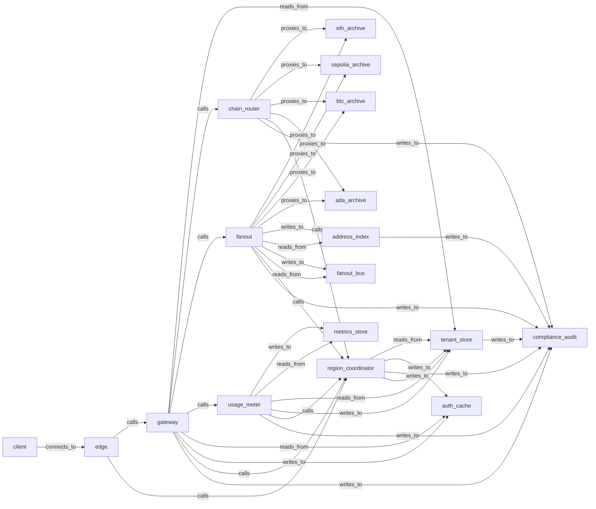

# Implementation tasks — `gateway-v1`

> Tree of implementation tasks projected from the hardened spec (`v10`). Each task = 1 markdown file.

## How to read this tree

- Top-level tasks (`scope=/`) sit at the root of `tasks/`.
- Each Service with internal sub-scope (gateway, chain_router, region_coordinator, tenant_store, compliance_audit) has its own subdirectory; the subdirectory `README.md` is the integration task for that service.
- Tasks are organized into waves by dependency (Wave 1 = no dependencies; later waves depend on earlier ones).
- Source of truth is the archi spec; regenerate with `python3 tasks/_generate.py`.

## Top-level architecture

## Waves

### Wave 1 (30 tasks)

- [eth_archive](eth_archive.md)
- [sepolia_archive](sepolia_archive.md)
- [btc_archive](btc_archive.md)
- [ada_archive](ada_archive.md)
- [auth_cache](auth_cache.md)
- [fanout_bus](fanout_bus.md)
- [address_index](address_index.md)
- [metrics_store](metrics_store.md)
- [tenant_record_store](tenant_store/tenant_record_store.md) _(scope: `tenant_store`)_
- [plan_version_timeline](tenant_store/plan_version_timeline.md) _(scope: `tenant_store`)_
- [preservation_hold_register](tenant_store/preservation_hold_register.md) _(scope: `tenant_store`)_
- [audit_encryption_key_register](tenant_store/audit_encryption_key_register.md) _(scope: `tenant_store`)_
- [role_log_of_record](tenant_store/role_log_of_record.md) _(scope: `tenant_store`)_
- [role_derived_store](tenant_store/role_derived_store.md) _(scope: `tenant_store`)_
- [role_admission_router](tenant_store/role_admission_router.md) _(scope: `tenant_store`)_
- [role_lifecycle_engine](tenant_store/role_lifecycle_engine.md) _(scope: `tenant_store`)_
- [pool_registry](chain_router/pool_registry.md) _(scope: `chain_router`)_
- [quarantine_set](chain_router/quarantine_set.md) _(scope: `chain_router`)_
- [drain_state_log](chain_router/drain_state_log.md) _(scope: `chain_router`)_
- [tombstone_lane](region_coordinator/tombstone_lane.md) _(scope: `region_coordinator`)_
- [tip_lane](region_coordinator/tip_lane.md) _(scope: `region_coordinator`)_
- [aggregate_lane](region_coordinator/aggregate_lane.md) _(scope: `region_coordinator`)_
- [control_lane](region_coordinator/control_lane.md) _(scope: `region_coordinator`)_
- [lease_lane](region_coordinator/lease_lane.md) _(scope: `region_coordinator`)_
- [health_lane](region_coordinator/health_lane.md) _(scope: `region_coordinator`)_
- [chain_log](compliance_audit/chain_log.md) _(scope: `compliance_audit`)_
- [drain_ack_index](compliance_audit/drain_ack_index.md) _(scope: `compliance_audit`)_
- [schema_registry](compliance_audit/schema_registry.md) _(scope: `compliance_audit`)_
- [response_canonicalizer](chain_router/response_canonicalizer.md) _(scope: `chain_router`)_
- [cert_bootstrap](region_coordinator/cert_bootstrap.md) _(scope: `region_coordinator`)_

### Wave 2 (15 tasks)

- [erasure_tombstone_log](tenant_store/erasure_tombstone_log.md) _(scope: `tenant_store`)_
- [residency_partition_router](tenant_store/residency_partition_router.md) _(scope: `tenant_store`)_
- [tenant_cluster_identity_engine](tenant_store/tenant_cluster_identity_engine.md) _(scope: `tenant_store`)_
- [schema_skew_quarantine](chain_router/schema_skew_quarantine.md) _(scope: `chain_router`)_
- [tip_freshness_tracker](chain_router/tip_freshness_tracker.md) _(scope: `chain_router`)_
- [fork_detection_alerter](chain_router/fork_detection_alerter.md) _(scope: `chain_router`)_
- [sub_pool_fork_partitioner](chain_router/sub_pool_fork_partitioner.md) _(scope: `chain_router`)_
- [pool_membership_manager](chain_router/pool_membership_manager.md) _(scope: `chain_router`)_
- [drain_coordinator](chain_router/drain_coordinator.md) _(scope: `chain_router`)_
- [hlc_service](region_coordinator/hlc_service.md) _(scope: `region_coordinator`)_
- [quorum_core](region_coordinator/quorum_core.md) _(scope: `region_coordinator`)_
- [chain_writer](compliance_audit/chain_writer.md) _(scope: `compliance_audit`)_
- [tier_splitter](compliance_audit/tier_splitter.md) _(scope: `compliance_audit`)_
- [retention_enforcer](compliance_audit/retention_enforcer.md) _(scope: `compliance_audit`)_
- [cert_assembler](compliance_audit/cert_assembler.md) _(scope: `compliance_audit`)_

### Wave 3 (12 tasks)

- [tombstone_history_log](tenant_store/tombstone_history_log.md) _(scope: `tenant_store`)_
- [admission_gate](compliance_audit/admission_gate.md) _(scope: `compliance_audit`)_
- [lifecycle_gate](region_coordinator/lifecycle_gate.md) _(scope: `region_coordinator`)_
- [residency_publisher](region_coordinator/residency_publisher.md) _(scope: `region_coordinator`)_
- [quota_aggregator](region_coordinator/quota_aggregator.md) _(scope: `region_coordinator`)_
- [tip_quorum](region_coordinator/tip_quorum.md) _(scope: `region_coordinator`)_
- [flag_propagator](region_coordinator/flag_propagator.md) _(scope: `region_coordinator`)_
- [credential_roster](region_coordinator/credential_roster.md) _(scope: `region_coordinator`)_
- [gateway_health_surface](region_coordinator/gateway_health_surface.md) _(scope: `region_coordinator`)_
- [lease_issuer](region_coordinator/lease_issuer.md) _(scope: `region_coordinator`)_
- [offboarding_orchestrator](region_coordinator/offboarding_orchestrator.md) _(scope: `region_coordinator`)_
- [chain_router_integration](chain_router/README.md)

### Wave 4 (3 tasks)

- [compliance_audit_owner](region_coordinator/compliance_audit_owner.md) _(scope: `region_coordinator`)_
- [compliance_audit_integration](compliance_audit/README.md)
- [tenant_store_integration](tenant_store/README.md)

### Wave 5 (2 tasks)

- [region_coordinator_integration](region_coordinator/README.md)
- [auth_check](gateway/auth_check.md) _(scope: `gateway`)_

### Wave 6 (3 tasks)

- [usage_meter](usage_meter.md)
- [fanout](fanout.md)
- [listener](gateway/listener.md) _(scope: `gateway`)_

### Wave 7 (3 tasks)

- [request_path](gateway/request_path.md) _(scope: `gateway`)_
- [subscription_path](gateway/subscription_path.md) _(scope: `gateway`)_
- [metrics_api](gateway/metrics_api.md) _(scope: `gateway`)_

### Wave 8 (1 tasks)

- [gateway_integration](gateway/README.md)

### Wave 9 (1 tasks)

- [edge](edge.md)

### Wave 10 (1 tasks)

- [client](client.md)

## Sub-services

- [compliance_audit/](compliance_audit/README.md) — integration task + child task tree
- [tenant_store/](tenant_store/README.md) — integration task + child task tree
- [chain_router/](chain_router/README.md) — integration task + child task tree
- [region_coordinator/](region_coordinator/README.md) — integration task + child task tree
- [gateway/](gateway/README.md) — integration task + child task tree

## Top-level standalone tasks

- [ada_archive](ada_archive.md)
- [address_index](address_index.md)
- [auth_cache](auth_cache.md)
- [btc_archive](btc_archive.md)
- [client](client.md)
- [edge](edge.md)
- [eth_archive](eth_archive.md)
- [fanout](fanout.md)
- [fanout_bus](fanout_bus.md)
- [metrics_store](metrics_store.md)
- [sepolia_archive](sepolia_archive.md)
- [usage_meter](usage_meter.md)

---

_Generated from `archi plan show` and `archi plan task show <id>` outputs._
