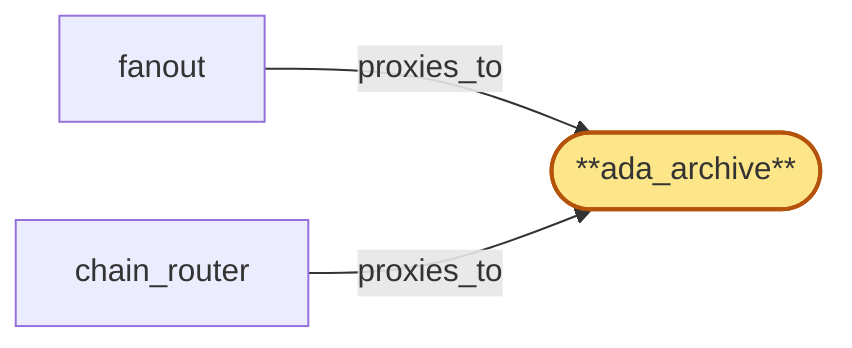

# ada_archive

> Provision the Cardano archive ChainPool:

## Properties

| Field | Value |
| --- | --- |
| Task | `ada_archive` |
| Scope | `/` |
| Node | `ada_archive` |
| Node type | `ChainPool` |
| Dependencies | `0` |
| Wave | `1` |

## Architecture

## Implementation summary

- Provision the Cardano archive ChainPool: a StatefulSet pairing cardano-node with an Ogmios bridge that exposes chain-sync, local-state-query, and local-tx-monitor mini-protocols
- Envoy mTLS sidecar
- per-replica liveness asserting Ogmios connectivity + tip-lag
- drain protocol
- tip-lag reporting hook.

## Node definition (`ada_archive` — ChainPool)

- Cardano chain-node pool: multiple Cardano-node + Ogmios bridge replicas (archive + pruned tip roles), exposing chain-sync, local-state-query, and local-tx-monitor
- chain_router and fanout select replicas from the pool.
- Replicas declare their (chain_id, fork_id) allegiance so chain_router partitions the pool by fork sub-pool.
- Replicas support an explicit drain state under chain_router's pool-drain protocol.
- Each replica reports tip-lag relative to chain peer count / expected slot advance for tip-staleness detection. mTLS surface to chain_router and fanout is enumerated in cert-inventory

## Requirements

### `r1` — R-ada

**Summary:** System exposes Cardano on-chain data (current and historical) to authenticated clients via the chain's native interface (Ogmios mini-protocols)

- Origin: `initial`
- Targets: `ada_archive`
- Matched via: `ada_archive`
- Verifications:
  - Integration test in tests/chain-pools/ada_archive_e2e.rs asserts (a) Ogmios chain-sync handshake succeeds, (b) local-state-query returns current ledger tip, (c) local-tx-monitor stream receives at least one mempool snapshot during the window, (d) Envoy mTLS enforced on Ogmios WS.

## Outputs

| Path | Purpose |
| --- | --- |
| `charts/chain-pools/ada-archive/` | Helm chart for cardano-node + Ogmios + mTLS sidecar |
| `ops/runbooks/ada-archive.md` | Operator runbook for ADA replica lifecycle and Ogmios mini-protocol validation |

## Stack details

- Helm chart 'charts/chain-pools/ada-archive' running cardano-node + Ogmios in the same Pod (sidecar pattern)
- Envoy mTLS sidecar covering Ogmios websocket port
- Liveness: Ogmios chain-sync handshake + tip-lag check; readiness: local-state-query reachable

## Acceptance criteria

### R-ada

- Integration test in tests/chain-pools/ada_archive_e2e.rs asserts (a) Ogmios chain-sync handshake succeeds, (b) local-state-query returns current ledger tip, (c) local-tx-monitor stream receives at least one mempool snapshot during the window, (d) Envoy mTLS enforced on Ogmios WS.

## Related tasks (graph neighbours)

- [chain_router_integration](chain_router/README.md)
- [fanout](fanout.md)

---

_Source of truth: `archi plan task show ada_archive`. Regenerate with `python3 tasks/_generate.py`._
