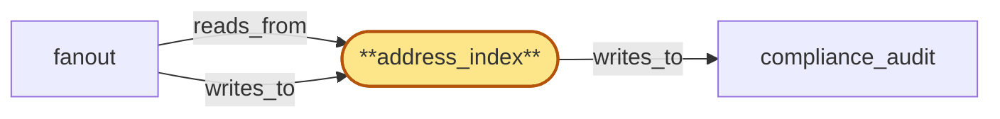

# address_index

> Build the per-chain address→event index used by fanout for sub-linear address-subscription matching, with per-tenant tombstones so offboarding does not hard-delete shared watch rows.

## Properties

| Field | Value |
| --- | --- |
| Task | `address_index` |
| Scope | `/` |
| Node | `address_index` |
| Node type | `Store` |
| Dependencies | `0` |
| Wave | `1` |

## Architecture

## Implementation summary

- Build the per-chain address→event index used by fanout for sub-linear address-subscription matching, with per-tenant tombstones so offboarding does not hard-delete shared watch rows.
- Postgres schema 'address_index' partitioned by chain.

## Node definition (`address_index` — Store)

- Per-chain index of recent block events keyed by address
- populated by the fanout layer from each chain's block stream and read on every new block to match address-activity subscribers without scanning all subscriber filters.
- Watch entries are claim-stamped per tenant: when a tenant offboards, only that tenant's claim on a watched address is removed (recorded as a per-tenant tombstone), never a hard delete of the underlying watch row when other tenants share it.
- CONSUMES drain-fence broadcasts: maintains a durable per-(offboarding_id, component_id) apply-state record with typed phase-markers (RECEIVED, FLUSH-IN-PROGRESS, FLUSH-COMPLETE, ACK-EMITTED, ATTESTATION-WRITTEN, TERMINAL)
- on restart resumes from the last durable phase and never re-runs a non-idempotent phase
- flushes in-flight audit writes for the named tenant to compliance_audit then acks drain to tenant_store within the HLC-bounded ack window
- if the local instance is itself in lifecycle teardown when the broadcast arrives, flush-then-ack-then-teardown is the only ordering that satisfies both invariants — alternatively a durable drain-ack-handoff record names a successor instance or persistent buffer
- never retracts a drain-ack once emitted.
- On receipt of a region_coordinator-signed offboarding signal — rejects offboarding signals lacking a current valid lifecycle_gate signature, verifies the signature against the broadcast's NAMED roster_version not the locally-cached roster_version (broadcasts are self-contained credential bundles)
- dedupes by idempotency key (offboarding_id, component_id, attempt_id) chosen by region_coordinator, meets a documented attestation SLO, and surfaces preservation-blocked terminal states (e.g. when a tenant's watch claim overlaps an active preservation hold and cannot be tombstoned-and-rotated) so region_coordinator can record a best-effort attestation rather than waiting indefinitely on timeout, with the attestation written to compliance_audit.
- Supports a 'extract for tenant T' operation returning only T's watch claims for compliance fulfilment

## Requirements

### `r1` — R-shared-watch-tombstone

**Summary:** When address_index removes a watch entry for an offboarded tenant on an address that other tenants also watch, only that tenant's claim on the watch is removed; the underlying watch persists for other tenants. Removal is recorded as a per-tenant tombstone, not a hard delete of the watch row.

- Origin: `stressor:3:s3-tenant-offboarding-orphan`
- Targets: `address_index`
- Matched via: `address_index`
- Verifications:
  - Integration test in crates/address_index/tests/tombstone.rs: two tenants A and B subscribe to the same address; tenant A offboards; assert (a) lookup_subscribers(address) still returns tenant B, (b) the watch row was not hard-deleted, (c) a per-tenant tombstone for A is present with reason=offboarding, (d) compliance_audit received an audit entry for the tombstone insertion.

## Outputs

| Path | Purpose |
| --- | --- |
| `crates/address_index/migrations/` | Postgres migrations for address_index schema (refinery) |
| `crates/address_index/` | Rust crate with sqlx-backed register_watch/unregister_watch/lookup_subscribers |

## Stack details

- Postgres schema 'address_index' with composite-key tables (chain_id, address) -> event-stream cursor; per-tenant subscription rows referenced by FK; tombstone column carrying tenant_id, removed_at_hlc, reason
- Rust crate 'crates/address_index' (sqlx) providing register_watch, unregister_watch (writes tombstone), and lookup_subscribers
- writes_to compliance_audit on every tenant tombstone using audit_admission sidecar; partitioned by chain_id for read locality

## Acceptance criteria

### R-shared-watch-tombstone

- Integration test in crates/address_index/tests/tombstone.rs: two tenants A and B subscribe to the same address; tenant A offboards; assert (a) lookup_subscribers(address) still returns tenant B, (b) the watch row was not hard-deleted, (c) a per-tenant tombstone for A is present with reason=offboarding, (d) compliance_audit received an audit entry for the tombstone insertion.

## Related tasks (graph neighbours)

- [compliance_audit_integration](compliance_audit/README.md)
- [fanout](fanout.md)

---

_Source of truth: `archi plan task show address_index`. Regenerate with `python3 tasks/_generate.py`._
