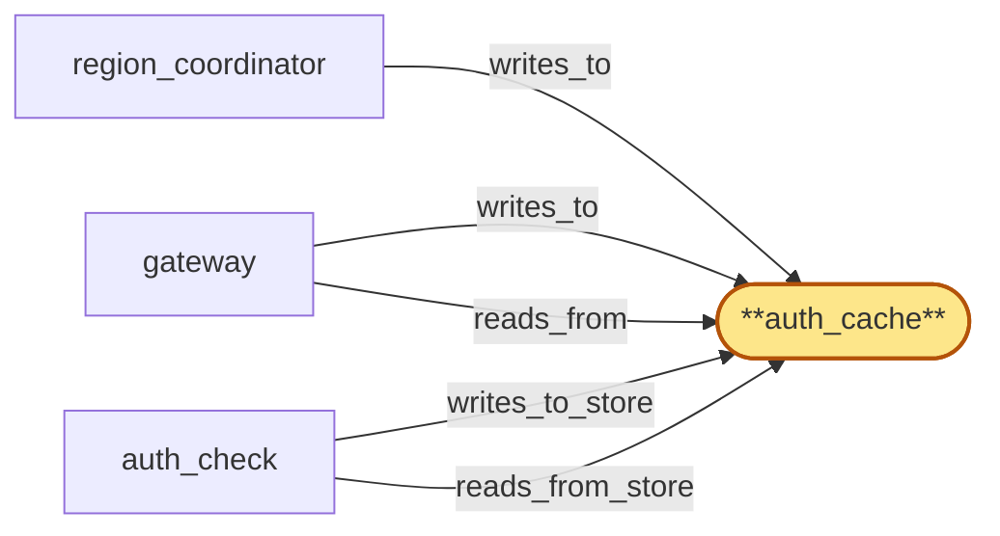

# auth_cache

> Build the per-region Redis-backed auth_cache:

## Properties

| Field | Value |
| --- | --- |
| Task | `auth_cache` |
| Scope | `/` |
| Node | `auth_cache` |
| Node type | `Store` |
| Dependencies | `0` |
| Wave | `1` |

## Architecture

## Implementation summary

- Build the per-region Redis-backed auth_cache: stores tenant credentials, rate-limit counters, throttle flags pushed by region_coordinator, and HLC-bounded pending-markers keyed by collision-free proposal-id tuples.
- Includes Helm chart + Rust client crate that gateway/auth_check + region_coordinator depend on.

## Node definition (`auth_cache` — Store)

- Per-region cache of tenant credentials, plan tier (and current plan_version), tenant_cluster identity, residency policy (with the pinned policy_version under which each cached entry was hydrated), and rolling rate-limit / quota counters.
- Hydrated from tenant_store on miss, but tombstoned signals from region_coordinator — per-tenant throttle flags, plan-change tombstones, cluster-level throttle flags, cluster suspensions, key revocations, and erasure tombstones — take precedence over and propagate ahead of fine-grained counter replication via the same fast-path.
- Supports deny-during-propagation pending markers on the unified fast-path: when flag_propagator publishes a pending-marker for a high-severity flag (cluster-suspended, key-revocation, erasure-tombstone) before the per-region apply lands, auth_cache treats the pending-marker as deny-by-default for the affected identity until the per-region apply commits and a flag-applied attestation is written back to flag_propagator
- reads against a marker-covered identity short-circuit to a documented deny reason rather than serving the prior cached state. Every accepted pending-marker must carry an originating-proposal-id and an HLC expiry bound
- auth_cache rejects pending-markers that lack an originating-proposal-id and refuses to install them, so an unattributed marker cannot indefinitely deny traffic.
- The originating-proposal-id is constructed as the tuple (originating_region_id, hlc_at_origin, region_local_monotonic_counter, nonce) and is globally unique by construction even under HLC-skew-degraded mode — the (originating_region_id, region_local_monotonic_counter) pair guarantees collision-freeness even when hlc_at_origin coincides across regions
- auth_cache rejects pending-markers whose proposal-id is not well-formed under this construction.
- Pending-markers auto-clear when their carried HLC expiry bound is reached without an explicit retraction, so a stalled or rejected proposal cannot leave a stuck deny-by-default state in place
- on apply commit, auth_cache reconciles the pending-marker by matching the inbound flag-applied attestation's originating-proposal-id (full tuple) to the installed marker rather than by identity alone, so an apply attestation for a different proposal targeting the same identity does not silently clear an unrelated pending-marker.
- Throttle flags are stored with an explicit monotonic version per tenant so long-running paths (active websocket subscriptions, streaming or chunked RPC responses) can re-check the flag cheaply by version comparison without re-running the full auth path.
- Hydration log records auth events per tenant and supports a 'extract for tenant T' operation suitable for compliance use without disclosing other tenants.
- Supports bulk hydration paths so a reconnect storm into a region does not produce an N-fold tenant_store read amplification.
- Internal channel to gateway, tenant_store, and region_coordinator's flag_propagator is a cert-bearing surface enumerated in cert-inventory

## Requirements

### `r1` — R-throttle-flag-fast-path

**Summary:** When a tenant crosses a global cost or rate ceiling, a throttle flag propagates to every region's auth_cache faster than fine-grained counter replication, so subsequent requests in any region are rejected immediately

- Origin: `stressor:2:S-cross-region-quota-race`
- Targets: `auth_cache`
- Matched via: `auth_cache`
- Verifications:
  - Integration test in crates/auth_cache_client/tests/throttle_flag.rs spins testcontainers Redis, has a mock region_coordinator push a throttle flag, then asserts a gateway-side reader observes the flag before the underlying counter replication completes (latency < 50ms p99).

### `r2` — r-s4-proposal-id-uniqueness

**Summary:** Originating-proposal-id used by auth_cache pending markers is constructed as a tuple (originating_region_id, hlc_at_origin, region_local_monotonic_counter, nonce) that is globally unique by construction even under HLC-skew-degraded mode; auth_cache reconciliation matches on the full tuple; markers whose proposal-id is not well-formed under this construction are rejected.

- Origin: `stressor:4:s4-proposal-id-collision`
- Targets: `auth_cache`
- Matched via: `auth_cache`
- Verifications:
  - Unit test asserting pending-marker proposal-id rejection: an entry submitted without a well-formed (region_id, hlc, monotonic_counter, nonce) tuple is rejected, two entries with the same tuple but different payloads collide, and reconciliation matches on the full tuple even when hlc_at_origin coincides across regions (region_id+monotonic_counter break the tie).

## Outputs

| Path | Purpose |
| --- | --- |
| `charts/stores/auth-cache/` | Helm chart for per-region Redis cluster (auth_cache) |
| `crates/auth_cache_client/` | Rust client crate exposing throttle_flag::push/read, pending_marker::insert/match, credential::lookup APIs |

## Stack details

- Helm chart 'charts/stores/auth-cache' deploying a per-region Redis 7 cluster (3 masters + 3 replicas) with persistence enabled and AOF appendfsync=everysec
- Rust crate 'crates/auth_cache_client' wrapping redis-rs: TTL-keyed credential lookup, throttle-flag fast-path key, pending-marker primitives keyed by tuple (originating_region_id, hlc_at_origin, region_local_monotonic_counter, nonce)
- Pending-marker entries auto-clear at HLC expiry via TTL; reconciliation key matches on the full proposal-id tuple

## Acceptance criteria

### R-throttle-flag-fast-path

- Integration test in crates/auth_cache_client/tests/throttle_flag.rs spins testcontainers Redis, has a mock region_coordinator push a throttle flag, then asserts a gateway-side reader observes the flag before the underlying counter replication completes (latency < 50ms p99).

### r-s4-proposal-id-uniqueness

- Unit test asserting pending-marker proposal-id rejection: an entry submitted without a well-formed (region_id, hlc, monotonic_counter, nonce) tuple is rejected, two entries with the same tuple but different payloads collide, and reconciliation matches on the full tuple even when hlc_at_origin coincides across regions (region_id+monotonic_counter break the tie).

## Related tasks (graph neighbours)

- [gateway_integration](gateway/README.md)
- [region_coordinator_integration](region_coordinator/README.md)

---

_Source of truth: `archi plan task show auth_cache`. Regenerate with `python3 tasks/_generate.py`._
