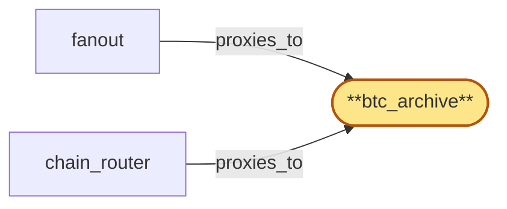

# btc_archive

> Provision the Bitcoin archive ChainPool:

## Properties

| Field | Value |
| --- | --- |
| Task | `btc_archive` |
| Scope | `/` |
| Node | `btc_archive` |
| Node type | `ChainPool` |
| Dependencies | `0` |
| Wave | `1` |

## Architecture

## Implementation summary

- Provision the Bitcoin archive ChainPool: a StatefulSet of Bitcoin Core nodes with txindex enabled and ZMQ rawmempool publisher exposed in-cluster, fronted by an Envoy mTLS sidecar for both JSON-RPC and ZMQ
- per-replica liveness probe asserting block-tip + ZMQ-readiness
- drain protocol
- tip-lag reporting hook.

## Node definition (`btc_archive` — ChainPool)

- Bitcoin chain-node pool: multiple Bitcoin Core replicas with txindex (archive role) plus pruned tip replicas, ZMQ notifications surfaced as chain-sync streams
- chain_router and fanout select replicas from the pool.
- Replicas declare their (chain_id, fork_id) allegiance so chain_router partitions the pool by fork sub-pool.
- Replicas support an explicit drain state under chain_router's pool-drain protocol.
- Each replica reports tip-lag relative to chain peer count / expected block advance for tip-staleness detection. mTLS surface to chain_router and fanout is enumerated in cert-inventory

## Requirements

### `r1` — R-btc

**Summary:** System exposes Bitcoin on-chain data (current and historical) to authenticated clients via the chain's native JSON-RPC interface

- Origin: `initial`
- Targets: `btc_archive`
- Matched via: `btc_archive`
- Verifications:
  - Integration test in tests/chain-pools/btc_archive_e2e.rs asserts (a) getblockcount returns a recent height, (b) getblock retrieves a sentinel historical block, (c) ZMQ rawmempool socket emits at least one tx during the test window, (d) mTLS enforced on JSON-RPC + ZMQ ports.

## Outputs

| Path | Purpose |
| --- | --- |
| `charts/chain-pools/btc-archive/` | Helm chart for Bitcoin Core w/ txindex + ZMQ + mTLS sidecar |
| `ops/runbooks/btc-archive.md` | Operator runbook for BTC replica lifecycle, ZMQ socket validation, snapshot bootstrap |

## Stack details

- Helm chart 'charts/chain-pools/btc-archive' deploying Bitcoin Core image with txindex=1, zmqpubrawmempool/rawblock sockets bound to in-cluster service
- Envoy mTLS sidecar covering both HTTP JSON-RPC (port 8332) and the ZMQ pub socket
- Liveness probe: getblockcount + ZMQ-port readiness; readiness asserts rawmempool subscription healthy

## Acceptance criteria

### R-btc

- Integration test in tests/chain-pools/btc_archive_e2e.rs asserts (a) getblockcount returns a recent height, (b) getblock retrieves a sentinel historical block, (c) ZMQ rawmempool socket emits at least one tx during the test window, (d) mTLS enforced on JSON-RPC + ZMQ ports.

## Related tasks (graph neighbours)

- [chain_router_integration](chain_router/README.md)
- [fanout](fanout.md)

---

_Source of truth: `archi plan task show btc_archive`. Regenerate with `python3 tasks/_generate.py`._
