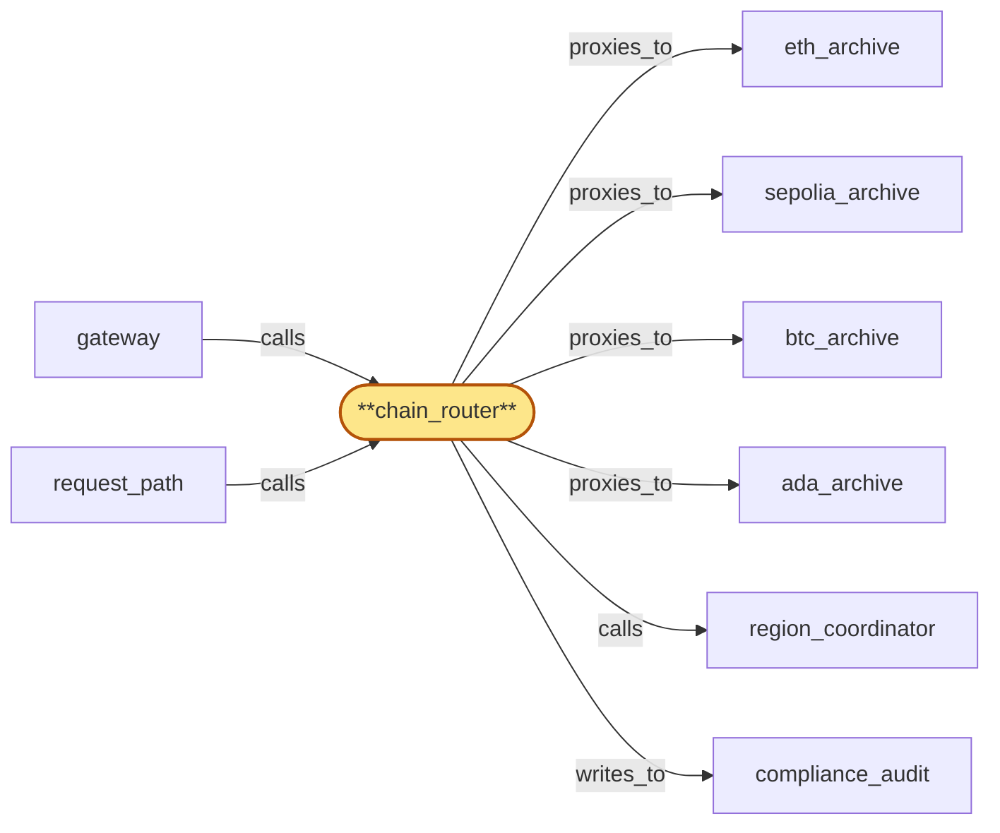
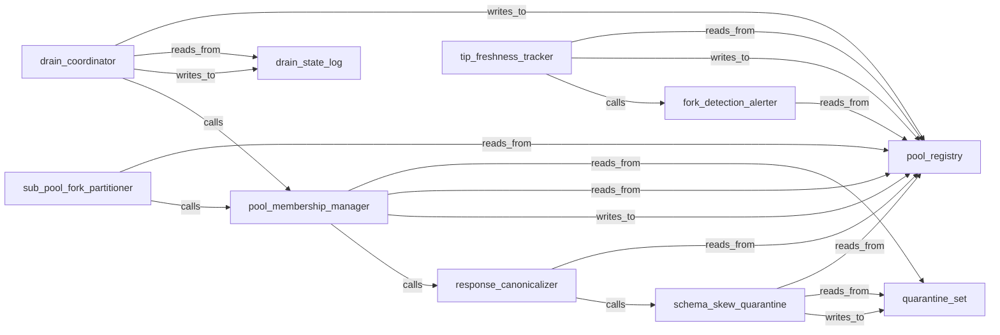

# chain_router_integration

> Integrate the 10 chain_router child tasks into a single deployable per-region service:

## Properties

| Field | Value |
| --- | --- |
| Task | `chain_router_integration` |
| Scope | `/` |
| Node | `chain_router` |
| Node type | `Service` |
| Dependencies | `10` |
| Wave | `3` |

## Architecture

## Implementation summary

- Integrate the 10 chain_router child tasks into a single deployable per-region service: pool_registry + quarantine_set + drain_state_log stores wired through canonicalizer + skew_quarantine + tip_freshness_tracker + fork_alerter + partitioner + membership_manager + drain_coordinator subservices
- auth-tagged head observations
- per-(chain, fork) routing
- Helm chart for the Rust service.

## Node definition (`chain_router` — Service)

- Per-chain routing service: receives authenticated RPC requests carrying an explicit (chain, fork) tag, selects a healthy non-draining replica from the matching fork sub-pool of the region's chain pool, enforces per-tenant query cost budgets, isolates heavy historical queries onto the historical-replica subset, observes replica-level chain-head and fork-allegiance signals and reports them to region_coordinator (which computes a quorum-based canonical tip per (chain, fork) across all regions)
- for high-value reads against tip, requires the canonical tip from region_coordinator rather than treating its region's pool as authoritative.
- Every head observation submitted to region_coordinator's tip_quorum is tagged with the authenticated source replica identity of the submitting chain_router replica, signed over the cert-bearing inter-region surface (mTLS to region_coordinator).
- Canonicalizes every JSON-RPC response leaving a chain pool against a per-(chain, method, schema_version) schema before forwarding to gateway.
- Quarantines replicas whose canonicalized response shape diverges from pool consensus the same way it quarantines tip-divergent replicas
- partitions a chain pool by replica fork allegiance.
- Detects unannounced consensus splits and emits a 'fork-detected' alert with a documented operator-decision SLA.
- When fork-detection produces a sub-pool repartition for (chain, fork), chain_router emits a structured fork-transition handshake to fanout that names the divergence point.
- Measures each pool's tip lag and marks pools 'tip-stale' when they exceed a per-chain freshness budget
- tip-stale pools are excluded from canonical-tip quorum and gateway annotates responses they answer. Exposes an explicit pool-drain protocol
- drain_coordinator schedules replica-level drain only inside windows reserved by region_coordinator's lifecycle_gate against the same target.
- Schema-skew and tip-divergence quarantines consult region_coordinator's 'rotation in progress' tag.
- At RPC submission time it returns a per-method cost-class hint.
- CONSUMES drain-fence broadcasts: maintains a durable per-(offboarding_id, component_id) apply-state record with typed phase-markers (RECEIVED, FLUSH-IN-PROGRESS, FLUSH-COMPLETE, ACK-EMITTED, ATTESTATION-WRITTEN, TERMINAL)
- on restart resumes from the last durable phase and never re-runs a non-idempotent phase
- flushes in-flight audit writes for the named tenant to compliance_audit then acks drain to tenant_store within the HLC-bounded ack window
- if the local instance is itself in lifecycle teardown when the broadcast arrives, flush-then-ack-then-teardown is the only ordering that satisfies both invariants — alternatively a durable drain-ack-handoff record names a successor instance or persistent buffer
- never retracts a drain-ack once emitted.
- Cancels in-flight long-RPCs for offboarded tenants on receipt of a region_coordinator-signed offboarding signal — rejects offboarding signals lacking a current valid lifecycle_gate signature, verifies the signature against the broadcast's NAMED roster_version not the locally-cached roster_version (broadcasts are self-contained credential bundles)
- deduping cancellation signals by idempotency key (offboarding_id, component_id, attempt_id), meeting a documented attestation SLO and surfacing preservation-blocked terminal states, with the attestation written to compliance_audit.
- Every operator-override admission path inside chain_router (pool_membership_manager safe-membership-floor override for emergency-rollover replica admission, drain_coordinator force-complete) is gated locally and admitted only when the override proposal carries M-of-N signatures from distinct operator credentials drawn from region_coordinator's published credential roster
- chain_router caches the credential roster locally with a documented HLC-bounded freshness window and falls to deny-by-default for further override admissions when the cached roster is older than the freshness window or when no roster has ever been received.
- ROSTER_VERSION CROSS-COMPONENT ORDERING: chain_router consults region_coordinator's currently-active roster_version on every override commit (not its locally-cached value), so a laggard local cache cannot admit a proposal that the activated roster has invalidated.
- Rejects override proposals whose signing credentials are not on the roster or whose roster_version predates chain_router's current effective roster_version
- refuses to commit override proposals after a compromise-revocation has invalidated any in-flight signature (including retroactive compromise-revocations whose retroactive-as-of-HLC predates the proposal's submission)
- acknowledges roster updates and revocations on the residency_publisher push-and-acknowledge pattern (rotation-prepare ack + rotation-activate observation)
- cancels in-flight proposals at activation by roster_version atomically.
- Records the signing operator identities and writes a typed override-admission entry to compliance_audit on every commit.
- Cert-bearing surface for mTLS to chain pool replicas and to region_coordinator's tip_quorum, enumerated in cert-inventory

## Requirements

### `r1` — R-response-canonicalization

**Summary:** Every JSON-RPC response forwarded from a chain pool through chain_router is canonicalized against a per-chain, per-method schema before it reaches gateway: undocumented optional fields are stripped or sorted, types are coerced, and intra-response ordering rules are applied so that response shape is a function of (chain, method, schema_version) and is independent of which client implementation in the pool produced it.

- Origin: `stressor:3:s3-client-schema-drift`
- Targets: `chain_router`
- Matched via: `chain_router`
- Verifications:
  - Test cr_int/canonicalization.rs asserts every JSON-RPC response is byte-canonicalized per (chain, method, schema_version, canonical-bytes-version) before reaching gateway.

### `r2` — R-schema-skew-quarantine

**Summary:** When a chain pool replica produces responses whose canonicalized shape differs from the pool consensus shape for the same (method, schema_version), chain_router quarantines that replica from the active pool the same way it quarantines a divergent-tip replica, and surfaces the skew to operators.

- Origin: `stressor:3:s3-client-schema-drift`
- Targets: `chain_router`
- Matched via: `chain_router`
- Verifications:
  - Test cr_int/schema_skew_quarantine.rs asserts a divergent replica is quarantined within bounded SLA and excluded from routing.

### `r3` — R-pool-drain-protocol

**Summary:** chain_router exposes an explicit drain state for chain pool replicas: a draining replica receives no new requests, finishes in-flight RPCs (or returns a retryable-on-other-replica signal to gateway), and only unsubscribes from fanout's head streams after gateway has re-bound the affected subscriptions to a non-draining replica.

- Origin: `stressor:3:s3-replica-rotation-storm`
- Targets: `chain_router`
- Matched via: `chain_router`
- Verifications:
  - Test cr_int/pool_drain_protocol.rs asserts end-to-end drain: stop-new → finish-in-flight → await-rebind-ack → commit-eviction with phase markers durable.

### `r4` — R-rotation-aware-skew

**Summary:** Schema-skew quarantine and tip-divergence quarantine both consult a 'rotation in progress' tag from region_coordinator and suppress quarantines triggered solely by the documented rotation window, so rotation noise does not look like a misbehaving replica.

- Origin: `stressor:3:s3-replica-rotation-storm`
- Targets: `chain_router`
- Matched via: `chain_router`
- Verifications:
  - Test cr_int/rotation_aware_skew.rs asserts schema-skew quarantines are suppressed during a rotation window and committed when the tag clears.

### `r5` — R-tip-freshness-budget

**Summary:** Each chain has an explicit per-chain tip-freshness budget (max acceptable lag from upstream chain tip). chain_router measures pool tip lag against an out-of-band reference (peer-regional pools, chain peer count, expected slot advance) and marks the pool 'tip-stale' when it exceeds the budget.

- Origin: `stressor:3:s3-pool-sync-stall`
- Targets: `chain_router`
- Matched via: `chain_router`
- Verifications:
  - Test cr_int/tip_freshness_budget.rs asserts pool tip-lag exceeding budget marks pool tip-stale; routing excludes the pool.

### `r6` — R-fork-identity

**Summary:** Every chain has an explicit, documented set of supported forks identified by (chain_id, fork_id). chain_router partitions each chain pool by fork allegiance; replicas on different forks belong to different sub-pools and are not treated as divergent under R-chain-cross-check.

- Origin: `stressor:3:s3-contentious-fork`
- Targets: `chain_router`
- Matched via: `chain_router`
- Verifications:
  - Test cr_int/fork_identity.rs asserts each replica's fork allegiance is explicit and exposed to fanout via pool_registry.

### `r7` — R-fork-detection-alert

**Summary:** Detection of an unannounced consensus split (replicas in a pool diverging into two stable subgroups, neither a transient reorg) surfaces a 'fork-detected' alert with a documented operator-decision SLA before the split is exposed to tenants as a separate fork sub-pool.

- Origin: `stressor:3:s3-contentious-fork`
- Targets: `chain_router`
- Matched via: `chain_router`
- Verifications:
  - Test cr_int/fork_detection_alert.rs asserts unannounced consensus splits trigger fork-detected alerts with operator-decision SLA.

### `r8` — bubble-chain_router-1

**Summary:** lifecycle_gate's operator-override admission path for chain_router pool_membership_manager (emergency-rollover replica admission that bypasses safe-membership-floor) needs the same parent-scope operator-credential authorization model with M-of-N signing requirements, credential-rotation, compromise-revocation, and per-operator audit so a single compromised credential cannot mass-admit attacker-controlled replicas; chain_router enforces local M-of-N gating for the override but parent scope must define and enforce the operator credential model that backs both tip_quorum and chain_router overrides.

- Origin: `freestanding`
- Targets: `chain_router`
- Matched via: `chain_router`
- Verifications:
  - Test cr_int/bubble_chain_router_1.rs asserts bubble-1 invariant: every override path verifies M-of-N signers against the active named credential_roster and rejects retroactive-as-of-HLC-revoked credentials.

### `r9` — r-s4-fork-transition-rollback-contract

**Summary:** When chain_router fork-detection produces a sub-pool repartition for (chain, fork), fanout emits a structured rollback notification to every active subscription on the losing fork — events back to the divergence point — before any forward-progress events on the new fork are delivered to that subscription. The cross-component contract is fixed at root scope; the chain_router fork-detection handshake protocol is a chain_router zoom concern; the fanout subscription rollback-and-rebind state machine is a fanout zoom concern (fanout not yet zoomed; deferred follow-up direction).

- Origin: `stressor:4:s4-fork-transition-subscription`
- Targets: `chain_router`
- Matched via: `chain_router`
- Verifications:
  - Test cr_int/fork_transition_rollback_contract.rs asserts the per-cursor monotonicity guarantee across the rollback-then-forward-progress sequence (rollback-event cursor < divergence-point cursor < first new-fork forward-progress cursor; no replay under handshake retry).

### `r10` — bubble-chain_router-2

**Summary:** chain_router needs an on-demand named-roster fetch path from region_coordinator over the cert-bearing inter-region surface to verify drain-fence broadcasts and offboarding signals when the broadcast's NAMED roster_version is strictly newer than the local cache. Per chain_router's Session 2 (s2-named-roster-unknown-locally / s2-stale-roster-cache-during-bulk-offboarding), the fetch is bounded by an HLC budget tighter than the per-tenant ack window, with bulk-wave coalescing. region_coordinator's credential_roster subsystem must expose the named-roster lookup endpoint (with appropriate rate-limiting and signature verification) and a documented availability target. This is a parent-scope concern because the fetch crosses the cert-bearing inter-region surface and depends on credential_roster's serving plane availability.

- Origin: `freestanding`
- Targets: `chain_router`
- Matched via: `chain_router`
- Verifications:
  - Test cr_int/bubble_chain_router_2.rs asserts bubble-2 invariant: deferred-quarantine semantics from tip_quorum honored across reads + writes.

### `r11` — bubble-chain_router-3

**Summary:** chain_router's fork-transition handshake to fanout requires fanout to ack the divergence-point (chain_id, prior fork_id, new fork_id, divergence HLC, prior fork terminal HLC) before chain_router admits forward-progress dispatch on the new fork. Per chain_router's Session 2 (s2-fork-transition-handshake-vs-fanout-monotonicity / s2-fork-transition-handshake-fanout-unreachable), chain_router enters fork-transition-pending degraded mode when fanout-suspended in the region. The fanout handshake ack protocol, fanout's per-cursor monotonicity guarantee under rollback-then-forward-progress, and the cross-component fork-transition-pending visibility (gateway_health_surface) are deferred to the fanout zoom (not yet entered). Bubble the handshake-ack contract as a parent concern to be picked up when fanout is zoomed.

- Origin: `freestanding`
- Targets: `chain_router`
- Matched via: `chain_router`
- Verifications:
  - Test cr_int/bubble_chain_router_3.rs asserts bubble-3 invariant: cost-class hint preserved across retries.

## Outputs

| Path | Purpose |
| --- | --- |
| `charts/services/chain-router/` | Helm chart |
| `crates/chain_router/tests/integration/` | End-to-end integration tests |

## Stack details

- Helm chart 'charts/services/chain-router' deploying the Rust service with sqlx access to chain_router Postgres schemas; replicas per region; per-pod Envoy mTLS sidecar for inter-region calls to region_coordinator and chain pools
- End-to-end integration tests in 'crates/chain_router/tests/integration/' covering the full request flow, drain cascade, fork transition handshake

## Acceptance criteria

### R-response-canonicalization

- Test cr_int/canonicalization.rs asserts every JSON-RPC response is byte-canonicalized per (chain, method, schema_version, canonical-bytes-version) before reaching gateway.

### R-schema-skew-quarantine

- Test cr_int/schema_skew_quarantine.rs asserts a divergent replica is quarantined within bounded SLA and excluded from routing.

### R-pool-drain-protocol

- Test cr_int/pool_drain_protocol.rs asserts end-to-end drain: stop-new → finish-in-flight → await-rebind-ack → commit-eviction with phase markers durable.

### R-rotation-aware-skew

- Test cr_int/rotation_aware_skew.rs asserts schema-skew quarantines are suppressed during a rotation window and committed when the tag clears.

### R-tip-freshness-budget

- Test cr_int/tip_freshness_budget.rs asserts pool tip-lag exceeding budget marks pool tip-stale; routing excludes the pool.

### R-fork-identity

- Test cr_int/fork_identity.rs asserts each replica's fork allegiance is explicit and exposed to fanout via pool_registry.

### R-fork-detection-alert

- Test cr_int/fork_detection_alert.rs asserts unannounced consensus splits trigger fork-detected alerts with operator-decision SLA.

### bubble-chain_router-1

- Test cr_int/bubble_chain_router_1.rs asserts bubble-1 invariant: every override path verifies M-of-N signers against the active named credential_roster and rejects retroactive-as-of-HLC-revoked credentials.

### r-s4-fork-transition-rollback-contract

- Test cr_int/fork_transition_rollback_contract.rs asserts the per-cursor monotonicity guarantee across the rollback-then-forward-progress sequence (rollback-event cursor < divergence-point cursor < first new-fork forward-progress cursor; no replay under handshake retry).

### bubble-chain_router-2

- Test cr_int/bubble_chain_router_2.rs asserts bubble-2 invariant: deferred-quarantine semantics from tip_quorum honored across reads + writes.

### bubble-chain_router-3

- Test cr_int/bubble_chain_router_3.rs asserts bubble-3 invariant: cost-class hint preserved across retries.

## Related tasks (graph neighbours)

- [ada_archive](ada_archive.md)
- [btc_archive](btc_archive.md)
- [compliance_audit_integration](compliance_audit/README.md)
- [eth_archive](eth_archive.md)
- [gateway_integration](gateway/README.md)
- [region_coordinator_integration](region_coordinator/README.md)
- [sepolia_archive](sepolia_archive.md)

---

_Source of truth: `archi plan task show chain_router_integration`. Regenerate with `python3 tasks/_generate.py`._

## Child tasks

| Task | Wave | Deps | Brief |
| --- | --- | --- | --- |
| [drain_coordinator](drain_coordinator.md) | 2 | 2 | Build the drain coordinator subservice: orchestrates drain across replicas — schedules per lifecycle_gate signature, transitions through ... |
| [drain_state_log](drain_state_log.md) | 1 | 0 | Build the drain-state log: append-only Postgres log per drain operation with phase markers (RECEIVED, FLUSH-IN-PROGRESS, FLUSH-COMPLETE, ... |
| [fork_detection_alerter](fork_detection_alerter.md) | 2 | 1 | Build the fork-detection alerter subservice: detects stable two-subgroup divergence within a sub-pool, emits fork-detected alerts with op... |
| [pool_membership_manager](pool_membership_manager.md) | 2 | 4 | Build the pool membership manager subservice: central CAS-on-pool_registry orchestrator that admits/excludes replicas given drain state, ... |
| [pool_registry](pool_registry.md) | 1 | 0 | Build the chain_router pool_registry: Postgres-backed shared state set holding per-(chain, fork_id, replica_id) membership, draining/quar... |
| [quarantine_set](quarantine_set.md) | 1 | 0 | Build the schema-skew quarantine state set: Postgres-backed table of currently-quarantined replicas (per chain, fork, method, schema_vers... |
| [response_canonicalizer](response_canonicalizer.md) | 1 | 0 | Build the response canonicalizer subservice: per-(chain, method, schema_version, canonical-bytes-version) byte-level canonicalization of ... |
| [schema_skew_quarantine](schema_skew_quarantine.md) | 2 | 3 | Build the schema-skew quarantine subservice: compares canonicalized response shape against pool consensus per (chain, method, schema_vers... |
| [sub_pool_fork_partitioner](sub_pool_fork_partitioner.md) | 2 | 1 | Build the sub-pool fork partitioner subservice: routes incoming RPCs by (chain, fork) tag only to matching sub-pool; routing fence during... |
| [tip_freshness_tracker](tip_freshness_tracker.md) | 2 | 1 | Build the tip-freshness tracker subservice: measures pool tip lag against an out-of-band reference (peer-regional pools via region_coordi... |

## Internal architecture

