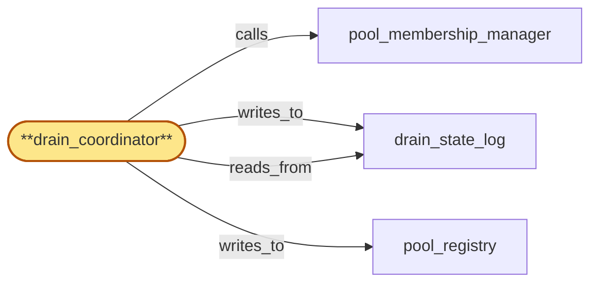

# drain_coordinator

> Build the drain coordinator subservice:

## Properties

| Field | Value |
| --- | --- |
| Task | `drain_coordinator` |
| Scope | `chain_router` |
| Node | `drain_coordinator` |
| Node type | `Subservice` |
| Dependencies | `2` |
| Wave | `2` |

## Architecture

## Implementation summary

- Build the drain coordinator subservice: orchestrates drain across replicas — schedules per lifecycle_gate signature, transitions through phase markers in drain_state_log, awaits gateway rebind ACK, handles teardown-overlap handoff, and writes terminal-class attestations to compliance_audit
- bulk-roster-fetch-coalesces under bulk-offboarding waves.

## Node definition (`drain_coordinator` — Subservice)

- Choreographs pool drains: a drain proposal moves a replica into 'draining' state in pool_registry, refuses new requests routed to it, holds in-flight RPCs (or returns them with a retryable-on-other-replica hint), waits for gateway to re-bind dependent subscriptions via fanout, and only then commits the drain-completed transition.
- Owns drain_state_log entries: drain-requested, drain-in-progress, drain-completed, drain-aborted, force-completed (with operator attribution), drain-stuck (with rebind-ack-missed reason), drain-window-expired (typed terminal state distinct from drain-stuck and force-completed when the lifecycle_gate window's HLC TTL expired mid-drain), drain-stuck-after-crash (when a lease-holder crash without TERMINAL within the window leaves the replica observable to lifecycle_gate).
- LIFECYCLE-GATE-SCHEDULED: drain_coordinator subscribes to region_coordinator's lifecycle_gate schedule and admits replica-level drains only inside windows reserved by lifecycle_gate against the same target (chain pool, replica subset)
- never schedules an autonomous drain that overlaps a non-reserved window
- refuses to start a drain whose lifecycle_gate window has expired.
- The per-(chain, fork_id, replica) drain mutex/lease is bounded by the lifecycle_gate window's HLC TTL: every drain start is stamped with the window_id and HLC TTL
- if the TTL expires mid-drain, the drain transitions to drain-window-expired, refuses further per-replica work under the expired window, surfaces an alert with attribution to window_id, and the replica remains in 'draining' until a new lifecycle_gate-reserved continuation window admits a continuation drain (no autonomous force-complete under expired window)
- the prior lease is implicitly released at window expiry.
- Drain-completion is gated on a bounded wait: if gateway-rebind ack is not received within a documented window, drain_coordinator surfaces a drain-stuck alert and either retries the rebind request idempotently or proposes a force-complete transition that itself requires M-of-N-signed operator override under chain_router's currently-effective roster_version.
- Gateway-rebind acks carry an authenticated signature over the cert-bearing gateway-to-chain_router channel and a per-drain nonce so a replayed or forged ack cannot complete an active drain.
- PHASE-MARKERS: drain_coordinator persists durable per-(offboarding_id, component_id, drain_id) phase-markers in drain_state_log (RECEIVED, FLUSH-IN-PROGRESS, FLUSH-COMPLETE, ACK-EMITTED, ATTESTATION-WRITTEN, TERMINAL-ACK, TERMINAL-PRESERVATION-BLOCKED)
- on restart resumes from the latest durable phase, never re-runs flush if FLUSH-COMPLETE is durable, never retracts a drain-ack once emitted.
- DRAIN-FENCE BROADCAST CONSUMER: consumes lifecycle_gate-originated drain-fence broadcasts for tenant T as self-contained credential bundles (broadcasts name roster_version V_named)
- verifies the signature against V_named via on-demand named-roster fetch from region_coordinator over the cert-bearing inter-region surface when V_named is strictly newer than the local cache, bounded by a documented HLC budget tighter than the per-tenant ack window — on fetch failure within budget rejects the broadcast and emits a typed 'named-roster-unfetchable' attestation to compliance_audit
- on bulk-offboarding waves coalesces named-roster fetches across the wave so N broadcasts trigger one fetch, on coalesced fetch failure rejecting the wave with a single typed 'named-roster-fetch-failed-bulk' attestation.
- On verified broadcast, drain_coordinator (with pool_membership_manager) flushes in-flight audit writes for tenant T to compliance_audit then acks drain to tenant_store within the HLC-bounded ack window.
- ROSTER FRESHNESS: caches the operator-credential roster locally with a documented HLC-bounded freshness window
- falls to deny-by-default for further override admissions when the cached roster is older than the freshness window or no roster has ever been received
- deny is sticky for that override path until a strictly-newer roster_version ack-readies. Rejects override proposals whose signing roster_version predates chain_router's currently-effective roster_version
- refuses to commit overrides after a compromise-revocation invalidates any in-flight signature including retroactive-as-of-HLC compromise-revocations
- cancel-and-rollback for in-flight proposals is performed atomically at activation.
- TERMINAL-CLASS ATTESTATION: TERMINAL-ACK and TERMINAL-PRESERVATION-BLOCKED each write exactly one typed attestation to compliance_audit with the (offboarding_id, component_id, attempt_id) idempotency key
- canonical writer election by drain_state_log CAS so attestation is written exactly once.
- PRIORITY: drain-fence flush takes priority on the per-(chain, fork_id) pool_registry shard CAS line (drain-fence-priority tag pre-empts deferred-quarantine commits).
- DRAIN-FENCE VS FORK-TRANSITION FENCE: refuses to commit a drain-ack while a fork-transition handshake is mid-flight on any (chain, fork_id) shard whose audit writes for tenant T are in flight
- ack-window HLC budget extends across handshake completion or the broadcast is rejected with a typed 'drain-fence-blocked-by-fork-transition' attestation
- flush enumerates audit writes by tenant_id across both pre- and post-transition sub-pool views.
- TEARDOWN-OVERLAP HANDOFF: if the chain_router replica is itself in lifecycle teardown when a drain-fence arrives, drain_coordinator either completes flush-then-ack-then-teardown within the remaining teardown window, or writes a typed drain-ack-handoff record in drain_state_log naming a successor chain_router instance OR a persistent buffer (a tenant-T-flush-residual queue) that owns the residual flush
- ack-by-handoff to tenant_store cites this record. drain_coordinator refuses teardown completion while any drain-fence on this instance is unacked AND no drain-ack-handoff is recorded
- idempotent successor read of drain_state_log resumes the flush.
- On offboarding cancellation overlapping a preservation hold, the drain waits for the long-RPC to complete or to time out (capped by the bounded drain-completion wait), surfaces TERMINAL-PRESERVATION-BLOCKED state per the offboarding-attestation SLO, and dedupes inbound offboarding signals by (offboarding_id, component_id, attempt_id).

## Requirements

### `r1` — IR-pool-drain-protocol

**Summary:** A replica entering 'draining' state stops receiving new requests, finishes in-flight RPCs (or returns them with a retryable-on-other-replica hint), and only after gateway has re-bound dependent subscriptions does the replica unsubscribe from fanout's head streams; eviction commits only after gateway-rebind acknowledgement.

- Origin: `initial`
- Targets: `drain_coordinator`, `pool_membership_manager`, `drain_state_log`
- Matched via: `drain_coordinator`
- Verifications:
  - Test drain_coordinator/pool_drain_protocol.rs asserts drain follows protocol: stop-new → finish-in-flight → await-rebind-ack → commit-eviction.

### `r2` — IR-offboarding-idempotency

**Summary:** Cancellation of in-flight long-RPCs for offboarded tenants dedupes inbound offboarding signals from region_coordinator by idempotency key (offboarding_id, component_id, attempt_id), meets a documented attestation SLO, and surfaces preservation-blocked terminal states (e.g. when an in-flight long-RPC overlaps a preservation hold) so region_coordinator can record best-effort attestations rather than waiting indefinitely.

- Origin: `initial`
- Targets: `pool_membership_manager`, `drain_coordinator`
- Matched via: `drain_coordinator`
- Verifications:
  - Test drain_coordinator/offboarding_idempotency.rs asserts dedupe by (offboarding_id, component_id, attempt_id); preservation_blocked terminal surfaced.

### `r3` — SR-drain-state-cas-gate

**Summary:** pool_registry lifecycle transitions for a replica are gated on the replica's current drain_state_log entry: a transition to admitted requires drain-completed-or-aborted, a transition to evicted requires drain-completed; concurrent proposals are CAS-ordered through pool_registry so admit-during-drain or evict-after-readmit cannot both commit.

- Origin: `stressor:1:s3-drain-readd-race`
- Targets: `pool_membership_manager`, `drain_coordinator`, `pool_registry`, `drain_state_log`
- Matched via: `drain_coordinator`
- Verifications:
  - Test drain_coordinator/cas_gate.rs asserts CAS-on-(drain_id, current_phase) gates each transition.

### `r4` — SR-drain-abort-explicit

**Summary:** Re-admission of a draining replica requires an explicit drain-abort transition in drain_state_log before the admit can commit; pool_membership_manager cannot auto-admit a replica whose drain_state_log entry is drain-in-progress without first proposing drain-abort, which surfaces an alert and records the operator/system attribution.

- Origin: `stressor:1:s3-drain-readd-race`
- Targets: `drain_coordinator`, `pool_membership_manager`, `drain_state_log`
- Matched via: `drain_coordinator`
- Verifications:
  - Test drain_coordinator/abort_explicit.rs asserts ABORT phase emitted explicitly; subsequent attempts rejected.

### `r5` — SR-drain-rebind-ack-bounded

**Summary:** drain_coordinator enforces a bounded drain-completion wait: if gateway-rebind ack is not received within a documented window, drain_coordinator escalates by surfacing a drain-stuck alert and either retries the rebind request (idempotent) or proposes a force-complete transition that is itself gated on operator override (M-of-N-signed) so a stuck gateway cannot indefinitely hold drain capacity hostage. The stuck-drain event is recorded in drain_state_log with the rebind-ack-missed reason.

- Origin: `stressor:1:s12-drain-rebind-ack-forgery-or-stall`
- Targets: `drain_coordinator`, `drain_state_log`
- Matched via: `drain_coordinator`
- Verifications:
  - Test drain_coordinator/rebind_ack_bounded.rs asserts rebind ACK awaited within HLC window; expiry → WINDOW_EXPIRED.

### `r6` — SR-drain-rebind-ack-authenticated

**Summary:** Gateway-rebind acknowledgements consumed by drain_coordinator carry an authenticated signature over the cert-bearing gateway-to-chain_router channel and a per-drain nonce (the drain_id from drain_state_log), so a replayed ack from a prior drain or a forged ack cannot complete an active drain.

- Origin: `stressor:1:s12-drain-rebind-ack-forgery-or-stall`
- Targets: `drain_coordinator`, `drain_state_log`
- Matched via: `drain_coordinator`
- Verifications:
  - Test drain_coordinator/rebind_ack_authenticated.rs asserts rebind ACKs require gateway SPIFFE identity signature.

### `r7` — IIR-drain-fence-broadcast-consume

**Summary:** chain_router consumes the lifecycle_gate-originated drain-fence broadcast for tenant T: drain_coordinator and pool_membership_manager flush in-flight audit writes for T to compliance_audit and ack drain to tenant_store within the HLC-bounded ack window; the drain-fence broadcast is verified as a self-contained credential bundle (broadcast names roster_version; verification is against the named roster_version, not the local cache).

- Origin: `freestanding`
- Targets: `drain_coordinator`, `pool_membership_manager`
- Matched via: `drain_coordinator`
- Verifications:
  - Test drain_coordinator/drain_fence_broadcast_consume.rs asserts the coordinator consumes lifecycle_gate broadcasts and acks within HLC window.

### `r8` — IIR-lifecycle-gate-scheduled-drain

**Summary:** drain_coordinator's replica-level pool drain is admitted only inside windows reserved by lifecycle_gate against the same target (chain pool, replica subset). drain_coordinator subscribes to lifecycle_gate's schedule, never schedules an autonomous drain that overlaps a non-reserved window, and refuses to start a drain whose lifecycle_gate window has expired. The mutex/lease is per-(chain, fork_id, replica) and bounded by the lifecycle_gate window's HLC TTL; lease-holder crash mid-drain leaves drain_state_log in drain-stuck and surfaces an alert.

- Origin: `freestanding`
- Targets: `drain_coordinator`, `drain_state_log`
- Matched via: `drain_coordinator`
- Verifications:
  - Test drain_coordinator/lifecycle_gate_scheduled.rs asserts only lifecycle_gate-signed drains are admitted; locally-initiated rejected.

### `r9` — IIR-broadcast-named-roster-verify

**Summary:** Every signed broadcast consumed by chain_router subsystems (offboarding signal, drain-fence broadcast, lifecycle-gate-scheduled drain window, roster updates) is treated as a self-contained credential bundle: chain_router verifies the signature against the broadcast's NAMED roster_version, not the locally cached roster_version, and rejects broadcasts whose named roster_version is unknown or has been retroactively revoked. Local roster cache acts only as the freshness witness, not as the authority.

- Origin: `freestanding`
- Targets: `pool_membership_manager`, `drain_coordinator`, `fork_detection_alerter`
- Matched via: `drain_coordinator`
- Verifications:
  - Test drain_coordinator/broadcast_named_roster.rs asserts incoming broadcast verified against active credential_roster.

### `r10` — IIR-roster-freshness-window

**Summary:** chain_router caches the operator-credential roster locally with a documented HLC-bounded freshness window; pool_membership_manager and drain_coordinator fall to deny-by-default for further override admissions when the cached roster is older than the freshness window or when no roster has ever been received; deny is sticky for that override path until a strictly-newer roster_version ack-readies.

- Origin: `freestanding`
- Targets: `pool_membership_manager`, `drain_coordinator`
- Matched via: `drain_coordinator`
- Verifications:
  - Test drain_coordinator/roster_freshness_window.rs asserts roster freshness enforced before commit.

### `r11` — IIR-roster-version-rejection

**Summary:** pool_membership_manager and drain_coordinator reject any operator-override proposal whose signing roster_version predates chain_router's currently-effective roster_version, and refuse to commit overrides after a compromise-revocation invalidates any in-flight signature (including retroactive compromise-revocations whose retroactive-as-of-HLC predates the proposal's submission); cancel-and-rollback for in-flight proposals is performed atomically at activation by roster_version.

- Origin: `freestanding`
- Targets: `pool_membership_manager`, `drain_coordinator`
- Matched via: `drain_coordinator`
- Verifications:
  - Test drain_coordinator/roster_version_rejection.rs asserts older roster_version rejected on commit.

### `r12` — IIR-offboarding-phase-markers

**Summary:** pool_membership_manager and drain_coordinator maintain a durable per-(offboarding_id, component_id) apply-state record with typed phase-markers (RECEIVED, FLUSH-IN-PROGRESS, FLUSH-COMPLETE, ACK-EMITTED, ATTESTATION-WRITTEN, TERMINAL); on restart resumes from the last durable phase and never re-runs a non-idempotent phase; never retracts a drain-ack once emitted; flush-in-progress includes flushing in-flight audit writes for the tenant to compliance_audit before ack-emit.

- Origin: `freestanding`
- Targets: `pool_membership_manager`, `drain_coordinator`, `drain_state_log`
- Matched via: `drain_coordinator`
- Verifications:
  - Test drain_coordinator/offboarding_phase_markers.rs asserts markers RECEIVED..TERMINAL recorded durably; never retract.

### `r13` — IIR-teardown-overlap-handoff

**Summary:** If a chain_router replica is itself in lifecycle teardown when a drain-fence broadcast arrives for tenant T, drain_coordinator either completes flush-then-ack-then-teardown within the remaining teardown window, or writes a durable drain-ack-handoff record (in drain_state_log) naming a successor chain_router instance or persistent buffer that owns the residual flush; ack-by-handoff to tenant_store is permitted only via that durable record.

- Origin: `freestanding`
- Targets: `drain_coordinator`, `drain_state_log`
- Matched via: `drain_coordinator`
- Verifications:
  - Test drain_coordinator/teardown_overlap_handoff.rs asserts flush-then-ack-then-teardown sequencing; durable handoff record on overlap.

### `r14` — SR2-drain-window-expiry-terminal

**Summary:** drain_coordinator stamps every drain start with the lifecycle_gate window's HLC TTL; if the window expires while the drain is in flight, the drain transitions to drain-window-expired (a typed terminal state in drain_state_log distinct from drain-stuck and force-completed), refuses further per-replica work under that expired window, surfaces an alert with attribution naming the lifecycle_gate window_id, and the replica remains in 'draining' until a new lifecycle_gate-reserved continuation window is admitted. drain_coordinator never autonomously force-completes under an expired window.

- Origin: `stressor:2:s2-drain-window-expiry-mid-drain`
- Targets: `drain_coordinator`, `drain_state_log`
- Matched via: `drain_coordinator`
- Verifications:
  - Test drain_coordinator/window_expiry_terminal.rs asserts WINDOW_EXPIRED is a distinct terminal_class.

### `r15` — SR2-named-roster-on-demand-fetch

**Summary:** chain_router exposes an on-demand named-roster fetch path: when a broadcast names V_named that is strictly newer than the local cache, chain_router synchronously requests V_named from region_coordinator over the cert-bearing inter-region surface before verifying the broadcast; the fetch is bounded by a documented HLC budget tighter than the per-tenant ack window; on fetch failure within budget, chain_router rejects the broadcast and emits a typed 'named-roster-unfetchable' attestation to compliance_audit with the offboarding_id.

- Origin: `stressor:2:s2-named-roster-unknown-locally`
- Targets: `pool_membership_manager`, `drain_coordinator`, `fork_detection_alerter`
- Matched via: `drain_coordinator`
- Verifications:
  - Test drain_coordinator/named_roster_on_demand_fetch.rs asserts on cache miss the coordinator calls the on-demand named-roster endpoint.

### `r16` — SR2-phase-markers-durable

**Summary:** drain_coordinator persists durable per-(offboarding_id, component_id, drain_id) phase-markers in drain_state_log: RECEIVED, FLUSH-IN-PROGRESS, FLUSH-COMPLETE, ACK-EMITTED, ATTESTATION-WRITTEN, TERMINAL. On restart the new instance reads the latest marker and resumes from there; never re-runs flush if FLUSH-COMPLETE is durable; never retracts a drain-ack.

- Origin: `stressor:2:s2-mutex-lease-holder-crash`
- Targets: `drain_coordinator`, `drain_state_log`
- Matched via: `drain_coordinator`
- Verifications:
  - Test drain_coordinator/phase_markers_durable.rs asserts markers durable across process restart.

### `r17` — SR2-drain-lease-window-bounded

**Summary:** Per-(chain, fork_id, replica) drain leases are bounded by the lifecycle_gate window's HLC TTL; lease-holder crash without TERMINAL within the window leaves the replica in a documented 'drain-stuck-after-crash' state visible to lifecycle_gate, allowing the next lifecycle_gate-reserved continuation window to admit a new lease; the prior lease is implicitly released at window expiry, never explicitly stolen.

- Origin: `stressor:2:s2-mutex-lease-holder-crash`
- Targets: `drain_coordinator`, `drain_state_log`
- Matched via: `drain_coordinator`
- Verifications:
  - Test drain_coordinator/lease_window_bounded.rs asserts drain operates under an HLC-bounded lease.

### `r18` — SR2-terminal-class-attestation-distinct

**Summary:** Phase-marker taxonomy distinguishes TERMINAL-ACK from TERMINAL-PRESERVATION-BLOCKED; each terminal class writes exactly one typed attestation to compliance_audit with the (offboarding_id, component_id, attempt_id) idempotency key. drain_coordinator and pool_membership_manager share the same drain_state_log entry; the attestation writer is whichever subsystem reaches TERMINAL first under the idempotency key (canonical writer election by drain_state_log CAS).

- Origin: `stressor:2:s2-long-rpc-cancel-vs-preservation-blocked`
- Targets: `drain_coordinator`, `pool_membership_manager`, `drain_state_log`
- Matched via: `drain_coordinator`
- Verifications:
  - Test drain_coordinator/terminal_class_attestation_distinct.rs asserts each terminal_class produces a distinct attestation type written to compliance_audit.

### `r19` — SR2-drain-fence-vs-fork-transition-fence

**Summary:** Drain-fence flush is fenced against fork-transition handshake state: pool_membership_manager refuses to commit a drain-ack while a fork-transition handshake is mid-flight on any (chain, fork_id) shard whose audit writes for tenant T are in flight; the drain-fence ack window's HLC budget extends across handshake completion or the broadcast is rejected with a typed 'drain-fence-blocked-by-fork-transition' attestation to compliance_audit. Flush enumerates audit writes by tenant_id across both pre- and post-transition sub-pool views.

- Origin: `stressor:2:s2-drain-fence-broadcast-during-fork-transition`
- Targets: `pool_membership_manager`, `sub_pool_fork_partitioner`, `drain_coordinator`
- Matched via: `drain_coordinator`
- Verifications:
  - Test drain_coordinator/drain_vs_fork_transition_fence.rs asserts drain fence beats fork-transition fence.

### `r20` — SR2-drain-ack-handoff-record

**Summary:** drain_state_log carries a typed drain-ack-handoff record naming a successor chain_router instance OR a persistent buffer (a tenant-T-flush-residual queue) that owns the residual flush; ack-by-handoff to tenant_store cites this record. drain_coordinator refuses teardown completion while any drain-fence on this instance is unacked AND no drain-ack-handoff is recorded; idempotent successor read of drain_state_log resumes the flush.

- Origin: `stressor:2:s2-replica-teardown-during-drain-fence`
- Targets: `drain_coordinator`, `drain_state_log`
- Matched via: `drain_coordinator`
- Verifications:
  - Test drain_coordinator/drain_ack_handoff_record.rs asserts durable drain-ack-handoff record exists before component teardown.

### `r21` — SR2-bulk-roster-fetch-coalesce

**Summary:** Bulk-offboarding wave triggers a single named-roster fetch for the shared roster_version: pool_membership_manager and drain_coordinator coalesce on the named-roster lookup so the wave does not trigger N fetch operations; on fetch failure, all broadcasts in the wave are rejected with a single typed 'named-roster-fetch-failed-bulk' attestation including the wave-id, allowing lifecycle_gate to retry the wave with bounded backoff before STRICT finalization.

- Origin: `stressor:2:s2-stale-roster-cache-during-bulk-offboarding`
- Targets: `pool_membership_manager`, `drain_coordinator`
- Matched via: `drain_coordinator`
- Verifications:
  - Test drain_coordinator/bulk_roster_fetch_coalesce.rs asserts concurrent fetches in a bulk-offboarding wave coalesce.

## Outputs

| Path | Purpose |
| --- | --- |
| `crates/chain_router/src/drain_coordinator.rs` | Drain orchestrator + bulk-fetch coalesce |

## Stack details

- Rust module 'chain_router::drain_coordinator' driving the drain state machine; per-drain HLC-bounded lease; phase advancement via drain_state_log.append_phase
- Bulk-roster-fetch coalescing: under offboarding waves, a single call fetches missing named rosters; cache-first within HLC budget tighter than per-tenant drain-fence ack window
- Terminal-class attestations: for each terminal class (DONE, WINDOW_EXPIRED, PRESERVATION_BLOCKED, FORCE_COMPLETED) writes a distinct attestation type to compliance_audit via audit_admission sidecar

## Acceptance criteria

### IR-pool-drain-protocol

- Test drain_coordinator/pool_drain_protocol.rs asserts drain follows protocol: stop-new → finish-in-flight → await-rebind-ack → commit-eviction.

### IR-offboarding-idempotency

- Test drain_coordinator/offboarding_idempotency.rs asserts dedupe by (offboarding_id, component_id, attempt_id); preservation_blocked terminal surfaced.

### SR-drain-state-cas-gate

- Test drain_coordinator/cas_gate.rs asserts CAS-on-(drain_id, current_phase) gates each transition.

### SR-drain-abort-explicit

- Test drain_coordinator/abort_explicit.rs asserts ABORT phase emitted explicitly; subsequent attempts rejected.

### SR-drain-rebind-ack-bounded

- Test drain_coordinator/rebind_ack_bounded.rs asserts rebind ACK awaited within HLC window; expiry → WINDOW_EXPIRED.

### SR-drain-rebind-ack-authenticated

- Test drain_coordinator/rebind_ack_authenticated.rs asserts rebind ACKs require gateway SPIFFE identity signature.

### IIR-drain-fence-broadcast-consume

- Test drain_coordinator/drain_fence_broadcast_consume.rs asserts the coordinator consumes lifecycle_gate broadcasts and acks within HLC window.

### IIR-lifecycle-gate-scheduled-drain

- Test drain_coordinator/lifecycle_gate_scheduled.rs asserts only lifecycle_gate-signed drains are admitted; locally-initiated rejected.

### IIR-broadcast-named-roster-verify

- Test drain_coordinator/broadcast_named_roster.rs asserts incoming broadcast verified against active credential_roster.

### IIR-roster-freshness-window

- Test drain_coordinator/roster_freshness_window.rs asserts roster freshness enforced before commit.

### IIR-roster-version-rejection

- Test drain_coordinator/roster_version_rejection.rs asserts older roster_version rejected on commit.

### IIR-offboarding-phase-markers

- Test drain_coordinator/offboarding_phase_markers.rs asserts markers RECEIVED..TERMINAL recorded durably; never retract.

### IIR-teardown-overlap-handoff

- Test drain_coordinator/teardown_overlap_handoff.rs asserts flush-then-ack-then-teardown sequencing; durable handoff record on overlap.

### SR2-drain-window-expiry-terminal

- Test drain_coordinator/window_expiry_terminal.rs asserts WINDOW_EXPIRED is a distinct terminal_class.

### SR2-named-roster-on-demand-fetch

- Test drain_coordinator/named_roster_on_demand_fetch.rs asserts on cache miss the coordinator calls the on-demand named-roster endpoint.

### SR2-phase-markers-durable

- Test drain_coordinator/phase_markers_durable.rs asserts markers durable across process restart.

### SR2-drain-lease-window-bounded

- Test drain_coordinator/lease_window_bounded.rs asserts drain operates under an HLC-bounded lease.

### SR2-terminal-class-attestation-distinct

- Test drain_coordinator/terminal_class_attestation_distinct.rs asserts each terminal_class produces a distinct attestation type written to compliance_audit.

### SR2-drain-fence-vs-fork-transition-fence

- Test drain_coordinator/drain_vs_fork_transition_fence.rs asserts drain fence beats fork-transition fence.

### SR2-drain-ack-handoff-record

- Test drain_coordinator/drain_ack_handoff_record.rs asserts durable drain-ack-handoff record exists before component teardown.

### SR2-bulk-roster-fetch-coalesce

- Test drain_coordinator/bulk_roster_fetch_coalesce.rs asserts concurrent fetches in a bulk-offboarding wave coalesce.

## Related tasks (graph neighbours)

- [drain_state_log](drain_state_log.md)
- [pool_membership_manager](pool_membership_manager.md)
- [pool_registry](pool_registry.md)

---

_Source of truth: `archi plan task show drain_coordinator`. Regenerate with `python3 tasks/_generate.py`._
