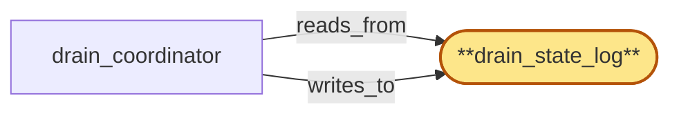

# drain_state_log

> Build the drain-state log:

## Properties

| Field | Value |
| --- | --- |
| Task | `drain_state_log` |
| Scope | `chain_router` |
| Node | `drain_state_log` |
| Node type | `StateSet` |
| Dependencies | `0` |
| Wave | `1` |

## Architecture

## Implementation summary

- Build the drain-state log: append-only Postgres log per drain operation with phase markers (RECEIVED, FLUSH-IN-PROGRESS, FLUSH-COMPLETE, ACK-EMITTED, ATTESTATION-WRITTEN, TERMINAL), gateway-rebind-ack record, lifecycle-gate-scheduled handoff, and per-(offboarding_id, component_id) durability.

## Node definition (`drain_state_log` — StateSet)

- Append-only log of drain transitions per replica keyed by drain_id and (chain, fork_id, replica_id): drain-requested, drain-in-progress, drain-completed, drain-aborted, force-completed (with M-of-N operator attribution), drain-stuck (with rebind-ack-missed reason), drain-window-expired (with lifecycle_gate window_id and HLC TTL evidence), drain-stuck-after-crash (lease-holder crash without TERMINAL within window).
- PHASE-MARKERS: each drain entry carries durable per-(offboarding_id, component_id, drain_id) phase-markers (RECEIVED, FLUSH-IN-PROGRESS, FLUSH-COMPLETE, ACK-EMITTED, ATTESTATION-WRITTEN, TERMINAL-ACK, TERMINAL-PRESERVATION-BLOCKED) so on restart the next instance resumes from the latest durable phase.
- Each entry carries the gateway-rebind acknowledgement timestamp (when received), the authenticated signature and per-drain nonce of the ack, the lifecycle_gate window_id and HLC TTL bounding the lease, and the bounded-wait deadline.
- DRAIN-ACK-HANDOFF RECORD: a typed drain-ack-handoff entry names a successor chain_router instance or a persistent buffer (a tenant-T-flush-residual queue) that owns the residual flush
- ack-by-handoff to tenant_store cites this record. Read by drain_coordinator and pool_membership_manager (whose lifecycle CAS rules consult the latest drain_state_log entry)
- written only by drain_coordinator.

## Requirements

### `r1` — IR-pool-drain-protocol

**Summary:** A replica entering 'draining' state stops receiving new requests, finishes in-flight RPCs (or returns them with a retryable-on-other-replica hint), and only after gateway has re-bound dependent subscriptions does the replica unsubscribe from fanout's head streams; eviction commits only after gateway-rebind acknowledgement.

- Origin: `initial`
- Targets: `drain_coordinator`, `pool_membership_manager`, `drain_state_log`
- Matched via: `drain_state_log`
- Verifications:
  - Test drain_state_log/pool_drain_protocol.rs asserts a draining replica stops accepting new requests, finishes in-flight RPCs, awaits gateway rebind ACK, and only then commits eviction.

### `r2` — SR-drain-state-cas-gate

**Summary:** pool_registry lifecycle transitions for a replica are gated on the replica's current drain_state_log entry: a transition to admitted requires drain-completed-or-aborted, a transition to evicted requires drain-completed; concurrent proposals are CAS-ordered through pool_registry so admit-during-drain or evict-after-readmit cannot both commit.

- Origin: `stressor:1:s3-drain-readd-race`
- Targets: `pool_membership_manager`, `drain_coordinator`, `pool_registry`, `drain_state_log`
- Matched via: `drain_state_log`
- Verifications:
  - Test drain_state_log/cas_gate.rs asserts every phase transition is CAS-on-(drain_id, current_phase); concurrent attempts collapse.

### `r3` — SR-drain-abort-explicit

**Summary:** Re-admission of a draining replica requires an explicit drain-abort transition in drain_state_log before the admit can commit; pool_membership_manager cannot auto-admit a replica whose drain_state_log entry is drain-in-progress without first proposing drain-abort, which surfaces an alert and records the operator/system attribution.

- Origin: `stressor:1:s3-drain-readd-race`
- Targets: `drain_coordinator`, `pool_membership_manager`, `drain_state_log`
- Matched via: `drain_state_log`
- Verifications:
  - Test drain_state_log/abort_explicit.rs asserts aborting a drain emits an explicit ABORT phase carrying the reason; subsequent attempts on same drain_id rejected.

### `r4` — SR-drain-rebind-ack-bounded

**Summary:** drain_coordinator enforces a bounded drain-completion wait: if gateway-rebind ack is not received within a documented window, drain_coordinator escalates by surfacing a drain-stuck alert and either retries the rebind request (idempotent) or proposes a force-complete transition that is itself gated on operator override (M-of-N-signed) so a stuck gateway cannot indefinitely hold drain capacity hostage. The stuck-drain event is recorded in drain_state_log with the rebind-ack-missed reason.

- Origin: `stressor:1:s12-drain-rebind-ack-forgery-or-stall`
- Targets: `drain_coordinator`, `drain_state_log`
- Matched via: `drain_state_log`
- Verifications:
  - Test drain_state_log/rebind_ack_bounded.rs asserts gateway-rebind-ack is bounded by HLC window; on expiry the drain advances to WINDOW_EXPIRED.

### `r5` — SR-drain-rebind-ack-authenticated

**Summary:** Gateway-rebind acknowledgements consumed by drain_coordinator carry an authenticated signature over the cert-bearing gateway-to-chain_router channel and a per-drain nonce (the drain_id from drain_state_log), so a replayed ack from a prior drain or a forged ack cannot complete an active drain.

- Origin: `stressor:1:s12-drain-rebind-ack-forgery-or-stall`
- Targets: `drain_coordinator`, `drain_state_log`
- Matched via: `drain_state_log`
- Verifications:
  - Test drain_state_log/rebind_ack_authenticated.rs asserts rebind-acks must be signed under gateway's SPIFFE identity; un-attested acks rejected.

### `r6` — IIR-lifecycle-gate-scheduled-drain

**Summary:** drain_coordinator's replica-level pool drain is admitted only inside windows reserved by lifecycle_gate against the same target (chain pool, replica subset). drain_coordinator subscribes to lifecycle_gate's schedule, never schedules an autonomous drain that overlaps a non-reserved window, and refuses to start a drain whose lifecycle_gate window has expired. The mutex/lease is per-(chain, fork_id, replica) and bounded by the lifecycle_gate window's HLC TTL; lease-holder crash mid-drain leaves drain_state_log in drain-stuck and surfaces an alert.

- Origin: `freestanding`
- Targets: `drain_coordinator`, `drain_state_log`
- Matched via: `drain_state_log`
- Verifications:
  - Test drain_state_log/lifecycle_gate_scheduled.rs asserts only lifecycle_gate-signed drains are admitted; locally-initiated drains rejected.

### `r7` — IIR-offboarding-phase-markers

**Summary:** pool_membership_manager and drain_coordinator maintain a durable per-(offboarding_id, component_id) apply-state record with typed phase-markers (RECEIVED, FLUSH-IN-PROGRESS, FLUSH-COMPLETE, ACK-EMITTED, ATTESTATION-WRITTEN, TERMINAL); on restart resumes from the last durable phase and never re-runs a non-idempotent phase; never retracts a drain-ack once emitted; flush-in-progress includes flushing in-flight audit writes for the tenant to compliance_audit before ack-emit.

- Origin: `freestanding`
- Targets: `pool_membership_manager`, `drain_coordinator`, `drain_state_log`
- Matched via: `drain_state_log`
- Verifications:
  - Test drain_state_log/offboarding_phase_markers.rs asserts every component records markers (RECEIVED..TERMINAL) per (offboarding_id, component_id) and never retracts an emitted ack.

### `r8` — IIR-teardown-overlap-handoff

**Summary:** If a chain_router replica is itself in lifecycle teardown when a drain-fence broadcast arrives for tenant T, drain_coordinator either completes flush-then-ack-then-teardown within the remaining teardown window, or writes a durable drain-ack-handoff record (in drain_state_log) naming a successor chain_router instance or persistent buffer that owns the residual flush; ack-by-handoff to tenant_store is permitted only via that durable record.

- Origin: `freestanding`
- Targets: `drain_coordinator`, `drain_state_log`
- Matched via: `drain_state_log`
- Verifications:
  - Test drain_state_log/teardown_overlap_handoff.rs asserts flush-then-ack-then-teardown sequencing; durable drain-ack-handoff record present on overlap.

### `r9` — SR2-drain-window-expiry-terminal

**Summary:** drain_coordinator stamps every drain start with the lifecycle_gate window's HLC TTL; if the window expires while the drain is in flight, the drain transitions to drain-window-expired (a typed terminal state in drain_state_log distinct from drain-stuck and force-completed), refuses further per-replica work under that expired window, surfaces an alert with attribution naming the lifecycle_gate window_id, and the replica remains in 'draining' until a new lifecycle_gate-reserved continuation window is admitted. drain_coordinator never autonomously force-completes under an expired window.

- Origin: `stressor:2:s2-drain-window-expiry-mid-drain`
- Targets: `drain_coordinator`, `drain_state_log`
- Matched via: `drain_state_log`
- Verifications:
  - Test drain_state_log/window_expiry_terminal.rs asserts WINDOW_EXPIRED is a documented terminal_class distinct from TIMED_OUT and PRESERVATION_BLOCKED.

### `r10` — SR2-phase-markers-durable

**Summary:** drain_coordinator persists durable per-(offboarding_id, component_id, drain_id) phase-markers in drain_state_log: RECEIVED, FLUSH-IN-PROGRESS, FLUSH-COMPLETE, ACK-EMITTED, ATTESTATION-WRITTEN, TERMINAL. On restart the new instance reads the latest marker and resumes from there; never re-runs flush if FLUSH-COMPLETE is durable; never retracts a drain-ack.

- Origin: `stressor:2:s2-mutex-lease-holder-crash`
- Targets: `drain_coordinator`, `drain_state_log`
- Matched via: `drain_state_log`
- Verifications:
  - Test drain_state_log/phase_markers_durable.rs asserts phase markers are durable across process restart — replays from log of record.

### `r11` — SR2-drain-lease-window-bounded

**Summary:** Per-(chain, fork_id, replica) drain leases are bounded by the lifecycle_gate window's HLC TTL; lease-holder crash without TERMINAL within the window leaves the replica in a documented 'drain-stuck-after-crash' state visible to lifecycle_gate, allowing the next lifecycle_gate-reserved continuation window to admit a new lease; the prior lease is implicitly released at window expiry, never explicitly stolen.

- Origin: `stressor:2:s2-mutex-lease-holder-crash`
- Targets: `drain_coordinator`, `drain_state_log`
- Matched via: `drain_state_log`
- Verifications:
  - Test drain_state_log/lease_window_bounded.rs asserts drain operates under a region_coordinator-issued lease whose HLC TTL bounds the drain window.

### `r12` — SR2-terminal-class-attestation-distinct

**Summary:** Phase-marker taxonomy distinguishes TERMINAL-ACK from TERMINAL-PRESERVATION-BLOCKED; each terminal class writes exactly one typed attestation to compliance_audit with the (offboarding_id, component_id, attempt_id) idempotency key. drain_coordinator and pool_membership_manager share the same drain_state_log entry; the attestation writer is whichever subsystem reaches TERMINAL first under the idempotency key (canonical writer election by drain_state_log CAS).

- Origin: `stressor:2:s2-long-rpc-cancel-vs-preservation-blocked`
- Targets: `drain_coordinator`, `pool_membership_manager`, `drain_state_log`
- Matched via: `drain_state_log`
- Verifications:
  - Test drain_state_log/terminal_class_attestation_distinct.rs asserts each terminal_class produces a distinct attestation type written to compliance_audit.

### `r13` — SR2-drain-ack-handoff-record

**Summary:** drain_state_log carries a typed drain-ack-handoff record naming a successor chain_router instance OR a persistent buffer (a tenant-T-flush-residual queue) that owns the residual flush; ack-by-handoff to tenant_store cites this record. drain_coordinator refuses teardown completion while any drain-fence on this instance is unacked AND no drain-ack-handoff is recorded; idempotent successor read of drain_state_log resumes the flush.

- Origin: `stressor:2:s2-replica-teardown-during-drain-fence`
- Targets: `drain_coordinator`, `drain_state_log`
- Matched via: `drain_state_log`
- Verifications:
  - Test drain_state_log/drain_ack_handoff_record.rs asserts a durable drain-ack-handoff record exists before component teardown completes.

## Outputs

| Path | Purpose |
| --- | --- |
| `crates/chain_router/migrations/0003_drain_state_log.sql` | Schema migration |
| `crates/chain_router/src/drain_state_log.rs` | Phase-marker API + signature verification |

## Stack details

- Postgres schema 'chain_router.drain_state_log' (drain_id, replica_id, phase enum, hlc, lifecycle_gate_signature, rebind_ack_id nullable, idempotency_key UNIQUE, terminal_class enum nullable) — REVOKE UPDATE
- Rust API: append_phase, latest_phase(drain_id), lifecycle_gate_signed_drain — verifies the lifecycle_gate signature against currently-active credential_roster
- Drain windows are HLC-bounded; expiry advances drain to terminal class WINDOW_EXPIRED

## Acceptance criteria

### IR-pool-drain-protocol

- Test drain_state_log/pool_drain_protocol.rs asserts a draining replica stops accepting new requests, finishes in-flight RPCs, awaits gateway rebind ACK, and only then commits eviction.

### SR-drain-state-cas-gate

- Test drain_state_log/cas_gate.rs asserts every phase transition is CAS-on-(drain_id, current_phase); concurrent attempts collapse.

### SR-drain-abort-explicit

- Test drain_state_log/abort_explicit.rs asserts aborting a drain emits an explicit ABORT phase carrying the reason; subsequent attempts on same drain_id rejected.

### SR-drain-rebind-ack-bounded

- Test drain_state_log/rebind_ack_bounded.rs asserts gateway-rebind-ack is bounded by HLC window; on expiry the drain advances to WINDOW_EXPIRED.

### SR-drain-rebind-ack-authenticated

- Test drain_state_log/rebind_ack_authenticated.rs asserts rebind-acks must be signed under gateway's SPIFFE identity; un-attested acks rejected.

### IIR-lifecycle-gate-scheduled-drain

- Test drain_state_log/lifecycle_gate_scheduled.rs asserts only lifecycle_gate-signed drains are admitted; locally-initiated drains rejected.

### IIR-offboarding-phase-markers

- Test drain_state_log/offboarding_phase_markers.rs asserts every component records markers (RECEIVED..TERMINAL) per (offboarding_id, component_id) and never retracts an emitted ack.

### IIR-teardown-overlap-handoff

- Test drain_state_log/teardown_overlap_handoff.rs asserts flush-then-ack-then-teardown sequencing; durable drain-ack-handoff record present on overlap.

### SR2-drain-window-expiry-terminal

- Test drain_state_log/window_expiry_terminal.rs asserts WINDOW_EXPIRED is a documented terminal_class distinct from TIMED_OUT and PRESERVATION_BLOCKED.

### SR2-phase-markers-durable

- Test drain_state_log/phase_markers_durable.rs asserts phase markers are durable across process restart — replays from log of record.

### SR2-drain-lease-window-bounded

- Test drain_state_log/lease_window_bounded.rs asserts drain operates under a region_coordinator-issued lease whose HLC TTL bounds the drain window.

### SR2-terminal-class-attestation-distinct

- Test drain_state_log/terminal_class_attestation_distinct.rs asserts each terminal_class produces a distinct attestation type written to compliance_audit.

### SR2-drain-ack-handoff-record

- Test drain_state_log/drain_ack_handoff_record.rs asserts a durable drain-ack-handoff record exists before component teardown completes.

## Related tasks (graph neighbours)

- [drain_coordinator](drain_coordinator.md)

---

_Source of truth: `archi plan task show drain_state_log`. Regenerate with `python3 tasks/_generate.py`._
