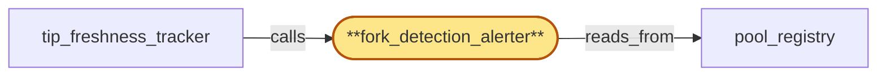

# fork_detection_alerter

> Build the fork-detection alerter subservice:

## Properties

| Field | Value |
| --- | --- |
| Task | `fork_detection_alerter` |
| Scope | `chain_router` |
| Node | `fork_detection_alerter` |
| Node type | `Subservice` |
| Dependencies | `1` |
| Wave | `2` |

## Architecture

## Implementation summary

- Build the fork-detection alerter subservice: detects stable two-subgroup divergence within a sub-pool, emits fork-detected alerts with operator-decision SLA
- head observations are authenticated and submitted to region_coordinator's tip_quorum over the cert-bearing inter-region surface
- broadcast verification against named credential_roster
- per-source rate-limit
- fork-transition handshake to fanout.

## Node definition (`fork_detection_alerter` — Subservice)

- Identifies (chain, fork_id) candidates from pool replicas' chain-head observations: when replicas in a sub-pool diverge into two stable subgroups (neither a transient reorg), emits a fork-detected alert with a documented operator-decision SLA.
- Submission to region_coordinator's tip_quorum is gated on a local stability threshold: a (chain, fork_id) candidate is submitted only after at least K independent local replicas have confirmed it within a documented stability window, and only one canonical local-stability submission is sent per (chain, fork_id) per submission window — subsequent observations within the window update the local view but do not generate fresh submissions.
- Enforces an internal max-submissions-per-window rate limit documented to fit within tip_quorum's per-source rate budget with headroom
- approaching the limit surfaces an alert
- exceeding it suppresses further submissions in the window with a documented suppression count for operator audit.
- Each head observation submitted to tip_quorum is tagged with the authenticated source replica identity of the submitting chain_router replica and signed over the cert-bearing inter-region surface (mTLS to region_coordinator), so per-source rate limit and adversarial-source quarantine apply at tip_quorum.
- SUBMISSION COHORT FILTER: filters its set of contributing replicas by pool_registry's deferred-quarantine flag (in addition to admitted/non-draining/non-tip-stale): a replica with deferred-quarantine for any reason is excluded from the head-observation submission cohort so a replica still serving observations under a deferred quarantine cannot inject signals into tip_quorum before its quarantine commits.
- Each candidate carries the tip-freshness flag (read from pool_registry) and the freshness-derivation tag (hlc-affirmed or hlc-degraded) so tip_quorum's quorum can apply IR-stale-pool-quorum-exclusion and degradation-aware weighting at submission time.
- FORK-TRANSITION HANDSHAKE: drives the cross-component fork-transition handshake — when local stability is reached and tip_quorum confirms (or operator override admits) the new (chain, fork_id), fork_detection_alerter signals pool_membership_manager to commit the new sub-pool's membership in pool_registry, then signals sub_pool_fork_partitioner to emit the fork-transition handshake to fanout (carrying chain_id, prior fork_id, new fork_id, divergence HLC, prior fork terminal HLC).
- On fanout-suspended in this region (per gateway_health_surface) signals sub_pool_fork_partitioner to enter fork-transition-pending degraded mode rather than unilaterally unblocking dispatch.
- NAMED-ROSTER VERIFICATION: signed broadcasts consumed by the alerter (operator overrides on fork-detection decisions, retroactive-revocations of operator credentials affecting prior fork-detection submissions) are verified against the broadcast's NAMED roster_version via on-demand named-roster fetch from region_coordinator when V_named is strictly newer than the local cache
- on fetch failure within budget rejects the broadcast and emits a typed 'named-roster-unfetchable' attestation to compliance_audit. Local roster cache acts only as the freshness witness, not as the authority.

## Requirements

### `r1` — IR-fork-detection-alert

**Summary:** Detection of an unannounced consensus split (replicas in a sub-pool diverging into two stable subgroups, neither a transient reorg) surfaces a 'fork-detected' alert with a documented operator-decision SLA before the split is exposed to tenants as a separate fork sub-pool.

- Origin: `initial`
- Targets: `fork_detection_alerter`
- Matched via: `fork_detection_alerter`
- Verifications:
  - Test fork_alerter/detection_alert.rs asserts a stable two-subgroup divergence yields fork-detected alert; transient reorg does not.

### `r2` — IR-head-observation-authenticated

**Summary:** Every head observation submitted to region_coordinator's tip_quorum is tagged with the authenticated source replica identity of the submitting chain_router replica and signed over the cert-bearing inter-region surface (mTLS to region_coordinator) so per-source rate limit and adversarial-source quarantine can be applied at tip_quorum.

- Origin: `initial`
- Targets: `fork_detection_alerter`
- Matched via: `fork_detection_alerter`
- Verifications:
  - Test fork_alerter/head_observation_authenticated.rs asserts every head observation submitted to tip_quorum carries authenticated source replica identity over mTLS; rate-limited per source.

### `r3` — SR-fork-alerter-local-stability-gate

**Summary:** fork_detection_alerter's submission to region_coordinator's tip_quorum is gated on a local stability threshold: a (chain, fork_id) candidate is submitted only after at least K independent local replicas have confirmed it within a documented stability window, and only one canonical local-stability submission is sent per (chain, fork_id) per submission window; subsequent observations within the window update the local view but do not generate fresh submissions.

- Origin: `stressor:1:s6-fork-alerter-flood`
- Targets: `fork_detection_alerter`
- Matched via: `fork_detection_alerter`
- Verifications:
  - Test fork_alerter/local_stability_gate.rs asserts divergence must persist N consecutive samples before alerting; flapping suppressed.

### `r4` — SR-fork-alerter-self-rate-limit

**Summary:** fork_detection_alerter enforces an internal max-submissions-per-window rate limit that is documented to fit within tip_quorum's per-source rate budget with headroom; approaching the limit surfaces an alert; exceeding it suppresses further submissions in the window with a documented suppression count for operator audit.

- Origin: `stressor:1:s6-fork-alerter-flood`
- Targets: `fork_detection_alerter`
- Matched via: `fork_detection_alerter`
- Verifications:
  - Test fork_alerter/self_rate_limit.rs asserts the alerter rate-limits itself per (chain, fork, source) so adversarial sources cannot flood tip_quorum.

### `r5` — IIR-broadcast-named-roster-verify

**Summary:** Every signed broadcast consumed by chain_router subsystems (offboarding signal, drain-fence broadcast, lifecycle-gate-scheduled drain window, roster updates) is treated as a self-contained credential bundle: chain_router verifies the signature against the broadcast's NAMED roster_version, not the locally cached roster_version, and rejects broadcasts whose named roster_version is unknown or has been retroactively revoked. Local roster cache acts only as the freshness witness, not as the authority.

- Origin: `freestanding`
- Targets: `pool_membership_manager`, `drain_coordinator`, `fork_detection_alerter`
- Matched via: `fork_detection_alerter`
- Verifications:
  - Test fork_alerter/broadcast_named_roster.rs asserts every broadcast verifies signer credentials against region_coordinator's currently-active credential_roster; off-roster signers rejected.

### `r6` — IIR-fork-transition-handshake-fanout

**Summary:** When fork_detection_alerter produces a sub-pool repartition for (chain, fork_id), chain_router emits a structured fork-transition handshake to fanout that names the divergence point (chain_id, prior fork_id, new fork_id, divergence height/HLC). The handshake protocol is initiated by sub_pool_fork_partitioner only after pool_membership_manager has committed the new sub-pool's membership in pool_registry and the routing-table fence has admitted the new fork; chain_router does not begin dispatching forward-progress requests on the new fork to fanout until fanout has acked the handshake.

- Origin: `freestanding`
- Targets: `sub_pool_fork_partitioner`, `fork_detection_alerter`, `pool_membership_manager`
- Matched via: `fork_detection_alerter`
- Verifications:
  - Test fork_alerter/fork_transition_handshake_fanout.rs asserts the divergence point is durably acked by fanout per (region, chain, fork-pair) before forward-progress dispatch admitted.

### `r7` — SR2-named-roster-on-demand-fetch

**Summary:** chain_router exposes an on-demand named-roster fetch path: when a broadcast names V_named that is strictly newer than the local cache, chain_router synchronously requests V_named from region_coordinator over the cert-bearing inter-region surface before verifying the broadcast; the fetch is bounded by a documented HLC budget tighter than the per-tenant ack window; on fetch failure within budget, chain_router rejects the broadcast and emits a typed 'named-roster-unfetchable' attestation to compliance_audit with the offboarding_id.

- Origin: `stressor:2:s2-named-roster-unknown-locally`
- Targets: `pool_membership_manager`, `drain_coordinator`, `fork_detection_alerter`
- Matched via: `fork_detection_alerter`
- Verifications:
  - Test fork_alerter/named_roster_on_demand_fetch.rs asserts on cache miss the alerter fetches the named-roster lookup endpoint over the cert-bearing surface; HLC-bounded budget honored.

### `r8` — SR2-fork-transition-fanout-ack-fence

**Summary:** sub_pool_fork_partitioner admits forward-progress dispatch on a new fork_id only after a fanout-handshake-ack is recorded in pool_registry's per-(chain, fork_id) shard with the divergence-point HLC; until then, requests tagged with the new fork_id are bounced (retryable-on-other-region-or-later-time). The handshake includes the divergence-point and the prior fork's terminal HLC observed by chain_router. Handshake timeout exceeding a documented bound surfaces fork-transition-stalled alert; chain_router never unilaterally unblocks dispatch.

- Origin: `stressor:2:s2-fork-transition-handshake-vs-fanout-monotonicity`
- Targets: `sub_pool_fork_partitioner`, `pool_registry`, `fork_detection_alerter`
- Matched via: `fork_detection_alerter`
- Verifications:
  - Test fork_alerter/fork_transition_fanout_ack_fence.rs asserts ack must arrive before pool_membership_manager admits dispatch on the new fork.

### `r9` — SR2-tip-quorum-deferred-quarantine-exclude

**Summary:** fork_detection_alerter's submission cohort to tip_quorum and tip_freshness_tracker's freshness aggregate both filter pool_registry by deferred-quarantine flag (in addition to admitted/non-draining/non-tip-stale): a replica with deferred-quarantine for any reason is excluded from head-observation submission AND from the per-(chain, fork) freshness aggregate, computed only over replicas that would survive an immediate quarantine commit.

- Origin: `stressor:2:s2-tip-freshness-during-quarantine-of-tip-replica`
- Targets: `fork_detection_alerter`, `tip_freshness_tracker`, `pool_registry`
- Matched via: `fork_detection_alerter`
- Verifications:
  - Test fork_alerter/tip_quorum_deferred_quarantine.rs asserts deferred-quarantine replicas are excluded from divergence detection inputs.

### `r10` — SR2-fork-transition-pending-degraded-mode

**Summary:** When fanout's handshake-ack is unavailable (fanout-suspended in region per gateway_health_surface), chain_router enters a documented fork-transition-pending degraded mode for the affected (chain, fork_id): refuses dispatch tagged with the new fork_id with a typed 'fork-transition-pending' error; tip_freshness_tracker treats the new sub-pool's tip-freshness as suspended. chain_router NEVER dispatches forward-progress on the new fork without a fanout ack. The degraded state is observable on the gateway_health_surface so edge-side residency-aware routing can shift traffic.

- Origin: `stressor:2:s2-fork-transition-handshake-fanout-unreachable`
- Targets: `sub_pool_fork_partitioner`, `fork_detection_alerter`, `tip_freshness_tracker`
- Matched via: `fork_detection_alerter`
- Verifications:
  - Test fork_alerter/fork_transition_pending_degraded.rs asserts on fork-transition-pending health-surface signal, alerter enters degraded mode and stops new alerts.

## Outputs

| Path | Purpose |
| --- | --- |
| `crates/chain_router/src/fork_alerter.rs` | Detector + alert + handshake orchestrator |

## Stack details

- Rust module 'chain_router::fork_alerter' with stable-divergence detector (consecutive-sample threshold) and per-source rate limiter
- Submits authenticated head observations over tonic gRPC + rustls mTLS to region_coordinator.tip_quorum; signs with replica SPIFFE identity
- On fork detection: emits operator alert (with SLA timer), waits for operator decision, then orchestrates fanout handshake to acknowledge divergence point before pool_membership_manager admits forward-progress

## Acceptance criteria

### IR-fork-detection-alert

- Test fork_alerter/detection_alert.rs asserts a stable two-subgroup divergence yields fork-detected alert; transient reorg does not.

### IR-head-observation-authenticated

- Test fork_alerter/head_observation_authenticated.rs asserts every head observation submitted to tip_quorum carries authenticated source replica identity over mTLS; rate-limited per source.

### SR-fork-alerter-local-stability-gate

- Test fork_alerter/local_stability_gate.rs asserts divergence must persist N consecutive samples before alerting; flapping suppressed.

### SR-fork-alerter-self-rate-limit

- Test fork_alerter/self_rate_limit.rs asserts the alerter rate-limits itself per (chain, fork, source) so adversarial sources cannot flood tip_quorum.

### IIR-broadcast-named-roster-verify

- Test fork_alerter/broadcast_named_roster.rs asserts every broadcast verifies signer credentials against region_coordinator's currently-active credential_roster; off-roster signers rejected.

### IIR-fork-transition-handshake-fanout

- Test fork_alerter/fork_transition_handshake_fanout.rs asserts the divergence point is durably acked by fanout per (region, chain, fork-pair) before forward-progress dispatch admitted.

### SR2-named-roster-on-demand-fetch

- Test fork_alerter/named_roster_on_demand_fetch.rs asserts on cache miss the alerter fetches the named-roster lookup endpoint over the cert-bearing surface; HLC-bounded budget honored.

### SR2-fork-transition-fanout-ack-fence

- Test fork_alerter/fork_transition_fanout_ack_fence.rs asserts ack must arrive before pool_membership_manager admits dispatch on the new fork.

### SR2-tip-quorum-deferred-quarantine-exclude

- Test fork_alerter/tip_quorum_deferred_quarantine.rs asserts deferred-quarantine replicas are excluded from divergence detection inputs.

### SR2-fork-transition-pending-degraded-mode

- Test fork_alerter/fork_transition_pending_degraded.rs asserts on fork-transition-pending health-surface signal, alerter enters degraded mode and stops new alerts.

## Related tasks (graph neighbours)

- [pool_registry](pool_registry.md)
- [tip_freshness_tracker](tip_freshness_tracker.md)

---

_Source of truth: `archi plan task show fork_detection_alerter`. Regenerate with `python3 tasks/_generate.py`._
