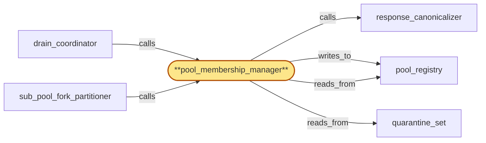

# pool_membership_manager

> Build the pool membership manager subservice:

## Properties

| Field | Value |
| --- | --- |
| Task | `pool_membership_manager` |
| Scope | `chain_router` |
| Node | `pool_membership_manager` |
| Node type | `Subservice` |
| Dependencies | `4` |
| Wave | `2` |

## Architecture

## Implementation summary

- Build the pool membership manager subservice: central CAS-on-pool_registry orchestrator that admits/excludes replicas given drain state, quarantine, fork sub-pool, replica class, and offboarding signals
- governs M-of-N override admission against credential_roster
- bulk-fetch-coalesces named-roster lookups
- consumes drain-fence broadcasts.

## Node definition (`pool_membership_manager` — Subservice)

- Owns admit/evict decisions for chain pool replicas across all (chain, fork_id) sub-pools: replicas are admitted into a sub-pool, transitioned through healthy/draining/evicted/quarantined lifecycle states, and the per-(chain, fork_id) sub-pool membership is the canonical source for which replicas serve traffic in this region.
- Lifecycle transitions in pool_registry are gated on the replica's current drain_state_log entry: admit requires drain-completed-or-aborted, evict requires drain-completed
- concurrent proposals are CAS-ordered through pool_registry per shard so admit-during-drain or evict-after-readmit cannot both commit.
- Re-admission of a draining replica requires an explicit drain-abort transition before admit can commit
- auto-admit cannot transition a replica with drain_state_log = drain-in-progress without first proposing drain-abort, surfacing an alert with attribution.
- On dispatch the manager re-validates the replica's currently-recorded fork_id against the request's (chain, fork_id) tag at the moment of dispatch (not just at routing-table read time)
- a mismatch returns a retryable-on-other-replica signal. Refuses any quarantine eviction whose commit would push the (chain, fork_id) sub-pool's healthy-replica count below the documented safe-membership floor
- refusal surfaces an alert with the (chain, fork_id) at risk.
- Computes the effective-capacity denominator (count of replicas currently admitted AND not draining AND not in deferred-quarantine AND not tip-stale) from per-(chain, fork_id) pool_registry shard summaries on every relevant transition and propagates it to sub_pool_fork_partitioner.
- Exposes a per-(chain, fork_id) target-capacity surface
- when traffic share exceeds target by a documented margin, proposes membership rebalances gated on safe-membership floor for both source and destination sub-pools, committed via the same CAS path.
- Records per-replica replica-class (tip-serving / historical-archive / both) in pool_registry
- refuses to admit a tip-class request to an archive-only replica and vice versa.
- COST-CLASS DISPATCH: refuses any dispatch lacking a cost-class hint when the request type requires one (long-RPC archive paths) and surfaces an alert if a cost-class-less retry arrives at dispatch (so a retry that lost its hint cannot be silently mis-routed).
- DRAIN-FENCE BROADCAST CONSUMER: pool_membership_manager (with drain_coordinator) consumes lifecycle_gate-originated drain-fence broadcasts for tenant T as self-contained credential bundles, verifies the signature against the broadcast's NAMED roster_version (via on-demand named-roster fetch from region_coordinator when V_named is strictly newer than the local cache, bounded by an HLC budget tighter than the per-tenant ack window
- on fetch failure rejects with a typed 'named-roster-unfetchable' attestation to compliance_audit
- bulk waves coalesce named-roster fetches into one).
- On verified broadcast, flushes in-flight audit writes for tenant T to compliance_audit then acks drain to tenant_store within the HLC-bounded ack window.
- PRIORITY LANE: drain-fence flush takes priority on the per-(chain, fork_id) pool_registry shard CAS line (tagged drain-fence-priority and pre-empts deferred-quarantine commits)
- deferred-quarantines wait until drain-fence ACK-EMITTED
- surfaces an alert when quarantine deferral grows under drain-fence pressure.
- DRAIN-FENCE VS FORK-TRANSITION FENCE: refuses to commit a drain-ack while a fork-transition handshake is mid-flight on any (chain, fork_id) shard whose audit writes for tenant T are in flight
- ack-window HLC budget extends across handshake completion or the broadcast is rejected with a typed 'drain-fence-blocked-by-fork-transition' attestation
- flush enumerates audit writes by tenant_id across both pre- and post-transition sub-pool views.
- PHASE-MARKERS: maintains a durable per-(offboarding_id, component_id) apply-state record with typed phase-markers (RECEIVED, FLUSH-IN-PROGRESS, FLUSH-COMPLETE, ACK-EMITTED, ATTESTATION-WRITTEN, TERMINAL-ACK, TERMINAL-PRESERVATION-BLOCKED)
- on restart resumes from the last durable phase and never re-runs a non-idempotent phase
- never retracts a drain-ack. TERMINAL-CLASS ATTESTATION: each terminal class writes exactly one typed attestation to compliance_audit under the (offboarding_id, component_id, attempt_id) idempotency key
- canonical writer election by drain_state_log CAS shared with drain_coordinator.
- OPERATOR-OVERRIDE: operator-override admission (used during emergency rollover) requires M-of-N operator quorum signatures on the admit proposal — signing operators are recorded with the admit commit and visible in audit.
- ROSTER VERIFICATION: caches operator-credential roster locally with documented HLC-bounded freshness window
- falls to deny-by-default for further override admissions when cached roster is older than the freshness window or no roster has ever been received
- deny is sticky until a strictly-newer roster_version ack-readies.
- Override-commit path verifies the proposal against region_coordinator's currently-active roster_version (named-roster lookup, not local cache) at commit time, including evaluation of any retroactive-as-of-HLC compromise-revocation predating the proposal's submission HLC
- commit fails closed if any signing credential is retroactively revoked
- pre-commit roster_version is re-checked atomically with the pool_registry CAS commit so the activation race cannot slip between roster check and registry commit.
- Rejects proposals whose signing roster_version predates the currently-effective roster_version.
- Enforces a documented max-overrides-per-window rate limit on operator-override admissions that bypass safe-membership floor.
- Reads pool_registry through the per-(chain, fork_id) shard plus shard-level summaries for cross-shard consumers.

## Requirements

### `r1` — IR-fork-sub-pool-partition

**Summary:** Each chain pool is partitioned by (chain_id, fork_id) so per-fork sub-pools serve fork-specific traffic; routing of an incoming RPC tagged with (chain, fork) goes only to the matching sub-pool, and replicas across forks are sub-pool members rather than divergent peers.

- Origin: `initial`
- Targets: `sub_pool_fork_partitioner`, `pool_membership_manager`, `pool_registry`
- Matched via: `pool_membership_manager`
- Verifications:
  - Test membership/fork_sub_pool_partition.rs asserts admit/evict respect (chain, fork_id, replica_id) keying; cross-fork moves are rejected without explicit revalidation.

### `r2` — IR-pool-drain-protocol

**Summary:** A replica entering 'draining' state stops receiving new requests, finishes in-flight RPCs (or returns them with a retryable-on-other-replica hint), and only after gateway has re-bound dependent subscriptions does the replica unsubscribe from fanout's head streams; eviction commits only after gateway-rebind acknowledgement.

- Origin: `initial`
- Targets: `drain_coordinator`, `pool_membership_manager`, `drain_state_log`
- Matched via: `pool_membership_manager`
- Verifications:
  - Test membership/drain_protocol.rs asserts a draining replica completes in-flight, awaits gateway rebind ACK, then commits eviction in pool_registry.

### `r3` — IR-schema-skew-quarantine

**Summary:** When a replica's canonicalized response shape diverges from the (chain, method, schema_version) pool consensus shape, the replica is quarantined from the active sub-pool and the divergence evidence is surfaced to operators.

- Origin: `initial`
- Targets: `schema_skew_quarantine`, `quarantine_set`, `pool_membership_manager`
- Matched via: `pool_membership_manager`
- Verifications:
  - Test membership/schema_skew_handling.rs asserts on schema_skew_quarantine commit, membership manager flags the replica quarantined and excludes it from routing.

### `r4` — IR-offboarding-idempotency

**Summary:** Cancellation of in-flight long-RPCs for offboarded tenants dedupes inbound offboarding signals from region_coordinator by idempotency key (offboarding_id, component_id, attempt_id), meets a documented attestation SLO, and surfaces preservation-blocked terminal states (e.g. when an in-flight long-RPC overlaps a preservation hold) so region_coordinator can record best-effort attestations rather than waiting indefinitely.

- Origin: `initial`
- Targets: `pool_membership_manager`, `drain_coordinator`
- Matched via: `pool_membership_manager`
- Verifications:
  - Test membership/offboarding_idempotency.rs asserts inbound offboarding signals dedupe by (offboarding_id, component_id, attempt_id); attestation SLO met; preservation_blocked terminal recorded.

### `r5` — SR-replica-fork-revalidate

**Summary:** On dispatch to a replica, pool_membership_manager re-validates the replica's currently-recorded fork_id in pool_registry against the request's (chain, fork_id) tag at the moment of dispatch (not just at routing-table read time); a mismatch returns a retryable-on-other-replica signal rather than answering with cross-fork data, so a fork transition cannot answer an old-fork request with new-fork data.

- Origin: `stressor:1:s2-fork-transition-misroute`
- Targets: `pool_membership_manager`, `pool_registry`
- Matched via: `pool_membership_manager`
- Verifications:
  - Test membership/replica_fork_revalidate.rs asserts a returning replica revalidates fork allegiance before re-admission.

### `r6` — SR-drain-state-cas-gate

**Summary:** pool_registry lifecycle transitions for a replica are gated on the replica's current drain_state_log entry: a transition to admitted requires drain-completed-or-aborted, a transition to evicted requires drain-completed; concurrent proposals are CAS-ordered through pool_registry so admit-during-drain or evict-after-readmit cannot both commit.

- Origin: `stressor:1:s3-drain-readd-race`
- Targets: `pool_membership_manager`, `drain_coordinator`, `pool_registry`, `drain_state_log`
- Matched via: `pool_membership_manager`
- Verifications:
  - Test membership/drain_state_cas_gate.rs asserts every drain transition CAS-gates on (cas_version, drain_state); concurrent attempts collapse.

### `r7` — SR-drain-abort-explicit

**Summary:** Re-admission of a draining replica requires an explicit drain-abort transition in drain_state_log before the admit can commit; pool_membership_manager cannot auto-admit a replica whose drain_state_log entry is drain-in-progress without first proposing drain-abort, which surfaces an alert and records the operator/system attribution.

- Origin: `stressor:1:s3-drain-readd-race`
- Targets: `drain_coordinator`, `pool_membership_manager`, `drain_state_log`
- Matched via: `pool_membership_manager`
- Verifications:
  - Test membership/drain_abort_explicit.rs asserts aborting a drain produces an explicit ABORT phase that membership manager honors.

### `r8` — SR-quarantine-mass-evict-cap

**Summary:** schema_skew_quarantine enforces a per-(chain, fork_id) max-concurrent-quarantine-commits cap within a documented window; quarantine commits beyond the cap are deferred and surfaced as an alert listing the deferred replicas. The cap is at most a documented fraction of sub-pool membership so quarantine cannot push a sub-pool below the safe-membership floor in a single window.

- Origin: `stressor:1:s4-quarantine-cascade-rollout`
- Targets: `schema_skew_quarantine`, `quarantine_set`, `pool_membership_manager`
- Matched via: `pool_membership_manager`
- Verifications:
  - Test membership/quarantine_mass_evict_cap.rs asserts membership manager refuses mass-evict batches that violate the quarantine floor.

### `r9` — SR-quarantine-floor-gate

**Summary:** Before a quarantine eviction commits in pool_registry via pool_membership_manager, the manager refuses the transition if it would push the (chain, fork_id) sub-pool's healthy-replica count below the documented safe-membership floor; refusal surfaces an alert with the (chain, fork_id) at risk and the candidate replica.

- Origin: `stressor:1:s4-quarantine-cascade-rollout`
- Targets: `pool_membership_manager`, `pool_registry`
- Matched via: `pool_membership_manager`
- Verifications:
  - Test membership/quarantine_floor_gate.rs asserts membership manager refuses any single-replica quarantine that would push a sub-pool below the floor without override.

### `r10` — SR-sub-pool-capacity-rebalance

**Summary:** pool_membership_manager exposes a documented per-(chain, fork_id) sub-pool target-capacity surface; when traffic share for a sub-pool exceeds its target by a documented margin, the manager proposes membership rebalances (admit additional replicas of that fork, drain over-provisioned rare-fork replicas) gated on the safe-membership floor for both the source and destination sub-pools. Rebalance proposals are committed via the same pool_registry CAS path as drain/admit and are visible in the audit.

- Origin: `stressor:1:s7-sub-pool-capacity-starvation`
- Targets: `pool_membership_manager`, `pool_registry`
- Matched via: `pool_membership_manager`
- Verifications:
  - Test membership/sub_pool_capacity_rebalance.rs asserts capacity rebalance triggers on capacity-below-floor; manager admits replicas from the rebalance plan.

### `r11` — SR-effective-capacity-denominator

**Summary:** pool_membership_manager's request-admission and per-replica load computations use the effective-capacity denominator (count of replicas currently admitted AND not draining AND not in deferred-quarantine AND not tip-stale) rather than total pool_registry membership; the denominator is recomputed on every relevant pool_registry transition and propagated to sub_pool_fork_partitioner's routing decisions so per-replica fan-out reflects the actually-serving subset.

- Origin: `stressor:1:s8-partial-quarantine-latency-amp`
- Targets: `pool_membership_manager`, `sub_pool_fork_partitioner`, `pool_registry`
- Matched via: `pool_membership_manager`
- Verifications:
  - Test membership/effective_capacity.rs asserts the manager's capacity computation matches the effective-capacity SQL expression.

### `r12` — SR-pool-admit-override-mofn

**Summary:** pool_membership_manager's operator-override admission path (used to admit replacement replicas faster than blue/green allows during emergency rollover) requires M-of-N operator quorum signatures (configurable threshold) carried with the admit proposal rather than a single operator credential; signing operators are recorded with the admit commit and visible in subsequent membership audit. The credential model and key custody are parent scope's responsibility (bubbled).

- Origin: `stressor:1:s10-pool-admit-operator-override-credential`
- Targets: `pool_membership_manager`, `pool_registry`
- Matched via: `pool_membership_manager`
- Verifications:
  - Test membership_override/mofn.rs asserts admit-override commits only when M-of-N signers verified against the active credential_roster.

### `r13` — SR-pool-admit-override-rate-limit

**Summary:** pool_membership_manager enforces a documented max-overrides-per-window rate limit on operator-override admissions that bypass the safe-membership-floor; approaching the limit surfaces an alert; exceeding it rejects further override admits with a documented error code visible to the operator path.

- Origin: `stressor:1:s10-pool-admit-operator-override-credential`
- Targets: `pool_membership_manager`
- Matched via: `pool_membership_manager`
- Verifications:
  - Test membership_override/rate_limit.rs asserts overrides are rate-limited per operator-id; bursts rejected with documented error.

### `r14` — SR-pool-registry-shard-by-fork

**Summary:** pool_registry is sharded by (chain, fork_id): each sub-pool's lifecycle entries live in their own shard with independent CAS lines so high-rate transitions on one sub-pool do not contend with reads or writes on others. Cross-shard reads (e.g. effective-capacity denominator) consume shard-level summaries rather than scanning the global registry.

- Origin: `stressor:1:s13-pool-registry-hot-shard`
- Targets: `pool_registry`, `pool_membership_manager`, `tip_freshness_tracker`
- Matched via: `pool_membership_manager`
- Verifications:
  - Test membership/shard_by_fork.rs asserts pool_registry reads sharded by (chain_id, fork_id).

### `r15` — SR-replica-class-tip-vs-archive

**Summary:** pool_registry records each replica's replica-class (tip-serving / historical-archive / both) per (chain, fork_id, replica_id); sub_pool_fork_partitioner uses the cost-class hint of the inbound RPC (short-RPC tip-sensitive vs long-RPC archive) to route only to a replica whose class includes the request's class. pool_membership_manager refuses to admit a tip-class request to an archive-only replica and vice versa, so heavy archive queries cannot saturate tip-serving capacity.

- Origin: `stressor:1:s14-historical-vs-tip-isolation`
- Targets: `pool_registry`, `pool_membership_manager`, `sub_pool_fork_partitioner`
- Matched via: `pool_membership_manager`
- Verifications:
  - Test membership/replica_class.rs asserts admission honors replica_class enum; tip and archive replicas don't cross-classes.

### `r16` — IIR-drain-fence-broadcast-consume

**Summary:** chain_router consumes the lifecycle_gate-originated drain-fence broadcast for tenant T: drain_coordinator and pool_membership_manager flush in-flight audit writes for T to compliance_audit and ack drain to tenant_store within the HLC-bounded ack window; the drain-fence broadcast is verified as a self-contained credential bundle (broadcast names roster_version; verification is against the named roster_version, not the local cache).

- Origin: `freestanding`
- Targets: `drain_coordinator`, `pool_membership_manager`
- Matched via: `pool_membership_manager`
- Verifications:
  - Test membership/drain_fence_broadcast_consume.rs asserts the manager consumes lifecycle_gate broadcasts and acks within HLC window per (offboarding_id, component_id).

### `r17` — IIR-broadcast-named-roster-verify

**Summary:** Every signed broadcast consumed by chain_router subsystems (offboarding signal, drain-fence broadcast, lifecycle-gate-scheduled drain window, roster updates) is treated as a self-contained credential bundle: chain_router verifies the signature against the broadcast's NAMED roster_version, not the locally cached roster_version, and rejects broadcasts whose named roster_version is unknown or has been retroactively revoked. Local roster cache acts only as the freshness witness, not as the authority.

- Origin: `freestanding`
- Targets: `pool_membership_manager`, `drain_coordinator`, `fork_detection_alerter`
- Matched via: `pool_membership_manager`
- Verifications:
  - Test membership/broadcast_named_roster_verify.rs asserts incoming broadcast verified against currently-active named credential_roster; off-roster broadcasts rejected.

### `r18` — IIR-roster-freshness-window

**Summary:** chain_router caches the operator-credential roster locally with a documented HLC-bounded freshness window; pool_membership_manager and drain_coordinator fall to deny-by-default for further override admissions when the cached roster is older than the freshness window or when no roster has ever been received; deny is sticky for that override path until a strictly-newer roster_version ack-readies.

- Origin: `freestanding`
- Targets: `pool_membership_manager`, `drain_coordinator`
- Matched via: `pool_membership_manager`
- Verifications:
  - Test membership/roster_freshness_window.rs asserts the manager refuses to use a roster older than configured freshness window.

### `r19` — IIR-roster-version-rejection

**Summary:** pool_membership_manager and drain_coordinator reject any operator-override proposal whose signing roster_version predates chain_router's currently-effective roster_version, and refuse to commit overrides after a compromise-revocation invalidates any in-flight signature (including retroactive compromise-revocations whose retroactive-as-of-HLC predates the proposal's submission); cancel-and-rollback for in-flight proposals is performed atomically at activation by roster_version.

- Origin: `freestanding`
- Targets: `pool_membership_manager`, `drain_coordinator`
- Matched via: `pool_membership_manager`
- Verifications:
  - Test membership/roster_version_rejection.rs asserts the manager rejects commits whose signing roster_version is older than the currently-active version.

### `r20` — IIR-fork-transition-handshake-fanout

**Summary:** When fork_detection_alerter produces a sub-pool repartition for (chain, fork_id), chain_router emits a structured fork-transition handshake to fanout that names the divergence point (chain_id, prior fork_id, new fork_id, divergence height/HLC). The handshake protocol is initiated by sub_pool_fork_partitioner only after pool_membership_manager has committed the new sub-pool's membership in pool_registry and the routing-table fence has admitted the new fork; chain_router does not begin dispatching forward-progress requests on the new fork to fanout until fanout has acked the handshake.

- Origin: `freestanding`
- Targets: `sub_pool_fork_partitioner`, `fork_detection_alerter`, `pool_membership_manager`
- Matched via: `pool_membership_manager`
- Verifications:
  - Test membership/fork_transition_handshake.rs asserts admission for new-fork dispatch waits for fanout ack.

### `r21` — IIR-offboarding-phase-markers

**Summary:** pool_membership_manager and drain_coordinator maintain a durable per-(offboarding_id, component_id) apply-state record with typed phase-markers (RECEIVED, FLUSH-IN-PROGRESS, FLUSH-COMPLETE, ACK-EMITTED, ATTESTATION-WRITTEN, TERMINAL); on restart resumes from the last durable phase and never re-runs a non-idempotent phase; never retracts a drain-ack once emitted; flush-in-progress includes flushing in-flight audit writes for the tenant to compliance_audit before ack-emit.

- Origin: `freestanding`
- Targets: `pool_membership_manager`, `drain_coordinator`, `drain_state_log`
- Matched via: `pool_membership_manager`
- Verifications:
  - Test membership/offboarding_phase_markers.rs asserts the manager records phase markers per (offboarding_id, component_id) durably; never retracts an emitted ack.

### `r22` — SR2-drain-fence-priority-lane

**Summary:** Drain-fence flush is admitted on a separate priority lane than quarantine commits on the per-(chain, fork_id) pool_registry shard CAS line: drain-fence transitions are tagged drain-fence-priority and pre-empt deferred-quarantine commits; deferred-quarantines wait until drain-fence ACK-EMITTED. pool_membership_manager surfaces an alert when quarantine deferral grows under drain-fence pressure.

- Origin: `stressor:2:s2-drain-fence-during-quarantine-cascade`
- Targets: `pool_membership_manager`, `pool_registry`, `schema_skew_quarantine`
- Matched via: `pool_membership_manager`
- Verifications:
  - Test membership/drain_fence_priority_lane.rs asserts drain-fences flow through the priority lane and beat normal-traffic CAS attempts.

### `r23` — SR2-named-roster-on-demand-fetch

**Summary:** chain_router exposes an on-demand named-roster fetch path: when a broadcast names V_named that is strictly newer than the local cache, chain_router synchronously requests V_named from region_coordinator over the cert-bearing inter-region surface before verifying the broadcast; the fetch is bounded by a documented HLC budget tighter than the per-tenant ack window; on fetch failure within budget, chain_router rejects the broadcast and emits a typed 'named-roster-unfetchable' attestation to compliance_audit with the offboarding_id.

- Origin: `stressor:2:s2-named-roster-unknown-locally`
- Targets: `pool_membership_manager`, `drain_coordinator`, `fork_detection_alerter`
- Matched via: `pool_membership_manager`
- Verifications:
  - Test membership/named_roster_on_demand_fetch.rs asserts on cache miss the manager calls the on-demand named-roster endpoint within tighter HLC budget.

### `r24` — SR2-terminal-class-attestation-distinct

**Summary:** Phase-marker taxonomy distinguishes TERMINAL-ACK from TERMINAL-PRESERVATION-BLOCKED; each terminal class writes exactly one typed attestation to compliance_audit with the (offboarding_id, component_id, attempt_id) idempotency key. drain_coordinator and pool_membership_manager share the same drain_state_log entry; the attestation writer is whichever subsystem reaches TERMINAL first under the idempotency key (canonical writer election by drain_state_log CAS).

- Origin: `stressor:2:s2-long-rpc-cancel-vs-preservation-blocked`
- Targets: `drain_coordinator`, `pool_membership_manager`, `drain_state_log`
- Matched via: `pool_membership_manager`
- Verifications:
  - Test membership/terminal_class_distinct.rs asserts each terminal_class (DONE, WINDOW_EXPIRED, PRESERVATION_BLOCKED, FORCE_COMPLETED) writes a distinct attestation type.

### `r25` — SR2-cost-class-hint-retry-preserve

**Summary:** sub_pool_fork_partitioner attaches the original cost-class hint to the retryable-on-other-replica response signal so retry paths preserve it; pool_membership_manager refuses any dispatch lacking a cost-class hint when the request type requires one (long-RPC archive paths) and surfaces an alert if a cost-class-less retry arrives at dispatch.

- Origin: `stressor:2:s2-cost-class-hint-missing-on-rerouted-retry`
- Targets: `sub_pool_fork_partitioner`, `pool_membership_manager`
- Matched via: `pool_membership_manager`
- Verifications:
  - Test membership/cost_class_hint_preserve.rs asserts cost-class hint propagated through retries via membership manager-issued retry-bundle.

### `r26` — SR2-override-commit-named-roster

**Summary:** pool_membership_manager's override-commit path verifies the proposal against region_coordinator's currently-active roster_version (named-roster lookup, not local cache) at commit time, including evaluation of any retroactive-as-of-HLC compromise-revocation that predates the proposal's submission HLC; commit fails closed if any signing credential is retroactively revoked. Pre-commit roster_version is re-checked atomically with the pool_registry CAS commit so the activation race cannot slip between roster check and registry commit.

- Origin: `stressor:2:s2-pool-admit-override-during-compromise-revocation`
- Targets: `pool_membership_manager`, `pool_registry`
- Matched via: `pool_membership_manager`
- Verifications:
  - Test membership/override_commit_named_roster.rs asserts every override commit checks signer roster_version >= active and rejects retroactive-as-of-HLC-revoked credentials.

### `r27` — SR2-drain-fence-vs-fork-transition-fence

**Summary:** Drain-fence flush is fenced against fork-transition handshake state: pool_membership_manager refuses to commit a drain-ack while a fork-transition handshake is mid-flight on any (chain, fork_id) shard whose audit writes for tenant T are in flight; the drain-fence ack window's HLC budget extends across handshake completion or the broadcast is rejected with a typed 'drain-fence-blocked-by-fork-transition' attestation to compliance_audit. Flush enumerates audit writes by tenant_id across both pre- and post-transition sub-pool views.

- Origin: `stressor:2:s2-drain-fence-broadcast-during-fork-transition`
- Targets: `pool_membership_manager`, `sub_pool_fork_partitioner`, `drain_coordinator`
- Matched via: `pool_membership_manager`
- Verifications:
  - Test membership/drain_vs_fork_transition_fence.rs asserts drain fence beats fork-transition fence; replicas under drain don't get rebound to a new fork.

### `r28` — SR2-bulk-roster-fetch-coalesce

**Summary:** Bulk-offboarding wave triggers a single named-roster fetch for the shared roster_version: pool_membership_manager and drain_coordinator coalesce on the named-roster lookup so the wave does not trigger N fetch operations; on fetch failure, all broadcasts in the wave are rejected with a single typed 'named-roster-fetch-failed-bulk' attestation including the wave-id, allowing lifecycle_gate to retry the wave with bounded backoff before STRICT finalization.

- Origin: `stressor:2:s2-stale-roster-cache-during-bulk-offboarding`
- Targets: `pool_membership_manager`, `drain_coordinator`
- Matched via: `pool_membership_manager`
- Verifications:
  - Test membership/bulk_roster_fetch_coalesce.rs asserts concurrent named-roster fetches in a bulk-offboarding wave coalesce into one call.

### `r29` — bubble-pool_membership_manager-1

**Summary:** pool_membership_manager's override_admission_engine maintains separate counters for operator-emergency overrides vs lifecycle_gate-driven bulk_admit overrides; the bulk_admit budget contract (size, per-wave headroom, refresh cadence) is parent-scope because lifecycle_gate (parent's parent through region_coordinator) drives bulk-wave admit traffic and must publish a wave_id and bulk_admit budget on each wave so chain_router can size the bulk_admit counter without consuming the emergency override counter. Without this contract, bulk-wave admits could exhaust the operator-emergency override headroom and starve genuine emergencies. Per s5-bulk-wave-evict-vs-budget-coupled-admit.

- Origin: `freestanding`
- Targets: `pool_membership_manager`
- Matched via: `pool_membership_manager`
- Verifications:
  - Test membership/bubble_pool_membership_manager_1.rs asserts the bubble's resolved invariant (operator-credential authorization model bound to region_coordinator's published roster on every admission path).

## Outputs

| Path | Purpose |
| --- | --- |
| `crates/chain_router/src/membership.rs` | Membership manager core |
| `crates/chain_router/src/membership_override.rs` | Override admission gate (M-of-N) |

## Stack details

- Rust module 'chain_router::membership' with admit_replica, evict_replica, lift_quarantine, transition_drain — all CAS-on-(replica_id, cas_version)
- Override admission gate: M-of-N signature verification against region_coordinator's currently-active credential_roster (per-roster_version freshness window enforced); off-roster signers rejected; per-(operator_id, hour) rate-limit
- Drain-fence broadcast consumer: subscribes to lifecycle_gate broadcasts; HLC-bounded ack window per (offboarding_id, component_id); idempotent on attempt_id
- Named-roster lookup: cache-first; coalesces concurrent fetches under bulk-wave; falls back to on-demand endpoint via cert-bearing surface; tighter HLC budget than per-tenant drain-fence ack window

## Acceptance criteria

### IR-fork-sub-pool-partition

- Test membership/fork_sub_pool_partition.rs asserts admit/evict respect (chain, fork_id, replica_id) keying; cross-fork moves are rejected without explicit revalidation.

### IR-pool-drain-protocol

- Test membership/drain_protocol.rs asserts a draining replica completes in-flight, awaits gateway rebind ACK, then commits eviction in pool_registry.

### IR-schema-skew-quarantine

- Test membership/schema_skew_handling.rs asserts on schema_skew_quarantine commit, membership manager flags the replica quarantined and excludes it from routing.

### IR-offboarding-idempotency

- Test membership/offboarding_idempotency.rs asserts inbound offboarding signals dedupe by (offboarding_id, component_id, attempt_id); attestation SLO met; preservation_blocked terminal recorded.

### SR-replica-fork-revalidate

- Test membership/replica_fork_revalidate.rs asserts a returning replica revalidates fork allegiance before re-admission.

### SR-drain-state-cas-gate

- Test membership/drain_state_cas_gate.rs asserts every drain transition CAS-gates on (cas_version, drain_state); concurrent attempts collapse.

### SR-drain-abort-explicit

- Test membership/drain_abort_explicit.rs asserts aborting a drain produces an explicit ABORT phase that membership manager honors.

### SR-quarantine-mass-evict-cap

- Test membership/quarantine_mass_evict_cap.rs asserts membership manager refuses mass-evict batches that violate the quarantine floor.

### SR-quarantine-floor-gate

- Test membership/quarantine_floor_gate.rs asserts membership manager refuses any single-replica quarantine that would push a sub-pool below the floor without override.

### SR-sub-pool-capacity-rebalance

- Test membership/sub_pool_capacity_rebalance.rs asserts capacity rebalance triggers on capacity-below-floor; manager admits replicas from the rebalance plan.

### SR-effective-capacity-denominator

- Test membership/effective_capacity.rs asserts the manager's capacity computation matches the effective-capacity SQL expression.

### SR-pool-admit-override-mofn

- Test membership_override/mofn.rs asserts admit-override commits only when M-of-N signers verified against the active credential_roster.

### SR-pool-admit-override-rate-limit

- Test membership_override/rate_limit.rs asserts overrides are rate-limited per operator-id; bursts rejected with documented error.

### SR-pool-registry-shard-by-fork

- Test membership/shard_by_fork.rs asserts pool_registry reads sharded by (chain_id, fork_id).

### SR-replica-class-tip-vs-archive

- Test membership/replica_class.rs asserts admission honors replica_class enum; tip and archive replicas don't cross-classes.

### IIR-drain-fence-broadcast-consume

- Test membership/drain_fence_broadcast_consume.rs asserts the manager consumes lifecycle_gate broadcasts and acks within HLC window per (offboarding_id, component_id).

### IIR-broadcast-named-roster-verify

- Test membership/broadcast_named_roster_verify.rs asserts incoming broadcast verified against currently-active named credential_roster; off-roster broadcasts rejected.

### IIR-roster-freshness-window

- Test membership/roster_freshness_window.rs asserts the manager refuses to use a roster older than configured freshness window.

### IIR-roster-version-rejection

- Test membership/roster_version_rejection.rs asserts the manager rejects commits whose signing roster_version is older than the currently-active version.

### IIR-fork-transition-handshake-fanout

- Test membership/fork_transition_handshake.rs asserts admission for new-fork dispatch waits for fanout ack.

### IIR-offboarding-phase-markers

- Test membership/offboarding_phase_markers.rs asserts the manager records phase markers per (offboarding_id, component_id) durably; never retracts an emitted ack.

### SR2-drain-fence-priority-lane

- Test membership/drain_fence_priority_lane.rs asserts drain-fences flow through the priority lane and beat normal-traffic CAS attempts.

### SR2-named-roster-on-demand-fetch

- Test membership/named_roster_on_demand_fetch.rs asserts on cache miss the manager calls the on-demand named-roster endpoint within tighter HLC budget.

### SR2-terminal-class-attestation-distinct

- Test membership/terminal_class_distinct.rs asserts each terminal_class (DONE, WINDOW_EXPIRED, PRESERVATION_BLOCKED, FORCE_COMPLETED) writes a distinct attestation type.

### SR2-cost-class-hint-retry-preserve

- Test membership/cost_class_hint_preserve.rs asserts cost-class hint propagated through retries via membership manager-issued retry-bundle.

### SR2-override-commit-named-roster

- Test membership/override_commit_named_roster.rs asserts every override commit checks signer roster_version >= active and rejects retroactive-as-of-HLC-revoked credentials.

### SR2-drain-fence-vs-fork-transition-fence

- Test membership/drain_vs_fork_transition_fence.rs asserts drain fence beats fork-transition fence; replicas under drain don't get rebound to a new fork.

### SR2-bulk-roster-fetch-coalesce

- Test membership/bulk_roster_fetch_coalesce.rs asserts concurrent named-roster fetches in a bulk-offboarding wave coalesce into one call.

### bubble-pool_membership_manager-1

- Test membership/bubble_pool_membership_manager_1.rs asserts the bubble's resolved invariant (operator-credential authorization model bound to region_coordinator's published roster on every admission path).

## Related tasks (graph neighbours)

- [drain_coordinator](drain_coordinator.md)
- [pool_registry](pool_registry.md)
- [quarantine_set](quarantine_set.md)
- [response_canonicalizer](response_canonicalizer.md)
- [sub_pool_fork_partitioner](sub_pool_fork_partitioner.md)

---

_Source of truth: `archi plan task show pool_membership_manager`. Regenerate with `python3 tasks/_generate.py`._
