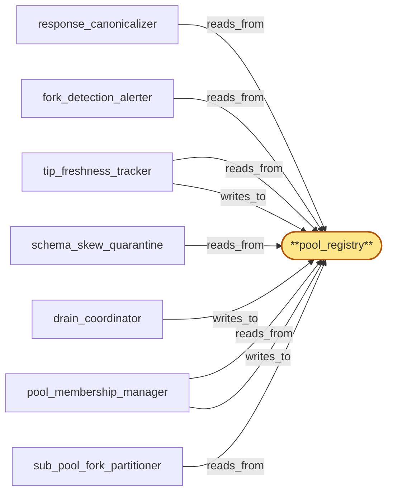

# pool_registry

> Build the chain_router pool_registry:

## Properties

| Field | Value |
| --- | --- |
| Task | `pool_registry` |
| Scope | `chain_router` |
| Node | `pool_registry` |
| Node type | `StateSet` |
| Dependencies | `0` |
| Wave | `1` |

## Architecture

## Implementation summary

- Build the chain_router pool_registry: Postgres-backed shared state set holding per-(chain, fork_id, replica_id) membership, draining/quarantined/tip-stale flags, drain-state CAS gates, sub-pool capacity, replica class (tip vs archive), and per-(chain,fork) sharding.
- CAS-on-version writes
- all chain_router subservices read/write through this single registry.

## Node definition (`pool_registry` — StateSet)

- Local in-process registry of every chain pool replica, sharded by (chain, fork_id): each sub-pool's lifecycle entries live in their own shard with independent CAS lines so high-rate transitions on one sub-pool do not contend with reads or writes on others.
- Each entry is keyed by (chain, fork_id, replica_id) and carries the replica's lifecycle state (admitted / draining / evicted / quarantined / deferred-quarantine), tip-freshness flag (with hlc-affirmed vs hlc-degraded derivation tag), current schema_version and canonical-bytes-version, replica-class (tip-serving / historical-archive / both), and the hlc_stamp of the last state transition.
- Sub-pool transitions carry a fork-transition hlc_stamp consumed by sub_pool_fork_partitioner's routing-table fence.
- FORK-TRANSITION HANDSHAKE STATE: per-(chain, fork_id) shard records fanout-handshake-ack state — pending (handshake emitted, ack not received), acked (with divergence-point HLC), suspended (fanout-suspended in region, no ack expected)
- sub_pool_fork_partitioner consults this state before admitting forward-progress dispatch on the new fork_id.
- PRIORITY LANE: per-shard CAS line tags drain-fence transitions as drain-fence-priority so they pre-empt deferred-quarantine commits on the same shard.
- Cross-shard reads (e.g. effective-capacity denominator, target-capacity audit) consume per-shard summaries rather than scanning the global registry.
- Lifecycle transitions are gated by drain_state_log per the membership manager's CAS rules
- quarantine transitions respect the safe-membership floor.

## Requirements

### `r1` — IR-fork-sub-pool-partition

**Summary:** Each chain pool is partitioned by (chain_id, fork_id) so per-fork sub-pools serve fork-specific traffic; routing of an incoming RPC tagged with (chain, fork) goes only to the matching sub-pool, and replicas across forks are sub-pool members rather than divergent peers.

- Origin: `initial`
- Targets: `sub_pool_fork_partitioner`, `pool_membership_manager`, `pool_registry`
- Matched via: `pool_registry`
- Verifications:
  - Test in crates/chain_router/tests/pool_registry/fork_sub_pool_partition.rs asserts members keyed by (chain, fork_id, replica_id); a request tagged with unknown fork_id returns NoMatch and is not routed.

### `r2` — IR-tip-freshness-budget

**Summary:** Each chain has a per-chain tip-freshness budget; chain_router measures pool tip lag against an out-of-band reference (peer-regional pools via region_coordinator, chain peer count, expected slot advance) and marks pools tip-stale when they exceed the budget.

- Origin: `initial`
- Targets: `tip_freshness_tracker`, `pool_registry`
- Matched via: `pool_registry`
- Verifications:
  - Test pool_registry/tip_freshness_budget.rs asserts tip_freshness_tracker writes tip_stale flag when per-chain budget exceeded; pool_membership_manager reads excluded the replica.

### `r3` — SR-replica-fork-revalidate

**Summary:** On dispatch to a replica, pool_membership_manager re-validates the replica's currently-recorded fork_id in pool_registry against the request's (chain, fork_id) tag at the moment of dispatch (not just at routing-table read time); a mismatch returns a retryable-on-other-replica signal rather than answering with cross-fork data, so a fork transition cannot answer an old-fork request with new-fork data.

- Origin: `stressor:1:s2-fork-transition-misroute`
- Targets: `pool_membership_manager`, `pool_registry`
- Matched via: `pool_registry`
- Verifications:
  - Test pool_registry/replica_fork_revalidate.rs asserts a replica re-emerging on a new fork triggers fork revalidation before re-entry.

### `r4` — SR-fork-transition-routing-fence

**Summary:** Sub-pool fork transitions in pool_registry are stamped with an hlc_stamp; sub_pool_fork_partitioner's routing table carries the hlc_stamp at which it was rebuilt and refuses to dispatch requests whose hlc_stamp would predate a transition affecting the target sub-pool — instead the request is bounced to be re-routed against the latest table.

- Origin: `stressor:1:s2-fork-transition-misroute`
- Targets: `sub_pool_fork_partitioner`, `pool_registry`
- Matched via: `pool_registry`
- Verifications:
  - Test pool_registry/fork_transition_routing_fence.rs asserts during a fork transition no forward-progress dispatch admitted on the new fork until divergence-point ack landed.

### `r5` — SR-drain-state-cas-gate

**Summary:** pool_registry lifecycle transitions for a replica are gated on the replica's current drain_state_log entry: a transition to admitted requires drain-completed-or-aborted, a transition to evicted requires drain-completed; concurrent proposals are CAS-ordered through pool_registry so admit-during-drain or evict-after-readmit cannot both commit.

- Origin: `stressor:1:s3-drain-readd-race`
- Targets: `pool_membership_manager`, `drain_coordinator`, `pool_registry`, `drain_state_log`
- Matched via: `pool_registry`
- Verifications:
  - Test pool_registry/drain_state_cas_gate.rs asserts every drain transition is gated by CAS on (cas_version, drain_state); concurrent drain attempts collapse to a single committed transition.

### `r6` — SR-quarantine-floor-gate

**Summary:** Before a quarantine eviction commits in pool_registry via pool_membership_manager, the manager refuses the transition if it would push the (chain, fork_id) sub-pool's healthy-replica count below the documented safe-membership floor; refusal surfaces an alert with the (chain, fork_id) at risk and the candidate replica.

- Origin: `stressor:1:s4-quarantine-cascade-rollout`
- Targets: `pool_membership_manager`, `pool_registry`
- Matched via: `pool_registry`
- Verifications:
  - Test pool_registry/quarantine_floor_gate.rs asserts pool_membership_manager refuses to take a sub-pool below the per-chain quarantine floor — refuse-rather-than-evict.

### `r7` — SR-tip-freshness-hlc-degraded-freeze

**Summary:** On region_coordinator's HLC-degraded marker, tip_freshness_tracker freezes the tip-stale flag set in pool_registry: no transitions in or out of tip-stale commit while degraded; existing flags remain conservatively in place; the tracker surfaces a tip-freshness-suspended alert and refuses fallback to local wall-clock as the freshness reference.

- Origin: `stressor:1:s5-tip-freshness-clock-fallback`
- Targets: `tip_freshness_tracker`, `pool_registry`
- Matched via: `pool_registry`
- Verifications:
  - Test pool_registry/tip_freshness_hlc_degraded_freeze.rs asserts on HLC-degraded mode, tip_freshness_tracker freezes its quarantine writes.

### `r8` — SR-tip-freshness-chain-derived-fallback

**Summary:** When HLC is degraded, tip_freshness_tracker may use chain-derived signals (chain peer count, expected slot advance for the chain, peer-regional pool's chain-coord head delta as relayed by region_coordinator on heal) as freshness inputs because they are timestamp-free; explicit refusal to derive freshness from local wall-clock is documented. Any freshness flag derived from chain-only signals is tagged hlc-degraded so consumers (region_coordinator's tip_quorum) can apply it more conservatively.

- Origin: `stressor:1:s5-tip-freshness-clock-fallback`
- Targets: `tip_freshness_tracker`, `pool_registry`
- Matched via: `pool_registry`
- Verifications:
  - Test pool_registry/tip_freshness_chain_derived_fallback.rs asserts when peer-regional reference unreachable, fallback to chain-derived tip estimator engages.

### `r9` — SR-sub-pool-capacity-rebalance

**Summary:** pool_membership_manager exposes a documented per-(chain, fork_id) sub-pool target-capacity surface; when traffic share for a sub-pool exceeds its target by a documented margin, the manager proposes membership rebalances (admit additional replicas of that fork, drain over-provisioned rare-fork replicas) gated on the safe-membership floor for both the source and destination sub-pools. Rebalance proposals are committed via the same pool_registry CAS path as drain/admit and are visible in the audit.

- Origin: `stressor:1:s7-sub-pool-capacity-starvation`
- Targets: `pool_membership_manager`, `pool_registry`
- Matched via: `pool_registry`
- Verifications:
  - Test pool_registry/sub_pool_capacity_rebalance.rs asserts when a sub-pool drops below capacity floor, pool_membership_manager triggers rebalance per documented policy.

### `r10` — SR-effective-capacity-denominator

**Summary:** pool_membership_manager's request-admission and per-replica load computations use the effective-capacity denominator (count of replicas currently admitted AND not draining AND not in deferred-quarantine AND not tip-stale) rather than total pool_registry membership; the denominator is recomputed on every relevant pool_registry transition and propagated to sub_pool_fork_partitioner's routing decisions so per-replica fan-out reflects the actually-serving subset.

- Origin: `stressor:1:s8-partial-quarantine-latency-amp`
- Targets: `pool_membership_manager`, `sub_pool_fork_partitioner`, `pool_registry`
- Matched via: `pool_registry`
- Verifications:
  - Test pool_registry/effective_capacity_denominator.rs asserts effective-capacity SQL expression matches active − quarantined − tip-stale − draining.

### `r11` — SR-pool-admit-override-mofn

**Summary:** pool_membership_manager's operator-override admission path (used to admit replacement replicas faster than blue/green allows during emergency rollover) requires M-of-N operator quorum signatures (configurable threshold) carried with the admit proposal rather than a single operator credential; signing operators are recorded with the admit commit and visible in subsequent membership audit. The credential model and key custody are parent scope's responsibility (bubbled).

- Origin: `stressor:1:s10-pool-admit-operator-override-credential`
- Targets: `pool_membership_manager`, `pool_registry`
- Matched via: `pool_registry`
- Verifications:
  - Test pool_registry/pool_admit_override_mofn.rs asserts only M-of-N signatures from the active credential_roster commit; off-roster signatures rejected.

### `r12` — SR-pool-registry-shard-by-fork

**Summary:** pool_registry is sharded by (chain, fork_id): each sub-pool's lifecycle entries live in their own shard with independent CAS lines so high-rate transitions on one sub-pool do not contend with reads or writes on others. Cross-shard reads (e.g. effective-capacity denominator) consume shard-level summaries rather than scanning the global registry.

- Origin: `stressor:1:s13-pool-registry-hot-shard`
- Targets: `pool_registry`, `pool_membership_manager`, `tip_freshness_tracker`
- Matched via: `pool_registry`
- Verifications:
  - Test pool_registry/shard_by_fork.rs asserts queries are sharded by (chain_id, fork_id); EXPLAIN does not scan across forks.

### `r13` — SR-replica-class-tip-vs-archive

**Summary:** pool_registry records each replica's replica-class (tip-serving / historical-archive / both) per (chain, fork_id, replica_id); sub_pool_fork_partitioner uses the cost-class hint of the inbound RPC (short-RPC tip-sensitive vs long-RPC archive) to route only to a replica whose class includes the request's class. pool_membership_manager refuses to admit a tip-class request to an archive-only replica and vice versa, so heavy archive queries cannot saturate tip-serving capacity.

- Origin: `stressor:1:s14-historical-vs-tip-isolation`
- Targets: `pool_registry`, `pool_membership_manager`, `sub_pool_fork_partitioner`
- Matched via: `pool_registry`
- Verifications:
  - Test pool_registry/replica_class_tip_vs_archive.rs asserts class enum keeps tip vs archive disjoint; mixed pools serve them on disjoint replicas.

### `r14` — SR2-drain-fence-priority-lane

**Summary:** Drain-fence flush is admitted on a separate priority lane than quarantine commits on the per-(chain, fork_id) pool_registry shard CAS line: drain-fence transitions are tagged drain-fence-priority and pre-empt deferred-quarantine commits; deferred-quarantines wait until drain-fence ACK-EMITTED. pool_membership_manager surfaces an alert when quarantine deferral grows under drain-fence pressure.

- Origin: `stressor:2:s2-drain-fence-during-quarantine-cascade`
- Targets: `pool_membership_manager`, `pool_registry`, `schema_skew_quarantine`
- Matched via: `pool_registry`
- Verifications:
  - Test pool_registry/drain_fence_priority_lane.rs asserts drain fences propagate through the priority lane and beat normal-traffic CAS attempts.

### `r15` — SR2-fork-transition-fanout-ack-fence

**Summary:** sub_pool_fork_partitioner admits forward-progress dispatch on a new fork_id only after a fanout-handshake-ack is recorded in pool_registry's per-(chain, fork_id) shard with the divergence-point HLC; until then, requests tagged with the new fork_id are bounced (retryable-on-other-region-or-later-time). The handshake includes the divergence-point and the prior fork's terminal HLC observed by chain_router. Handshake timeout exceeding a documented bound surfaces fork-transition-stalled alert; chain_router never unilaterally unblocks dispatch.

- Origin: `stressor:2:s2-fork-transition-handshake-vs-fanout-monotonicity`
- Targets: `sub_pool_fork_partitioner`, `pool_registry`, `fork_detection_alerter`
- Matched via: `pool_registry`
- Verifications:
  - Test pool_registry/fork_transition_fanout_ack_fence.rs asserts forward-progress dispatch withheld until per-(region, chain, fork-pair) ack from fanout lands.

### `r16` — SR2-tip-quorum-deferred-quarantine-exclude

**Summary:** fork_detection_alerter's submission cohort to tip_quorum and tip_freshness_tracker's freshness aggregate both filter pool_registry by deferred-quarantine flag (in addition to admitted/non-draining/non-tip-stale): a replica with deferred-quarantine for any reason is excluded from head-observation submission AND from the per-(chain, fork) freshness aggregate, computed only over replicas that would survive an immediate quarantine commit.

- Origin: `stressor:2:s2-tip-freshness-during-quarantine-of-tip-replica`
- Targets: `fork_detection_alerter`, `tip_freshness_tracker`, `pool_registry`
- Matched via: `pool_registry`
- Verifications:
  - Test pool_registry/tip_quorum_deferred_quarantine_exclude.rs asserts replicas tagged deferred-quarantine by tip_quorum are excluded from active sets.

### `r17` — SR2-override-commit-named-roster

**Summary:** pool_membership_manager's override-commit path verifies the proposal against region_coordinator's currently-active roster_version (named-roster lookup, not local cache) at commit time, including evaluation of any retroactive-as-of-HLC compromise-revocation that predates the proposal's submission HLC; commit fails closed if any signing credential is retroactively revoked. Pre-commit roster_version is re-checked atomically with the pool_registry CAS commit so the activation race cannot slip between roster check and registry commit.

- Origin: `stressor:2:s2-pool-admit-override-during-compromise-revocation`
- Targets: `pool_membership_manager`, `pool_registry`
- Matched via: `pool_registry`
- Verifications:
  - Test pool_registry/override_commit_named_roster.rs asserts override commit refuses to land if signing roster_version is older than region_coordinator's currently-active roster_version.

## Outputs

| Path | Purpose |
| --- | --- |
| `crates/chain_router/migrations/0001_pool_registry.sql` | Schema migration |
| `crates/chain_router/src/pool_registry.rs` | CAS API + sharded accessors |

## Stack details

- Postgres schema 'chain_router.pool_registry' (chain_id, fork_id, replica_id PK; class enum; flags JSONB; cas_version; updated_at_hlc); REVOKE app DELETE — soft-deletes via tombstone column
- Rust crate 'crates/chain_router' module 'pool_registry' with sqlx CAS helpers cas_update_flags, list_active(chain, fork), exclude_quarantined, fork-shard accessor
- Indexes per (chain_id, fork_id) to make pool_registry shard-by-fork; effective-capacity computed in SQL as count(active) − count(quarantined) − count(tip-stale) − count(draining)

## Acceptance criteria

### IR-fork-sub-pool-partition

- Test in crates/chain_router/tests/pool_registry/fork_sub_pool_partition.rs asserts members keyed by (chain, fork_id, replica_id); a request tagged with unknown fork_id returns NoMatch and is not routed.

### IR-tip-freshness-budget

- Test pool_registry/tip_freshness_budget.rs asserts tip_freshness_tracker writes tip_stale flag when per-chain budget exceeded; pool_membership_manager reads excluded the replica.

### SR-replica-fork-revalidate

- Test pool_registry/replica_fork_revalidate.rs asserts a replica re-emerging on a new fork triggers fork revalidation before re-entry.

### SR-fork-transition-routing-fence

- Test pool_registry/fork_transition_routing_fence.rs asserts during a fork transition no forward-progress dispatch admitted on the new fork until divergence-point ack landed.

### SR-drain-state-cas-gate

- Test pool_registry/drain_state_cas_gate.rs asserts every drain transition is gated by CAS on (cas_version, drain_state); concurrent drain attempts collapse to a single committed transition.

### SR-quarantine-floor-gate

- Test pool_registry/quarantine_floor_gate.rs asserts pool_membership_manager refuses to take a sub-pool below the per-chain quarantine floor — refuse-rather-than-evict.

### SR-tip-freshness-hlc-degraded-freeze

- Test pool_registry/tip_freshness_hlc_degraded_freeze.rs asserts on HLC-degraded mode, tip_freshness_tracker freezes its quarantine writes.

### SR-tip-freshness-chain-derived-fallback

- Test pool_registry/tip_freshness_chain_derived_fallback.rs asserts when peer-regional reference unreachable, fallback to chain-derived tip estimator engages.

### SR-sub-pool-capacity-rebalance

- Test pool_registry/sub_pool_capacity_rebalance.rs asserts when a sub-pool drops below capacity floor, pool_membership_manager triggers rebalance per documented policy.

### SR-effective-capacity-denominator

- Test pool_registry/effective_capacity_denominator.rs asserts effective-capacity SQL expression matches active − quarantined − tip-stale − draining.

### SR-pool-admit-override-mofn

- Test pool_registry/pool_admit_override_mofn.rs asserts only M-of-N signatures from the active credential_roster commit; off-roster signatures rejected.

### SR-pool-registry-shard-by-fork

- Test pool_registry/shard_by_fork.rs asserts queries are sharded by (chain_id, fork_id); EXPLAIN does not scan across forks.

### SR-replica-class-tip-vs-archive

- Test pool_registry/replica_class_tip_vs_archive.rs asserts class enum keeps tip vs archive disjoint; mixed pools serve them on disjoint replicas.

### SR2-drain-fence-priority-lane

- Test pool_registry/drain_fence_priority_lane.rs asserts drain fences propagate through the priority lane and beat normal-traffic CAS attempts.

### SR2-fork-transition-fanout-ack-fence

- Test pool_registry/fork_transition_fanout_ack_fence.rs asserts forward-progress dispatch withheld until per-(region, chain, fork-pair) ack from fanout lands.

### SR2-tip-quorum-deferred-quarantine-exclude

- Test pool_registry/tip_quorum_deferred_quarantine_exclude.rs asserts replicas tagged deferred-quarantine by tip_quorum are excluded from active sets.

### SR2-override-commit-named-roster

- Test pool_registry/override_commit_named_roster.rs asserts override commit refuses to land if signing roster_version is older than region_coordinator's currently-active roster_version.

## Related tasks (graph neighbours)

- [drain_coordinator](drain_coordinator.md)
- [fork_detection_alerter](fork_detection_alerter.md)
- [pool_membership_manager](pool_membership_manager.md)
- [response_canonicalizer](response_canonicalizer.md)
- [schema_skew_quarantine](schema_skew_quarantine.md)
- [sub_pool_fork_partitioner](sub_pool_fork_partitioner.md)
- [tip_freshness_tracker](tip_freshness_tracker.md)

---

_Source of truth: `archi plan task show pool_registry`. Regenerate with `python3 tasks/_generate.py`._
