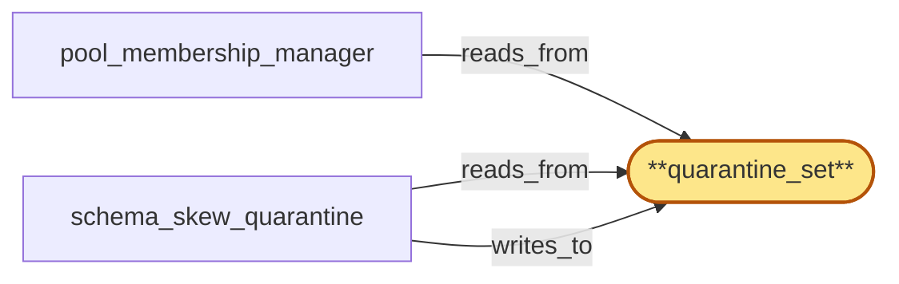

# quarantine_set

> Build the schema-skew quarantine state set:

## Properties

| Field | Value |
| --- | --- |
| Task | `quarantine_set` |
| Scope | `chain_router` |
| Node | `quarantine_set` |
| Node type | `StateSet` |
| Dependencies | `0` |
| Wave | `1` |

## Architecture

## Implementation summary

- Build the schema-skew quarantine state set: Postgres-backed table of currently-quarantined replicas (per chain, fork, method, schema_version) with divergence evidence
- mass-evict cap
- canonicalizer-fault distinct from schema-skew
- consulted by pool_membership_manager.

## Node definition (`quarantine_set` — StateSet)

- Per-replica quarantine evidence keyed by replica_id with the divergence reason (replica-skew / canonicalizer-fault / tip-divergence / fork-suspect), the observation evidence (canonical shape vs observed, canonical-bytes-version), the cohort the divergence was scored against (chain, method, schema_version, canonical-bytes-version), the rotation-in-progress tag's event-type and hlc_stamp at observation time, the suppression deadline, and the deferred-quarantine commit cap window state.
- Read by pool_membership_manager and operator surfaces
- written only by schema_skew_quarantine and tip_freshness_tracker.

## Requirements

### `r1` — IR-schema-skew-quarantine

**Summary:** When a replica's canonicalized response shape diverges from the (chain, method, schema_version) pool consensus shape, the replica is quarantined from the active sub-pool and the divergence evidence is surfaced to operators.

- Origin: `initial`
- Targets: `schema_skew_quarantine`, `quarantine_set`, `pool_membership_manager`
- Matched via: `quarantine_set`
- Verifications:
  - Test crates/chain_router/tests/quarantine_set/schema_skew.rs asserts a replica diverging from pool consensus shape lands in quarantine_set with divergence evidence captured verbatim.

### `r2` — SR-quarantine-schema-version-aware

**Summary:** schema_skew_quarantine indexes pool consensus shape per (chain, method, schema_version) and only quarantines on divergence within the same schema_version cohort; a replica emitting shape under a new schema_version is compared against the new schema_version's cohort, not the old. A new-schema cohort is bootstrapped from the registered canonical-bytes-version spec rather than from existing pool members so divergence detection works even when only one replica has rolled to the new version.

- Origin: `stressor:1:s4-quarantine-cascade-rollout`
- Targets: `schema_skew_quarantine`, `quarantine_set`
- Matched via: `quarantine_set`
- Verifications:
  - Test quarantine_set/schema_version_aware.rs asserts quarantines are keyed by (chain, method, schema_version, canonical-bytes-version); same replica on different schema_version is not double-quarantined.

### `r3` — SR-quarantine-mass-evict-cap

**Summary:** schema_skew_quarantine enforces a per-(chain, fork_id) max-concurrent-quarantine-commits cap within a documented window; quarantine commits beyond the cap are deferred and surfaced as an alert listing the deferred replicas. The cap is at most a documented fraction of sub-pool membership so quarantine cannot push a sub-pool below the safe-membership floor in a single window.

- Origin: `stressor:1:s4-quarantine-cascade-rollout`
- Targets: `schema_skew_quarantine`, `quarantine_set`, `pool_membership_manager`
- Matched via: `quarantine_set`
- Verifications:
  - Test quarantine_set/mass_evict_cap.rs asserts when a mass-evict batch would push a sub-pool below the floor, the batch is refused; operator override required.

### `r4` — SR-quarantine-canonicalizer-fault-distinct

**Summary:** schema_skew_quarantine distinguishes a 'replica-skew' verdict (canonicalized bytes diverge from validator-affirmed pool consensus) from a 'canonicalizer-fault' verdict (validator rejects canonicalizer output as non-canonical) and refuses to commit replica quarantines when the prevailing fault is a canonicalizer-fault rather than a replica-skew, surfacing canonicalizer-fault as its own alert for separate operator response.

- Origin: `stressor:1:s9-canonicalizer-quarantine-coupling`
- Targets: `schema_skew_quarantine`, `quarantine_set`
- Matched via: `quarantine_set`
- Verifications:
  - Test quarantine_set/canonicalizer_fault_distinct.rs asserts canonicalizer-fault entries have source=canonicalizer-fault and never collapse with schema-skew entries.

## Outputs

| Path | Purpose |
| --- | --- |
| `crates/chain_router/migrations/0002_quarantine_set.sql` | Schema migration |
| `crates/chain_router/src/quarantine_set.rs` | Quarantine API with mass-evict cap |

## Stack details

- Postgres schema 'chain_router.quarantine_set' (chain, fork, replica, method, schema_version, evidence JSONB, source enum {schema-skew, canonicalizer-fault}, asserted_at_hlc, expires_at_hlc, mass_evict_batch_id)
- Rust API: insert_quarantine, lift_quarantine, list_active(chain, fork) — and a write-side mass_evict_cap check that refuses to push a sub-pool below configured floor

## Acceptance criteria

### IR-schema-skew-quarantine

- Test crates/chain_router/tests/quarantine_set/schema_skew.rs asserts a replica diverging from pool consensus shape lands in quarantine_set with divergence evidence captured verbatim.

### SR-quarantine-schema-version-aware

- Test quarantine_set/schema_version_aware.rs asserts quarantines are keyed by (chain, method, schema_version, canonical-bytes-version); same replica on different schema_version is not double-quarantined.

### SR-quarantine-mass-evict-cap

- Test quarantine_set/mass_evict_cap.rs asserts when a mass-evict batch would push a sub-pool below the floor, the batch is refused; operator override required.

### SR-quarantine-canonicalizer-fault-distinct

- Test quarantine_set/canonicalizer_fault_distinct.rs asserts canonicalizer-fault entries have source=canonicalizer-fault and never collapse with schema-skew entries.

## Related tasks (graph neighbours)

- [pool_membership_manager](pool_membership_manager.md)
- [schema_skew_quarantine](schema_skew_quarantine.md)

---

_Source of truth: `archi plan task show quarantine_set`. Regenerate with `python3 tasks/_generate.py`._
