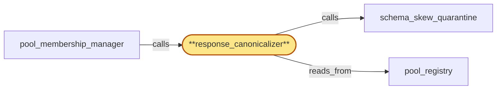

# response_canonicalizer

> Build the response canonicalizer subservice:

## Properties

| Field | Value |
| --- | --- |
| Task | `response_canonicalizer` |
| Scope | `chain_router` |
| Node | `response_canonicalizer` |
| Node type | `Subservice` |
| Dependencies | `0` |
| Wave | `1` |

## Architecture

## Implementation summary

- Build the response canonicalizer subservice: per-(chain, method, schema_version, canonical-bytes-version) byte-level canonicalization of every JSON-RPC response before it reaches gateway
- refuses unknown tuples
- explicit unknown-field signal
- canonicalizer-fault distinct from schema-skew.

## Node definition (`response_canonicalizer` — Subservice)

- Normalizes every JSON-RPC response leaving a chain pool replica into a canonical form keyed by (chain, method, schema_version): strips/sorts undocumented optional fields, coerces types, applies intra-response ordering.
- The canonicalizer's output is defined by an explicit canonical-bytes spec keyed by (chain, method, schema_version, canonical-bytes-version): canonical-bytes-version is distinct from schema_version and is bumped when byte-level field ordering, numeric type representation, or whitespace policy changes
- the canonicalizer refuses to emit bytes for any (chain, method, schema_version) tuple lacking a registered canonical-bytes-version, and a previously-unseen field surface produces an explicit unknown-field signal rather than a silent canonicalization.
- Canonical-bytes output is validated against the canonical-bytes-version spec by an independent validator path that does not share code or in-process state with the transform path
- the validator's verdict (canonical-affirmed vs canonicalizer-fault) is the input that schema_skew_quarantine consumes — a mis-transform produced by the transform path is detected by the validator and surfaced as a canonicalizer-fault alert distinct from a replica-skew alert.
- Reads from pool_registry are limited to the per-(chain, fork_id) shard summary needed to compute canonical-shape consensus.

## Requirements

### `r1` — IR-response-canonicalization

**Summary:** Every JSON-RPC response forwarded from a chain pool replica is canonicalized against a per-(chain, method, schema_version) schema before reaching gateway: undocumented optional fields stripped or sorted, types coerced, intra-response ordering rules applied so response shape is independent of which client implementation answered.

- Origin: `initial`
- Targets: `response_canonicalizer`
- Matched via: `response_canonicalizer`
- Verifications:
  - Snapshot test crates/chain_router/tests/canonicalizer/canonical_output.rs feeds responses from two replica implementations and asserts byte-equal canonical output for every (chain, method, schema_version) tuple in scope.

### `r2` — SR-canonical-bytes-spec

**Summary:** response_canonicalizer's canonical output for a given (chain, method, schema_version) is defined by an explicit canonical-bytes spec (canonical-bytes-version, distinct from schema_version) that documents byte-level field ordering, numeric type representation, and whitespace policy. The canonicalizer refuses to emit bytes for any (chain, method, schema_version) lacking a registered canonical-bytes-version; encountering a previously-unseen field surface produces an explicit unknown-field signal rather than a silent canonicalization.

- Origin: `stressor:1:s1-canonicalizer-silent-drift`
- Targets: `response_canonicalizer`
- Matched via: `response_canonicalizer`
- Verifications:
  - Test canonicalizer/canonical_bytes_spec.rs asserts spec file presence per (chain, method, schema_version) and that canonical-bytes-version is documented and asserted as load-time invariant.

### `r3` — SR-canonicalizer-quarantine-independent-validators

**Summary:** response_canonicalizer's canonical-bytes output is validated against the canonical-bytes-version spec by an independent validator path that does not share code or in-process state with the canonicalizer's transform path; schema_skew_quarantine's divergence-detection input is the validator's verdict, not the canonicalizer's emission. A mis-transform produced by the canonicalizer is detected by the validator (and surfaced as a canonicalizer-fault alert distinct from a replica-skew alert) rather than feeding the divergence-detection path with mis-shaped 'consensus'.

- Origin: `stressor:1:s9-canonicalizer-quarantine-coupling`
- Targets: `response_canonicalizer`, `schema_skew_quarantine`
- Matched via: `response_canonicalizer`
- Verifications:
  - Test canonicalizer/quarantine_independent_validators.rs asserts validator implementations come from independent vendors (or independently authored modules) so a single canonicalizer bug cannot mask itself.

### `r4` — SR2-canonicalizer-fault-no-rotation-suppress

**Summary:** schema_skew_quarantine's canonicalizer-fault verdict is structurally orthogonal to rotation-tag suppression: rotation suppression applies only to replica-skew verdicts. canonicalizer-fault is always recorded and surfaced as its own alert, never suppressed during rotation-or-drain windows; the verdict is published to compliance_audit so post-mortem of any drained replica retains the evidence.

- Origin: `stressor:2:s2-schema-skew-during-rotation-and-drain`
- Targets: `schema_skew_quarantine`, `response_canonicalizer`
- Matched via: `response_canonicalizer`
- Verifications:
  - Test canonicalizer/fault_no_rotation_suppress.rs asserts canonicalizer-fault quarantines are NOT suppressed by rotation-in-progress tag (only schema-skew suppression applies during rotation).

## Outputs

| Path | Purpose |
| --- | --- |
| `crates/chain_router/src/canonicalizer.rs` | Canonicalizer trait + per-chain modules |
| `crates/chain_router/canonical-bytes-spec/` | Per-(chain,method,schema_version,canonical-bytes-version) canonical-bytes spec files |

## Stack details

- Rust crate 'crates/chain_router' module 'canonicalizer' with trait Canonicalizer { fn canonicalize(chain, method, schema_version, canonical_bytes_version, body) -> Result<Bytes, Fault>; }
- Per-chain modules implement field ordering, numeric type coercion, whitespace policy; spec stored in 'crates/chain_router/canonical-bytes-spec/' as TOML keyed by tuple
- Refuses to emit bytes for any tuple lacking a registered canonical-bytes-version; emits explicit UnknownField signal that is consumed by schema_skew_quarantine but flagged distinctly as canonicalizer-fault

## Acceptance criteria

### IR-response-canonicalization

- Snapshot test crates/chain_router/tests/canonicalizer/canonical_output.rs feeds responses from two replica implementations and asserts byte-equal canonical output for every (chain, method, schema_version) tuple in scope.

### SR-canonical-bytes-spec

- Test canonicalizer/canonical_bytes_spec.rs asserts spec file presence per (chain, method, schema_version) and that canonical-bytes-version is documented and asserted as load-time invariant.

### SR-canonicalizer-quarantine-independent-validators

- Test canonicalizer/quarantine_independent_validators.rs asserts validator implementations come from independent vendors (or independently authored modules) so a single canonicalizer bug cannot mask itself.

### SR2-canonicalizer-fault-no-rotation-suppress

- Test canonicalizer/fault_no_rotation_suppress.rs asserts canonicalizer-fault quarantines are NOT suppressed by rotation-in-progress tag (only schema-skew suppression applies during rotation).

## Related tasks (graph neighbours)

- [pool_membership_manager](pool_membership_manager.md)
- [pool_registry](pool_registry.md)
- [schema_skew_quarantine](schema_skew_quarantine.md)

---

_Source of truth: `archi plan task show response_canonicalizer`. Regenerate with `python3 tasks/_generate.py`._
