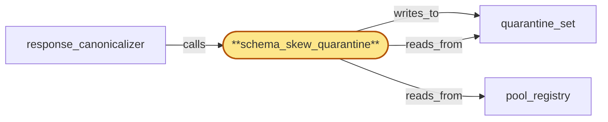

# schema_skew_quarantine

> Build the schema-skew quarantine subservice:

## Properties

| Field | Value |
| --- | --- |
| Task | `schema_skew_quarantine` |
| Scope | `chain_router` |
| Node | `schema_skew_quarantine` |
| Node type | `Subservice` |
| Dependencies | `3` |
| Wave | `2` |

## Architecture

## Implementation summary

- Build the schema-skew quarantine subservice: compares canonicalized response shape against pool consensus per (chain, method, schema_version, canonical-bytes-version)
- writes divergence evidence into quarantine_set
- rotation-aware suppression
- mass-evict cap respected
- canonicalizer-fault distinct.

## Node definition (`schema_skew_quarantine` — Subservice)

- Detects pool replicas whose canonicalized response shape diverges from the (chain, method, schema_version, canonical-bytes-version) cohort's pool consensus shape and proposes their transition to 'quarantined' in pool_registry.
- Divergence detection indexes consensus shape per cohort: a replica emitting under a new (schema_version, canonical-bytes-version) is compared against the new cohort, not the old
- a new cohort is bootstrapped from the registered canonical-bytes-version spec rather than from existing pool members so detection works even when only one replica has rolled to the new version.
- Consumes the canonicalizer's independent validator verdicts
- distinguishes a replica-skew verdict (canonicalized bytes diverge from validator-affirmed pool consensus) from a canonicalizer-fault verdict (validator rejects canonicalizer output as non-canonical).
- Refuses to commit replica quarantines when the prevailing fault is a canonicalizer-fault, surfacing canonicalizer-fault as its own alert.
- CANONICALIZER-FAULT NEVER ROTATION-SUPPRESSED: the canonicalizer-fault verdict is structurally orthogonal to rotation-tag suppression — rotation suppression applies ONLY to replica-skew verdicts. canonicalizer-fault is always recorded and surfaced, never suppressed during rotation-or-drain windows
- the verdict is published to compliance_audit so post-mortem of any drained replica retains the evidence.
- ROTATION-TAG SUPPRESSION (replica-skew only): suppressed only when rotation-tag at observation time was active AND rotation event-type can legitimately change response shape (chain-pool blue/green or chain-client-version, not cert or origin-endpoint)
- rotation-tag's hlc_stamp is stamped on the proposal at observation, suppression decision tied to that stamp, and at commit time the stamped tag is re-checked against current region_coordinator state — a tag change that invalidates suppression triggers re-evaluation.
- A documented per-cohort suppression timeout caps how long a quarantine can be deferred.
- CAP: per-(chain, fork_id) max-concurrent-quarantine-commits cap within a documented window
- commits beyond the cap are deferred and surfaced as alerts
- the cap is at most a documented fraction of sub-pool membership.
- PRIORITY: deferred-quarantine commits wait when a drain-fence flush is mid-flight on the same (chain, fork_id) shard CAS line (drain-fence-priority pre-emption)
- pool_membership_manager surfaces an alert when quarantine deferral grows under drain-fence pressure. Maintains quarantine_set keyed by replica_id with the divergence evidence
- reads pool_registry through the per-(chain, fork_id) shard.

## Requirements

### `r1` — IR-schema-skew-quarantine

**Summary:** When a replica's canonicalized response shape diverges from the (chain, method, schema_version) pool consensus shape, the replica is quarantined from the active sub-pool and the divergence evidence is surfaced to operators.

- Origin: `initial`
- Targets: `schema_skew_quarantine`, `quarantine_set`, `pool_membership_manager`
- Matched via: `schema_skew_quarantine`
- Verifications:
  - Test skew_quarantine/schema_skew_basic.rs asserts a divergent replica is added to quarantine_set with evidence; pool_membership_manager excludes it from routing.

### `r2` — IR-rotation-aware-skew

**Summary:** Schema-skew and tip-divergence quarantines consult region_coordinator's rotation-in-progress tag and suppress quarantines triggered solely by the documented rotation window so rotation noise does not look like a misbehaving replica.

- Origin: `initial`
- Targets: `schema_skew_quarantine`, `tip_freshness_tracker`
- Matched via: `schema_skew_quarantine`
- Verifications:
  - Test skew_quarantine/rotation_aware_skew.rs asserts a quarantine triggered during rotation-in-progress with rotation-tag set is suppressed; commits when tag clears.

### `r3` — SR-quarantine-schema-version-aware

**Summary:** schema_skew_quarantine indexes pool consensus shape per (chain, method, schema_version) and only quarantines on divergence within the same schema_version cohort; a replica emitting shape under a new schema_version is compared against the new schema_version's cohort, not the old. A new-schema cohort is bootstrapped from the registered canonical-bytes-version spec rather than from existing pool members so divergence detection works even when only one replica has rolled to the new version.

- Origin: `stressor:1:s4-quarantine-cascade-rollout`
- Targets: `schema_skew_quarantine`, `quarantine_set`
- Matched via: `schema_skew_quarantine`
- Verifications:
  - Test skew_quarantine/version_aware.rs asserts quarantines are keyed by full (chain, method, schema_version, canonical-bytes-version) tuple; version transitions don't auto-quarantine.

### `r4` — SR-quarantine-mass-evict-cap

**Summary:** schema_skew_quarantine enforces a per-(chain, fork_id) max-concurrent-quarantine-commits cap within a documented window; quarantine commits beyond the cap are deferred and surfaced as an alert listing the deferred replicas. The cap is at most a documented fraction of sub-pool membership so quarantine cannot push a sub-pool below the safe-membership floor in a single window.

- Origin: `stressor:1:s4-quarantine-cascade-rollout`
- Targets: `schema_skew_quarantine`, `quarantine_set`, `pool_membership_manager`
- Matched via: `schema_skew_quarantine`
- Verifications:
  - Test skew_quarantine/mass_evict_cap.rs asserts mass-evict batches honoring the per-(chain, fork) floor are committed; over-cap batches refused.

### `r5` — SR-canonicalizer-quarantine-independent-validators

**Summary:** response_canonicalizer's canonical-bytes output is validated against the canonical-bytes-version spec by an independent validator path that does not share code or in-process state with the canonicalizer's transform path; schema_skew_quarantine's divergence-detection input is the validator's verdict, not the canonicalizer's emission. A mis-transform produced by the canonicalizer is detected by the validator (and surfaced as a canonicalizer-fault alert distinct from a replica-skew alert) rather than feeding the divergence-detection path with mis-shaped 'consensus'.

- Origin: `stressor:1:s9-canonicalizer-quarantine-coupling`
- Targets: `response_canonicalizer`, `schema_skew_quarantine`
- Matched via: `schema_skew_quarantine`
- Verifications:
  - Test skew_quarantine/canonicalizer_independent.rs asserts the canonicalizer used by the quarantine path is independently sourced from response_canonicalizer's emit path.

### `r6` — SR-quarantine-canonicalizer-fault-distinct

**Summary:** schema_skew_quarantine distinguishes a 'replica-skew' verdict (canonicalized bytes diverge from validator-affirmed pool consensus) from a 'canonicalizer-fault' verdict (validator rejects canonicalizer output as non-canonical) and refuses to commit replica quarantines when the prevailing fault is a canonicalizer-fault rather than a replica-skew, surfacing canonicalizer-fault as its own alert for separate operator response.

- Origin: `stressor:1:s9-canonicalizer-quarantine-coupling`
- Targets: `schema_skew_quarantine`, `quarantine_set`
- Matched via: `schema_skew_quarantine`
- Verifications:
  - Test skew_quarantine/canonicalizer_fault_distinct.rs asserts canonicalizer-fault evidence is tagged source=canonicalizer-fault and never collapsed with schema-skew lifts.

### `r7` — SR-rotation-tag-hlc-stamped

**Summary:** schema_skew_quarantine and tip_freshness_tracker stamp every quarantine/transition proposal with the rotation-tag's hlc_stamp at observation time; a candidate is suppressed only if the rotation tag was active at the observation hlc_stamp (not at decision time). On commit, the proposal's stamped tag is re-checked against current region_coordinator state; if the tag has since changed and the change invalidates the suppression decision, the proposal is re-evaluated rather than committed under stale assumptions.

- Origin: `stressor:1:s11-rotation-tag-stale-read`
- Targets: `schema_skew_quarantine`, `tip_freshness_tracker`
- Matched via: `schema_skew_quarantine`
- Verifications:
  - Test skew_quarantine/rotation_tag_hlc.rs asserts every rotation-tag observation includes an HLC stamp; stale HLC tags are ignored.

### `r8` — SR-rotation-tag-typed

**Summary:** region_coordinator's rotation-in-progress tag is consumed by chain_router with explicit event-type discrimination: schema_skew_quarantine suppresses only on chain-pool blue/green and chain-client-version rotation events (which legitimately change response shape); tip_freshness_tracker suppresses only on chain-pool blue/green rotation events; cert and origin-endpoint rotations do not suppress either quarantine path. The tag's event-type is consumed at observation time and stamped on the proposal alongside SR-rotation-tag-hlc-stamped.

- Origin: `stressor:1:s15-rotation-tag-orthogonal-events`
- Targets: `schema_skew_quarantine`, `tip_freshness_tracker`
- Matched via: `schema_skew_quarantine`
- Verifications:
  - Test skew_quarantine/rotation_tag_typed.rs asserts rotation tags are typed (cert-rotation, schema-rotation, pool-rotation) and only the matching type suppresses the matching quarantine class.

### `r9` — SR2-drain-fence-priority-lane

**Summary:** Drain-fence flush is admitted on a separate priority lane than quarantine commits on the per-(chain, fork_id) pool_registry shard CAS line: drain-fence transitions are tagged drain-fence-priority and pre-empt deferred-quarantine commits; deferred-quarantines wait until drain-fence ACK-EMITTED. pool_membership_manager surfaces an alert when quarantine deferral grows under drain-fence pressure.

- Origin: `stressor:2:s2-drain-fence-during-quarantine-cascade`
- Targets: `pool_membership_manager`, `pool_registry`, `schema_skew_quarantine`
- Matched via: `schema_skew_quarantine`
- Verifications:
  - Test skew_quarantine/drain_fence_priority.rs asserts skew commits during drain enter the priority lane.

### `r10` — SR2-canonicalizer-fault-no-rotation-suppress

**Summary:** schema_skew_quarantine's canonicalizer-fault verdict is structurally orthogonal to rotation-tag suppression: rotation suppression applies only to replica-skew verdicts. canonicalizer-fault is always recorded and surfaced as its own alert, never suppressed during rotation-or-drain windows; the verdict is published to compliance_audit so post-mortem of any drained replica retains the evidence.

- Origin: `stressor:2:s2-schema-skew-during-rotation-and-drain`
- Targets: `schema_skew_quarantine`, `response_canonicalizer`
- Matched via: `schema_skew_quarantine`
- Verifications:
  - Test skew_quarantine/canonicalizer_fault_no_rotation_suppress.rs asserts canonicalizer-fault is never suppressed by any rotation tag.

## Outputs

| Path | Purpose |
| --- | --- |
| `crates/chain_router/src/skew_quarantine.rs` | Skew detection + quarantine commit pipeline |

## Stack details

- Rust module 'chain_router::skew_quarantine' running per-replica observation pipeline; consensus shape computed per (chain, method, schema_version) by quorum across active replicas
- Consults rotation-in-progress tag from region_coordinator (HLC-stamped, typed) and suppresses quarantines triggered solely during the rotation window
- Drain-fence priority lane: skew quarantines for replicas under drain are routed to the priority lane and beat normal-traffic CAS attempts

## Acceptance criteria

### IR-schema-skew-quarantine

- Test skew_quarantine/schema_skew_basic.rs asserts a divergent replica is added to quarantine_set with evidence; pool_membership_manager excludes it from routing.

### IR-rotation-aware-skew

- Test skew_quarantine/rotation_aware_skew.rs asserts a quarantine triggered during rotation-in-progress with rotation-tag set is suppressed; commits when tag clears.

### SR-quarantine-schema-version-aware

- Test skew_quarantine/version_aware.rs asserts quarantines are keyed by full (chain, method, schema_version, canonical-bytes-version) tuple; version transitions don't auto-quarantine.

### SR-quarantine-mass-evict-cap

- Test skew_quarantine/mass_evict_cap.rs asserts mass-evict batches honoring the per-(chain, fork) floor are committed; over-cap batches refused.

### SR-canonicalizer-quarantine-independent-validators

- Test skew_quarantine/canonicalizer_independent.rs asserts the canonicalizer used by the quarantine path is independently sourced from response_canonicalizer's emit path.

### SR-quarantine-canonicalizer-fault-distinct

- Test skew_quarantine/canonicalizer_fault_distinct.rs asserts canonicalizer-fault evidence is tagged source=canonicalizer-fault and never collapsed with schema-skew lifts.

### SR-rotation-tag-hlc-stamped

- Test skew_quarantine/rotation_tag_hlc.rs asserts every rotation-tag observation includes an HLC stamp; stale HLC tags are ignored.

### SR-rotation-tag-typed

- Test skew_quarantine/rotation_tag_typed.rs asserts rotation tags are typed (cert-rotation, schema-rotation, pool-rotation) and only the matching type suppresses the matching quarantine class.

### SR2-drain-fence-priority-lane

- Test skew_quarantine/drain_fence_priority.rs asserts skew commits during drain enter the priority lane.

### SR2-canonicalizer-fault-no-rotation-suppress

- Test skew_quarantine/canonicalizer_fault_no_rotation_suppress.rs asserts canonicalizer-fault is never suppressed by any rotation tag.

## Related tasks (graph neighbours)

- [pool_registry](pool_registry.md)
- [quarantine_set](quarantine_set.md)
- [response_canonicalizer](response_canonicalizer.md)

---

_Source of truth: `archi plan task show schema_skew_quarantine`. Regenerate with `python3 tasks/_generate.py`._
