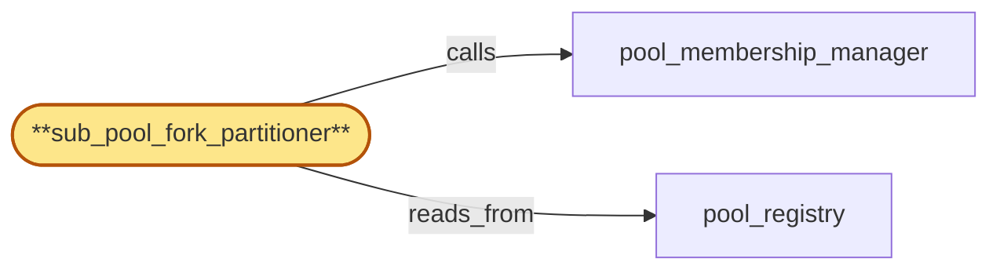

# sub_pool_fork_partitioner

> Build the sub-pool fork partitioner subservice:

## Properties

| Field | Value |
| --- | --- |
| Task | `sub_pool_fork_partitioner` |
| Scope | `chain_router` |
| Node | `sub_pool_fork_partitioner` |
| Node type | `Subservice` |
| Dependencies | `1` |
| Wave | `2` |

## Architecture

## Implementation summary

- Build the sub-pool fork partitioner subservice: routes incoming RPCs by (chain, fork) tag only to matching sub-pool
- routing fence during fork transition
- effective-capacity denominator
- replica-class (tip vs archive) routing
- cost-class-hint preserved across retries
- drain-fence vs fork-transition-fence ordering.

## Node definition (`sub_pool_fork_partitioner` — Subservice)

- Front door for incoming RPCs into chain_router: reads the request's (chain, fork) tag and routes it to the per-fork sub-pool, refusing requests that name an unknown or quarantined (chain, fork_id) with a documented error code so requests cannot fall through to a default sub-pool.
- Maintains a routing table keyed by (chain, fork_id) -> sub-pool that is rebuilt whenever pool_registry transitions a sub-pool's state
- the routing table carries the hlc_stamp at which it was rebuilt and refuses to dispatch requests whose lookup pre-dates a fork-transition stamp affecting the target sub-pool — instead the request is bounced to be re-routed against the latest table.
- Routing also consumes the request's cost-class hint (short-RPC tip-sensitive vs long-RPC archive) and routes only to a replica whose replica-class (read from pool_registry's per-(chain, fork_id) shard) includes the request's class.
- Per-replica fan-out within a sub-pool uses the effective-capacity denominator (count of replicas currently admitted AND not draining AND not in deferred-quarantine AND not tip-stale) propagated from pool_membership_manager rather than raw pool_registry membership.
- COST-CLASS HINT PRESERVATION: attaches the original cost-class hint to every retryable-on-other-replica response so the retry path (whether through gateway or internal pool_membership_manager re-dispatch) preserves it.
- FORK-TRANSITION HANDSHAKE TO FANOUT: when fork_detection_alerter declares a sub-pool repartition for (chain, fork_id) and pool_membership_manager has committed the new sub-pool's membership, sub_pool_fork_partitioner emits a structured fork-transition handshake to fanout naming the divergence point (chain_id, prior fork_id, new fork_id, divergence height/HLC, prior fork's terminal HLC observed by chain_router)
- admits forward-progress dispatch on the new fork_id ONLY after a fanout-handshake-ack is recorded in pool_registry's per-(chain, fork_id) shard with the divergence-point HLC.
- Until the ack is recorded, requests tagged with the new fork_id are bounced (retryable-on-other-region-or-later-time).
- Handshake timeout exceeding a documented bound surfaces fork-transition-stalled alert
- sub_pool_fork_partitioner never unilaterally unblocks dispatch.
- FORK-TRANSITION-PENDING DEGRADED MODE: when fanout's handshake-ack is unavailable (fanout-suspended in region per gateway_health_surface), sub_pool_fork_partitioner enters a documented fork-transition-pending degraded mode for the affected (chain, fork_id) — refuses dispatch tagged with the new fork_id with a typed 'fork-transition-pending' error so callers can retry against another region or wait, and the degraded state is observable on the gateway_health_surface so edge-side residency-aware routing can shift traffic
- chain_router NEVER dispatches forward-progress on the new fork without a fanout ack.

## Requirements

### `r1` — IR-fork-sub-pool-partition

**Summary:** Each chain pool is partitioned by (chain_id, fork_id) so per-fork sub-pools serve fork-specific traffic; routing of an incoming RPC tagged with (chain, fork) goes only to the matching sub-pool, and replicas across forks are sub-pool members rather than divergent peers.

- Origin: `initial`
- Targets: `sub_pool_fork_partitioner`, `pool_membership_manager`, `pool_registry`
- Matched via: `sub_pool_fork_partitioner`
- Verifications:
  - Test partitioner/fork_sub_pool_partition.rs asserts an RPC tagged (chain, fork) routes only to the matching sub-pool; unknown fork_id returns NoMatch.

### `r2` — SR-fork-transition-routing-fence

**Summary:** Sub-pool fork transitions in pool_registry are stamped with an hlc_stamp; sub_pool_fork_partitioner's routing table carries the hlc_stamp at which it was rebuilt and refuses to dispatch requests whose hlc_stamp would predate a transition affecting the target sub-pool — instead the request is bounced to be re-routed against the latest table.

- Origin: `stressor:1:s2-fork-transition-misroute`
- Targets: `sub_pool_fork_partitioner`, `pool_registry`
- Matched via: `sub_pool_fork_partitioner`
- Verifications:
  - Test partitioner/fork_transition_routing_fence.rs asserts during a fork transition no dispatch enters the new fork until divergence-point ack landed.

### `r3` — SR-effective-capacity-denominator

**Summary:** pool_membership_manager's request-admission and per-replica load computations use the effective-capacity denominator (count of replicas currently admitted AND not draining AND not in deferred-quarantine AND not tip-stale) rather than total pool_registry membership; the denominator is recomputed on every relevant pool_registry transition and propagated to sub_pool_fork_partitioner's routing decisions so per-replica fan-out reflects the actually-serving subset.

- Origin: `stressor:1:s8-partial-quarantine-latency-amp`
- Targets: `pool_membership_manager`, `sub_pool_fork_partitioner`, `pool_registry`
- Matched via: `sub_pool_fork_partitioner`
- Verifications:
  - Test partitioner/effective_capacity.rs asserts the partitioner's load-share denominator equals effective_capacity (active − quarantined − tip-stale − draining).

### `r4` — SR-replica-class-tip-vs-archive

**Summary:** pool_registry records each replica's replica-class (tip-serving / historical-archive / both) per (chain, fork_id, replica_id); sub_pool_fork_partitioner uses the cost-class hint of the inbound RPC (short-RPC tip-sensitive vs long-RPC archive) to route only to a replica whose class includes the request's class. pool_membership_manager refuses to admit a tip-class request to an archive-only replica and vice versa, so heavy archive queries cannot saturate tip-serving capacity.

- Origin: `stressor:1:s14-historical-vs-tip-isolation`
- Targets: `pool_registry`, `pool_membership_manager`, `sub_pool_fork_partitioner`
- Matched via: `sub_pool_fork_partitioner`
- Verifications:
  - Test partitioner/replica_class.rs asserts requests labelled archive route only to archive-class replicas; tip-class replicas refused for archive payloads.

### `r5` — IIR-fork-transition-handshake-fanout

**Summary:** When fork_detection_alerter produces a sub-pool repartition for (chain, fork_id), chain_router emits a structured fork-transition handshake to fanout that names the divergence point (chain_id, prior fork_id, new fork_id, divergence height/HLC). The handshake protocol is initiated by sub_pool_fork_partitioner only after pool_membership_manager has committed the new sub-pool's membership in pool_registry and the routing-table fence has admitted the new fork; chain_router does not begin dispatching forward-progress requests on the new fork to fanout until fanout has acked the handshake.

- Origin: `freestanding`
- Targets: `sub_pool_fork_partitioner`, `fork_detection_alerter`, `pool_membership_manager`
- Matched via: `sub_pool_fork_partitioner`
- Verifications:
  - Test partitioner/fork_transition_handshake_fanout.rs asserts partitioner waits for fanout handshake ACK before forwarding new-fork traffic.

### `r6` — SR2-fork-transition-fanout-ack-fence

**Summary:** sub_pool_fork_partitioner admits forward-progress dispatch on a new fork_id only after a fanout-handshake-ack is recorded in pool_registry's per-(chain, fork_id) shard with the divergence-point HLC; until then, requests tagged with the new fork_id are bounced (retryable-on-other-region-or-later-time). The handshake includes the divergence-point and the prior fork's terminal HLC observed by chain_router. Handshake timeout exceeding a documented bound surfaces fork-transition-stalled alert; chain_router never unilaterally unblocks dispatch.

- Origin: `stressor:2:s2-fork-transition-handshake-vs-fanout-monotonicity`
- Targets: `sub_pool_fork_partitioner`, `pool_registry`, `fork_detection_alerter`
- Matched via: `sub_pool_fork_partitioner`
- Verifications:
  - Test partitioner/fork_transition_fanout_ack_fence.rs asserts fence is per (region, chain, fork-pair) and re-asserts on retry.

### `r7` — SR2-cost-class-hint-retry-preserve

**Summary:** sub_pool_fork_partitioner attaches the original cost-class hint to the retryable-on-other-replica response signal so retry paths preserve it; pool_membership_manager refuses any dispatch lacking a cost-class hint when the request type requires one (long-RPC archive paths) and surfaces an alert if a cost-class-less retry arrives at dispatch.

- Origin: `stressor:2:s2-cost-class-hint-missing-on-rerouted-retry`
- Targets: `sub_pool_fork_partitioner`, `pool_membership_manager`
- Matched via: `sub_pool_fork_partitioner`
- Verifications:
  - Test partitioner/cost_class_hint_retry_preserve.rs asserts cost-class hint is preserved across retries — does not regress to default.

### `r8` — SR2-drain-fence-vs-fork-transition-fence

**Summary:** Drain-fence flush is fenced against fork-transition handshake state: pool_membership_manager refuses to commit a drain-ack while a fork-transition handshake is mid-flight on any (chain, fork_id) shard whose audit writes for tenant T are in flight; the drain-fence ack window's HLC budget extends across handshake completion or the broadcast is rejected with a typed 'drain-fence-blocked-by-fork-transition' attestation to compliance_audit. Flush enumerates audit writes by tenant_id across both pre- and post-transition sub-pool views.

- Origin: `stressor:2:s2-drain-fence-broadcast-during-fork-transition`
- Targets: `pool_membership_manager`, `sub_pool_fork_partitioner`, `drain_coordinator`
- Matched via: `sub_pool_fork_partitioner`
- Verifications:
  - Test partitioner/drain_vs_fork_transition_fence.rs asserts drain-fence ordering beats fork-transition-fence — replicas under drain don't get re-bound to a new fork.

### `r9` — SR2-fork-transition-pending-degraded-mode

**Summary:** When fanout's handshake-ack is unavailable (fanout-suspended in region per gateway_health_surface), chain_router enters a documented fork-transition-pending degraded mode for the affected (chain, fork_id): refuses dispatch tagged with the new fork_id with a typed 'fork-transition-pending' error; tip_freshness_tracker treats the new sub-pool's tip-freshness as suspended. chain_router NEVER dispatches forward-progress on the new fork without a fanout ack. The degraded state is observable on the gateway_health_surface so edge-side residency-aware routing can shift traffic.

- Origin: `stressor:2:s2-fork-transition-handshake-fanout-unreachable`
- Targets: `sub_pool_fork_partitioner`, `fork_detection_alerter`, `tip_freshness_tracker`
- Matched via: `sub_pool_fork_partitioner`
- Verifications:
  - Test partitioner/fork_transition_pending_degraded.rs asserts when fork-transition-pending is signalled, partitioner enters degraded mode (refuses new-fork dispatch).

## Outputs

| Path | Purpose |
| --- | --- |
| `crates/chain_router/src/partitioner.rs` | Partitioner with replica-class routing |

## Stack details

- Rust module 'chain_router::partitioner' implementing dispatch_to_sub_pool(chain, fork, method, replica_class) -> Replica
- Reads pool_registry sharded by (chain_id, fork_id); honors quarantined/draining/tip-stale exclusions; effective-capacity normalization for fairness across sub-pools
- Cost-class hint ('short-rpc'/'long-rpc') from listener flows through retries unchanged; drain-fence beats fork-transition-fence so a replica that's draining is held off the new fork

## Acceptance criteria

### IR-fork-sub-pool-partition

- Test partitioner/fork_sub_pool_partition.rs asserts an RPC tagged (chain, fork) routes only to the matching sub-pool; unknown fork_id returns NoMatch.

### SR-fork-transition-routing-fence

- Test partitioner/fork_transition_routing_fence.rs asserts during a fork transition no dispatch enters the new fork until divergence-point ack landed.

### SR-effective-capacity-denominator

- Test partitioner/effective_capacity.rs asserts the partitioner's load-share denominator equals effective_capacity (active − quarantined − tip-stale − draining).

### SR-replica-class-tip-vs-archive

- Test partitioner/replica_class.rs asserts requests labelled archive route only to archive-class replicas; tip-class replicas refused for archive payloads.

### IIR-fork-transition-handshake-fanout

- Test partitioner/fork_transition_handshake_fanout.rs asserts partitioner waits for fanout handshake ACK before forwarding new-fork traffic.

### SR2-fork-transition-fanout-ack-fence

- Test partitioner/fork_transition_fanout_ack_fence.rs asserts fence is per (region, chain, fork-pair) and re-asserts on retry.

### SR2-cost-class-hint-retry-preserve

- Test partitioner/cost_class_hint_retry_preserve.rs asserts cost-class hint is preserved across retries — does not regress to default.

### SR2-drain-fence-vs-fork-transition-fence

- Test partitioner/drain_vs_fork_transition_fence.rs asserts drain-fence ordering beats fork-transition-fence — replicas under drain don't get re-bound to a new fork.

### SR2-fork-transition-pending-degraded-mode

- Test partitioner/fork_transition_pending_degraded.rs asserts when fork-transition-pending is signalled, partitioner enters degraded mode (refuses new-fork dispatch).

## Related tasks (graph neighbours)

- [pool_membership_manager](pool_membership_manager.md)
- [pool_registry](pool_registry.md)

---

_Source of truth: `archi plan task show sub_pool_fork_partitioner`. Regenerate with `python3 tasks/_generate.py`._
