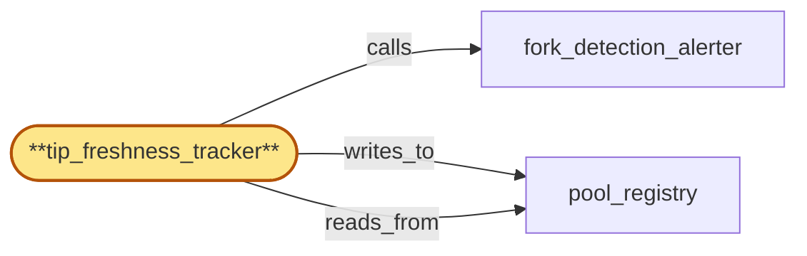

# tip_freshness_tracker

> Build the tip-freshness tracker subservice:

## Properties

| Field | Value |
| --- | --- |
| Task | `tip_freshness_tracker` |
| Scope | `chain_router` |
| Node | `tip_freshness_tracker` |
| Node type | `Subservice` |
| Dependencies | `1` |
| Wave | `2` |

## Architecture

## Implementation summary

- Build the tip-freshness tracker subservice: measures pool tip lag against an out-of-band reference (peer-regional pools via region_coordinator, chain peer count, expected slot advance)
- writes tip-stale flags
- HLC-degraded freeze
- chain-derived fallback
- rotation-aware suppression
- per-fork sharded reads
- deferred-quarantine exclusions
- fork-transition pending degraded mode.

## Node definition (`tip_freshness_tracker` — Subservice)

- Per-pool tip-freshness signal: measures each pool's tip lag against an out-of-band reference (peer-regional pools sourced via region_coordinator, chain peer count / expected slot advance for the chain) and marks a pool 'tip-stale' when its lag exceeds the per-chain freshness budget.
- Writes tip-stale state into pool_registry as a per-replica freshness flag (per-(chain, fork_id) shard) and surfaces the per-pool aggregate to fork_detection_alerter and to region_coordinator's tip_quorum.
- FRESHNESS AGGREGATE FILTER: the per-(chain, fork) freshness aggregate is computed only over replicas that would survive an immediate quarantine commit — replicas with deferred-quarantine flag (any reason) are excluded from the aggregate AND from the head-observation submission cohort, so a deferred-quarantine replica still serving observations cannot mask the surviving cohort's freshness.
- Uses region_coordinator's hybrid logical clock for freshness measurement
- on the HLC-degraded marker the tracker freezes the tip-stale flag set in pool_registry — no transitions in or out of tip-stale commit while degraded
- existing flags remain conservatively in place
- refuses fallback to local wall-clock as the freshness reference.
- When HLC is degraded, may use chain-derived signals (chain peer count, expected slot advance, peer-regional pool's chain-coord head delta as relayed by region_coordinator on heal)
- flags derived from chain-only signals are tagged hlc-degraded so consumers apply them more conservatively.
- Tip-divergence quarantine proposals consult the rotation-tag with explicit event-type discrimination — suppressing only on chain-pool blue/green rotation events, not on cert/origin-endpoint or chain-client-version rotations alone — and stamp the rotation-tag's hlc_stamp on each proposal at observation
- commit-time re-check forces re-evaluation if the tag's state has changed.
- FORK-TRANSITION-PENDING SUSPENSION: when sub_pool_fork_partitioner is in fork-transition-pending degraded mode for (chain, new_fork_id) (because fanout's handshake-ack is unavailable), tip_freshness_tracker treats the new sub-pool's tip-freshness as suspended (no fresh-vs-stale verdict committed) until the handshake completes.

## Requirements

### `r1` — IR-rotation-aware-skew

**Summary:** Schema-skew and tip-divergence quarantines consult region_coordinator's rotation-in-progress tag and suppress quarantines triggered solely by the documented rotation window so rotation noise does not look like a misbehaving replica.

- Origin: `initial`
- Targets: `schema_skew_quarantine`, `tip_freshness_tracker`
- Matched via: `tip_freshness_tracker`
- Verifications:
  - Test tip_freshness/rotation_aware_skew.rs asserts tip-stale commits during rotation-in-progress are suppressed.

### `r2` — IR-tip-freshness-budget

**Summary:** Each chain has a per-chain tip-freshness budget; chain_router measures pool tip lag against an out-of-band reference (peer-regional pools via region_coordinator, chain peer count, expected slot advance) and marks pools tip-stale when they exceed the budget.

- Origin: `initial`
- Targets: `tip_freshness_tracker`, `pool_registry`
- Matched via: `tip_freshness_tracker`
- Verifications:
  - Test tip_freshness/budget.rs asserts when per-chain tip-lag exceeds budget, tracker writes tip_stale=true into pool_registry for the replica.

### `r3` — SR-tip-freshness-hlc-degraded-freeze

**Summary:** On region_coordinator's HLC-degraded marker, tip_freshness_tracker freezes the tip-stale flag set in pool_registry: no transitions in or out of tip-stale commit while degraded; existing flags remain conservatively in place; the tracker surfaces a tip-freshness-suspended alert and refuses fallback to local wall-clock as the freshness reference.

- Origin: `stressor:1:s5-tip-freshness-clock-fallback`
- Targets: `tip_freshness_tracker`, `pool_registry`
- Matched via: `tip_freshness_tracker`
- Verifications:
  - Test tip_freshness/hlc_degraded_freeze.rs asserts when HLC reports degraded mode, tracker freezes writes (no new tip-stale assertions).

### `r4` — SR-tip-freshness-chain-derived-fallback

**Summary:** When HLC is degraded, tip_freshness_tracker may use chain-derived signals (chain peer count, expected slot advance for the chain, peer-regional pool's chain-coord head delta as relayed by region_coordinator on heal) as freshness inputs because they are timestamp-free; explicit refusal to derive freshness from local wall-clock is documented. Any freshness flag derived from chain-only signals is tagged hlc-degraded so consumers (region_coordinator's tip_quorum) can apply it more conservatively.

- Origin: `stressor:1:s5-tip-freshness-clock-fallback`
- Targets: `tip_freshness_tracker`, `pool_registry`
- Matched via: `tip_freshness_tracker`
- Verifications:
  - Test tip_freshness/chain_derived_fallback.rs asserts when peer-regional unreachable, tracker uses chain-derived estimator and records reference_source=chain-derived in evidence.

### `r5` — SR-rotation-tag-hlc-stamped

**Summary:** schema_skew_quarantine and tip_freshness_tracker stamp every quarantine/transition proposal with the rotation-tag's hlc_stamp at observation time; a candidate is suppressed only if the rotation tag was active at the observation hlc_stamp (not at decision time). On commit, the proposal's stamped tag is re-checked against current region_coordinator state; if the tag has since changed and the change invalidates the suppression decision, the proposal is re-evaluated rather than committed under stale assumptions.

- Origin: `stressor:1:s11-rotation-tag-stale-read`
- Targets: `schema_skew_quarantine`, `tip_freshness_tracker`
- Matched via: `tip_freshness_tracker`
- Verifications:
  - Test tip_freshness/rotation_tag_hlc.rs asserts only HLC-stamped fresh rotation tags suppress quarantine writes.

### `r6` — SR-pool-registry-shard-by-fork

**Summary:** pool_registry is sharded by (chain, fork_id): each sub-pool's lifecycle entries live in their own shard with independent CAS lines so high-rate transitions on one sub-pool do not contend with reads or writes on others. Cross-shard reads (e.g. effective-capacity denominator) consume shard-level summaries rather than scanning the global registry.

- Origin: `stressor:1:s13-pool-registry-hot-shard`
- Targets: `pool_registry`, `pool_membership_manager`, `tip_freshness_tracker`
- Matched via: `tip_freshness_tracker`
- Verifications:
  - Test tip_freshness/shard_by_fork.rs asserts tracker reads pool_registry sharded by (chain_id, fork_id).

### `r7` — SR-rotation-tag-typed

**Summary:** region_coordinator's rotation-in-progress tag is consumed by chain_router with explicit event-type discrimination: schema_skew_quarantine suppresses only on chain-pool blue/green and chain-client-version rotation events (which legitimately change response shape); tip_freshness_tracker suppresses only on chain-pool blue/green rotation events; cert and origin-endpoint rotations do not suppress either quarantine path. The tag's event-type is consumed at observation time and stamped on the proposal alongside SR-rotation-tag-hlc-stamped.

- Origin: `stressor:1:s15-rotation-tag-orthogonal-events`
- Targets: `schema_skew_quarantine`, `tip_freshness_tracker`
- Matched via: `tip_freshness_tracker`
- Verifications:
  - Test tip_freshness/rotation_tag_typed.rs asserts tracker only honours tag type 'tip-rotation'.

### `r8` — SR2-tip-quorum-deferred-quarantine-exclude

**Summary:** fork_detection_alerter's submission cohort to tip_quorum and tip_freshness_tracker's freshness aggregate both filter pool_registry by deferred-quarantine flag (in addition to admitted/non-draining/non-tip-stale): a replica with deferred-quarantine for any reason is excluded from head-observation submission AND from the per-(chain, fork) freshness aggregate, computed only over replicas that would survive an immediate quarantine commit.

- Origin: `stressor:2:s2-tip-freshness-during-quarantine-of-tip-replica`
- Targets: `fork_detection_alerter`, `tip_freshness_tracker`, `pool_registry`
- Matched via: `tip_freshness_tracker`
- Verifications:
  - Test tip_freshness/tip_quorum_deferred_quarantine.rs asserts replicas tagged deferred-quarantine by tip_quorum are excluded from tracker's reference-pool computation.

### `r9` — SR2-fork-transition-pending-degraded-mode

**Summary:** When fanout's handshake-ack is unavailable (fanout-suspended in region per gateway_health_surface), chain_router enters a documented fork-transition-pending degraded mode for the affected (chain, fork_id): refuses dispatch tagged with the new fork_id with a typed 'fork-transition-pending' error; tip_freshness_tracker treats the new sub-pool's tip-freshness as suspended. chain_router NEVER dispatches forward-progress on the new fork without a fanout ack. The degraded state is observable on the gateway_health_surface so edge-side residency-aware routing can shift traffic.

- Origin: `stressor:2:s2-fork-transition-handshake-fanout-unreachable`
- Targets: `sub_pool_fork_partitioner`, `fork_detection_alerter`, `tip_freshness_tracker`
- Matched via: `tip_freshness_tracker`
- Verifications:
  - Test tip_freshness/fork_transition_pending_degraded.rs asserts tracker enters degraded mode when gateway_health_surface reports fork-transition-pending for the (chain, fork).

## Outputs

| Path | Purpose |
| --- | --- |
| `crates/chain_router/src/tip_freshness.rs` | Tracker worker + reference-source plugins |

## Stack details

- Rust module 'chain_router::tip_freshness' with periodic worker per (chain, fork) computing lag; budget driven by per-chain config
- Reference sources: (1) region_coordinator's tip_quorum aggregating peer regions, (2) chain peer count over RPC, (3) expected slot advance at HLC; consensus computed and documented
- On HLC degradation, freezes writes; on peer-regional reachability loss, falls back to chain-derived estimator; rotation-tag suppresses tip-stale commits during rotation window

## Acceptance criteria

### IR-rotation-aware-skew

- Test tip_freshness/rotation_aware_skew.rs asserts tip-stale commits during rotation-in-progress are suppressed.

### IR-tip-freshness-budget

- Test tip_freshness/budget.rs asserts when per-chain tip-lag exceeds budget, tracker writes tip_stale=true into pool_registry for the replica.

### SR-tip-freshness-hlc-degraded-freeze

- Test tip_freshness/hlc_degraded_freeze.rs asserts when HLC reports degraded mode, tracker freezes writes (no new tip-stale assertions).

### SR-tip-freshness-chain-derived-fallback

- Test tip_freshness/chain_derived_fallback.rs asserts when peer-regional unreachable, tracker uses chain-derived estimator and records reference_source=chain-derived in evidence.

### SR-rotation-tag-hlc-stamped

- Test tip_freshness/rotation_tag_hlc.rs asserts only HLC-stamped fresh rotation tags suppress quarantine writes.

### SR-pool-registry-shard-by-fork

- Test tip_freshness/shard_by_fork.rs asserts tracker reads pool_registry sharded by (chain_id, fork_id).

### SR-rotation-tag-typed

- Test tip_freshness/rotation_tag_typed.rs asserts tracker only honours tag type 'tip-rotation'.

### SR2-tip-quorum-deferred-quarantine-exclude

- Test tip_freshness/tip_quorum_deferred_quarantine.rs asserts replicas tagged deferred-quarantine by tip_quorum are excluded from tracker's reference-pool computation.

### SR2-fork-transition-pending-degraded-mode

- Test tip_freshness/fork_transition_pending_degraded.rs asserts tracker enters degraded mode when gateway_health_surface reports fork-transition-pending for the (chain, fork).

## Related tasks (graph neighbours)

- [fork_detection_alerter](fork_detection_alerter.md)
- [pool_registry](pool_registry.md)

---

_Source of truth: `archi plan task show tip_freshness_tracker`. Regenerate with `python3 tasks/_generate.py`._
