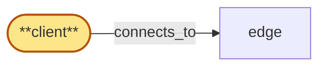

# client

> Build the Rust client crate 'chain-gateway-client':

## Properties

| Field | Value |
| --- | --- |
| Task | `client` |
| Scope | `/` |
| Node | `client` |
| Node type | `Client` |
| Dependencies | `2` |
| Wave | `10` |

## Architecture

## Implementation summary

- Build the Rust client crate 'chain-gateway-client': wraps each chain's native JSON-RPC + WS subscription protocol with API-key auth, edge-attestation handling, reconnect/cursor resumption.

## Node definition (`client` — Client)

- External developer application that connects to the gateway over HTTP for request/response RPC and over WebSocket for real-time subscriptions

## Outputs

| Path | Purpose |
| --- | --- |
| `crates/client/` | Client crate |
| `crates/client/examples/` | Example programs demonstrating each chain + each subscription type |

## Stack details

- Rust crate 'crates/client' published as 'chain-gateway-client' on crates.io
- jsonrpsee for JSON-RPC, tokio-tungstenite for WS; Connection trait + per-chain modules; reconnect with cursor resumption; API key auth + edge-attestation passthrough
- Public API: Client::new(api_key) -> Client; client.eth().get_block_by_number(...); client.subscriptions().new_heads(filter, cursor) -> SubscriptionStream

## Related tasks (graph neighbours)

- [edge](edge.md)

---

_Source of truth: `archi plan task show client`. Regenerate with `python3 tasks/_generate.py`._
