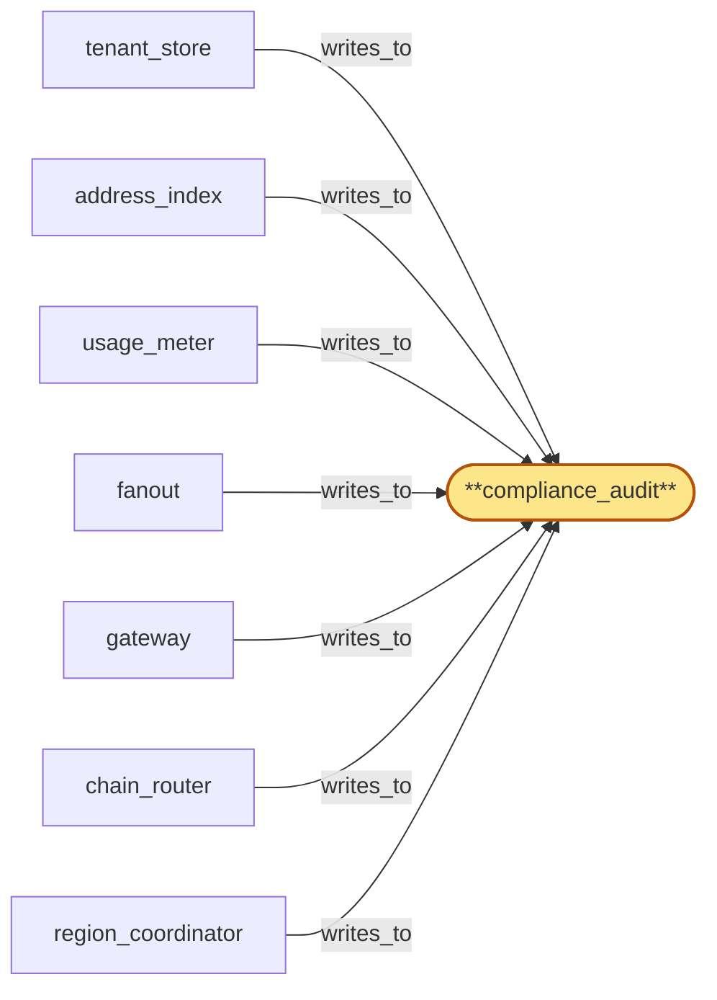
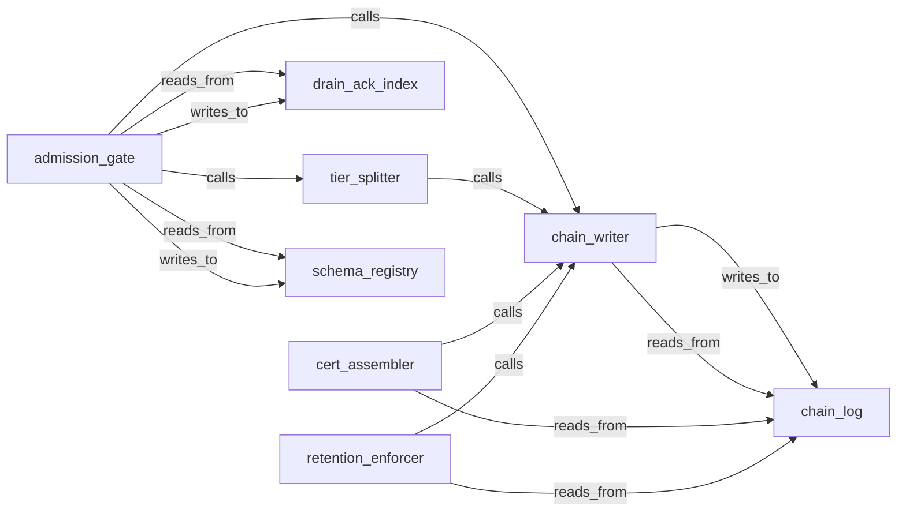

# compliance_audit_integration

> Integrate the 8 compliance_audit child tasks into a single deployable per-region service:

## Properties

| Field | Value |
| --- | --- |
| Task | `compliance_audit_integration` |
| Scope | `/` |
| Node | `compliance_audit` |
| Node type | `Store` |
| Dependencies | `8` |
| Wave | `4` |

## Architecture

## Implementation summary

- Integrate the 8 compliance_audit child tasks into a single deployable per-region service: chain_log + drain_ack_index + schema_registry stores wired to the chain_writer + tier_splitter + admission_gate pipeline
- cert_assembler producing certificates-of-deletion
- retention_enforcer pruning Tier-1 chunks
- Helm chart packaging the whole service.

## Node definition (`compliance_audit` — Store)

- Append-only, hash-chained tamper-evident store of credentialed-action audit records. Every entry hash-chains to its predecessor so any in-place mutation is detectable
- entries are residency-tagged on the same residency-policy framework as other tenant-keyed surfaces
- retention policy is declared and bounded by jurisdiction-specific compliance windows propagated through region_coordinator's residency_publisher.
- The substrate is isolated from operational write planes — usage_meter, metrics_store, gateway, fanout, address_index, chain_router, and tenant_store each write directly to compliance_audit via authenticated append-only RPC, never through a shared operational data path that an operational compromise could alter retroactively. region_coordinator's compliance_audit_owner subsystem owns the audit schema and is the only authority that can publish a new entry-type version.
- AUDIT MATERIAL IS TWO-TIER: TIER 1 (per-tenant audit-encryption key, shredded on tenant erasure) holds the full audit entry payload including tenant-identifying fields, request payload digests, signing-credential identities, and any other tenant-attributable detail
- the hash chain covers Tier-1 ciphertext + entry skeleton
- tenant erasure destroys the per-tenant audit-encryption key (crypto-shred), rendering Tier-1 historical entries unreadable while leaving the chain intact and tamper-evidence preserved.
- TIER 2 (organizational long-lived key under the OOB-anchor key hierarchy, NOT shredded) holds a structural witness — event type, event HLC, originating component, and a hash commitment to the Tier-1 payload — with NO tenant-identifying material
- Tier 2 is not subject to erasure.
- The certificate-of-deletion vouches for Tier-2 witnesses by verifiable hash chain so post-shred a regulator can inspect structure-and-presence of every attested event, verify the hash chain is intact, and verify each Tier-2 hash commitment matches the (now-shredded) Tier-1 payload contents.
- INBOUND ADMISSION CHECK FOR PER-TENANT WRITES: a write's writer-encrypted-at-HLC must be <= the writer's drain-ack-HLC for the same tenant
- a write whose encrypted-at-HLC exceeds the writer's drain-ack-HLC is a protocol violation (ack-after-write contract broken) and is rejected at admission rather than silently shred by a missing key
- the rejection is itself logged in compliance_audit's protocol-violation log. The shred mechanism applies only to entries that landed BEFORE the writer's drain-ack-HLC
- their decryption is impossible after key destruction by design.
- CERTIFICATE-OF-DELETION ENTRY: a typed entry assembled by tenant_store and linked here, comprising (per-store erasure attestations + drain-ack receipts + audit-key DESTROYED log entry)
- each component carries provenance — which writer, which lease/policy_version, which broadcast HLC
- certificates are typed as full-ack, partial-with-witnesses, or erasure-incomplete and the type is machine-distinguishable from full-ack.
- Per-tenant audit-encryption-key lifecycle (issuance, rotation, destruction-on-erasure) is a tenant_store zoom concern
- the at-root contract is the two-tier scheme + the late-write rejection rule + the certificate-of-deletion typing.
- Required entry types include: operator-override admission (chain_router pool_membership_manager, tip_quorum, drain_coordinator, lifecycle_gate force-complete), OOB-anchor use & cert re-rooting, anchor rotation, residency policy_version activation / abort / prepared-orphan, roster mutation (issue, rotate, revoke, retroactive compromise-revocation), offboarding attestation (per-component, including preservation-blocked terminal states), drain-fence broadcast-emit, drain-ack receipts and ack-by-handoff records, certificate-of-deletion (typed full-ack / partial-with-witnesses / erasure-incomplete), protocol-violation log entries, and per-tenant compliance events (lawful-access fetch, erasure tombstone)

## Requirements

### `r1` — r-s5-composite-cert-assembly

**Summary:** compliance_audit's certificate of deletion is a verifiable composite of (per-store erasure attestations + drain-ack receipts + audit-key DESTROYED log entry). The assembly contract lives at root: tenant_store collects the per-store attestations and drain-ack receipts under its erasure tombstone for tenant T; lifecycle_gate emits the audit-key DESTROYED event after tenant_store confirms the assembly is closed; compliance_audit links these into a single typed certificate-of-deletion entry whose hash chain covers all three components. Each component carries provenance — which writer, which lease/policy_version, which broadcast HLC. Certificates are typed as full-ack, partial-with-witnesses, or erasure-incomplete.

- Origin: `stressor:5:s5-composite-cert-partial-ack-loss`
- Targets: `compliance_audit`
- Matched via: `compliance_audit`
- Verifications:
  - Test integration/composite_cert_assembly.rs asserts a teardown produces a typed certificate-of-deletion (full-ack / partial-with-witnesses / erasure-incomplete) assembled from per-store erasure attestations + drain-ack receipts + audit-key DESTROYED markers, written to chain_log.

### `r2` — r-s5-compliance-audit-late-write-rejection

**Summary:** compliance_audit's inbound admission for per-tenant audit writes checks the writer's encrypted-at-HLC against the writer's drain-ack-HLC for the same tenant: a write whose encrypted-at-HLC exceeds the writer's drain-ack-HLC is a protocol violation (ack-after-write contract broken) and is rejected at admission rather than silently shred by missing key; the rejection is itself logged in compliance_audit's protocol-violation log. The shred mechanism applies only to entries that landed BEFORE the writer's drain-ack-HLC; their decryption is impossible after key destruction by design, but their hash-chain inclusion is preserved.

- Origin: `stressor:5:s5-audit-key-destruction-race`
- Targets: `compliance_audit`
- Matched via: `compliance_audit`
- Verifications:
  - Test integration/late_write_rejection.rs asserts late writes from a destroyed-key tenant are rejected at admission (admission_gate path) and surface a violation summary.

### `r3` — r-s5-audit-tier-witness

**Summary:** Audit material is two-tier. TIER 1 (per-tenant audit-encryption key, shredded on tenant erasure): full audit entry payload including tenant-identifying fields, request payload digests, signing-credential identities, and any other tenant-attributable detail. TIER 2 (organizational long-lived key, NOT shredded): a structural witness of each attested event consisting of event type, event HLC, originating component, and a hash commitment to the (eventually-shredded) Tier-1 payload; Tier 2 contains NO tenant-identifying material and is not subject to erasure. The certificate-of-deletion vouches for Tier-2 witnesses; post-shred, a regulator can inspect the structure-and-presence of every attested event and verify the hash chain. The organizational long-lived key is part of the OOB-anchor key hierarchy under region_coordinator. The per-tenant audit-encryption-key lifecycle remains a tenant_store zoom concern.

- Origin: `stressor:5:s5-cert-verification-post-destroy`
- Targets: `compliance_audit`
- Matched via: `compliance_audit`
- Verifications:
  - Test integration/audit_tier_witness.rs asserts every audit entry produces both a Tier-1 shredded payload and a Tier-2 organizational structural witness; certificate-of-deletion vouches for Tier-2 witnesses post-shred.

## Outputs

| Path | Purpose |
| --- | --- |
| `charts/services/compliance-audit/` | Helm chart for compliance_audit |
| `crates/compliance_audit/tests/integration/` | End-to-end integration tests |

## Stack details

- Helm chart 'charts/services/compliance-audit' deploying the audit Postgres + Rust admission/writer/splitter/cert services as a single unit per region; Tier-2 witness blobs replicated to S3 Object Lock buckets per region
- End-to-end integration tests in 'crates/compliance_audit/tests/' covering composite-cert assembly, late-write rejection, Tier-1/Tier-2 split

## Acceptance criteria

### r-s5-composite-cert-assembly

- Test integration/composite_cert_assembly.rs asserts a teardown produces a typed certificate-of-deletion (full-ack / partial-with-witnesses / erasure-incomplete) assembled from per-store erasure attestations + drain-ack receipts + audit-key DESTROYED markers, written to chain_log.

### r-s5-compliance-audit-late-write-rejection

- Test integration/late_write_rejection.rs asserts late writes from a destroyed-key tenant are rejected at admission (admission_gate path) and surface a violation summary.

### r-s5-audit-tier-witness

- Test integration/audit_tier_witness.rs asserts every audit entry produces both a Tier-1 shredded payload and a Tier-2 organizational structural witness; certificate-of-deletion vouches for Tier-2 witnesses post-shred.

## Related tasks (graph neighbours)

- [address_index](address_index.md)
- [chain_router_integration](chain_router/README.md)
- [fanout](fanout.md)
- [gateway_integration](gateway/README.md)
- [region_coordinator_integration](region_coordinator/README.md)
- [tenant_store_integration](tenant_store/README.md)
- [usage_meter](usage_meter.md)

---

_Source of truth: `archi plan task show compliance_audit_integration`. Regenerate with `python3 tasks/_generate.py`._

## Child tasks

| Task | Wave | Deps | Brief |
| --- | --- | --- | --- |
| [admission_gate](admission_gate.md) | 3 | 3 | Build the compliance_audit admission gate: rejects late writes from a destroyed-key tenant, marks cold-miss tenant state, validates causa... |
| [cert_assembler](cert_assembler.md) | 2 | 1 | Build the certificate-of-deletion assembler: takes (per-store erasure attestations, drain-ack receipts, audit-key DESTROYED markers) and ... |
| [chain_log](chain_log.md) | 1 | 0 | Build the compliance_audit chain_log: hash-chained append-only Postgres table holding TIER-1 audit entries with crypto-shred semantics; r... |
| [chain_writer](chain_writer.md) | 2 | 1 | Build the chain writer: Rust-side append worker that takes admission_gate-validated entries, computes the hash-chain link, and inserts in... |
| [drain_ack_index](drain_ack_index.md) | 1 | 0 | Build the drain-ack index: lookup table for per-(tenant, drain_id) ack records consumed by admission_gate to gate late-write rejection. |
| [retention_enforcer](retention_enforcer.md) | 2 | 1 | Build the retention enforcer: scheduled job that prunes tier-1 chunks past their retention window per residency-tagged retention policy; ... |
| [schema_registry](schema_registry.md) | 1 | 0 | Build the audit schema registry: per-(component, entry_class) schema definition with two-phase activation (PREPARE + ACTIVATE) so admissi... |
| [tier_splitter](tier_splitter.md) | 2 | 2 | Build the tier splitter: classifies each admitted entry into TIER-1 (per-tenant-key shredded payload) and TIER-2 (organizational long-liv... |

## Internal architecture

