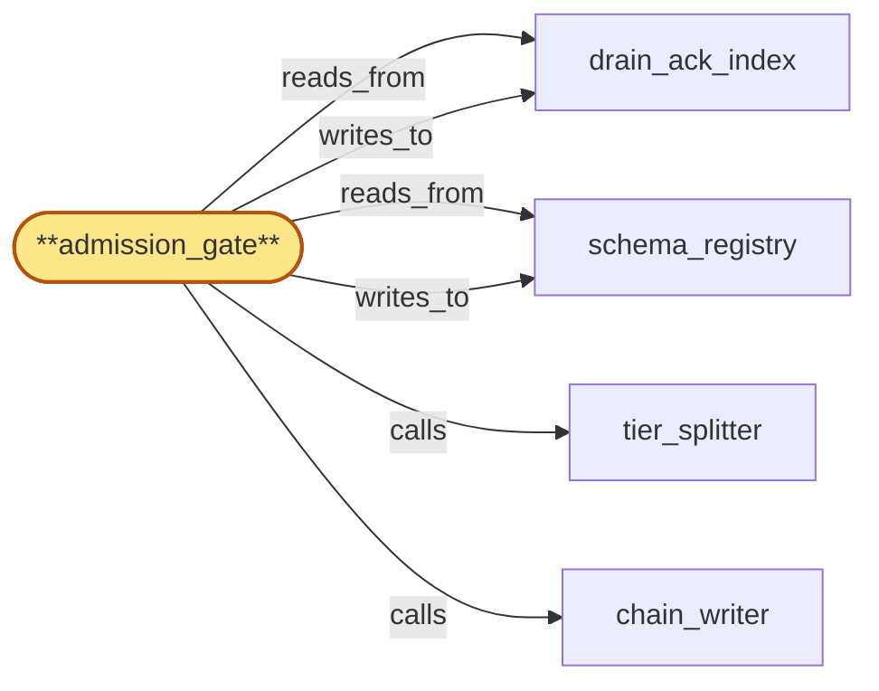

# admission_gate

> Build the compliance_audit admission gate:

## Properties

| Field | Value |
| --- | --- |
| Task | `admission_gate` |
| Scope | `compliance_audit` |
| Node | `admission_gate` |
| Node type | `Subsystem` |
| Dependencies | `3` |
| Wave | `3` |

## Architecture

## Implementation summary

- Build the compliance_audit admission gate: rejects late writes from a destroyed-key tenant, marks cold-miss tenant state, validates causal sequence vs late-write, pins residency to write-HLC, validates drain-ack rebuild completeness, coalesces violation summaries.

## Node definition (`admission_gate` — Subsystem)

- Inbound RPC entry point for parent-scope writers (region_coordinator, chain_router, gateway, fanout, address_index, usage_meter, tenant_store).
- Authenticates the caller and validates the typed-entry shape against schema_registry under TWO-PHASE schema activation: PROPOSE entries from compliance_audit_owner pre-load (V, V+1) into schema_registry
- admission_gate strictly admits per entry-type under V before activation HLC H_act and under V+1 at-or-after H_act, picking deterministically from the writer-encrypted-at-HLC
- replicas more than (H_act - readiness_window) behind the PROPOSE entry deny-by-default for affected entry types until they catch up.
- CAUSAL LATE-WRITE CHECK: every per-tenant audit write carries (writer-encrypted-at-HLC H_w, writer-emitted monotonic per-(writer, tenant) sequence S_w)
- admission_gate looks up (writer, tenant) in drain_ack_index to obtain (sealing-HLC H_a, sealing-sequence S_a) plus the tenant-state flag ∈ {UNFENCED, FENCED}.
- Admission rules: (a) UNFENCED ⇒ admit (tenant has not yet entered any drain-fence regime — drain-ack-HLC = +infinity)
- (b) FENCED with no sealing drain-ack for the pair ⇒ reject (drain-ack-HLC = -infinity)
- (c) FENCED with sealing (H_a, S_a) ⇒ reject iff S_w > S_a (writer-side causal violation regardless of arrival order).
- The tenant-state flag flips UNFENCED → FENCED on the first admitted drain-fence-broadcast entry for the tenant and never flips back.
- RETROACTIVE VIOLATION DETECTION: when a fresh drain-ack lands, admission_gate scans the bounded retroactive-window for already-admitted writes with S > S_a and writes typed retroactive-protocol-violation entries into chain_log so that arrival-order races still surface.
- RESIDENCY PINNING: admission_gate computes a residency-decision-tuple (residency_version V_e, partition R_e) from the residency policy active at H_w and embeds it in the entry record passed to tier_splitter and chain_writer
- H_w ahead of admission_gate-observed residency policy_version triggers sticky-deny-by-default consistent with the parent-scope residency-2PC contract.
- Drain-ack-receipt entries from lifecycle_gate cause admission_gate to update drain_ack_index for the (writer, tenant) pair AFTER the entry has been chain-attested via chain_writer (so admission can never observe a drain-ack that is not also chain-attested).
- VIOLATION COALESCING: admission_gate maintains a per-(writer, tenant) violation-counter and sliding-window state in drain_ack_index
- the FIRST violation in window W emits a typed protocol-violation entry carrying full rejection metadata
- subsequent violations in W increment the counter without emitting
- on window close / counter saturation / distinct-cause arrival the counter is flushed as a single typed violation-summary entry (count, first-seen-HLC, last-seen-HLC, min-S_w, max-S_w).
- DRAIN-ACK-INDEX SNAPSHOTS: admission_gate periodically appends typed drain-ack-index-snapshot entries into chain_log (small, bounded by N_tenants × M_writers)
- on restart it rebuilds drain_ack_index from the most recent snapshot plus forward Tier-2 replay (writer_id and tenant_id are present in cleartext on Tier-2 of relevant entry types — see chain_log), so admission_gate can never resume in UNFENCED-by-default for a previously FENCED tenant.
- APPEND-CLASS STAMPING: admission_gate stamps each forwarded entry with its append-class label (cert_assembler / drain-ack-receipt / protocol-violation / normal-per-tenant / retention-shred / schema-activation / operator-override / drain-ack-index-snapshot) so chain_writer can route into the correct fair-queue lane.

## Requirements

### `r1` — r-init-late-write-rejection

**Summary:** compliance_audit must reject writes whose writer-encrypted-at-HLC exceeds the writer drain-ack-HLC for the same tenant as protocol violations at admission, and log the rejection itself; the shred mechanism applies only to entries that landed BEFORE the writer drain-ack-HLC.

- Origin: `initial`
- Targets: `admission_gate`
- Matched via: `admission_gate`
- Verifications:
  - Test admission_gate/late_write_rejection.rs asserts late writes after audit-key DESTROYED are rejected at admission with a documented error class.

### `r2` — r-cold-miss-tenant-state-flag

**Summary:** admission_gate explicit cold-miss semantics: drain_ack_index entries carry a tenant-state flag ∈ {UNFENCED, FENCED}. UNFENCED means no drain-fence has been issued for the tenant — all admissions are allowed (writer is in tenant bootstrap, not yet under any fence contract). FENCED means at least one drain-fence-broadcast for the tenant has been observed by admission_gate — absence of a drain-ack-receipt for a (writer, tenant) pair under FENCED means drain-ack-HLC = -infinity (REJECT every per-tenant write). The flag flips UNFENCED → FENCED on the first admitted drain-fence-broadcast entry for the tenant; never flips back. admission_gate maintains the flag at tenant scope (not per-pair) so it is consistent across writers.

- Origin: `stressor:1:s-drain-ack-cold-miss`
- Targets: `admission_gate`
- Matched via: `admission_gate`
- Verifications:
  - Test admission_gate/cold_miss_tenant_state_flag.rs asserts a cold-miss on tenant state surfaces a flag; admission proceeds with deny-by-default until rehydration.

### `r3` — r-causal-sequence-late-write

**Summary:** admission_gate late-write check is bound to writer-side causal ordering: every per-tenant audit write carries a writer-emitted monotonic per-(writer, tenant) sequence number S_w plus its writer-encrypted-at-HLC H_w. Each drain-ack-receipt entry from lifecycle_gate attests (drain-ack-HLC=H_a, sealing-sequence=S_a) — i.e. covers all writer sequences ≤ S_a. admission_gate stores (H_a, S_a) per (writer, tenant) in drain_ack_index. A write with sequence S_w arriving at admission_gate is rejected as a protocol-violation iff (S_w > S_a) under the active fence (the writer emitted it after its own ack, regardless of arrival order). Drain-acks that arrive BEFORE a late write also seal correctly. Symmetrically, on a fresh drain-ack landing, admission_gate scans for already-admitted writes with S > S_a within a bounded retroactive window and writes retroactive-protocol-violation entries into chain_log so the violation is auditable even if the late write arrived first.

- Origin: `stressor:1:s-drain-ack-arrival-race`
- Targets: `admission_gate`
- Matched via: `admission_gate`
- Verifications:
  - Test admission_gate/causal_sequence_late_write.rs asserts entries arriving out of causal sequence are rejected (no out-of-order admission).

### `r4` — r-residency-pinned-to-write-hlc

**Summary:** Residency partitioning of an audit entry is HLC-anchored to the writer-encrypted-at-HLC, not to chain-writer commit time. admission_gate computes the residency-decision-tuple (residency_version V_e, partition R_e) from the residency policy active at the writer-encrypted-at-HLC and embeds the tuple in the entry record. chain_writer commits into partition R_e regardless of the residency policy_version active at commit time. tier_splitter likewise looks up the per-tenant audit-key handle by HLC, ensuring Tier-1 ciphertext is encrypted under the key that was active when the writer emitted the entry. admission_gate denies-by-default any entry whose H_w is ahead of the admission_gate-observed residency policy_version (sticky-deny consistent with parent-scope contract).

- Origin: `stressor:1:s-residency-flip-mid-write`
- Targets: `admission_gate`
- Matched via: `admission_gate`
- Verifications:
  - Test admission_gate/residency_pinned_to_write_hlc.rs asserts residency is pinned to the entry's write-HLC, not the current policy_version.

### `r5` — r-drain-ack-rebuild-completeness

**Summary:** admission_gate drain_ack_index rebuild after restart is complete by construction. (a) Tier-2 structural witness for drain-ack-receipt entries and tenant-fence-state-transition entries carries the (writer_id, tenant_id, drain-ack-HLC, sealing-sequence) tuple in cleartext (these are routing identifiers, not tenant-attributable content — they appear in many non-shreddable parent-scope locations and shred destroys content not existence-of-tenant). (b) admission_gate persists periodic drain_ack_index snapshots as typed snapshot entries into chain_log; retention_enforcer treats the most recent snapshot as non-shreddable (until superseded). On restart admission_gate rebuilds from the most recent snapshot plus forward Tier-2 replay; the rebuilt baseline is provably complete and admission_gate cannot resume in an UNFENCED-by-default state for a tenant that was previously FENCED.

- Origin: `stressor:1:s-drain-ack-rebuild-incomplete`
- Targets: `admission_gate`
- Matched via: `admission_gate`
- Verifications:
  - Test admission_gate/drain_ack_rebuild_completeness.rs asserts on rebuild from drain_ack_index, completeness is asserted before admission proceeds.

### `r6` — r-violation-summary-coalescing

**Summary:** admission_gate coalesces repeated late-write violations from the same (writer, tenant) pair within a sliding window of width W into a bounded-state violation-summary record. First violation in a window emits a typed protocol-violation entry; subsequent violations within W increment a per-(writer,tenant) counter in drain_ack_index without emitting further entries. On window close / counter saturation / distinct-cause arrival, admission_gate emits a single typed violation-summary entry carrying (count, first-seen-HLC, last-seen-HLC, min-S_w, max-S_w). chain growth becomes O(distinct (writer,tenant) per window) under flood. The summary preserves enough information for upstream credential-revocation triggers without preserving per-violation fidelity.

- Origin: `stressor:1:s-violation-flood-self-dos`
- Targets: `admission_gate`
- Matched via: `admission_gate`
- Verifications:
  - Test admission_gate/violation_summary_coalescing.rs asserts violation summaries are coalesced per (tenant, class) so noise is bounded.

## Outputs

| Path | Purpose |
| --- | --- |
| `crates/audit_admission/` | Admission sidecar crate |
| `crates/compliance_audit/src/admission_gate.rs` | Admission policy engine |

## Stack details

- Rust module 'compliance_audit::admission_gate' run as a Rust sidecar 'crates/audit_admission' next to every writer; consults schema_registry, drain_ack_index, audit_encryption_key_register

## Acceptance criteria

### r-init-late-write-rejection

- Test admission_gate/late_write_rejection.rs asserts late writes after audit-key DESTROYED are rejected at admission with a documented error class.

### r-cold-miss-tenant-state-flag

- Test admission_gate/cold_miss_tenant_state_flag.rs asserts a cold-miss on tenant state surfaces a flag; admission proceeds with deny-by-default until rehydration.

### r-causal-sequence-late-write

- Test admission_gate/causal_sequence_late_write.rs asserts entries arriving out of causal sequence are rejected (no out-of-order admission).

### r-residency-pinned-to-write-hlc

- Test admission_gate/residency_pinned_to_write_hlc.rs asserts residency is pinned to the entry's write-HLC, not the current policy_version.

### r-drain-ack-rebuild-completeness

- Test admission_gate/drain_ack_rebuild_completeness.rs asserts on rebuild from drain_ack_index, completeness is asserted before admission proceeds.

### r-violation-summary-coalescing

- Test admission_gate/violation_summary_coalescing.rs asserts violation summaries are coalesced per (tenant, class) so noise is bounded.

## Related tasks (graph neighbours)

- [chain_writer](chain_writer.md)
- [drain_ack_index](drain_ack_index.md)
- [schema_registry](schema_registry.md)
- [tier_splitter](tier_splitter.md)

---

_Source of truth: `archi plan task show admission_gate`. Regenerate with `python3 tasks/_generate.py`._
