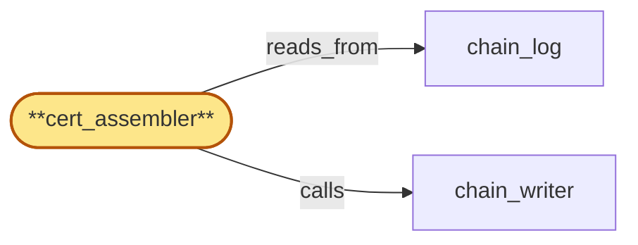

# cert_assembler

> Build the certificate-of-deletion assembler:

## Properties

| Field | Value |
| --- | --- |
| Task | `cert_assembler` |
| Scope | `compliance_audit` |
| Node | `cert_assembler` |
| Node type | `Subsystem` |
| Dependencies | `1` |
| Wave | `2` |

## Architecture

## Implementation summary

- Build the certificate-of-deletion assembler: takes (per-store erasure attestations, drain-ack receipts, audit-key DESTROYED markers) and assembles a typed certificate (full-ack / partial-with-witnesses / erasure-incomplete)
- pins inputs and verification mode.

## Node definition (`cert_assembler` — Subsystem)

- Assembles typed certificate-of-deletion entries on behalf of tenant_store. tenant_store opens an assembly trigger by appending a typed cert-input-pin entry into chain_log (via admission_gate / chain_writer) naming the entry-hashes the cert will reference
- retention_enforcer treats those pinned entry-hashes as retention-extended until the certificate-of-deletion entry referencing them is appended or the pin is released. cert_assembler then receives the assembly inputs (per-store erasure attestations + drain-ack receipts from the parent-scope writers + audit-key DESTROYED entry from lifecycle_gate + any key-destroyed-encrypt-failure entries for the tenant), looks each input up in chain_log by entry-hash, and verifies chain presence and provenance (writer, lease/policy_version, broadcast HLC).
- PER-INPUT VERIFICATION-MODE: each verified input is classified as Tier-1-and-Tier-2-verified (Tier-1 still readable at assembly time) vs Tier-2-only-verified (Tier-1 retention-shredded but Tier-2 structural witness present) vs suspect-witness (Tier-2 signed under a compromised epoch per the tier2-key-compromise entry)
- the certificate-of-deletion record carries the per-input verification-mode. CERT TYPING: full-ack iff all expected inputs are STRUCTURALLY PRESENT in chain_log (Tier-2 verified is sufficient
- Tier-1 readability is not required because structural-presence is what regulators need post-shred)
- partial-with-witnesses iff one or more expected inputs are structurally absent OR one or more key-destroyed-encrypt-failure entries exist for the tenant
- erasure-incomplete iff the audit-key DESTROYED entry is missing OR a preservation-blocked condition is recorded.
- The typed certificate is machine-distinguishable from full-ack and is itself appended via chain_writer in the cert_assembler fair-queue lane. cert_assembler does not finalize tenant_store erasure — it only writes the certificate
- tenant_store reads the type to decide downstream actions.

## Requirements

### `r1` — r-init-cert-of-deletion-typing

**Summary:** cert_assembler emits typed certificate-of-deletion entries (full-ack / partial-with-witnesses / erasure-incomplete) over assembly inputs (per-store erasure attestations + drain-ack receipts + audit-key DESTROYED log entry), each input verified present in chain_log and provenance-tagged (writer, lease/policy_version, broadcast HLC); the certificate type is machine-distinguishable from full-ack.

- Origin: `initial`
- Targets: `cert_assembler`
- Matched via: `cert_assembler`
- Verifications:
  - Test cert_assembler/typing.rs asserts every assembled cert has explicit type enum (full-ack / partial-with-witnesses / erasure-incomplete) recorded.

### `r2` — r-cert-input-pin-and-verification-mode

**Summary:** Two-part contract for cert_assembler reading retention-shredded inputs. (a) tenant_store opens an assembly trigger by appending a cert-input-pin typed entry naming the entry-hashes the cert will reference; retention_enforcer reads chain_log and treats pinned entry-hashes as retention-extended until the certificate-of-deletion entry referencing them is appended or the pin is explicitly released. (b) cert_assembler classifies each verified input as Tier-2-only-verified vs Tier-1-and-Tier-2-verified based on Tier-1 readability at assembly time; the certificate-of-deletion record carries a per-input verification-mode field. Structural-presence (Tier-2 verified) is sufficient to retain full-ack typing; partial-with-witnesses applies only when an expected input is structurally absent from chain_log.

- Origin: `stressor:1:s-cert-input-retention-shredded`
- Targets: `cert_assembler`
- Matched via: `cert_assembler`
- Verifications:
  - Test cert_assembler/input_pin_verification_mode.rs asserts inputs are pinned at assembly time; verification mode (signed-by-quorum / quorum-of-witnesses / single-attestation) is recorded.

## Outputs

| Path | Purpose |
| --- | --- |
| `crates/compliance_audit/src/cert_assembler.rs` | Certificate-of-deletion assembler |

## Stack details

- Rust module 'compliance_audit::cert_assembler' producing certificates as durable chain_log entries with explicit type and verification mode (full-ack / partial-with-witnesses / erasure-incomplete)

## Acceptance criteria

### r-init-cert-of-deletion-typing

- Test cert_assembler/typing.rs asserts every assembled cert has explicit type enum (full-ack / partial-with-witnesses / erasure-incomplete) recorded.

### r-cert-input-pin-and-verification-mode

- Test cert_assembler/input_pin_verification_mode.rs asserts inputs are pinned at assembly time; verification mode (signed-by-quorum / quorum-of-witnesses / single-attestation) is recorded.

## Related tasks (graph neighbours)

- [chain_log](chain_log.md)
- [chain_writer](chain_writer.md)

---

_Source of truth: `archi plan task show cert_assembler`. Regenerate with `python3 tasks/_generate.py`._
