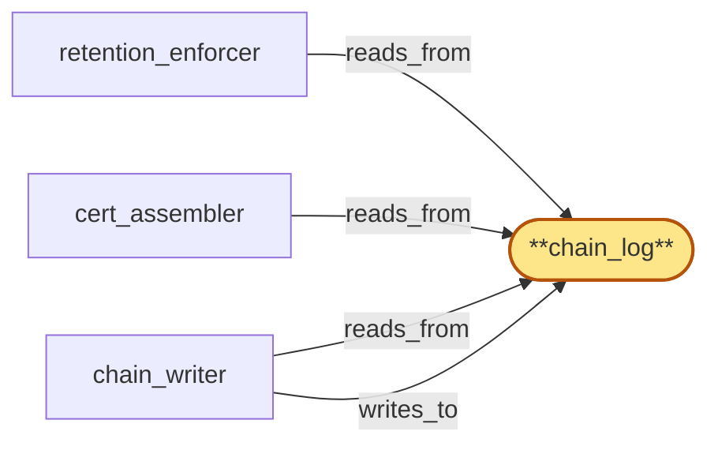

# chain_log

> Build the compliance_audit chain_log:

## Properties

| Field | Value |
| --- | --- |
| Task | `chain_log` |
| Scope | `compliance_audit` |
| Node | `chain_log` |
| Node type | `SubStore` |
| Dependencies | `0` |
| Wave | `1` |

## Architecture

## Implementation summary

- Build the compliance_audit chain_log: hash-chained append-only Postgres table holding TIER-1 audit entries with crypto-shred semantics
- row hashes form a hash-chain so tampering is detectable.

## Node definition (`chain_log` — SubStore)

- Residency-partitioned, append-only, micro-batched, hash-chained log.
- Each micro-batch record holds (sequence, prev-hash, batch-hash, schema_version, residency_version, append-class-mix, internal Merkle-tree-of-entries root) and the contained entries hold (entry-hash within batch-Merkle, residency-decision-tuple V_e+R_e, Tier-1 ciphertext blob, Tier-2 structural-witness signed under the FORWARD-SECURE Tier-2 signing key for the active epoch).
- Tier-2 contains no tenant-attributable content but DOES carry routing identifiers in cleartext on entries where rebuilds depend on them (drain-ack-receipt, drain-fence-broadcast, drain-ack-index-snapshot, key-destroyed-encrypt-failure, retroactive-protocol-violation, violation-summary, cert-input-pin) — see tier_splitter.
- Tier-1 is opaque ciphertext.
- The substrate exposes append-and-CAS-on-tip-hash (one CAS per micro-batch), read-by-sequence-or-by-batch-hash-or-by-entry-hash, and per-residency tip-hash inspection.
- FORWARD-SECURE TIER-2 EPOCHS: the active Tier-2 signing key advances one epoch per micro-batch (or per fixed bounded chain-prefix)
- each epoch transition appends a typed tier2-epoch-witness entry committing the new epoch verification material under OOB-anchor signature.
- Forward security: a compromised epoch-K key cannot mint signatures attributable to epoch K-1 or earlier.
- Compromise of the active epoch is recorded as a typed tier2-key-compromise entry naming compromised epoch and the new active epoch
- downstream verification of any Tier-2 witness from a compromised epoch yields suspect-witness mode without invalidating prior epochs.
- The epoch-witness chain is verified against OOB-anchor signatures rooted in region_coordinator parent-scope OOB-anchor M-of-N quorum.
- RETENTION INTERLOCK: cert-input-pin entries (typed entries written by tenant_store via admission_gate when an assembly trigger opens) name entry-hashes that retention_enforcer must treat as retention-extended until the certificate-of-deletion entry referencing them is appended or the pin is explicitly released. drain-ack-index-snapshot entries are non-shreddable until superseded by a fresher snapshot.
- SHRED PRESERVES STRUCTURE: shred destroys readability of Tier-1 ciphertext blob only — entry-hash, prev-hash, batch-hash, internal Merkle proofs, and Tier-2 witness all remain so external chain integrity verification and structural-presence verification survive both tenant-driven crypto-shred and retention-driven shred.

## Requirements

### `r1` — r-init-chain-shred-integrity

**Summary:** Tenant audit-key destruction (crypto-shred) renders Tier-1 ciphertext unreadable but leaves the hash chain intact: prev-hash links, entry-hash, and Tier-2 witness all survive; an external verifier can still confirm chain integrity and structural-presence of every attested event for the tenant after shred.

- Origin: `initial`
- Targets: `chain_log`
- Matched via: `chain_log`
- Verifications:
  - Test chain_log/shred_integrity.rs asserts after key destruction the tier-1 payload is unreadable; the hash-chain remains intact (tier-2 witnesses preserve structural invariants).

## Outputs

| Path | Purpose |
| --- | --- |
| `crates/compliance_audit/migrations/0001_chain_log.sql` | Migration creating chain_log + hash-chain trigger |
| `crates/compliance_audit/src/chain_log.rs` | Hash-chain append API |

## Stack details

- Postgres schema 'audit.chain_log' (entry_id PK, prev_hash, this_hash, payload BYTEA, hlc, residency_region, schema_version, tier ENUM); REVOKE UPDATE/DELETE; row_hash = blake3(prev_hash || canonical(payload) || hlc)
- Crypto-shred: payload encrypted with per-tenant audit_key from audit_encryption_key_register; tier-1 payload becomes unreadable when key DESTROYED

## Acceptance criteria

### r-init-chain-shred-integrity

- Test chain_log/shred_integrity.rs asserts after key destruction the tier-1 payload is unreadable; the hash-chain remains intact (tier-2 witnesses preserve structural invariants).

## Related tasks (graph neighbours)

- [cert_assembler](cert_assembler.md)
- [chain_writer](chain_writer.md)
- [retention_enforcer](retention_enforcer.md)

---

_Source of truth: `archi plan task show chain_log`. Regenerate with `python3 tasks/_generate.py`._
