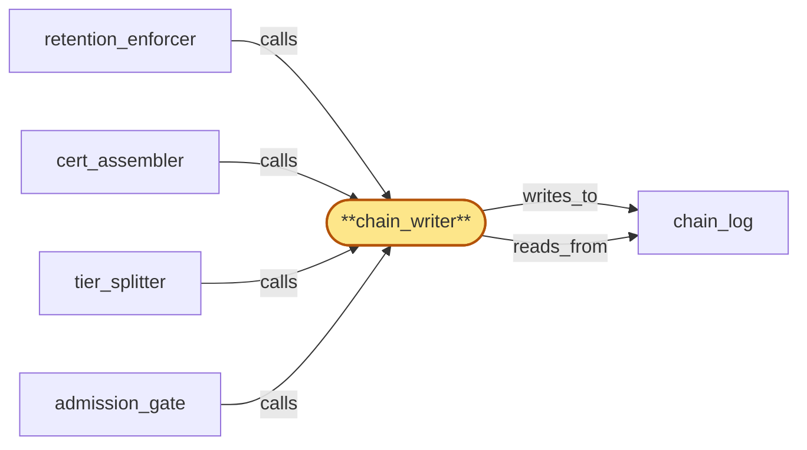

# chain_writer

> Build the chain writer:

## Properties

| Field | Value |
| --- | --- |
| Task | `chain_writer` |
| Scope | `compliance_audit` |
| Node | `chain_writer` |
| Node type | `Subsystem` |
| Dependencies | `1` |
| Wave | `2` |

## Architecture

## Implementation summary

- Build the chain writer: Rust-side append worker that takes admission_gate-validated entries, computes the hash-chain link, and inserts into chain_log with class-fair queueing so high-volume writers can't starve low-volume ones.

## Node definition (`chain_writer` — Subsystem)

- Single point of append into the residency-tagged hash-chained log under a BOUNDED-CONCURRENCY MICRO-BATCH model with PER-CLASS FAIR-QUEUEING.
- Receives prepared chain-entry records carrying a residency-decision-tuple (V_e, R_e) computed at admission_gate from the writer-encrypted-at-HLC and an append-class label.
- Commits each entry into partition R_e regardless of the residency policy_version active at commit time (the policy is HLC-anchored at admission).
- Per-residency append model: chain_writer assembles micro-batches of up to N entries
- each micro-batch is a single CAS-on-tip-hash committing the batch with an internal Merkle-tree-of-entries root so per-entry verification stays constant-time
- the chain prev-hash links micro-batch to micro-batch.
- PER-CLASS FAIR LANES (cert_assembler / drain-ack-receipt / protocol-violation / normal-per-tenant-write / retention-shred / schema-activation / operator-override / drain-ack-index-snapshot) each hold a guaranteed minimum micro-batch-slot share so latency-sensitive classes (cert_assembler closing certs against regulatory windows, drain-ack-receipt feeding the late-write check, schema-activation feeding deny-by-default cutover) cannot starve behind bulk per-tenant or retention-shred traffic.
- Per-class fair-queueing parameters are themselves typed entries owned by region_coordinator and audit-logged through the same chain.
- Refuses any append whose H_w, residency-decision-tuple, schema_version, or append-class is not internally consistent with the routing rule.

## Requirements

### `r1` — r-chain-writer-class-fair-queue

**Summary:** chain_writer admits entries via per-residency bounded-concurrency micro-batches with per-class fair-queueing. Each micro-batch is a single CAS-on-tip-hash that commits N entries; the chain prev-hash links micro-batch to micro-batch; an internal Merkle-tree-of-entries root in each micro-batch lets per-entry entry-hash verification stay constant-time. Append classes (cert_assembler, drain-ack-receipt, protocol-violation, normal per-tenant write, retention-shred, schema-activation, operator-override) each hold a guaranteed minimum micro-batch-slot share so cert_assembler and protocol-violation entries cannot starve behind bulk per-tenant traffic or retention-shred waves. Per-class fair-queueing parameters are themselves typed entries owned by region_coordinator and audit-logged through the same substrate.

- Origin: `stressor:1:s-chain-writer-bulk-contention`
- Targets: `chain_writer`
- Matched via: `chain_writer`
- Verifications:
  - Test chain_writer/class_fair_queue.rs asserts under sustained load each writer class receives its documented fair share; no class is starved.

## Outputs

| Path | Purpose |
| --- | --- |
| `crates/compliance_audit/src/chain_writer.rs` | Chain writer + class-fair queue |

## Stack details

- Rust module 'compliance_audit::chain_writer' with class-fair queue (per writer-class fair-share scheduler) and atomic transaction-per-batch

## Acceptance criteria

### r-chain-writer-class-fair-queue

- Test chain_writer/class_fair_queue.rs asserts under sustained load each writer class receives its documented fair share; no class is starved.

## Related tasks (graph neighbours)

- [admission_gate](admission_gate.md)
- [cert_assembler](cert_assembler.md)
- [chain_log](chain_log.md)
- [retention_enforcer](retention_enforcer.md)
- [tier_splitter](tier_splitter.md)

---

_Source of truth: `archi plan task show chain_writer`. Regenerate with `python3 tasks/_generate.py`._
