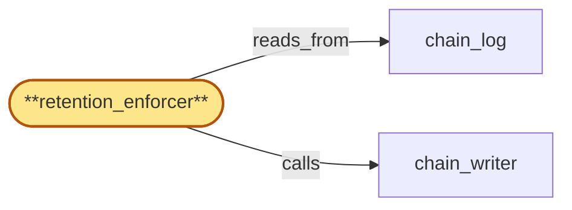

# retention_enforcer

> Build the retention enforcer:

## Properties

| Field | Value |
| --- | --- |
| Task | `retention_enforcer` |
| Scope | `compliance_audit` |
| Node | `retention_enforcer` |
| Node type | `Subsystem` |
| Dependencies | `1` |
| Wave | `2` |

## Architecture

## Implementation summary

- Build the retention enforcer: scheduled job that prunes tier-1 chunks past their retention window per residency-tagged retention policy
- never deletes tier-2 witnesses.

## Node definition (`retention_enforcer` — Subsystem)

- Applies the jurisdiction-bound retention policy propagated through region_coordinator residency_publisher to chain_log entries.
- For each (residency, entry-type) pair holds the active retention window and on retention expiry crypto-shreds (deletes Tier-1 ciphertext only) entries past the bound, leaving Tier-2 witness, entry-hash, prev-hash, batch-hash, and Merkle proofs in place so chain integrity and structural-presence verification survive.
- RETENTION INTERLOCK: retention_enforcer never shreds chain_log entry-hashes named by an open or pending cert-input-pin entry — pinned hashes are treated as retention-extended until the referencing certificate-of-deletion entry is appended or the pin is explicitly released by tenant_store. drain-ack-index-snapshot entries are likewise non-shreddable while they remain the most-recent-snapshot for any (writer-set, tenant-set) projection currently used by admission_gate rebuild
- supersession by a fresher snapshot releases the prior snapshot for normal retention.
- Retention-driven shred is itself logged as a typed retention-shred entry into chain_log via chain_writer (in the retention-shred fair-queue lane) so post-shred a regulator can verify which entries were retention-shredded vs tenant-shredded vs surviving.

## Outputs

| Path | Purpose |
| --- | --- |
| `crates/compliance_audit/src/retention_enforcer.rs` | Retention enforcer |
| `charts/services/audit-retention/` | K8s CronJob Helm chart |

## Stack details

- Rust module 'compliance_audit::retention_enforcer' running as a Kubernetes CronJob; computes per-(residency, tier) cutoff HLC and invokes a documented prune procedure

## Related tasks (graph neighbours)

- [chain_log](chain_log.md)
- [chain_writer](chain_writer.md)

---

_Source of truth: `archi plan task show retention_enforcer`. Regenerate with `python3 tasks/_generate.py`._
