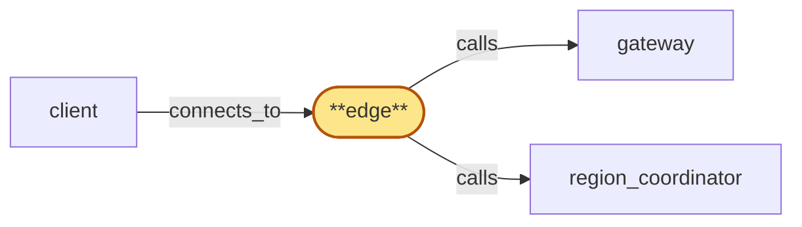

# edge

> Build the edge service:

## Properties

| Field | Value |
| --- | --- |
| Task | `edge` |
| Scope | `/` |
| Node | `edge` |
| Node type | `Service` |
| Dependencies | `3` |
| Wave | `9` |

## Architecture

## Implementation summary

- Build the edge service: residency-aware anycast front layer that terminates TLS, applies WAF/IP rate-limit/bot mitigation (delegated to Cloudflare/Envoy), signs edge-attestations the gateway requires, consumes per-region gateway health surface, emits reconnect-storm hints on disconnect
- cert inventory enumerated
- cert rotation overlap window.

## Node definition (`edge` — Service)

- Public-facing untrusted-traffic filter: terminates TLS, applies IP-level rate limiting, runs WAF / bot-mitigation rules, classifies source-network fingerprint, and forwards only API-key-bearing traffic to the gateway.
- Mints a short-lived cryptographically signed edge-attestation on every forwarded request that includes the tenant's residency tag, source-network classification, signup-fingerprint signal for the tenant-clustering pipeline, edge-applied rate-limit verdicts, and the pinned residency policy_version under which edge enforced the request
- the policy_version travels in the attestation so downstream consumers (gateway, usage_meter, metrics_store) can detect mismatch.
- As a residency-policy consumer, edge subscribes to region_coordinator's residency_publisher push-and-acknowledge channel: on every published policy update it must acknowledge readiness within the documented window before residency_publisher activates a tightening change
- if edge fails to acknowledge in-window it falls to deny-by-default for the affected tenant — sticky for that version
- leaves deny-by-default only by ack-readying to a strictly newer policy_version.
- ON COLD-START requests pre-warm hydration from residency_publisher delivering the currently-active policy_version's full state synchronously, ack-readies the active version inline as part of registration, and only after ack-readying begins serving residency-pinned traffic
- pre-warm honors monotonic-per-(instance_id, version)
- on pre-warm-stalled falls to deny-by-default for residency-pinned operations and reports the state.
- Advances pinned policy_version only on observing strictly newer activation from residency_publisher's push-and-acknowledge channel
- out-of-band signals are not a valid activation source. gateway rejects any request lacking a current valid attestation regardless of source IP.
- Edge is enumerated as a cert-bearing surface in the cert-inventory: TLS-termination cert, attestation-signing key, and any mTLS to gateway each have a documented renewal cadence with overlap-window acceptance, rotated under region_coordinator's region-staggered gating.
- Routing is residency-aware: requests from a residency-pinned tenant (looked up via region_coordinator) are forwarded only to gateways in regions allowed by that tenant's policy.
- On reconnect storms, edge advertises jittered-backoff hints and regional affinity hints to clients so reconnect load spreads across surviving regions.
- Consumes a per-region gateway-health surface (sourced via region_coordinator's gateway_health_surface) that aggregates per-Subrole liveness — in particular fanout-suspended versus rpc-healthy — so anycast / residency-aware routing can shift subscription traffic away from a region whose subscription path is degraded even when that region's RPC path is healthy
- verifies the surface's monotonic freshness signal and falls back to a documented stale-surface policy when the surface is stuck-good or stuck-bad
- honors region_coordinator's cross-witness construction. Deployed at the network edge with anycast routing across regions

## Requirements

### `r1` — R-residency-aware-routing

**Summary:** Edge routing is residency-aware: requests from a residency-pinned tenant are forwarded only to gateways in regions allowed by that tenant's policy, even when an out-of-policy region is closer by anycast

- Origin: `stressor:2:S-data-residency`
- Targets: `edge`
- Matched via: `edge`
- Verifications:
  - Test edge/residency_aware_routing.rs asserts traffic is routed to a residency-allowed region; non-allowed regions receive a documented redirect.

### `r2` — R-reconnect-storm-control

**Summary:** When connections drop en masse (anycast flap, region drain, edge restart), the system bounds the reconnect-storm load on surviving regions through advertised jittered-backoff hints, bulk auth_cache hydration paths, and pre-warmed fanout state for the most likely failover regions

- Origin: `stressor:2:S-anycast-flap`
- Targets: `edge`
- Matched via: `edge`
- Verifications:
  - Test edge/reconnect_storm_control.rs asserts on disconnect, edge emits jittered-backoff reconnect hints to clients.

### `r3` — R-cert-inventory

**Summary:** Every TLS / mTLS-bearing surface in the system is enumerated as part of the spec — public edge ingress, gateway↔chain_router, gateway↔fanout, gateway↔auth_cache, gateway↔tenant_store, chain_router↔chain pool, region_coordinator inter-region channel — and each has a documented renewal cadence with an explicit pre-expiry safety margin.

- Origin: `stressor:3:s3-tls-expiry`
- Targets: `edge`
- Matched via: `edge`
- Verifications:
  - Test edge/cert_inventory.rs asserts every cert in use is enumerated in cert-inventory and rotated by lifecycle_gate.

### `r4` — R-cert-rotation-overlap

**Summary:** Cert rotation on any surface includes a documented overlap window during which both the outgoing and incoming credential are accepted, so peers that pin or strict-validate do not see a hard cutover.

- Origin: `stressor:3:s3-tls-expiry`
- Targets: `edge`
- Matched via: `edge`
- Verifications:
  - Test edge/cert_rotation_overlap.rs asserts cert rotations operate under an overlap window allowing both old and new certs concurrently.

### `r5` — r-s5-consumer-activation-source

**Summary:** Residency-policy consumers (edge, gateway, usage_meter, metrics_store) advance their pinned policy_version only on observing a strictly newer activation from residency_publisher's push-and-acknowledge channel; out-of-band signals from tenant_store or any other component are not a valid activation source. This invariant prevents out-of-order activation under stuck-prepared recovery.

- Origin: `stressor:5:s5-policy-2pc-stuck-prepared`
- Targets: `edge`
- Matched via: `edge`
- Verifications:
  - Test edge/consumer_activation_source.rs asserts edge advances pinned policy_version only on observing strictly newer activation from residency_publisher's push channel.

## Outputs

| Path | Purpose |
| --- | --- |
| `crates/edge/` | Edge service crate |
| `charts/services/edge/` | Helm chart |

## Stack details

- Rust workspace crate 'crates/edge' (axum) sitting behind a Cloudflare/Envoy edge proxy that handles TLS termination, WAF, IP rate-limit, bot mitigation
- Edge-attestation signer: signs per-request attestations with rustls-private-key referenced in cert-inventory; consumes residency_publisher for residency-aware routing

## Acceptance criteria

### R-residency-aware-routing

- Test edge/residency_aware_routing.rs asserts traffic is routed to a residency-allowed region; non-allowed regions receive a documented redirect.

### R-reconnect-storm-control

- Test edge/reconnect_storm_control.rs asserts on disconnect, edge emits jittered-backoff reconnect hints to clients.

### R-cert-inventory

- Test edge/cert_inventory.rs asserts every cert in use is enumerated in cert-inventory and rotated by lifecycle_gate.

### R-cert-rotation-overlap

- Test edge/cert_rotation_overlap.rs asserts cert rotations operate under an overlap window allowing both old and new certs concurrently.

### r-s5-consumer-activation-source

- Test edge/consumer_activation_source.rs asserts edge advances pinned policy_version only on observing strictly newer activation from residency_publisher's push channel.

## Related tasks (graph neighbours)

- [client](client.md)
- [gateway_integration](gateway/README.md)
- [region_coordinator_integration](region_coordinator/README.md)

---

_Source of truth: `archi plan task show edge`. Regenerate with `python3 tasks/_generate.py`._
