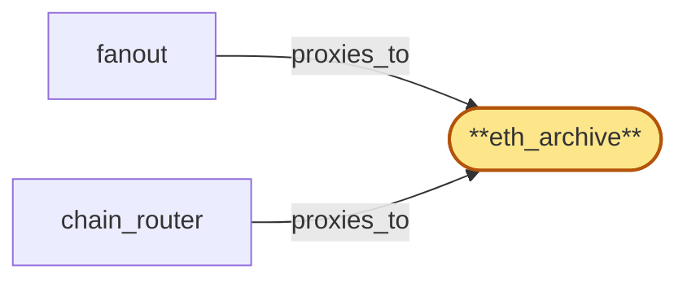

# eth_archive

> Provision the Ethereum mainnet archive ChainPool:

## Properties

| Field | Value |
| --- | --- |
| Task | `eth_archive` |
| Scope | `/` |
| Node | `eth_archive` |
| Node type | `ChainPool` |
| Dependencies | `0` |
| Wave | `1` |

## Architecture

## Implementation summary

- Provision the Ethereum mainnet archive ChainPool: a K8s StatefulSet of Erigon archive replicas (mixed archive + pruned tiers as separate sub-StatefulSets), each fronted by an Envoy mTLS sidecar that exposes JSON-RPC and websocket subscriptions to the in-cluster network only.
- Includes per-replica liveness probe (eth_blockNumber + tip-lag), per-pool drain protocol, fork sub-pool labelling, and tip-lag reporting hook for chain_router.

## Node definition (`eth_archive` — ChainPool)

- Ethereum mainnet chain-node pool: a managed group of replicas with mixed roles — archive replicas (historical state, served on the historical-isolated path) and pruned tip replicas (current-state reads), preferably across diverse client implementations (Erigon + Geth) for byzantine cross-checking
- chain_router and fanout select replicas from the pool.
- Replicas declare their (chain_id, fork_id) allegiance so chain_router partitions the pool by fork sub-pool.
- Replicas support an explicit drain state under chain_router's pool-drain protocol, finishing in-flight RPCs and unsubscribing from fanout head streams only after gateway-side subscriptions have re-bound.
- Each replica reports tip-lag relative to chain peer count / expected slot advance so chain_router can mark the pool tip-stale when it falls behind the per-chain freshness budget. mTLS surface to chain_router and fanout is enumerated in cert-inventory

## Requirements

### `r1` — R-eth

**Summary:** System exposes Ethereum mainnet on-chain data (current and historical) to authenticated clients via the chain's native JSON-RPC interface

- Origin: `initial`
- Targets: `eth_archive`
- Matched via: `eth_archive`
- Verifications:
  - Integration test in tests/chain-pools/eth_archive_e2e.rs spawns the Helm-deployed eth_archive chart in a kind cluster and asserts: (a) eth_blockNumber returns a recent mainnet block, (b) eth_getBlockByNumber retrieves a sentinel historical block (>2y old), (c) Envoy mTLS rejects a client without a SPIFFE SVID.

## Outputs

| Path | Purpose |
| --- | --- |
| `charts/chain-pools/eth-archive/` | Helm chart deploying the Erigon archive + pruned StatefulSets, Envoy mTLS sidecar, liveness/readiness probes, and per-replica drain pre-stop hook |
| `ops/runbooks/eth-archive.md` | Operator runbook for replica replacement, snapshot bootstrap, drain protocol, and fork sub-pool labelling |

## Stack details

- Helm chart 'charts/chain-pools/eth-archive' deploying Erigon archive image; one StatefulSet for archive tier, one for pruned tier
- Envoy sidecar enforcing SPIFFE mTLS using SPIRE-issued SVIDs; reverse-proxies localhost JSON-RPC + WS to the in-cluster network
- Liveness probe: HTTP probe calling eth_blockNumber and asserting tip-lag below threshold; readiness probe asserts archive history reachable for a sentinel old block

## Acceptance criteria

### R-eth

- Integration test in tests/chain-pools/eth_archive_e2e.rs spawns the Helm-deployed eth_archive chart in a kind cluster and asserts: (a) eth_blockNumber returns a recent mainnet block, (b) eth_getBlockByNumber retrieves a sentinel historical block (>2y old), (c) Envoy mTLS rejects a client without a SPIFFE SVID.

## Related tasks (graph neighbours)

- [chain_router_integration](chain_router/README.md)
- [fanout](fanout.md)

---

_Source of truth: `archi plan task show eth_archive`. Regenerate with `python3 tasks/_generate.py`._
