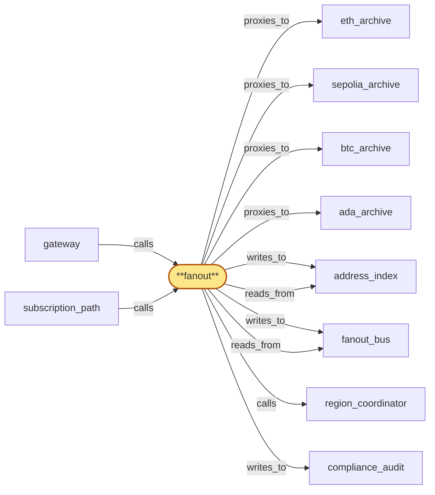

# fanout

> Build the fanout subscription-multiplex service:

## Properties

| Field | Value |
| --- | --- |
| Task | `fanout` |
| Scope | `/` |
| Node | `fanout` |
| Node type | `Service` |
| Dependencies | `8` |
| Wave | `6` |

## Architecture

## Implementation summary

- Build the fanout subscription-multiplex service: consumes chain-pool head and pending-tx streams once per region, multiplexes via fanout_bus to N subscriber-handling fanout instances
- portable cursors, chain-derived ordering, rollback-coherent emission with cross-region canonical-tip from region_coordinator
- mempool fairness (deterministic shuffle, no privileged access), planned-rebind events, subscription progress heartbeats
- address-index for sub-linear address-watch matching.

## Node definition (`fanout` — Service)

- Subscription multiplex layer: maintains the upstream chain-sync / newHeads / mempool subscriptions to each region's chain pools (per (chain, fork) sub-pool), publishes events to fanout_bus which subscriber-handling instances read from, multiplexes events to many client websockets, populates the per-chain address index, and emits explicit rollback notifications on reorg.
- Cursors are portable: each event is tagged with both an opaque cursor and a globally-meaningful chain coordinate (block number + intra-block index, or chain-stream sequence) so any region can replay from the cursor by reconstructing from the chain pool's history when its local ring buffer does not cover that coordinate.
- Canonical-tip and rollback decisions come from region_coordinator (per (chain, fork)) so subscribers reconnecting across regions see one canonical timeline per fork.
- Event ordering exposed to subscribers uses chain-derived sequencing rather than wall-clock
- the hybrid logical clock from region_coordinator is used only when chain ordering does not apply.
- Distinguishes a planned head-stream rebind (driven by chain pool rotation, signalled by chain_router's drain protocol) from a network fault: subscription cursors and consumer-rate state are preserved through a rebind and only a single 'rebind' event surfaces.
- FORK-TRANSITION HANDSHAKE-ACK PROTOCOL (root-level contract): on a chain_router-issued fork-transition handshake naming the divergence point (chain_id, prior fork_id, new fork_id, divergence HLC, prior fork terminal HLC), fanout MUST ack the divergence point to chain_router before chain_router admits any forward-progress dispatch on the new fork
- the ack is per-(region, chain, fork-pair) and is durable so a fanout restart resumes the in-flight handshake from its last durable phase.
- PER-CURSOR MONOTONICITY UNDER ROLLBACK-THEN-FORWARD-PROGRESS: every active subscription's cursor advances monotonically across the rollback-then-forward-progress sequence — fanout emits a structured rollback notification covering events back to the divergence point named in the handshake to every active subscription on the losing fork BEFORE any forward-progress event on the new fork is delivered to that subscription, and the cursor sequence the subscriber observes (rollback-event cursor < divergence-point cursor < first forward-progress cursor on the new fork) is monotone-non-decreasing per subscription with no replay of already-delivered new-fork events
- this monotonicity holds even if the handshake is retried by chain_router.
- CROSS-COMPONENT VISIBILITY: while a fanout instance has handshake-pending state for any (chain, fork-pair) in its region, fanout reports 'fork-transition-pending' to region_coordinator's gateway_health_surface (subsystem 8) so edge sees fanout as fork-transition-pending and routes accordingly
- the state clears only after the handshake completes (ack delivered, divergence-point persisted, rollback notifications emitted to all affected subscriptions).
- The internal subscription rollback-and-rebind state machine (subscriber-acknowledgement, forward-progress gating, per-subscription replay buffer sizing) remains a fanout zoom concern — root pins the handshake-ack contract, per-cursor monotonicity guarantee, and gateway_health_surface visibility, and defers internals to the fanout zoom.
- Mempool / pending-transaction subscription delivery has an explicit fairness model: per-event delivery order across subscribers is derived from a deterministic shuffling keyed on (event_id, subscription_id) with a fixed delay budget
- no internal, admin, co-located, or commercially-favoured subscriber receives mempool events on a faster path
- consumer-rate feedback is advisory only for mempool streams.
- Head-event and watched-address subscriptions emit a periodic progress heartbeat.
- Exposes a per-subscription consumer-rate feedback signal so callers can implement bounded per-subscription backpressure
- accepts batched subscribe calls so reconnect-storm subscribe load can be coalesced.
- CONSUMES drain-fence broadcasts: maintains a durable per-(offboarding_id, component_id) apply-state record with typed phase-markers (RECEIVED, FLUSH-IN-PROGRESS, FLUSH-COMPLETE, ACK-EMITTED, ATTESTATION-WRITTEN, TERMINAL)
- on restart resumes from the last durable phase and never re-runs a non-idempotent phase
- flushes in-flight audit writes for the named tenant to compliance_audit then acks drain to tenant_store within the HLC-bounded ack window
- if the local instance is itself in lifecycle teardown when the broadcast arrives, flush-then-ack-then-teardown is the only ordering that satisfies both invariants — alternatively a durable drain-ack-handoff record names a successor instance or persistent buffer
- never retracts a drain-ack once emitted.
- On tenant offboarding, drops the tenant's subscriptions and emits a single accounting record on receipt of a region_coordinator-signed offboarding signal — rejects offboarding signals lacking a current valid lifecycle_gate signature, verifies the signature against the broadcast's NAMED roster_version not the locally-cached roster_version (broadcasts are self-contained credential bundles)
- on named-roster cache miss, fetches the named roster bundle via region_coordinator.credential_roster's on-demand named-roster lookup endpoint within the HLC-bounded budget tighter than the per-tenant ack window, with bulk-wave-coalesced fetches
- deduping by idempotency key (offboarding_id, component_id, attempt_id), meeting a documented attestation SLO and surfacing preservation-blocked terminal states, with the attestation written to compliance_audit.
- Cert-bearing surface for mTLS to gateway and chain pool replicas, enumerated in cert-inventory

## Requirements

### `r1` — R-portable-cursor

**Summary:** Subscription cursors are portable across regions: a cursor issued in region A can be resumed from in region B, and the system reconstructs missed events from a globally-meaningful coordinate (chain block + offset or a chain-stream sequence) when the local ring buffer does not cover the requested cursor

- Origin: `stressor:2:S-cursor-cross-region`
- Targets: `fanout`
- Matched via: `fanout`
- Verifications:
  - Test fanout/portable_cursor.rs asserts cursors are portable across instances and chain-derived; reconnecting from a cursor replays missed events deterministically.

### `r2` — R-cross-region-canonical-tip

**Summary:** For each supported chain, the system advertises a single canonical-tip view across all regions, computed by quorum across regional chain pools, so that the canonical chain history a subscriber sees is independent of which region they connect to

- Origin: `stressor:2:S-reorg-divergence-cross-region`
- Targets: `fanout`
- Matched via: `fanout`
- Verifications:
  - Test fanout/cross_region_canonical_tip.rs asserts fanout consults region_coordinator's tip_quorum for canonical tip per (chain, fork) before confirming events.

### `r3` — R-cross-region-rollback-coherent

**Summary:** When a reorg is detected, the rollback notification carries a globally-meaningful divergence point (chain coordinate, not region-local cursor) so all regions emit a coherent rollback to their subscribers regardless of when each region's chain pool observes the reorg

- Origin: `stressor:2:S-reorg-divergence-cross-region`
- Targets: `fanout`
- Matched via: `fanout`
- Verifications:
  - Test fanout/cross_region_rollback_coherent.rs asserts rollback notifications are emitted with divergence-point cursor before any forward-progress on the new fork.

### `r4` — R-chain-derived-ordering

**Summary:** Cross-region event ordering exposed to subscribers is derived from chain-native sequencing (block + intra-block index, or chain-stream sequence) rather than gateway wall-clock, so cross-region clients see the same ordering regardless of inter-region clock skew

- Origin: `stressor:2:S-clock-skew`
- Targets: `fanout`
- Matched via: `fanout`
- Verifications:
  - Test fanout/chain_derived_ordering.rs asserts emission ordering is chain-derived (block hash, slot/height) — not wall-clock.

### `r5` — R-fanout-bus-modeled

**Summary:** The internal pub/sub layer that fanout uses to multiplex chain streams is modeled as an explicit component with its own health, capacity, and failover semantics, so its failure modes are visible to operators and to stress testing

- Origin: `stressor:2:S-implicit-fanout-bus`
- Targets: `fanout`
- Matched via: `fanout`
- Verifications:
  - Test fanout/bus_modeled.rs asserts fanout_bus is the explicit multiplex layer; no alternative multiplex paths.

### `r6` — R-fanout-rebind-event

**Summary:** fanout distinguishes a planned head-stream rebind (driven by chain pool rotation) from a network fault, so subscription cursors and consumer-rate state are preserved through the rebind and only a single 'rebind' event surfaces to subscribers (no spurious rollback).

- Origin: `stressor:3:s3-replica-rotation-storm`
- Targets: `fanout`
- Matched via: `fanout`
- Verifications:
  - Test fanout/rebind_event.rs asserts planned-rebind events are emitted on chain pool replica drains.

### `r7` — R-subscription-progress-heartbeat

**Summary:** Head-event and watched-address subscriptions emit a periodic progress heartbeat that includes the pool's last-observed-tip and freshness state, so a silent subscription is distinguishable from a healthy chain quiet period and from a stalled pool.

- Origin: `stressor:3:s3-pool-sync-stall`
- Targets: `fanout`
- Matched via: `fanout`
- Verifications:
  - Test fanout/progress_heartbeat.rs asserts subscription-progress heartbeats emitted at documented cadence so consumers can detect stalls.

### `r8` — R-mempool-fairness

**Summary:** Pending-transaction / mempool subscription delivery follows a documented fairness model: cross-subscriber delivery order for the same event is deterministic in (event_id, subscription_id), with an explicit upper bound on best-vs-worst delivery skew. Consumer-rate feedback (bubble-gateway-1) is advisory only for mempool streams.

- Origin: `stressor:3:s3-mempool-frontrunning`
- Targets: `fanout`
- Matched via: `fanout`
- Verifications:
  - Test fanout/mempool_fairness.rs asserts pending-tx emission uses deterministic shuffle; no caller has privileged early access.

### `r9` — R-no-privileged-mempool-access

**Summary:** No internal, admin, or co-located subscriber receives mempool events on a faster path than external tenants. fanout's mempool delivery does not privilege any subscriber by network locality, internal status, or commercial agreement; if priority is sold as a product it is a separate documented contract, not an emergent property.

- Origin: `stressor:3:s3-mempool-frontrunning`
- Targets: `fanout`
- Matched via: `fanout`
- Verifications:
  - Test fanout/no_privileged_mempool_access.rs asserts no client connection has access to a privileged mempool feed; co-located callers receive the same view.

## Outputs

| Path | Purpose |
| --- | --- |
| `crates/fanout/` | Fanout service crate |
| `charts/services/fanout/` | Helm chart |

## Stack details

- Rust workspace crate 'crates/fanout' (tokio + tokio-tungstenite); chain-stream consumers per (chain, fork); writes to fanout_bus (Redis Streams) with portable cursor format
- Mempool fairness: deterministic per-block shuffle of pending-tx ordering; no co-located advantage; emit-order documented per chain
- Rollback-and-rebind state machine deferred to internal fanout zoom (Direction 22 candidate); current fanout pins the minimal fork-transition handshake-ack contract: per-(region, chain, fork-pair) durable ack of divergence point before chain_router admits forward-progress

## Acceptance criteria

### R-portable-cursor

- Test fanout/portable_cursor.rs asserts cursors are portable across instances and chain-derived; reconnecting from a cursor replays missed events deterministically.

### R-cross-region-canonical-tip

- Test fanout/cross_region_canonical_tip.rs asserts fanout consults region_coordinator's tip_quorum for canonical tip per (chain, fork) before confirming events.

### R-cross-region-rollback-coherent

- Test fanout/cross_region_rollback_coherent.rs asserts rollback notifications are emitted with divergence-point cursor before any forward-progress on the new fork.

### R-chain-derived-ordering

- Test fanout/chain_derived_ordering.rs asserts emission ordering is chain-derived (block hash, slot/height) — not wall-clock.

### R-fanout-bus-modeled

- Test fanout/bus_modeled.rs asserts fanout_bus is the explicit multiplex layer; no alternative multiplex paths.

### R-fanout-rebind-event

- Test fanout/rebind_event.rs asserts planned-rebind events are emitted on chain pool replica drains.

### R-subscription-progress-heartbeat

- Test fanout/progress_heartbeat.rs asserts subscription-progress heartbeats emitted at documented cadence so consumers can detect stalls.

### R-mempool-fairness

- Test fanout/mempool_fairness.rs asserts pending-tx emission uses deterministic shuffle; no caller has privileged early access.

### R-no-privileged-mempool-access

- Test fanout/no_privileged_mempool_access.rs asserts no client connection has access to a privileged mempool feed; co-located callers receive the same view.

## Related tasks (graph neighbours)

- [ada_archive](ada_archive.md)
- [address_index](address_index.md)
- [btc_archive](btc_archive.md)
- [compliance_audit_integration](compliance_audit/README.md)
- [eth_archive](eth_archive.md)
- [fanout_bus](fanout_bus.md)
- [gateway_integration](gateway/README.md)
- [region_coordinator_integration](region_coordinator/README.md)
- [sepolia_archive](sepolia_archive.md)

---

_Source of truth: `archi plan task show fanout`. Regenerate with `python3 tasks/_generate.py`._
