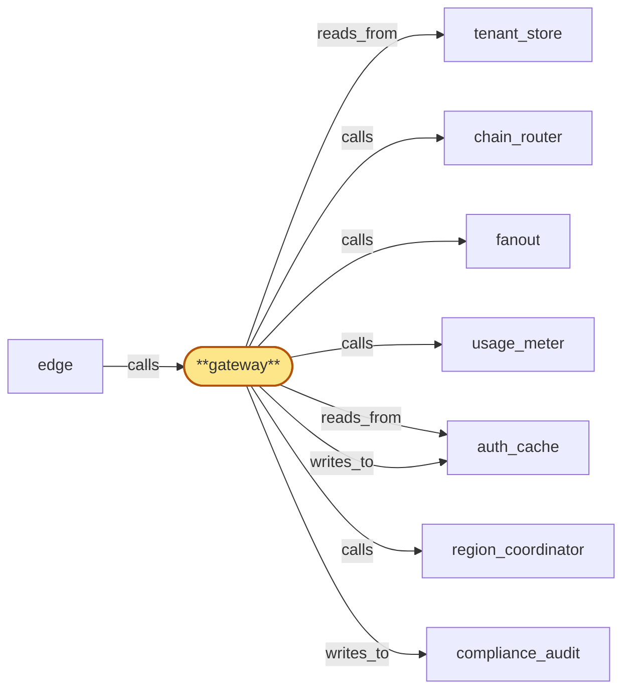
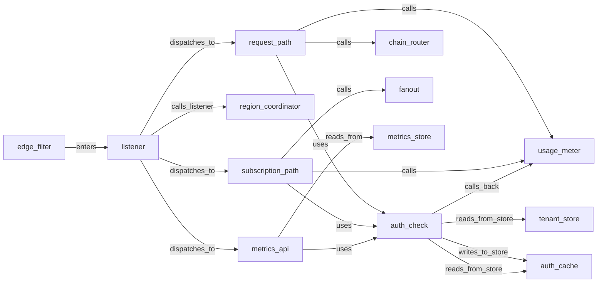

# gateway_integration

> Integrate the 5 gateway child tasks (listener + auth_check + request_path + subscription_path + metrics_api) into a single deployable per-region service:

## Properties

| Field | Value |
| --- | --- |
| Task | `gateway_integration` |
| Scope | `/` |
| Node | `gateway` |
| Node type | `Service` |
| Dependencies | `12` |
| Wave | `8` |

## Architecture

## Implementation summary

- Integrate the 5 gateway child tasks (listener + auth_check + request_path + subscription_path + metrics_api) into a single deployable per-region service: axum + tokio-tungstenite app with the listener owning the HLC + edge-attestation path and Subroles dispatching via auth_check
- Helm chart per region
- end-to-end integration tests covering every parent-scope gateway invariant.

## Node definition (`gateway` — Service)

- Stateless authenticated request entry: validates API keys, residency policy, and tenant_cluster identity / suspension state against auth_cache (with tenant_store as the canonical source on miss)
- requires every inbound request to carry a current valid edge-attestation (signed by edge) and rejects any request that does not, regardless of source IP or apparent network position
- legitimately edge-bypassing traffic (health checks, control plane, region_coordinator → gateway) carries an explicit internal-identity attestation, never an implicit network-position trust.
- As a residency-policy consumer, gateway pins the residency policy_version it enforced on every outgoing request (to chain_router, fanout, usage_meter), and cross-checks the policy_version carried in the inbound edge-attestation so downstream mismatch is detectable
- subscribes to region_coordinator's residency_publisher push-and-acknowledge channel and must acknowledge readiness within the documented window before residency_publisher activates a tightening change
- if gateway fails to acknowledge in-window it falls to deny-by-default for the affected tenant — sticky for that version
- leaves deny-by-default only by ack-readying to a strictly newer policy_version.
- ON COLD-START requests pre-warm hydration from residency_publisher delivering the currently-active policy_version's full state synchronously, ack-readies the active version inline as part of registration, and only after ack-readying begins serving residency-pinned traffic
- pre-warm honors monotonic-per-(instance_id, version)
- on pre-warm-stalled falls to deny-by-default for residency-pinned operations and reports the state.
- Advances pinned policy_version only on observing strictly newer activation from residency_publisher's push-and-acknowledge channel
- out-of-band signals are not a valid activation source.
- Enforces per-key and per-cluster rate limits via auth_cache and global throttle flags pushed by region_coordinator (cluster-level throttle and suspension flags propagate the same fast-path as per-tenant flags).
- Records usage with usage_meter, tagging rejected-request signals with rejection reason (rate-limit, throttle, residency, revoked, malformed-auth, plan-change-overage, cluster-suspended, tenant-offboarded, lease-stale, lease-superseded, residency-miss).
- Routes RPC requests to chain_router and websocket subscriptions to fanout, threading an explicit (chain, fork) tag derived from the request so chain_router and fanout serve the requested fork
- tip-state RPC responses are annotated with the answering pool's freshness state when the pool is in tip-stale mode.
- Classifies TLS / mTLS handshake errors against chain_router and chain pool as a distinct error class from upstream-chain network errors.
- Enforces a free-tier trust ramp: capacity unlocks gradually as verified-attribute signals accrue.
- Plan downgrades are graceful: existing in-flight subscriptions and long-RPC slots that exceed new caps are not killed
- new requests over the new caps are rejected with 'plan-change-overage'.
- CONSUMES drain-fence broadcasts: maintains a durable per-(offboarding_id, component_id) apply-state record with typed phase-markers (RECEIVED, FLUSH-IN-PROGRESS, FLUSH-COMPLETE, ACK-EMITTED, ATTESTATION-WRITTEN, TERMINAL)
- on restart resumes from the last durable phase and never re-runs a non-idempotent phase
- flushes in-flight audit writes for the named tenant to compliance_audit then acks drain to tenant_store within the HLC-bounded ack window
- if the local instance is itself in lifecycle teardown when the broadcast arrives, flush-then-ack-then-teardown is the only ordering that satisfies both invariants — alternatively a durable drain-ack-handoff record names a successor instance or persistent buffer
- never retracts a drain-ack once emitted.
- On tenant offboarding, closes all open websocket subscriptions for the tenant with a structured 'tenant-offboarded' close reason on receipt of a region_coordinator-signed offboarding signal — rejects offboarding signals lacking a current valid lifecycle_gate signature, verifies the signature against the broadcast's NAMED roster_version not the locally-cached roster_version
- deduping by idempotency key (offboarding_id, component_id, attempt_id), meeting a documented attestation SLO and surfacing preservation-blocked terminal states, with the attestation written to compliance_audit.
- Time-bucketed enforcement uses the hybrid logical clock from region_coordinator rather than wall-clock
- observed inter-region clock skew above a threshold transitions the region into a documented degraded mode. Deployed in every region
- no per-connection state outside auth_cache and fanout

## Requirements

### `r1` — R-historical

**Summary:** Clients can query state at any historical block on every supported chain (archive semantics, not just recent state)

- Origin: `initial`
- Targets: `gateway`
- Matched via: `gateway`
- Verifications:
  - Test gw_int/historical.rs asserts archive-class queries reach archive replicas via chain_router and return correct historical state.

### `r2` — R-realtime-newheads

**Summary:** Clients can subscribe over WebSocket and receive every new block header as it is observed by the corresponding chain node

- Origin: `initial`
- Targets: `gateway`
- Matched via: `gateway`
- Verifications:
  - Test gw_int/realtime_newheads.rs asserts WS newHeads delivers every block header observed by chain pool.

### `r3` — R-realtime-mempool

**Summary:** Clients can subscribe over WebSocket and receive pending/unconfirmed transactions, including Cardano via the Ogmios local-tx-monitor mini-protocol

- Origin: `initial`
- Targets: `gateway`
- Matched via: `gateway`
- Verifications:
  - Test gw_int/realtime_mempool.rs asserts WS pending-tx delivers eth/btc/ada pending txs verbatim (incl. Ogmios local-tx-monitor).

### `r4` — R-realtime-address

**Summary:** Clients can subscribe over WebSocket to a watched address and receive an event whenever that address sends or receives value on the corresponding chain

- Origin: `initial`
- Targets: `gateway`
- Matched via: `gateway`
- Verifications:
  - Test gw_int/realtime_address.rs asserts watched-address subscription emits events on tx send/receive.

### `r5` — R-multitenant

**Summary:** Every request and subscription is authenticated to a specific tenant via an API key looked up in the tenant store

- Origin: `initial`
- Targets: `gateway`
- Matched via: `gateway`
- Verifications:
  - Test gw_int/multitenant.rs asserts every connection/request authenticates to a specific tenant via API key.

### `r6` — R-ratelimit

**Summary:** Per-API-key request-rate limits and usage quotas are enforced before the request reaches a chain node

- Origin: `initial`
- Targets: `gateway`
- Matched via: `gateway`
- Verifications:
  - Test gw_int/ratelimit.rs asserts per-key rate-limits enforced before chain_router.

### `r7` — R-passthrough

**Summary:** Each chain's native JSON-RPC / mini-protocol surface is exposed to clients without translation to a unified cross-chain schema

- Origin: `initial`
- Targets: `gateway`
- Matched via: `gateway`
- Verifications:
  - Test gw_int/passthrough.rs asserts chain-native JSON-RPC forwarded verbatim.

### `r8` — R-reorg-safe

**Summary:** The system delivers reorg-safe semantics: WebSocket subscribers receive explicit rollback notifications, and REST/RPC responses can express finality status

- Origin: `initial`
- Targets: `gateway`
- Matched via: `gateway`
- Verifications:
  - Test gw_int/reorg_safe.rs asserts rollback notifications + finality on REST/RPC.

### `r9` — R-chain-redundancy

**Summary:** For every supported chain, the system maintains multiple healthy chain-node replicas; failure of any single replica does not cause a client-visible error or subscription drop

- Origin: `stressor:1:S-chain-crash`
- Targets: `gateway`
- Matched via: `gateway`
- Verifications:
  - Test gw_int/chain_redundancy.rs asserts single-replica failure invisible to clients (chain_router excludes unhealthy replicas).

### `r10` — R-chain-health

**Summary:** Every chain-node replica is continuously health-checked; unhealthy replicas are excluded from the routing pool until they recover

- Origin: `stressor:1:S-chain-crash`
- Targets: `gateway`
- Matched via: `gateway`
- Verifications:
  - Test gw_int/chain_health.rs asserts continuous health-checks exclude unhealthy replicas; recovery readmits.

### `r11` — R-finality-model

**Summary:** Every chain has an explicit finality model and every emitted event carries the chain's confirmation depth and finality status at emission time

- Origin: `stressor:1:S-deep-reorg`
- Targets: `gateway`
- Matched via: `gateway`
- Verifications:
  - Test gw_int/finality_model.rs asserts every emitted event carries chain confirmation depth + finality status.

### `r12` — R-reorg-replay

**Summary:** When a reorg occurs at any depth, subscribers receive an explicit rollback notification identifying the divergence point and a replay of the new canonical events

- Origin: `stressor:1:S-deep-reorg`
- Targets: `gateway`
- Matched via: `gateway`
- Verifications:
  - Test gw_int/reorg_replay.rs asserts on reorg subscribers receive explicit rollback + replay of canonical events.

### `r13` — R-confirmation-threshold

**Summary:** Subscribers can configure a per-stream confirmation threshold; events below the threshold are not delivered as confirmed

- Origin: `stressor:1:S-deep-reorg`
- Targets: `gateway`
- Matched via: `gateway`
- Verifications:
  - Test gw_int/confirmation_threshold.rs asserts per-stream confirmation-threshold honored end-to-end.

### `r14` — R-fanout-scale

**Summary:** System supports at least 1M concurrent websocket subscribers per chain stream without per-process bottlenecks

- Origin: `stressor:1:S-fanout-1m`
- Targets: `gateway`
- Matched via: `gateway`
- Verifications:
  - Test gw_int/fanout_scale.rs asserts ≥1M concurrent subscribers per chain stream sustained without per-process bottlenecks (loadtest).

### `r15` — R-fanout-decoupled

**Summary:** Subscription fanout is decoupled from request handling; new subscribers do not degrade RPC request latency

- Origin: `stressor:1:S-fanout-1m`
- Targets: `gateway`
- Matched via: `gateway`
- Verifications:
  - Test gw_int/fanout_decoupled.rs asserts new subscribers don't degrade RPC latency (latency p99 stable under subscriber-load).

### `r16` — R-event-index

**Summary:** System maintains a per-chain index of block events keyed by address so address-subscription matching scales sub-linearly in the number of subscribers

- Origin: `stressor:1:S-hotspot-address`
- Targets: `gateway`
- Matched via: `gateway`
- Verifications:
  - Test gw_int/event_index.rs asserts address-subscription matching is sub-linear in subscriber count via address_index.

### `r17` — R-query-cost

**Summary:** System enforces a per-request and per-tenant cost budget on chain queries; over-budget requests are rejected with guidance to chunk or use the historical pool

- Origin: `stressor:1:S-heavy-historical`
- Targets: `gateway`
- Matched via: `gateway`
- Verifications:
  - Test gw_int/query_cost.rs asserts per-request and per-tenant cost budgets enforced; over-budget rejected with chunking guidance.

### `r18` — R-historical-isolation

**Summary:** Long-running historical queries do not contend with tip-state requests on the same chain-node replica

- Origin: `stressor:1:S-heavy-historical`
- Targets: `gateway`
- Matched via: `gateway`
- Verifications:
  - Test gw_int/historical_isolation.rs asserts long-running historical queries route to archive subset; tip-state queries unaffected.

### `r19` — R-auth-cache

**Summary:** Gateway caches tenant credentials and rate-limit state with explicit TTLs so a transient tenant_store outage does not cause a service outage

- Origin: `stressor:1:S-tenant-store-outage`
- Targets: `gateway`
- Matched via: `gateway`
- Verifications:
  - Test gw_int/auth_cache.rs asserts gateway caches credentials + rate-limit state with TTLs; tenant_store outage doesn't outage gateway.

### `r20` — R-degradation

**Summary:** When tenant_store is unreachable, gateway operates in a documented degraded mode (cache-served auth, queued counter updates) and surfaces the degradation in metrics

- Origin: `stressor:1:S-tenant-store-outage`
- Targets: `gateway`
- Matched via: `gateway`
- Verifications:
  - Test gw_int/degradation.rs asserts when tenant_store unreachable, gateway operates in documented degraded mode and surfaces metrics.

### `r21` — R-key-rotation

**Summary:** Tenants can rotate API keys without service interruption (multiple active keys per tenant, immediate revocation, hot replacement)

- Origin: `stressor:1:S-api-key-leak`
- Targets: `gateway`
- Matched via: `gateway`
- Verifications:
  - Test gw_int/key_rotation.rs asserts API-key rotation supports multiple active keys, immediate revocation, hot replacement.

### `r22` — R-key-anomaly

**Summary:** System detects anomalous API-key usage (geo, IP, request-pattern shifts) and alerts the tenant

- Origin: `stressor:1:S-api-key-leak`
- Targets: `gateway`
- Matched via: `gateway`
- Verifications:
  - Test gw_int/key_anomaly.rs asserts anomalous key usage patterns surface anomaly detection events.

### `r23` — R-pending-state-machine

**Summary:** Pending-transaction events are emitted as transitions in a documented per-chain state machine (seen, replaced-by, dropped, confirmed) so subscribers can reason about non-monotonic mempool changes

- Origin: `stressor:1:S-pending-tx-flux`
- Targets: `gateway`
- Matched via: `gateway`
- Verifications:
  - Test gw_int/pending_state_machine.rs asserts pending-tx state machine transitions delivered verbatim to subscribers.

### `r24` — R-subscription-cursor

**Summary:** Every event on a subscription stream carries an opaque cursor; clients can reconnect and request 'resume from cursor X' to replay missed events within a documented retention window

- Origin: `stressor:1:S-subscriber-resume`
- Targets: `gateway`
- Matched via: `gateway`
- Verifications:
  - Test gw_int/subscription_cursor.rs asserts resume cursors honored on reconnect.

### `r25` — R-edge-protection

**Summary:** Untrusted public traffic is filtered at an edge layer (TLS termination, IP rate-limit, WAF, bot mitigation) before it reaches the gateway's chain-bound code paths

- Origin: `stressor:1:S-ddos-unauth`
- Targets: `gateway`
- Matched via: `gateway`
- Verifications:
  - Test gw_int/edge_protection.rs asserts requests without edge-attestation are rejected regardless of source IP.

### `r26` — R-chain-upgrade

**Summary:** Every supported chain has a documented upgrade procedure that pre-stages new node/bridge versions and transitions traffic across forks without a client-visible outage

- Origin: `stressor:1:S-chain-hard-fork`
- Targets: `gateway`
- Matched via: `gateway`
- Verifications:
  - Test gw_int/chain_upgrade.rs asserts chain upgrades (hard fork) handled via fork sub-pool transitions without subscription drop.

### `r27` — R-protocol-version

**Summary:** Every subscription and response surface advertises a protocol/schema version so client code can detect and negotiate compatible behaviour across chain upgrades

- Origin: `stressor:1:S-chain-hard-fork`
- Targets: `gateway`
- Matched via: `gateway`
- Verifications:
  - Test gw_int/protocol_version.rs asserts protocol/schema version handshake at connection-open.

### `r28` — R-multi-region

**Summary:** System runs active-active in at least two independent regions; failure of any one region does not cause a global outage and clients reconnect into a surviving region without manual intervention

- Origin: `stressor:1:S-region-outage`
- Targets: `gateway`
- Matched via: `gateway`
- Verifications:
  - Test gw_int/multi_region.rs asserts gateway operates in every region; residency-pinned traffic stays within allowed regions.

### `r29` — R-cost-accounting

**Summary:** System measures per-tenant cost drivers beyond request count (chain-node CPU, response bytes / egress) and attributes them to the tenant in near-real-time

- Origin: `stressor:1:S-egress-runaway`
- Targets: `gateway`
- Matched via: `gateway`
- Verifications:
  - Test gw_int/cost_accounting.rs asserts per-request and per-subscription usage tracking via usage_meter.

### `r30` — R-plan-ceilings

**Summary:** Each tenant plan has explicit monthly cost ceilings; approaching the ceiling triggers warnings, crossing it triggers throttle/reject with a clear error

- Origin: `stressor:1:S-egress-runaway`
- Targets: `gateway`
- Matched via: `gateway`
- Verifications:
  - Test gw_int/plan_ceilings.rs asserts plan-version-aware ceilings enforced.

### `r31` — R-tenant-metrics

**Summary:** Tenants can read per-key usage, error, latency, and rate-limit-headroom metrics for at least the past 30 days through a metrics API

- Origin: `stressor:1:S-tenant-observability`
- Targets: `gateway`
- Matched via: `gateway`
- Verifications:
  - Test gw_int/tenant_metrics.rs asserts tenant metrics API queries metrics_store within residency-allowed regions.

### `r32` — R-chain-cross-check

**Summary:** System cross-checks chain head and canonical block hashes across multiple chain-node replicas and quarantines any replica that diverges from the consensus tip

- Origin: `stressor:1:S-byzantine-node`
- Targets: `gateway`
- Matched via: `gateway`
- Verifications:
  - Test gw_int/chain_cross_check.rs asserts cross-chain consistency check surfaces divergences.

### `r33` — R-client-diversity

**Summary:** Where a chain has multiple production-quality client implementations, the chain-node pool includes more than one implementation to bound client-bug blast radius

- Origin: `stressor:1:S-byzantine-node`
- Targets: `gateway`
- Matched via: `gateway`
- Verifications:
  - Test gw_int/client_diversity.rs asserts gateway tolerates clients implementing different libraries (canonicalizer normalizes responses).

### `r34` — R-tiered-storage

**Summary:** Per chain, the system supports tiered storage (hot recent state, cold deep archive with on-demand re-warming) so storage cost grows sub-linearly with chain history

- Origin: `stressor:1:S-archive-disk-growth`
- Targets: `gateway`
- Matched via: `gateway`
- Verifications:
  - Test gw_int/tiered_storage.rs asserts archive vs tip tiers serve correct latency/cost characteristics.

### `r35` — R-pruned-replicas

**Summary:** For tip-state requests, the chain pool can include pruned (non-archive) replicas; tip-state read capacity scales independently of archive storage

- Origin: `stressor:1:S-archive-disk-growth`
- Targets: `gateway`
- Matched via: `gateway`
- Verifications:
  - Test gw_int/pruned_replicas.rs asserts pruned replicas serve tip-state queries; archive queries route around them.

### `r36` — R-bounded-clock-skew

**Summary:** Rate-limit windows and other time-bucketed enforcement use a hybrid-logical or coordinated clock that bounds inter-region skew explicitly; observed skew above a threshold puts the affected region into a documented degraded mode

- Origin: `stressor:2:S-clock-skew`
- Targets: `gateway`
- Matched via: `gateway`
- Verifications:
  - Test gw_int/bounded_clock_skew.rs asserts inter-region clock skew above threshold transitions region into degraded mode.

### `r37` — bubble-gateway-1

**Summary:** fanout exposes a per-subscription consumer-rate feedback signal and accepts batched subscribe calls from gateway, so gateway can implement bounded per-subscription backpressure (slow-consumer overflow policy) and reconnect-storm subscribe-coalescing without saturating fanout's subscribe-RPC fan-out

- Origin: `freestanding`
- Targets: `gateway`
- Matched via: `gateway`
- Verifications:
  - Test gw_int/bubble_gateway_1.rs asserts bubble-1 invariant: per-subscription consumer-rate feedback signal + batched subscribe.

### `r38` — bubble-gateway-2

**Summary:** chain_router returns a per-method cost-class hint at RPC submission time so gateway can partition its in-flight slot pool (short-RPC vs long-RPC pools) and prevent long-tail historical queries from starving short ones

- Origin: `freestanding`
- Targets: `gateway`
- Matched via: `gateway`
- Verifications:
  - Test gw_int/bubble_gateway_2.rs asserts bubble-2 invariant: per-method cost-class hint at submission time.

### `r39` — bubble-gateway-3

**Summary:** auth_cache stores the per-tenant throttle flag with an explicit version so gateway's long-running paths (active websocket subscriptions, streaming/chunked RPC responses) can re-check the flag cheaply by version comparison without re-running the full auth path

- Origin: `freestanding`
- Targets: `gateway`
- Matched via: `gateway`
- Verifications:
  - Test gw_int/bubble_gateway_3.rs asserts bubble-3 invariant: versioned per-tenant throttle flag with cluster-flag fast-path.

### `r40` — bubble-gateway-4

**Summary:** edge consumes a per-region gateway health surface that aggregates per-Subrole liveness (in particular fanout-suspended) so anycast / residency-aware routing can shift subscription traffic away from a region whose subscription path is degraded, even when that region's RPC path is healthy

- Origin: `freestanding`
- Targets: `gateway`
- Matched via: `gateway`
- Verifications:
  - Test gw_int/bubble_gateway_4.rs asserts bubble-4 invariant: edge consumes per-region gateway health surface with per-Subrole liveness.

### `r41` — bubble-gateway-5

**Summary:** usage_meter accepts a tagged 'rejected-request' signal from gateway with rejection reason (rate-limit, throttle, residency, revoked, malformed-auth) so per-tenant cost attribution covers shadow load from rejected requests and key-anomaly detection sees the rejection signal

- Origin: `freestanding`
- Targets: `gateway`
- Matched via: `gateway`
- Verifications:
  - Test gw_int/bubble_gateway_5.rs asserts bubble-5 invariant: tagged rejected-request signal with rejection reason.

### `r42` — R-handshake-error-classification

**Summary:** Gateway and chain_router classify TLS / mTLS handshake failures as a distinct error class from upstream-chain network errors, so on-call signal and tenant-facing error responses point at the correct surface (cert vs chain) instead of conflating them.

- Origin: `stressor:3:s3-tls-expiry`
- Targets: `gateway`
- Matched via: `gateway`
- Verifications:
  - Test gw_int/handshake_error_classification.rs asserts handshake errors are classified per documented error class.

### `r43` — R-schema-version-surface

**Summary:** Per-chain response schema_version is part of the protocol-version surface advertised on every response, and is bumped on intentional canonicalization changes so tenants can pin a schema_version and detect drift independently of chain protocol upgrades.

- Origin: `stressor:3:s3-client-schema-drift`
- Targets: `gateway`
- Matched via: `gateway`
- Verifications:
  - Test gw_int/schema_version_surface.rs asserts the schema version is surfaced to clients on every response.

### `r44` — R-plan-downgrade-graceful

**Summary:** When a tenant's resource usage exceeds the new plan's caps at the moment of downgrade (concurrent subscriptions, long-RPC slots, in-flight quota), existing in-flight resources are not torn down; new requests over the new caps are rejected with a 'plan-change overage' reason routed through the rejected-request signal.

- Origin: `stressor:3:s3-plan-downgrade-race`
- Targets: `gateway`
- Matched via: `gateway`
- Verifications:
  - Test gw_int/plan_downgrade_graceful.rs asserts plan downgrade is graceful — connections aren't dropped mid-stream.

### `r45` — R-stale-response-annotation

**Summary:** When gateway answers a tip-state RPC from a tip-stale pool, the response is annotated with the pool's freshness state (lag, last-tip-observed-at) so tenants distinguish 'no new chain activity' from 'we are not seeing new chain activity'.

- Origin: `stressor:3:s3-pool-sync-stall`
- Targets: `gateway`
- Matched via: `gateway`
- Verifications:
  - Test gw_int/stale_response_annotation.rs asserts stale responses are annotated with finality + age.

### `r46` — R-mempool-fairness-disclosure

**Summary:** The mempool stream subscription contract surface (advertised to clients via the protocol-version surface) documents the fairness regime, the delivery-skew budget, and the fact that no privileged early access exists.

- Origin: `stressor:3:s3-mempool-frontrunning`
- Targets: `gateway`
- Matched via: `gateway`
- Verifications:
  - Test gw_int/mempool_fairness_disclosure.rs asserts mempool fairness contract is documented and observable to clients.

### `r47` — R-trust-ramp

**Summary:** Free-tier tenants begin with a low trust score; capacity (concurrent subscriptions, cost class access, mempool stream access, address_index watch counts) unlocks gradually as verified-attribute signals accrue (validated payment instrument, captcha, domain ownership, age-of-tenant, cluster reputation). Trust ramp is documented and inspectable by the tenant.

- Origin: `stressor:3:s3-signup-farm-abuse`
- Targets: `gateway`
- Matched via: `gateway`
- Verifications:
  - Test gw_int/trust_ramp.rs asserts trust-ramp behavior on protocol/schema version transitions.

### `r48` — R-edge-attestation

**Summary:** Every inbound request reaching gateway carries a short-lived, cryptographically signed edge-attestation produced by edge that includes the request's residency tag, source-network classification, and edge-applied rate-limit verdicts. gateway rejects any request without a current valid attestation, regardless of source IP or apparent network position.

- Origin: `stressor:3:s3-edge-bypass`
- Targets: `gateway`
- Matched via: `gateway`
- Verifications:
  - Test gw_int/edge_attestation.rs asserts edge-attestation signing + verification end-to-end.

### `r49` — R-internal-traffic-explicit

**Summary:** Traffic that legitimately bypasses edge (health checks, control plane, region_coordinator → gateway calls) carries a distinct internal-identity attestation, not an implicit network-position trust. Gateway treats absence of attestation as untrusted regardless of source.

- Origin: `stressor:3:s3-edge-bypass`
- Targets: `gateway`
- Matched via: `gateway`
- Verifications:
  - Test gw_int/internal_traffic_explicit.rs asserts internal traffic carries explicit internal-identity attestation, never implicit network-position trust.

### `r50` — r-s5-offboarding-idempotent-apply

**Summary:** Every offboarding consumer (gateway, fanout, address_index, chain_router, usage_meter) maintains a durable per-(offboarding_id, component_id) apply-state record with a typed phase-marker sequence — RECEIVED, FLUSH-IN-PROGRESS, FLUSH-COMPLETE, ACK-EMITTED, ATTESTATION-WRITTEN, TERMINAL — written durably before each phase advance. On restart the consumer resumes from the last durable phase and never re-runs a phase whose side-effects are not idempotent. A drain-ack once emitted is never retracted. compliance_audit's offboarding-attestation entries are keyed on (offboarding_id, component_id) so duplicate writes are detectable on the read side, but the writer-side phase-marker is the primary defense against duplication.

- Origin: `stressor:5:s5-offboarding-idempotent-apply`
- Targets: `gateway`
- Matched via: `gateway`
- Verifications:
  - Test gw_int/offboarding_idempotent_apply.rs asserts gateway's offboarding apply is idempotent and records phase markers.

## Outputs

| Path | Purpose |
| --- | --- |
| `charts/services/gateway/` | Helm chart |
| `crates/gateway/tests/integration/` | End-to-end tests |

## Stack details

- Helm chart 'charts/services/gateway' deploying the gateway Deployment with SPIFFE identity (SPIRE), readiness/liveness probes, and per-region Redis (auth_cache) + Postgres (tenant_store) sidecar links
- End-to-end integration tests in 'crates/gateway/tests/integration/' spinning the full chain (gateway + auth_cache + tenant_store + chain_router + fanout fakes) via testcontainers

## Acceptance criteria

### R-historical

- Test gw_int/historical.rs asserts archive-class queries reach archive replicas via chain_router and return correct historical state.

### R-realtime-newheads

- Test gw_int/realtime_newheads.rs asserts WS newHeads delivers every block header observed by chain pool.

### R-realtime-mempool

- Test gw_int/realtime_mempool.rs asserts WS pending-tx delivers eth/btc/ada pending txs verbatim (incl. Ogmios local-tx-monitor).

### R-realtime-address

- Test gw_int/realtime_address.rs asserts watched-address subscription emits events on tx send/receive.

### R-multitenant

- Test gw_int/multitenant.rs asserts every connection/request authenticates to a specific tenant via API key.

### R-ratelimit

- Test gw_int/ratelimit.rs asserts per-key rate-limits enforced before chain_router.

### R-passthrough

- Test gw_int/passthrough.rs asserts chain-native JSON-RPC forwarded verbatim.

### R-reorg-safe

- Test gw_int/reorg_safe.rs asserts rollback notifications + finality on REST/RPC.

### R-chain-redundancy

- Test gw_int/chain_redundancy.rs asserts single-replica failure invisible to clients (chain_router excludes unhealthy replicas).

### R-chain-health

- Test gw_int/chain_health.rs asserts continuous health-checks exclude unhealthy replicas; recovery readmits.

### R-finality-model

- Test gw_int/finality_model.rs asserts every emitted event carries chain confirmation depth + finality status.

### R-reorg-replay

- Test gw_int/reorg_replay.rs asserts on reorg subscribers receive explicit rollback + replay of canonical events.

### R-confirmation-threshold

- Test gw_int/confirmation_threshold.rs asserts per-stream confirmation-threshold honored end-to-end.

### R-fanout-scale

- Test gw_int/fanout_scale.rs asserts ≥1M concurrent subscribers per chain stream sustained without per-process bottlenecks (loadtest).

### R-fanout-decoupled

- Test gw_int/fanout_decoupled.rs asserts new subscribers don't degrade RPC latency (latency p99 stable under subscriber-load).

### R-event-index

- Test gw_int/event_index.rs asserts address-subscription matching is sub-linear in subscriber count via address_index.

### R-query-cost

- Test gw_int/query_cost.rs asserts per-request and per-tenant cost budgets enforced; over-budget rejected with chunking guidance.

### R-historical-isolation

- Test gw_int/historical_isolation.rs asserts long-running historical queries route to archive subset; tip-state queries unaffected.

### R-auth-cache

- Test gw_int/auth_cache.rs asserts gateway caches credentials + rate-limit state with TTLs; tenant_store outage doesn't outage gateway.

### R-degradation

- Test gw_int/degradation.rs asserts when tenant_store unreachable, gateway operates in documented degraded mode and surfaces metrics.

### R-key-rotation

- Test gw_int/key_rotation.rs asserts API-key rotation supports multiple active keys, immediate revocation, hot replacement.

### R-key-anomaly

- Test gw_int/key_anomaly.rs asserts anomalous key usage patterns surface anomaly detection events.

### R-pending-state-machine

- Test gw_int/pending_state_machine.rs asserts pending-tx state machine transitions delivered verbatim to subscribers.

### R-subscription-cursor

- Test gw_int/subscription_cursor.rs asserts resume cursors honored on reconnect.

### R-edge-protection

- Test gw_int/edge_protection.rs asserts requests without edge-attestation are rejected regardless of source IP.

### R-chain-upgrade

- Test gw_int/chain_upgrade.rs asserts chain upgrades (hard fork) handled via fork sub-pool transitions without subscription drop.

### R-protocol-version

- Test gw_int/protocol_version.rs asserts protocol/schema version handshake at connection-open.

### R-multi-region

- Test gw_int/multi_region.rs asserts gateway operates in every region; residency-pinned traffic stays within allowed regions.

### R-cost-accounting

- Test gw_int/cost_accounting.rs asserts per-request and per-subscription usage tracking via usage_meter.

### R-plan-ceilings

- Test gw_int/plan_ceilings.rs asserts plan-version-aware ceilings enforced.

### R-tenant-metrics

- Test gw_int/tenant_metrics.rs asserts tenant metrics API queries metrics_store within residency-allowed regions.

### R-chain-cross-check

- Test gw_int/chain_cross_check.rs asserts cross-chain consistency check surfaces divergences.

### R-client-diversity

- Test gw_int/client_diversity.rs asserts gateway tolerates clients implementing different libraries (canonicalizer normalizes responses).

### R-tiered-storage

- Test gw_int/tiered_storage.rs asserts archive vs tip tiers serve correct latency/cost characteristics.

### R-pruned-replicas

- Test gw_int/pruned_replicas.rs asserts pruned replicas serve tip-state queries; archive queries route around them.

### R-bounded-clock-skew

- Test gw_int/bounded_clock_skew.rs asserts inter-region clock skew above threshold transitions region into degraded mode.

### bubble-gateway-1

- Test gw_int/bubble_gateway_1.rs asserts bubble-1 invariant: per-subscription consumer-rate feedback signal + batched subscribe.

### bubble-gateway-2

- Test gw_int/bubble_gateway_2.rs asserts bubble-2 invariant: per-method cost-class hint at submission time.

### bubble-gateway-3

- Test gw_int/bubble_gateway_3.rs asserts bubble-3 invariant: versioned per-tenant throttle flag with cluster-flag fast-path.

### bubble-gateway-4

- Test gw_int/bubble_gateway_4.rs asserts bubble-4 invariant: edge consumes per-region gateway health surface with per-Subrole liveness.

### bubble-gateway-5

- Test gw_int/bubble_gateway_5.rs asserts bubble-5 invariant: tagged rejected-request signal with rejection reason.

### R-handshake-error-classification

- Test gw_int/handshake_error_classification.rs asserts handshake errors are classified per documented error class.

### R-schema-version-surface

- Test gw_int/schema_version_surface.rs asserts the schema version is surfaced to clients on every response.

### R-plan-downgrade-graceful

- Test gw_int/plan_downgrade_graceful.rs asserts plan downgrade is graceful — connections aren't dropped mid-stream.

### R-stale-response-annotation

- Test gw_int/stale_response_annotation.rs asserts stale responses are annotated with finality + age.

### R-mempool-fairness-disclosure

- Test gw_int/mempool_fairness_disclosure.rs asserts mempool fairness contract is documented and observable to clients.

### R-trust-ramp

- Test gw_int/trust_ramp.rs asserts trust-ramp behavior on protocol/schema version transitions.

### R-edge-attestation

- Test gw_int/edge_attestation.rs asserts edge-attestation signing + verification end-to-end.

### R-internal-traffic-explicit

- Test gw_int/internal_traffic_explicit.rs asserts internal traffic carries explicit internal-identity attestation, never implicit network-position trust.

### r-s5-offboarding-idempotent-apply

- Test gw_int/offboarding_idempotent_apply.rs asserts gateway's offboarding apply is idempotent and records phase markers.

## Related tasks (graph neighbours)

- [auth_cache](auth_cache.md)
- [chain_router_integration](chain_router/README.md)
- [compliance_audit_integration](compliance_audit/README.md)
- [edge](edge.md)
- [fanout](fanout.md)
- [region_coordinator_integration](region_coordinator/README.md)
- [tenant_store_integration](tenant_store/README.md)
- [usage_meter](usage_meter.md)

---

_Source of truth: `archi plan task show gateway_integration`. Regenerate with `python3 tasks/_generate.py`._

## Child tasks

| Task | Wave | Deps | Brief |
| --- | --- | --- | --- |
| [auth_check](auth_check.md) | 5 | 2 | Build the gateway auth_check sidecar: in-process synchronous authentication and rate-limit/throttle gate invoked by every Subrole. Splits... |
| [listener](listener.md) | 6 | 2 | Build the gateway listener: outer HTTP/WS connection acceptor and in-process control plane that terminates HTTP and WS framing for traffi... |
| [metrics_api](metrics_api.md) | 7 | 3 | Build the gateway metrics_api Subrole: tenant metrics read API — receives HTTP request, runs auth_check, queries metrics_store scoped to ... |
| [request_path](request_path.md) | 7 | 4 | Build the gateway request_path Subrole: handles JSON-RPC RPC envelopes — runs auth_check, forwards verbatim to chain_router (passthrough)... |
| [subscription_path](subscription_path.md) | 7 | 4 | Build the gateway subscription_path Subrole: handles WebSocket subscription lifecycle — runs auth_check, registers with fanout (coalescin... |

## Internal architecture

