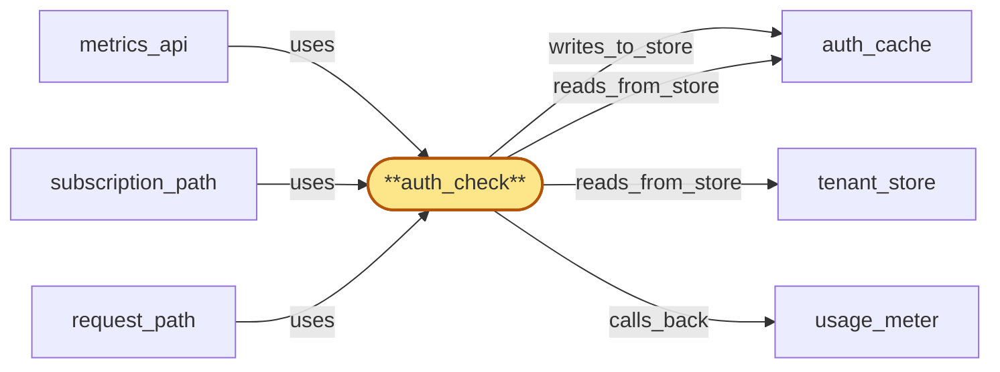

# auth_check

> Build the gateway auth_check sidecar:

## Properties

| Field | Value |
| --- | --- |
| Task | `auth_check` |
| Scope | `gateway` |
| Node | `auth_check` |
| Node type | `Sidecar` |
| Dependencies | `2` |
| Wave | `5` |

## Architecture

## Implementation summary

- Build the gateway auth_check sidecar: in-process synchronous authentication and rate-limit/throttle gate invoked by every Subrole.
- Splits hot path (auth_cache lookup, residency check, throttle-flag check, in-memory HLC-bucketed rate-limit increment) from cold path (asynchronous tenant_store hydration on cache miss).
- Hot path never blocks
- cold path queues and either rejects with cache-miss or accepts on documented optimistic path. Honours revocation tombstones immediately on TTL refresh
- emits rejected-request usage signal.

## Node definition (`auth_check` — Sidecar)

- In-process authentication and rate-limit/throttle gate invoked synchronously by every Subrole on every incoming request or subscription.
- Splits the hot path (synchronous auth_cache lookup, residency check, throttle-flag check, in-memory HLC-bucketed rate-limit counter increment) from the cold path (asynchronous tenant_store hydration on cache miss).
- Hot path is non-blocking and never reaches tenant_store
- cold path queues hydration in the background and either rejects with a documented 'cache-miss' decision or, for high-confidence keys, accepts on a documented optimistic path with eventual reconciliation — Subroles never make this decision themselves.
- Exposes a bulk-hydrate batch path that the listener invokes during reconnect-storm-prewarm to fan-in tenant_store fetches into one request.
- Honours revocation tombstones from auth_cache immediately on TTL refresh.
- Exposes a re-check API used by request_path and subscription_path to re-evaluate the per-tenant throttle-flag version on long-running paths cheaply.
- Reads HLC bucket from the listener's process-local accessor (not region_coordinator).
- Emits a 'rejected-request' usage signal to usage_meter on every rejection (with reason: rate-limit, throttle, residency, revoked, malformed-auth) so per-tenant cost attribution covers rejection load and key-anomaly detection sees the rejection signal.
- Surfaces a degraded-mode metric whenever serving auth from existing auth_cache entries because tenant_store is unreachable

## Requirements

### `r1` — R-gw-auth-cache

**Summary:** auth_check resolves API keys via auth_cache and only consults tenant_store on cache miss

- Origin: `initial`
- Targets: `auth_check`
- Matched via: `auth_check`
- Verifications:
  - Test auth_check/cache.rs asserts hot-path decisions return only from auth_cache; never reach tenant_store synchronously.

### `r2` — R-gw-degradation

**Summary:** On tenant_store unreachability, auth_check serves auth from existing auth_cache entries and surfaces a degraded-mode metric

- Origin: `initial`
- Targets: `auth_check`
- Matched via: `auth_check`
- Verifications:
  - Test auth_check/degradation.rs asserts when tenant_store unreachable on cold-path miss, gateway operates in documented degraded mode with cache-served auth and surfaces the degradation in metrics.

### `r3` — R-gw-key-rotation

**Summary:** auth_check honours revocation tombstones from auth_cache immediately on TTL refresh, supporting hot replacement and multiple active keys per tenant

- Origin: `initial`
- Targets: `auth_check`
- Matched via: `auth_check`
- Verifications:
  - Test auth_check/key_rotation.rs asserts revocation tombstones honored on next TTL refresh; multiple active keys per tenant supported.

### `r4` — R-gw-plan-ceilings

**Summary:** auth_check rejects requests when the throttle flag for a tenant is set in auth_cache (propagated by region_coordinator) so plan-ceiling decisions are honoured fast-path in every region

- Origin: `initial`
- Targets: `auth_check`
- Matched via: `auth_check`
- Verifications:
  - Test auth_check/plan_ceilings.rs asserts plan-version-aware ceilings enforced on every accept.

### `r5` — R-gw-bounded-clock-skew

**Summary:** auth_check and the Subroles use the hybrid logical clock from region_coordinator for time-bucketed enforcement; observed inter-region skew above the threshold puts the local gateway into a documented degraded mode that surfaces in metrics

- Origin: `initial`
- Targets: `listener`, `auth_check`
- Matched via: `auth_check`
- Verifications:
  - Test auth_check/bounded_clock_skew.rs asserts HLC bucket read from listener's process-local accessor; auth_check never queries region_coordinator directly.

### `r6` — R-gw-residency-policy

**Summary:** auth_check enforces the tenant's residency policy on every request; metrics_api scopes metrics_store reads to the tenant's residency-allowed regions

- Origin: `initial`
- Targets: `auth_check`, `metrics_api`
- Matched via: `auth_check`
- Verifications:
  - Test auth_check/residency_policy.rs asserts residency check honours the active policy_version pinned by listener; requests outside residency-allowed regions rejected.

### `r7` — R-gw-auth-bulk-hydrate

**Summary:** auth_check exposes a bulk-hydrate batch path so listener can pre-warm auth_cache for the API keys observed in a handshake batch, bounding tenant_store fan-out under reconnect storms

- Origin: `stressor:1:S-reconnect-storm-local`
- Targets: `auth_check`
- Matched via: `auth_check`
- Verifications:
  - Test auth_check/bulk_hydrate.rs asserts bulk-hydrate path fans many tenant_store fetches into a single request under reconnect-storm.

### `r8` — R-gw-auth-hot-cold-split

**Summary:** auth_check separates the synchronous hot path (auth_cache lookup, in-memory checks) from the asynchronous cold path (tenant_store hydration), so a slow tenant_store fallback on one key cannot stall hot-path auth for warm keys across Subroles

- Origin: `stressor:1:S-auth-check-bottleneck`
- Targets: `auth_check`
- Matched via: `auth_check`
- Verifications:
  - Test auth_check/hot_cold_split.rs asserts hot-path is non-blocking and never reaches tenant_store; cold-path queues hydration and either rejects or accepts on documented optimistic path.

### `r9` — R-gw-rejection-accounting

**Summary:** auth_check emits a usage signal to usage_meter on every rejection, tagged with the reason (rate-limit, throttle, residency, revoked, malformed-auth), so per-tenant cost attribution covers rejected-traffic load and key-anomaly detection sees the rejection signal

- Origin: `stressor:1:S-auth-cost-blindspot`
- Targets: `auth_check`
- Matched via: `auth_check`
- Verifications:
  - Test auth_check/rejection_accounting.rs asserts every rejection emits a rejected-request signal to usage_meter with reason (rate-limit, throttle, residency, revoked, malformed-auth).

## Outputs

| Path | Purpose |
| --- | --- |
| `crates/gateway/src/auth_check.rs` | AuthCheck sidecar |
| `crates/gateway/src/auth_check_cold_path.rs` | Cold-path hydration worker |

## Stack details

- Rust module 'crates/gateway/src/auth_check.rs' implementing AuthCheck::evaluate(api_key, tenant_id, hlc) -> Decision::{Accept, Reject(reason), CacheMiss}
- Hot path uses redis-rs against auth_cache; cold path posts hydration job to a tokio mpsc channel processed by the cold-path worker that writes back to auth_cache
- Bulk-hydrate API used by listener during reconnect-storm to fan-in tenant_store fetches into one request; re-check API for streaming/long-running paths to re-evaluate throttle-flag version cheaply

## Acceptance criteria

### R-gw-auth-cache

- Test auth_check/cache.rs asserts hot-path decisions return only from auth_cache; never reach tenant_store synchronously.

### R-gw-degradation

- Test auth_check/degradation.rs asserts when tenant_store unreachable on cold-path miss, gateway operates in documented degraded mode with cache-served auth and surfaces the degradation in metrics.

### R-gw-key-rotation

- Test auth_check/key_rotation.rs asserts revocation tombstones honored on next TTL refresh; multiple active keys per tenant supported.

### R-gw-plan-ceilings

- Test auth_check/plan_ceilings.rs asserts plan-version-aware ceilings enforced on every accept.

### R-gw-bounded-clock-skew

- Test auth_check/bounded_clock_skew.rs asserts HLC bucket read from listener's process-local accessor; auth_check never queries region_coordinator directly.

### R-gw-residency-policy

- Test auth_check/residency_policy.rs asserts residency check honours the active policy_version pinned by listener; requests outside residency-allowed regions rejected.

### R-gw-auth-bulk-hydrate

- Test auth_check/bulk_hydrate.rs asserts bulk-hydrate path fans many tenant_store fetches into a single request under reconnect-storm.

### R-gw-auth-hot-cold-split

- Test auth_check/hot_cold_split.rs asserts hot-path is non-blocking and never reaches tenant_store; cold-path queues hydration and either rejects or accepts on documented optimistic path.

### R-gw-rejection-accounting

- Test auth_check/rejection_accounting.rs asserts every rejection emits a rejected-request signal to usage_meter with reason (rate-limit, throttle, residency, revoked, malformed-auth).

## Related tasks (graph neighbours)

- [auth_cache](../auth_cache.md)
- [metrics_api](metrics_api.md)
- [request_path](request_path.md)
- [subscription_path](subscription_path.md)
- [tenant_store_integration](../tenant_store/README.md)
- [usage_meter](../usage_meter.md)

---

_Source of truth: `archi plan task show auth_check`. Regenerate with `python3 tasks/_generate.py`._
