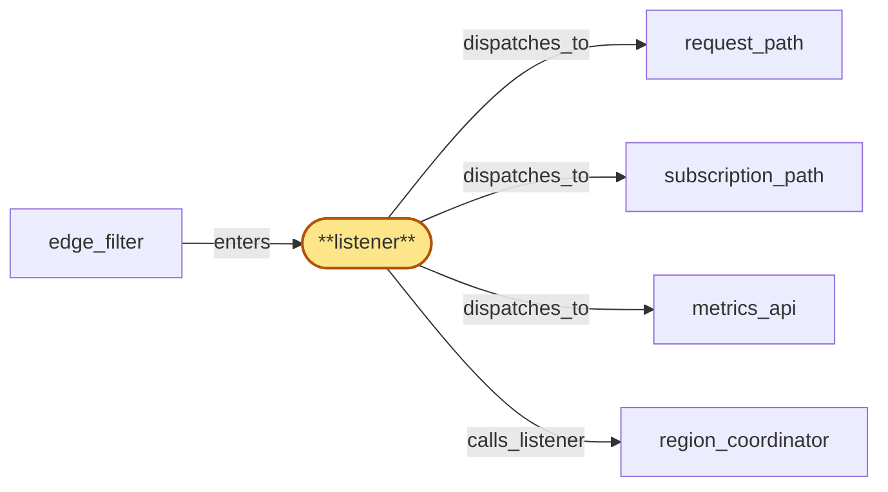

# listener

> Build the gateway listener:

## Properties

| Field | Value |
| --- | --- |
| Task | `listener` |
| Scope | `gateway` |
| Node | `listener` |
| Node type | `Listener` |
| Dependencies | `2` |
| Wave | `6` |

## Architecture

## Implementation summary

- Build the gateway listener: outer HTTP/WS connection acceptor and in-process control plane that terminates HTTP and WS framing for traffic forwarded by edge, parses the minimal envelope (route, protocol/schema version handshake, API key header, chain_router-supplied per-method cost class), and dispatches each connection or request to the appropriate Subrole.
- Owns the in-process HLC accessor, region-wide concurrent-handshake admission budget, jittered-backoff hints, last-known protocol-version cache for warm-start, and the Subrole-liveness aggregator that drives gateway_health_surface.

## Node definition (`listener` — Listener)

- Outer HTTP/WS connection acceptor and in-process control plane: terminates HTTP and websocket framing for traffic forwarded by edge, parses minimal envelope (route, protocol/schema version handshake, API key header, chain_router-supplied per-method cost class for RPCs), and dispatches each connection or request to the appropriate Subrole.
- Owns the in-process hybrid logical clock — refreshes from region_coordinator on a documented cadence and on skew-threshold transitions, and exposes a single HLC snapshot to every Subrole and Sidecar via a process-local accessor (Subroles never call region_coordinator for HLC directly).
- Persists last-known protocol-version, residency hints, and HLC seed to a local read cache
- on startup serves traffic from last-known-good values when region_coordinator is unreachable and surfaces the degraded state in metrics.
- Applies a region-wide concurrent-handshake admission budget and emits jittered-backoff hints to clients past the threshold.
- Aggregates per-Subrole liveness (in particular fanout-suspended from subscription_path) into a region-level health surface that edge_filter consumes for residency-aware traffic shifting.
- Holds no per-tenant state

## Requirements

### `r1` — R-gw-protocol-version

**Summary:** listener advertises the gateway's protocol/schema version on every response and websocket subscription handshake, sourced from region_coordinator

- Origin: `initial`
- Targets: `listener`
- Matched via: `listener`
- Verifications:
  - Test listener/protocol_version.rs asserts handshake negotiates a single mutually-supported protocol_version; mismatched clients get a documented error.

### `r2` — R-gw-bounded-clock-skew

**Summary:** auth_check and the Subroles use the hybrid logical clock from region_coordinator for time-bucketed enforcement; observed inter-region skew above the threshold puts the local gateway into a documented degraded mode that surfaces in metrics

- Origin: `initial`
- Targets: `listener`, `auth_check`
- Matched via: `listener`
- Verifications:
  - Test listener/bounded_clock_skew.rs asserts on observed inter-region skew above threshold, listener transitions region into degraded mode and surfaces the metric.

### `r3` — R-gw-listener-admission

**Summary:** listener applies a documented region-wide concurrent-handshake admission budget and emits jittered-backoff hints to clients above the threshold so reconnect storms cannot exceed the gateway's hot-path capacity

- Origin: `stressor:1:S-reconnect-storm-local`
- Targets: `listener`
- Matched via: `listener`
- Verifications:
  - Test listener/admission_budget.rs asserts region-wide concurrent-handshake budget enforced; overflow yields jittered-backoff hints.

### `r4` — R-gw-region-health-signal

**Summary:** listener exposes per-Subrole liveness (in particular fanout-suspended) to the edge-level health surface so edge_filter and anycast can shift subscription traffic away from a region whose fanout is degraded

- Origin: `stressor:1:S-fanout-outage`
- Targets: `listener`
- Matched via: `listener`
- Verifications:
  - Test listener/region_health_signal.rs asserts per-Subrole liveness aggregated into the region-level health signal published to gateway_health_surface.

### `r5` — R-gw-listener-warm-start

**Summary:** listener persists last-known protocol-version, residency hints, and HLC seed across restarts and starts serving traffic from last-known-good values when region_coordinator is unreachable, refreshing in the background and surfacing the state in metrics

- Origin: `stressor:1:S-listener-cold-start`
- Targets: `listener`
- Matched via: `listener`
- Verifications:
  - Test listener/warm_start.rs asserts on startup with region_coordinator unreachable, listener serves traffic from last-known-good values and surfaces the degraded state.

### `r6` — R-gw-hlc-single-source

**Summary:** listener is the single in-process source of the hybrid logical clock for every Subrole and Sidecar; Subroles read HLC via a process-local accessor and never fetch HLC from region_coordinator directly, so all Subroles share the same HLC snapshot for any given request

- Origin: `stressor:1:S-hlc-subrole-skew`
- Targets: `listener`
- Matched via: `listener`
- Verifications:
  - Test listener/hlc_single_source.rs asserts only the listener pulls HLC from region_coordinator; Subroles read only the process-local accessor.

### `r7` — R-gw-edge-protection

**Summary:** listener accepts inbound traffic only from edge_filter; no public network path exists directly to listener

- Origin: `initial`
- Targets: `edge_filter->listener:enters`
- Matched via: `edge_filter->listener:enters`
- Verifications:
  - Test listener/edge_protection.rs asserts every inbound request must arrive via edge_filter (enters edge); requests without a valid edge-attestation are rejected.

## Outputs

| Path | Purpose |
| --- | --- |
| `crates/gateway/src/listener.rs` | Listener implementation |
| `crates/gateway/src/hlc_accessor.rs` | Process-local HLC accessor |

## Stack details

- Rust module 'crates/gateway/src/listener.rs' built on axum + tokio-tungstenite; minimal envelope parser for route/protocol/api-key/cost-class
- Process-local HLC accessor pulls from region_coordinator's hlc_service on a documented cadence; Subroles read this accessor only (never region_coordinator directly)
- Admission budget: region-wide concurrent-handshake counter with jittered-backoff response on overflow; warm-start cache persisted to disk for last-known protocol_version + residency hint

## Acceptance criteria

### R-gw-protocol-version

- Test listener/protocol_version.rs asserts handshake negotiates a single mutually-supported protocol_version; mismatched clients get a documented error.

### R-gw-bounded-clock-skew

- Test listener/bounded_clock_skew.rs asserts on observed inter-region skew above threshold, listener transitions region into degraded mode and surfaces the metric.

### R-gw-listener-admission

- Test listener/admission_budget.rs asserts region-wide concurrent-handshake budget enforced; overflow yields jittered-backoff hints.

### R-gw-region-health-signal

- Test listener/region_health_signal.rs asserts per-Subrole liveness aggregated into the region-level health signal published to gateway_health_surface.

### R-gw-listener-warm-start

- Test listener/warm_start.rs asserts on startup with region_coordinator unreachable, listener serves traffic from last-known-good values and surfaces the degraded state.

### R-gw-hlc-single-source

- Test listener/hlc_single_source.rs asserts only the listener pulls HLC from region_coordinator; Subroles read only the process-local accessor.

### R-gw-edge-protection

- Test listener/edge_protection.rs asserts every inbound request must arrive via edge_filter (enters edge); requests without a valid edge-attestation are rejected.

## Related tasks (graph neighbours)

- [metrics_api](metrics_api.md)
- [region_coordinator_integration](../region_coordinator/README.md)
- [request_path](request_path.md)
- [subscription_path](subscription_path.md)

---

_Source of truth: `archi plan task show listener`. Regenerate with `python3 tasks/_generate.py`._
