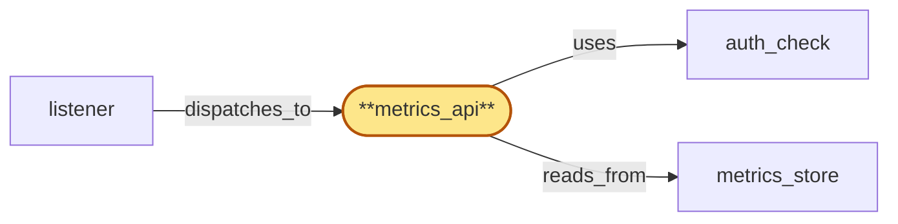

# metrics_api

> Build the gateway metrics_api Subrole:

## Properties

| Field | Value |
| --- | --- |
| Task | `metrics_api` |
| Scope | `gateway` |
| Node | `metrics_api` |
| Node type | `Subrole` |
| Dependencies | `3` |
| Wave | `7` |

## Architecture

## Implementation summary

- Build the gateway metrics_api Subrole: tenant metrics read API — receives HTTP request, runs auth_check, queries metrics_store scoped to authenticated tenant within residency-allowed regions
- per-tenant query-cost budget separate from RPC
- routes heavy queries to metrics_store read replicas/async jobs.

## Node definition (`metrics_api` — Subrole)

- Handles tenant metrics read API: receives a dispatched HTTP request for tenant usage/error/latency/rate-limit-headroom metrics, runs auth_check, and queries metrics_store scoped to the authenticated tenant (and only within tenant's residency-allowed regions).
- Enforces a per-tenant query-cost budget for metrics-API requests (window size, cardinality, and per-second cap) separate from the RPC rate limit
- over-budget requests are rejected with explicit chunking guidance.
- Routes heavy queries to a documented metrics_store read path (read replicas or async result jobs) so they don't contend with usage_meter writes.
- Reads HLC bucket from the listener's process-local accessor.
- Read-only
- never writes counters or state

## Requirements

### `r1` — R-gw-multitenant

**Summary:** Every dispatched RPC, websocket, or metrics request is authenticated to a tenant via API key before it reaches a Subrole's business logic

- Origin: `initial`
- Targets: `request_path`, `subscription_path`, `metrics_api`
- Matched via: `metrics_api`
- Verifications:
  - Test metrics_api/multitenant.rs asserts every request tenant-tagged via auth_check.

### `r2` — R-gw-tenant-metrics

**Summary:** metrics_api authenticates the tenant and reads only that tenant's metrics from metrics_store, returning per-key usage, error, latency, and rate-limit-headroom data

- Origin: `initial`
- Targets: `metrics_api`
- Matched via: `metrics_api`
- Verifications:
  - Test metrics_api/tenant_metrics.rs asserts queries are scoped to the authenticated tenant and within residency-allowed regions.

### `r3` — R-gw-residency-policy

**Summary:** auth_check enforces the tenant's residency policy on every request; metrics_api scopes metrics_store reads to the tenant's residency-allowed regions

- Origin: `initial`
- Targets: `auth_check`, `metrics_api`
- Matched via: `metrics_api`
- Verifications:
  - Test metrics_api/residency_policy.rs asserts queries cross-region only when residency policy permits.

### `r4` — R-gw-metrics-query-budget

**Summary:** metrics_api enforces a per-tenant query-cost budget for metrics-API requests (window size, cardinality, and per-second cap) separate from the RPC rate limit; over-budget requests are rejected with explicit chunking guidance

- Origin: `stressor:1:S-metrics-scan-abuse`
- Targets: `metrics_api`
- Matched via: `metrics_api`
- Verifications:
  - Test metrics_api/query_budget.rs asserts per-tenant query-cost budget separate from RPC rate limit; over-budget chunked or rejected with documented guidance.

### `r5` — R-gw-metrics-isolation

**Summary:** metrics_api routes heavy queries to a documented metrics_store read path (read replicas or async result jobs) that does not contend with usage_meter writes

- Origin: `stressor:1:S-metrics-scan-abuse`
- Targets: `metrics_api`
- Matched via: `metrics_api`
- Verifications:
  - Test metrics_api/isolation.rs asserts heavy queries route to read replicas / async result jobs so they don't contend with usage_meter writes.

## Outputs

| Path | Purpose |
| --- | --- |
| `crates/gateway/src/metrics_api.rs` | Metrics API handler |

## Stack details

- Rust module 'crates/gateway/src/metrics_api.rs' (axum handler) with read-replica routing and per-tenant query-cost budget

## Acceptance criteria

### R-gw-multitenant

- Test metrics_api/multitenant.rs asserts every request tenant-tagged via auth_check.

### R-gw-tenant-metrics

- Test metrics_api/tenant_metrics.rs asserts queries are scoped to the authenticated tenant and within residency-allowed regions.

### R-gw-residency-policy

- Test metrics_api/residency_policy.rs asserts queries cross-region only when residency policy permits.

### R-gw-metrics-query-budget

- Test metrics_api/query_budget.rs asserts per-tenant query-cost budget separate from RPC rate limit; over-budget chunked or rejected with documented guidance.

### R-gw-metrics-isolation

- Test metrics_api/isolation.rs asserts heavy queries route to read replicas / async result jobs so they don't contend with usage_meter writes.

## Related tasks (graph neighbours)

- [auth_check](auth_check.md)
- [listener](listener.md)
- [metrics_store](../metrics_store.md)

---

_Source of truth: `archi plan task show metrics_api`. Regenerate with `python3 tasks/_generate.py`._
