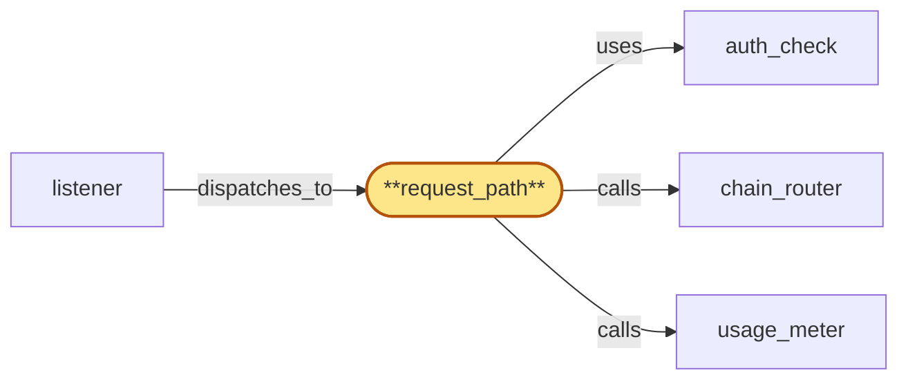

# request_path

> Build the gateway request_path Subrole:

## Properties

| Field | Value |
| --- | --- |
| Task | `request_path` |
| Scope | `gateway` |
| Node | `request_path` |
| Node type | `Subrole` |
| Dependencies | `4` |
| Wave | `7` |

## Architecture

## Implementation summary

- Build the gateway request_path Subrole: handles JSON-RPC RPC envelopes — runs auth_check, forwards verbatim to chain_router (passthrough), maintains partitioned in-flight slot pools by cost class, re-evaluates throttle-flag version on streaming chunks, attaches finality metadata, emits per-request and per-chunk usage signals to usage_meter.

## Node definition (`request_path` — Subrole)

- Handles JSON-RPC request handling: receives a dispatched RPC envelope (with chain_router-supplied per-method cost class hint from the listener), runs auth_check, and forwards the chain-native RPC payload verbatim to chain_router (passthrough — no schema rewrite).
- Maintains a partitioned in-flight slot pool keyed by cost class (short-RPC and long-RPC pools) so long-tail historical queries cannot starve short ones
- over-budget long-tail traffic surfaces a 'try chunking' error rather than blocking.
- For streaming or chunked RPC responses, re-evaluates the tenant's throttle-flag version (from auth_cache via the auth_check re-check path) before yielding further chunks
- stops yielding when the flag becomes set.
- Attaches finality metadata returned by chain_router to the response payload.
- Emits per-request and per-chunk usage signals to usage_meter.
- Reads HLC bucket from the listener's process-local accessor (not region_coordinator).
- Stateless beyond the in-flight slot bookkeeping

## Requirements

### `r1` — R-gw-multitenant

**Summary:** Every dispatched RPC, websocket, or metrics request is authenticated to a tenant via API key before it reaches a Subrole's business logic

- Origin: `initial`
- Targets: `request_path`, `subscription_path`, `metrics_api`
- Matched via: `request_path`
- Verifications:
  - Test request_path/multitenant.rs asserts every RPC is tenant-tagged via auth_check before forwarding.

### `r2` — R-gw-ratelimit

**Summary:** Per-API-key request-rate and quota enforcement happens inside the gateway process before the request is forwarded to chain_router or fanout

- Origin: `initial`
- Targets: `request_path`, `subscription_path`
- Matched via: `request_path`
- Verifications:
  - Test request_path/ratelimit.rs asserts per-key rate-limit enforced before reaching chain_router.

### `r3` — R-gw-passthrough

**Summary:** request_path forwards each chain's JSON-RPC method calls verbatim to chain_router with no cross-chain schema rewrite

- Origin: `initial`
- Targets: `request_path`
- Matched via: `request_path`
- Verifications:
  - Test request_path/passthrough.rs asserts JSON-RPC payload forwarded verbatim — no schema rewrite.

### `r4` — R-gw-cost-accounting

**Summary:** request_path and subscription_path emit per-request and per-event cost-driver signals (request count, response bytes, websocket egress) to usage_meter so per-tenant cost can be attributed in near-real-time

- Origin: `initial`
- Targets: `request_path`, `subscription_path`
- Matched via: `request_path`
- Verifications:
  - Test request_path/cost_accounting.rs asserts per-request and per-chunk usage signals delivered to usage_meter.

### `r5` — R-gw-historical

**Summary:** request_path forwards historical-state JSON-RPC requests verbatim to chain_router; archive vs pruned tier selection happens in chain_router

- Origin: `initial`
- Targets: `request_path`
- Matched via: `request_path`
- Verifications:
  - Test request_path/historical.rs asserts archive-class queries route via chain_router to archive replicas.

### `r6` — R-gw-finality-status

**Summary:** request_path attaches finality metadata returned by chain_router to the response payload; subscription_path forwards finality tags emitted by fanout

- Origin: `initial`
- Targets: `request_path`, `subscription_path`
- Matched via: `request_path`
- Verifications:
  - Test request_path/finality_status.rs asserts finality metadata returned by chain_router is attached to the response payload.

### `r7` — R-gw-throttle-recheck

**Summary:** Long-running paths (active websocket subscriptions, streaming or chunked RPC responses) re-evaluate the per-tenant throttle flag in auth_cache on a documented interval; subscription_path tears subscriptions down with an explicit control event when the flag becomes set, request_path stops yielding further chunks

- Origin: `stressor:1:S-throttle-flag-race`
- Targets: `request_path`, `subscription_path`
- Matched via: `request_path`
- Verifications:
  - Test request_path/throttle_recheck.rs asserts streaming responses re-evaluate throttle-flag and stop on flag set.

### `r8` — R-gw-rpc-pool-partition

**Summary:** request_path partitions its in-flight slot pool by chain_router-supplied per-method cost class so long-tail RPC traffic cannot starve short-RPC traffic; over-budget long-tail requests surface a documented 'chunk this query' error rather than blocking

- Origin: `stressor:1:S-rpc-long-tail`
- Targets: `request_path`
- Matched via: `request_path`
- Verifications:
  - Test request_path/rpc_pool_partition.rs asserts in-flight slot pools partitioned by cost class; long-tail traffic doesn't starve short.

## Outputs

| Path | Purpose |
| --- | --- |
| `crates/gateway/src/request_path.rs` | Request-path handler |

## Stack details

- Rust module 'crates/gateway/src/request_path.rs' (axum handler chain) with cost-class-keyed in-flight slot pool (short-rpc / long-rpc) — long-tail historical queries cannot starve short ones
- Streaming/chunked RPC re-evaluates throttle-flag version via auth_check.recheck before yielding next chunk; stops yielding when flag set

## Acceptance criteria

### R-gw-multitenant

- Test request_path/multitenant.rs asserts every RPC is tenant-tagged via auth_check before forwarding.

### R-gw-ratelimit

- Test request_path/ratelimit.rs asserts per-key rate-limit enforced before reaching chain_router.

### R-gw-passthrough

- Test request_path/passthrough.rs asserts JSON-RPC payload forwarded verbatim — no schema rewrite.

### R-gw-cost-accounting

- Test request_path/cost_accounting.rs asserts per-request and per-chunk usage signals delivered to usage_meter.

### R-gw-historical

- Test request_path/historical.rs asserts archive-class queries route via chain_router to archive replicas.

### R-gw-finality-status

- Test request_path/finality_status.rs asserts finality metadata returned by chain_router is attached to the response payload.

### R-gw-throttle-recheck

- Test request_path/throttle_recheck.rs asserts streaming responses re-evaluate throttle-flag and stop on flag set.

### R-gw-rpc-pool-partition

- Test request_path/rpc_pool_partition.rs asserts in-flight slot pools partitioned by cost class; long-tail traffic doesn't starve short.

## Related tasks (graph neighbours)

- [auth_check](auth_check.md)
- [chain_router_integration](../chain_router/README.md)
- [listener](listener.md)
- [usage_meter](../usage_meter.md)

---

_Source of truth: `archi plan task show request_path`. Regenerate with `python3 tasks/_generate.py`._
