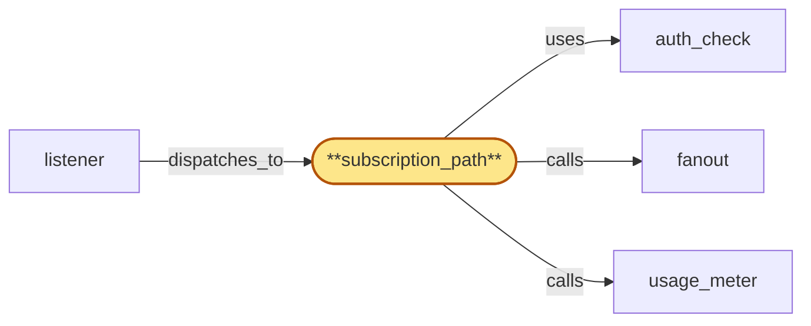

# subscription_path

> Build the gateway subscription_path Subrole:

## Properties

| Field | Value |
| --- | --- |
| Task | `subscription_path` |
| Scope | `gateway` |
| Node | `subscription_path` |
| Node type | `Subrole` |
| Dependencies | `4` |
| Wave | `7` |

## Architecture

## Implementation summary

- Build the gateway subscription_path Subrole: handles WebSocket subscription lifecycle — runs auth_check, registers with fanout (coalescing concurrent subscribes into per-chain batches under reconnect-storm), forwards events with rollback notifications + finality tags + pending-tx state-machine transitions, enforces bounded per-subscription egress queue with overflow policy, operates fanout-liveness watchdog, re-evaluates throttle-flag periodically and tears down on flag set.

## Node definition (`subscription_path` — Subrole)

- Handles WebSocket subscription lifecycle: receives a dispatched WS upgrade with subscription parameters (chain, kind, address filters, confirmation threshold, optional resume cursor), runs auth_check, and registers the subscription with fanout — coalescing concurrent subscribes into per-chain batches under reconnect-storm load to bound fanout's subscribe-RPC fan-out.
- Forwards every event fanout returns to the client connection
- forwards rollback notifications, finality tags, and pending-tx state-machine transitions verbatim.
- Enforces a bounded per-subscription egress queue with a documented overflow policy: on overflow, emits a 'slow-consumer' control event to the client and reports the consumer rate back to fanout so its ring-buffer cursor stays bounded
- persistent overflow may force-unsubscribe the slow client with a documented reason.
- Operates a fanout-liveness watchdog: on extended fanout unreachability or sustained subscribe failure, emits a 'stream-suspended' control event carrying the last-known cursor and reconnect guidance, and surfaces the suspended state to the listener health surface.
- Re-evaluates the tenant's throttle-flag version on a documented interval
- tears down the subscription with an explicit control event when the flag becomes set.
- Reads HLC bucket from the listener's process-local accessor.
- No per-subscription registry state lives here — fanout owns the registry, ring buffer, cursor positions, and address index

## Requirements

### `r1` — R-gw-multitenant

**Summary:** Every dispatched RPC, websocket, or metrics request is authenticated to a tenant via API key before it reaches a Subrole's business logic

- Origin: `initial`
- Targets: `request_path`, `subscription_path`, `metrics_api`
- Matched via: `subscription_path`
- Verifications:
  - Test subscription_path/multitenant.rs asserts every WS upgrade is tenant-tagged via auth_check before fanout subscribe.

### `r2` — R-gw-ratelimit

**Summary:** Per-API-key request-rate and quota enforcement happens inside the gateway process before the request is forwarded to chain_router or fanout

- Origin: `initial`
- Targets: `request_path`, `subscription_path`
- Matched via: `subscription_path`
- Verifications:
  - Test subscription_path/ratelimit.rs asserts per-key rate limits applied to subscription registration.

### `r3` — R-gw-realtime-newheads

**Summary:** subscription_path accepts WebSocket subscriptions for new block headers and forwards the stream from fanout

- Origin: `initial`
- Targets: `subscription_path`
- Matched via: `subscription_path`
- Verifications:
  - Test subscription_path/realtime_newheads.rs asserts newHeads subscription delivers every block header observed by chain pool.

### `r4` — R-gw-realtime-mempool

**Summary:** subscription_path accepts WebSocket subscriptions for pending/unconfirmed transactions (incl. Cardano Ogmios local-tx-monitor) and forwards the stream from fanout

- Origin: `initial`
- Targets: `subscription_path`
- Matched via: `subscription_path`
- Verifications:
  - Test subscription_path/realtime_mempool.rs asserts pending-tx subscription delivers pending txs (eth/btc/ada) verbatim.

### `r5` — R-gw-realtime-address

**Summary:** subscription_path accepts WebSocket subscriptions for watched-address activity and forwards the matched stream from fanout

- Origin: `initial`
- Targets: `subscription_path`
- Matched via: `subscription_path`
- Verifications:
  - Test subscription_path/realtime_address.rs asserts watched-address subscription emits events on tx send/receive for the watched address.

### `r6` — R-gw-reorg-safe

**Summary:** subscription_path forwards explicit rollback notifications and finality status emitted by fanout to the subscriber connection

- Origin: `initial`
- Targets: `subscription_path`
- Matched via: `subscription_path`
- Verifications:
  - Test subscription_path/reorg_safe.rs asserts rollback notifications are forwarded explicitly with divergence point identified.

### `r7` — R-gw-confirmation-threshold

**Summary:** subscription_path accepts a per-stream confirmation threshold parameter on subscribe and passes it to fanout

- Origin: `initial`
- Targets: `subscription_path`
- Matched via: `subscription_path`
- Verifications:
  - Test subscription_path/confirmation_threshold.rs asserts per-stream confirmation-threshold parameter honored; events below threshold not delivered as confirmed.

### `r8` — R-gw-fanout-decoupled

**Summary:** subscription_path holds no per-subscription registry state; fanout owns the registry, ring buffer, and cursor positions

- Origin: `initial`
- Targets: `subscription_path`
- Matched via: `subscription_path`
- Verifications:
  - Test subscription_path/fanout_decoupled.rs asserts subscription state lives in fanout, not gateway; new subscribers don't degrade RPC latency.

### `r9` — R-gw-cost-accounting

**Summary:** request_path and subscription_path emit per-request and per-event cost-driver signals (request count, response bytes, websocket egress) to usage_meter so per-tenant cost can be attributed in near-real-time

- Origin: `initial`
- Targets: `request_path`, `subscription_path`
- Matched via: `subscription_path`
- Verifications:
  - Test subscription_path/cost_accounting.rs asserts per-subscription usage signals reach usage_meter.

### `r10` — R-gw-subscription-cursor

**Summary:** subscription_path accepts an optional resume cursor parameter on subscribe and passes it to fanout for ring-buffer replay

- Origin: `initial`
- Targets: `subscription_path`
- Matched via: `subscription_path`
- Verifications:
  - Test subscription_path/subscription_cursor.rs asserts resume cursor is honored on reconnect; missed events between cursor and now are replayed.

### `r11` — R-gw-finality-status

**Summary:** request_path attaches finality metadata returned by chain_router to the response payload; subscription_path forwards finality tags emitted by fanout

- Origin: `initial`
- Targets: `request_path`, `subscription_path`
- Matched via: `subscription_path`
- Verifications:
  - Test subscription_path/finality_status.rs asserts each event carries finality status from chain pool.

### `r12` — R-gw-sub-backpressure

**Summary:** subscription_path enforces a bounded per-subscription egress queue with a documented overflow policy (gap-marker, slow-consumer signal, or forced unsubscribe); fanout receives consumer-rate feedback from subscription_path so the ring buffer advance and per-subscription cursor stays bounded

- Origin: `stressor:1:S-sub-slow-consumer`
- Targets: `subscription_path`
- Matched via: `subscription_path`
- Verifications:
  - Test subscription_path/sub_backpressure.rs asserts bounded egress queue with documented overflow: slow-consumer event emitted, consumer rate reported back to fanout.

### `r13` — R-gw-fanout-subscribe-batch

**Summary:** subscription_path coalesces fanout subscribe calls into per-chain batches under reconnect-storm load so fanout's subscribe RPC is not saturated by individual registrations

- Origin: `stressor:1:S-reconnect-storm-local`
- Targets: `subscription_path`
- Matched via: `subscription_path`
- Verifications:
  - Test subscription_path/fanout_subscribe_batch.rs asserts concurrent subscribes coalesce into per-chain batches under reconnect-storm.

### `r14` — R-gw-fanout-liveness

**Summary:** subscription_path detects fanout unreachability or sustained subscribe failure within a documented bound and surfaces it to clients via an explicit stream-suspended control event carrying the last-known cursor and reconnect guidance

- Origin: `stressor:1:S-fanout-outage`
- Targets: `subscription_path`
- Matched via: `subscription_path`
- Verifications:
  - Test subscription_path/fanout_liveness.rs asserts fanout-liveness watchdog emits stream-suspended on extended unreachability.

### `r15` — R-gw-throttle-recheck

**Summary:** Long-running paths (active websocket subscriptions, streaming or chunked RPC responses) re-evaluate the per-tenant throttle flag in auth_cache on a documented interval; subscription_path tears subscriptions down with an explicit control event when the flag becomes set, request_path stops yielding further chunks

- Origin: `stressor:1:S-throttle-flag-race`
- Targets: `request_path`, `subscription_path`
- Matched via: `subscription_path`
- Verifications:
  - Test subscription_path/throttle_recheck.rs asserts subscription-level throttle-flag re-evaluation; tearing down on flag set.

## Outputs

| Path | Purpose |
| --- | --- |
| `crates/gateway/src/subscription_path.rs` | Subscription-path handler |

## Stack details

- Rust module 'crates/gateway/src/subscription_path.rs' (tokio-tungstenite) with per-subscription egress queue (bounded, with slow-consumer overflow event); reconnect-storm coalescing uses a per-chain debounce buffer
- Fanout-liveness watchdog: on extended fanout unreachability, emits stream-suspended control event with last-known cursor + reconnect guidance; surfaces fanout-suspended in listener health

## Acceptance criteria

### R-gw-multitenant

- Test subscription_path/multitenant.rs asserts every WS upgrade is tenant-tagged via auth_check before fanout subscribe.

### R-gw-ratelimit

- Test subscription_path/ratelimit.rs asserts per-key rate limits applied to subscription registration.

### R-gw-realtime-newheads

- Test subscription_path/realtime_newheads.rs asserts newHeads subscription delivers every block header observed by chain pool.

### R-gw-realtime-mempool

- Test subscription_path/realtime_mempool.rs asserts pending-tx subscription delivers pending txs (eth/btc/ada) verbatim.

### R-gw-realtime-address

- Test subscription_path/realtime_address.rs asserts watched-address subscription emits events on tx send/receive for the watched address.

### R-gw-reorg-safe

- Test subscription_path/reorg_safe.rs asserts rollback notifications are forwarded explicitly with divergence point identified.

### R-gw-confirmation-threshold

- Test subscription_path/confirmation_threshold.rs asserts per-stream confirmation-threshold parameter honored; events below threshold not delivered as confirmed.

### R-gw-fanout-decoupled

- Test subscription_path/fanout_decoupled.rs asserts subscription state lives in fanout, not gateway; new subscribers don't degrade RPC latency.

### R-gw-cost-accounting

- Test subscription_path/cost_accounting.rs asserts per-subscription usage signals reach usage_meter.

### R-gw-subscription-cursor

- Test subscription_path/subscription_cursor.rs asserts resume cursor is honored on reconnect; missed events between cursor and now are replayed.

### R-gw-finality-status

- Test subscription_path/finality_status.rs asserts each event carries finality status from chain pool.

### R-gw-sub-backpressure

- Test subscription_path/sub_backpressure.rs asserts bounded egress queue with documented overflow: slow-consumer event emitted, consumer rate reported back to fanout.

### R-gw-fanout-subscribe-batch

- Test subscription_path/fanout_subscribe_batch.rs asserts concurrent subscribes coalesce into per-chain batches under reconnect-storm.

### R-gw-fanout-liveness

- Test subscription_path/fanout_liveness.rs asserts fanout-liveness watchdog emits stream-suspended on extended unreachability.

### R-gw-throttle-recheck

- Test subscription_path/throttle_recheck.rs asserts subscription-level throttle-flag re-evaluation; tearing down on flag set.

## Related tasks (graph neighbours)

- [auth_check](auth_check.md)
- [fanout](../fanout.md)
- [listener](listener.md)
- [usage_meter](../usage_meter.md)

---

_Source of truth: `archi plan task show subscription_path`. Regenerate with `python3 tasks/_generate.py`._
