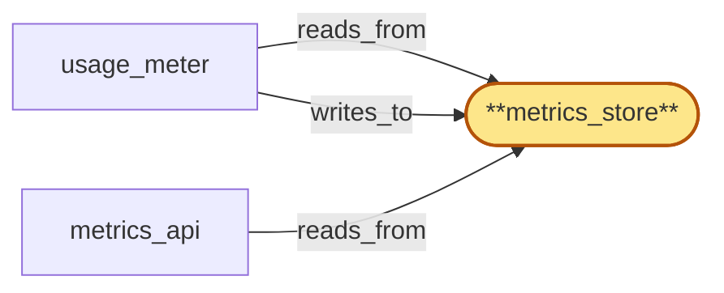

# metrics_store

> Build the residency-sharded per-tenant time-series store retaining ≥30 days of usage/error/latency/rate-limit-headroom metrics; per-region Postgres + TimescaleDB; explicit retention policy enforced as automated rotation.

## Properties

| Field | Value |
| --- | --- |
| Task | `metrics_store` |
| Scope | `/` |
| Node | `metrics_store` |
| Node type | `Store` |
| Dependencies | `0` |
| Wave | `1` |

## Architecture

## Implementation summary

- Build the residency-sharded per-tenant time-series store retaining ≥30 days of usage/error/latency/rate-limit-headroom metrics
- per-region Postgres + TimescaleDB
- explicit retention policy enforced as automated rotation.

## Node definition (`metrics_store` — Store)

- Per-region operational metrics store: residency-sharded (per-residency-tag partition with no cross-tag joins), holding service-level health, latency, error-rate, throughput, residency-policy-violation counters, and rejected-request signals tagged with rejection reason.
- Subscribes to region_coordinator's residency_publisher push-and-acknowledge channel for the residency policy_version it pins on incoming writes, ack-readying within the documented activation window or falling to deny-by-default for the affected tenant.
- ON COLD-START requests pre-warm hydration from residency_publisher delivering the currently-active policy_version's full state synchronously, ack-readies the active version inline as part of registration, and only after ack-readying begins ingesting residency-tagged writes
- pre-warm honors monotonic-per-(instance_id, version)
- on pre-warm-stalled falls to deny-by-default for residency-pinned operations and reports the state.
- Advances pinned policy_version only on observing strictly newer activation from residency_publisher's push-and-acknowledge channel
- out-of-band signals are not a valid activation source. metrics_store is purely operational
- the immutable compliance audit trail role lives in compliance_audit (a separate first-class Store). metrics_store does NOT host audit-of-credentialed-actions records — those are written directly by their originators (region_coordinator, chain_router, gateway, fanout, address_index, usage_meter, tenant_store) to compliance_audit on its append-only hash-chained substrate, isolated from metrics_store's operational write plane.
- Cert-bearing surface for the writes from usage_meter and other operational reporters is enumerated in cert-inventory

## Requirements

### `r1` — R-retention-policy

**Summary:** Every data class held in the system has an explicit retention policy with a documented minimum (regulatory floor) and maximum (privacy ceiling). Retention is enforced as automated rotation, not manual cleanup, and is inspectable per tenant.

- Origin: `stressor:3:s3-lawful-access`
- Targets: `metrics_store`
- Matched via: `metrics_store`
- Verifications:
  - Integration test in crates/metrics_store/tests/retention.rs: insert sentinel rows with timestamps spanning 200 days, run the retention job, assert chunks <30d remain, chunks >90d are gone, and the deletion was performed by the automated job (not manual SQL).

### `r2` — R-compliance-audit-trail

**Summary:** All compliance operations (extract, hold-create, hold-release, erasure-request, erasure-attestation) are logged in an immutable, append-only audit trail that is itself residency-scoped and itself retention-managed. Operator identity is captured per operation.

- Origin: `stressor:3:s3-lawful-access`
- Targets: `metrics_store`
- Matched via: `metrics_store`
- Verifications:
  - Integration test asserting metrics_store hosts a per-tenant compliance-operations audit table that is append-only (Postgres revoke UPDATE/DELETE), records operator identity per row, is residency-scoped via region_id column, and has the same retention policy applied.

## Outputs

| Path | Purpose |
| --- | --- |
| `crates/metrics_store/migrations/` | Postgres + TimescaleDB migrations including hypertable creation and retention policy |
| `crates/metrics_store/` | Rust crate with write/read API and retention-policy assertion helpers |

## Stack details

- Postgres + TimescaleDB extension; schema 'metrics' with hypertables tenant_usage_per_minute, tenant_errors_per_minute, tenant_latency_buckets, rate_limit_headroom
- Retention policy: TimescaleDB drop_chunks scheduled job removing chunks older than 30d (regulatory floor) and capped at 90d (privacy ceiling); enforced as an automated background job, not manual cleanup
- Rust crate 'crates/metrics_store' (sqlx) exposing time-bucketed write API and read replica queries; residency-sharded by region partition

## Acceptance criteria

### R-retention-policy

- Integration test in crates/metrics_store/tests/retention.rs: insert sentinel rows with timestamps spanning 200 days, run the retention job, assert chunks <30d remain, chunks >90d are gone, and the deletion was performed by the automated job (not manual SQL).

### R-compliance-audit-trail

- Integration test asserting metrics_store hosts a per-tenant compliance-operations audit table that is append-only (Postgres revoke UPDATE/DELETE), records operator identity per row, is residency-scoped via region_id column, and has the same retention policy applied.

## Related tasks (graph neighbours)

- [usage_meter](usage_meter.md)

---

_Source of truth: `archi plan task show metrics_store`. Regenerate with `python3 tasks/_generate.py`._
