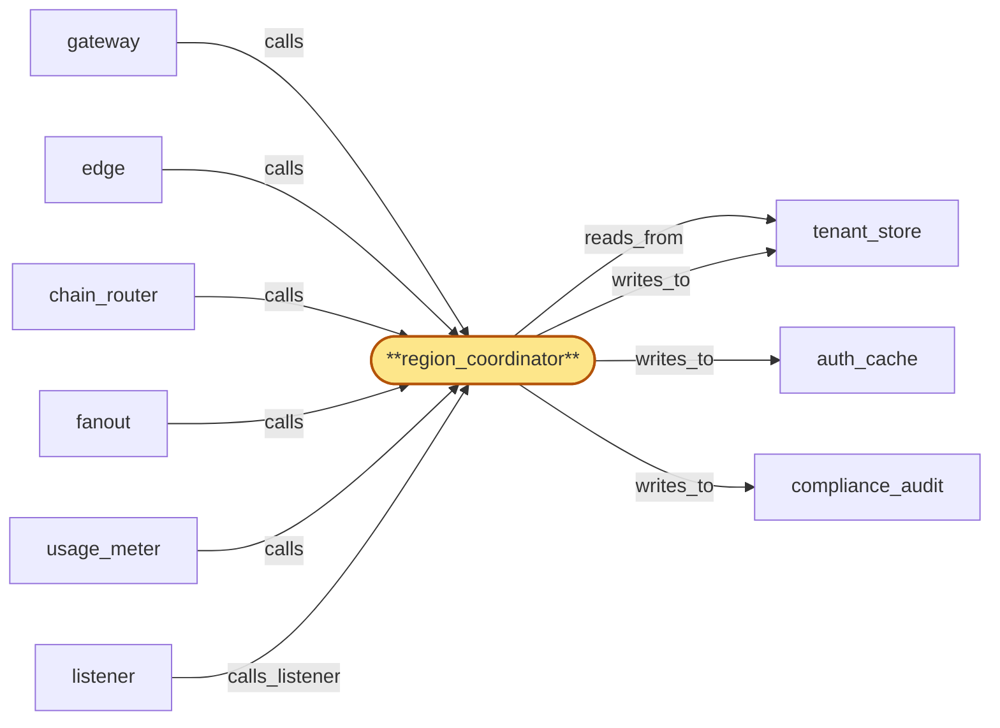
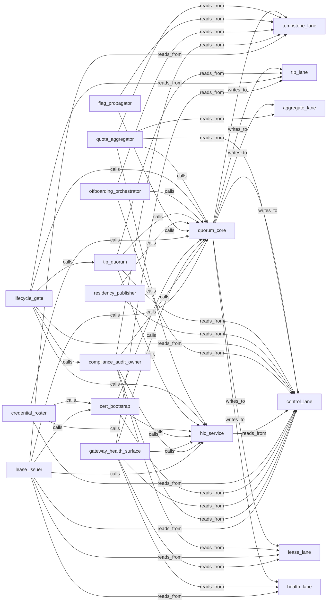

# region_coordinator_integration

> Integrate the 19 region_coordinator child tasks into a single deployable per-region service:

## Properties

| Field | Value |
| --- | --- |
| Task | `region_coordinator_integration` |
| Scope | `/` |
| Node | `region_coordinator` |
| Node type | `Service` |
| Dependencies | `21` |
| Wave | `5` |

## Architecture

## Implementation summary

- Integrate the 19 region_coordinator child tasks into a single deployable per-region service: openraft cluster (one replica per region) running quorum_core + 6 lanes + 13 subservices
- mTLS inter-region channel
- OOB cert bootstrap
- Helm chart deploying the StatefulSet with cloud-KMS integration.

## Node definition (`region_coordinator` — Service)

- Global control plane shared across regions: (1) tip_quorum — receives authenticated head observations from chain_router (per (chain, fork)) and computes the canonical tip per (chain, fork) via quorum across regions
- observations carry the authenticated submitting chain_router replica identity so adversarial sources can be quarantined
- (2) flag_propagator — propagates per-tenant and per-cluster suspension / throttle / revocation / erasure-tombstone / plan-change-tombstone flags via a unified fast-path that auth_cache and other consumers consume ahead of fine-grained counter replication
- (3) residency_publisher — publishes residency policy (with monotonic policy_version) on a push-and-acknowledge channel: every consumer (edge, gateway, usage_meter, metrics_store) must acknowledge readiness within a documented activation window before residency_publisher activates a tightening change.
- ACTIVATION IS A 2PC AT ROOT: PREPARE phase requires a quarantine-and-relocate-complete ack from tenant_store before the M-of-regions quorum-witnessed activation CAS proceeds
- COMMIT phase activates V+1 region-wide. ABORT is itself an M-of-regions quorum-witnessed CAS event with monotonic abort_id per (V+1) attempt
- tenant_store's relocate-and-rollback is idempotent on (tenant_key, V+1, attempt_id)
- each abort writes a typed entry to compliance_audit.
- PRE-WARM HYDRATION: on cold-start (process restart, scale-out, region failover) every consumer requests a pre-warm hydration that delivers the currently-active policy_version's full state synchronously and ack-readies the active version inline as part of registration
- pre-warm is rate-limited per-region to bound publisher load under correlated cold-start events
- pre-warm honors monotonic-per-(consumer instance_id, version)
- on pre-warm-stalled the consumer falls to deny-by-default and reports the state.
- Activation is governed by an M-of-regions quorum-witnessed CAS: a region that did not witness the activation enters 'residency-fenced' degraded mode
- ack-tracking is monotonic per (consumer, policy_version)
- consumers leave deny-by-default only by ack-readying to a strictly newer policy_version. (4) hybrid_clock — issues hybrid-logical-clock readings
- observed inter-region clock skew above a threshold transitions affected regions into a documented degraded mode
- the degraded-mode skew_bound is the substrate for clock-skew-bounded fences (lease TTL, audit-key destruction, drain-fence ack windows).
- (5) lifecycle_gate — coordinates rotations with region-staggered gating across all cert-bearing surfaces and is the SINGLE SCHEDULER-OF-RECORD for cross-component lifecycle operations.
- Sole originator of HLC+nonce-stamped offboarding signals signed under lifecycle-gate authority.
- ORIGINATES drain-fence broadcasts for tenant erasure: every operational write plane that ever writes audit entries for a tenant (region_coordinator, chain_router, gateway, fanout, address_index, usage_meter) consumes a drain-fence message for tenant T, flushes in-flight audit writes for T to compliance_audit, and acks drain-of-in-flight-audit-writes-for-T to tenant_store within an HLC-bounded window.
- Bulk-offboarding is admitted into bounded-size waves with documented max-tenants-per-wave and inter-wave spacing
- writers consume drain-fences from per-writer bounded queues with explicit back-pressure to lifecycle_gate
- the per-tenant HLC-bounded ack window starts from the per-tenant ack-broadcast-emit-HLC, not from the bulk action's HLC.
- TEARDOWN OVERLAP: when both a per-tenant drain-fence and a per-node teardown target the same node, lifecycle_gate sequences drain-fence-flush BEFORE node-teardown and refuses to admit a node-teardown that has not first acked all in-flight per-tenant drain-fences
- nodes that cannot flush within their teardown window write a durable 'drain-ack-handoff' record naming a successor instance or persistent buffer and ack-by-handoff to tenant_store.
- SELF-CONTAINED CREDENTIAL BUNDLES: lifecycle_gate-signed broadcasts (drain-fence and offboarding) carry the signing roster_version as part of the broadcast itself
- consumers verify against the broadcast's named roster_version, not their currently-cached roster_version
- the broadcast remains verifiable for the duration of its HLC-bounded ack window after a scheduled roster rotation, but a compromise-revocation with a 'retroactive-as-of-HLC' field at or before the broadcast-emit-HLC requires lifecycle_gate to re-sign-and-rebroadcast within bounded-batching with a fresh broadcast-emit-HLC and per-tenant ack window.
- (6) credential_roster — publishes the operator-credential roster with a monotonic roster_version and HLC-stamped publication timestamp through push-and-acknowledge.
- ROTATION IS A 2PC: rotation-prepare broadcasts to every override-admission consumer and collects ack
- rotation-activate is M-of-regions quorum-witnessed
- consumers advance their effective roster_version only on observing activation
- an override proposal commits only if every consumer it touches has effective roster_version >= the proposal's signing roster_version at commit-HLC
- in-flight proposals at activation are cancel-by-roster-version atomically. Compromise-revocation events carry a 'retroactive-as-of-HLC' field (usually equal to revocation HLC
- may be set earlier when forensics establish compromise predates discovery)
- retroactive compromise-revocation is M-of-N-authorized at the elevated-issuance threshold and writes a typed entry to compliance_audit identifying the affected broadcasts.
- Every roster mutation is M-of-N-authorized under the operator-credential model with elevated threshold for issuance
- bootstrap (cold-start, post-full-revocation re-bootstrap) is rooted in the OOB trust anchor
- every roster mutation writes a typed entry to compliance_audit.
- ALSO EXPOSES AN ON-DEMAND NAMED-ROSTER LOOKUP ENDPOINT over the cert-bearing inter-region surface: callers (chain_router, fanout, gateway, usage_meter, address_index) request a specific named roster_version (typically named in a lifecycle_gate broadcast) and receive the signed roster bundle for verification when the broadcast's named roster_version is strictly newer than the caller's local cache.
- The lookup endpoint has a documented serving-plane availability target distinct from the rotation push-and-acknowledge channel, enforces per-caller and per-region rate limits, and supports bulk-wave-coalesced fetch: concurrent requests for the same roster_version under a bulk-offboarding wave are coalesced into a single roster-bundle fetch per wave/region with results fanned out to all coalesced waiters under an HLC-bounded budget tighter than the per-tenant drain-fence ack window.
- Lookup responses are signed under lifecycle-gate authority so callers verify the roster bundle without trusting the channel alone
- lookup is read-only and never bypasses the 2PC rotation flow.
- Defines and enforces the parent-scope operator-credential authorization model (M-of-N signatures from distinct registered operator credentials drawn from the published credential roster, scheduled rotation, compromise-revocation that immediately removes the credential and invalidates in-flight override proposals bearing it, per-operator audit) backing every operator-override admitted anywhere in the system.
- (7) cert_bootstrap — out-of-band emergency cert-recovery surface rooted in an out-of-band trust anchor (M-of-N quorum of hardware-rooted material distributed across geographically and organizationally distinct custodians
- documented anchor-rotation procedure and availability test cadence) distinct from the inter-region channel cert chain
- requires human authorization under M-of-N with elevated threshold for cert re-rooting
- every recovery, every anchor use, and every anchor rotation is audit-logged to compliance_audit.
- (8) gateway_health_surface — publishes per-region gateway-health (per-Subrole liveness, fanout-suspended vs rpc-healthy, AND fork-transition-pending per (chain, fork)) to edge for routing decisions
- carries a monotonic freshness signal so a stuck-good or stuck-bad surface is detectable as stale
- classifications affecting routing are independently cross-witnessed via the multi-region observation pattern before edge acts on them.
- (9) compliance_audit_owner — owns the compliance_audit schema and the audit entry-type catalogue
- only authority that can publish a new entry-type version.
- AUDIT MATERIAL IS TWO-TIER: TIER 1 (per-tenant audit-encryption key, shredded on tenant erasure) holds the full audit entry payload including tenant-identifying fields
- TIER 2 (organizational long-lived key under the OOB-anchor key hierarchy, NOT shredded) holds a structural witness — event type, event HLC, originating component, and a hash commitment to the Tier-1 payload — with NO tenant-identifying material
- the certificate-of-deletion vouches for Tier-2 witnesses so post-shred regulators can inspect structure-and-presence and verify the hash chain. The crypto-shred mechanism (Tier 1) is named at root
- per-tenant audit-encryption-key lifecycle is a tenant_store zoom concern. (10) lease_issuer — issues per-tenant single-writer lease tokens with HLC-bounded TTL through an M-of-regions quorum-witnessed activation pattern
- supports issuance, renewal, revocation
- OOB-anchor-rooted emergency lease re-bootstrap when all issuer regions are simultaneously unavailable
- documented issuer-plane availability target distinct from the inter-region channel
- lease-handoff requires a handoff-recorded ack from tenant_store before lease_v_new is acked to a successor writer, with the HLC-stamped handoff event written to tenant_store as a typed handoff-fence record
- lease issuance, renewal, revocation, TTL bound, and handoff-fence-ack are parent-scope contracts.
- AUDIT-KEY DESTRUCTION FENCE: lifecycle_gate's audit-key DESTROYED event for tenant T is issued at HLC t_destroy >= max(observed_ack_hlc, fence_HLC + skew_bound) + write-delivery-grace
- the drain-fence broadcast carries fence-HLC f_T and writer acks must be at writer-local HLC >= f_T + skew_bound. Cert-bearing inter-region surface enumerated in cert-inventory

## Requirements

### `r1` — R-cert-rotation-staggered

**Summary:** Region-staggered rotation: region_coordinator gates rotation roll-out across regions so that no two regions can transition the same surface inside the same maintenance window. Simultaneous expiry across regions is prevented by construction, not by deployment discipline.

- Origin: `stressor:3:s3-tls-expiry`
- Targets: `region_coordinator`
- Matched via: `region_coordinator`
- Verifications:
  - Test rc_int/cert_rotation_staggered.rs asserts cert rotations are region-staggered; quorum maintained throughout.

### `r2` — R-rotation-coordinator-gate

**Summary:** region_coordinator gates pool-rotation events globally: at most one pool, one region, one rotation wave at a time, and the canonical-tip quorum size is held above its safe threshold throughout. Rotations are scheduled, not ad-hoc.

- Origin: `stressor:3:s3-replica-rotation-storm`
- Targets: `region_coordinator`
- Matched via: `region_coordinator`
- Verifications:
  - Test rc_int/rotation_coordinator_gate.rs asserts every rotation is admitted by lifecycle_gate; no peer rotation paths.

### `r3` — R-stale-pool-quorum-exclusion

**Summary:** region_coordinator's canonical-tip quorum excludes votes from any chain pool currently in tip-stale state, so a stalled regional pool cannot anchor the global canonical-tip view.

- Origin: `stressor:3:s3-pool-sync-stall`
- Targets: `region_coordinator`
- Matched via: `region_coordinator`
- Verifications:
  - Test rc_int/stale_pool_quorum_exclusion.rs asserts stale pools are excluded from tip_quorum aggregation.

### `r4` — R-origin-rotation

**Summary:** Origin endpoints (the IP/hostname pairs gateway accepts on) rotate on a documented cadence under region_coordinator's gating, neutralizing leaked-origin windows; rotation is region-staggered like cert rotation so no two regions rotate simultaneously.

- Origin: `stressor:3:s3-edge-bypass`
- Targets: `region_coordinator`
- Matched via: `region_coordinator`
- Verifications:
  - Test rc_int/origin_rotation.rs asserts origin (issuing CA) rotation completes via 2PC + M-of-regions ack.

### `r5` — R-per-fork-canonical-tip

**Summary:** region_coordinator maintains a separate canonical-tip per (chain, fork) and reports it as such. Tenants explicitly subscribe to or query a (chain, fork) pair; the protocol-version surface advertises which forks are currently supported.

- Origin: `stressor:3:s3-contentious-fork`
- Targets: `region_coordinator`
- Matched via: `region_coordinator`
- Verifications:
  - Test rc_int/per_fork_canonical_tip.rs asserts canonical tip computed per (chain, fork) on tip_lane.

### `r6` — R-offboarding-teardown

**Summary:** Tenant offboarding triggers a documented end-to-end teardown coordinated by region_coordinator: open subscriptions closed with a structured reason, fanout state dropped, address_index watches removed, in-flight long-RPCs cancelled, usage_meter cost record frozen at offboarding time. Each component emits an offboarding attestation collected into the compliance audit trail.

- Origin: `stressor:3:s3-tenant-offboarding-orphan`
- Targets: `region_coordinator`
- Matched via: `region_coordinator`
- Verifications:
  - Test rc_int/offboarding_teardown.rs asserts offboarding drives every component to terminal phase and writes certificate-of-deletion.

### `r7` — bubble-region_coordinator-1

**Summary:** chain_router must tag every head observation submitted to region_coordinator's tip_quorum with its source replica identity, authenticated via the cert-bearing inter-region surface, so per-source rate limiting and adversarial-source quarantine inside region_coordinator can attribute observations to a specific chain_router replica.

- Origin: `freestanding`
- Targets: `region_coordinator`
- Matched via: `region_coordinator`
- Verifications:
  - Test rc_int/bubble_region_coordinator_1.rs asserts bubble-1 resolved invariant.

### `r8` — bubble-region_coordinator-2

**Summary:** auth_cache must support deny-during-propagation pending markers for the unified fast-path: flag_propagator publishes a pending-marker for high-severity flags (cluster-suspended, key-revocation, erasure-tombstone) before the per-region apply lands, and auth_cache must treat the marker as deny-by-default for the affected identity until the per-region apply commits and a flag-applied attestation is written back.

- Origin: `freestanding`
- Targets: `region_coordinator`
- Matched via: `region_coordinator`
- Verifications:
  - Test rc_int/bubble_region_coordinator_2.rs asserts bubble-2 resolved invariant.

### `r9` — bubble-region_coordinator-3

**Summary:** Residency-policy consumers (edge, gateway, usage_meter, metrics_store) must pin the policy_version they enforced on outgoing requests, propagate it downstream so mismatch is detectable, and acknowledge readiness within the push-and-acknowledge window before residency_publisher activates a tightening change; consumers that fail to acknowledge default to deny-by-default for the affected tenant rather than serve under the old version past activation.

- Origin: `freestanding`
- Targets: `region_coordinator`
- Matched via: `region_coordinator`
- Verifications:
  - Test rc_int/bubble_region_coordinator_3.rs asserts bubble-3 resolved invariant.

### `r10` — bubble-region_coordinator-4

**Summary:** Downstream offboarding components (gateway, fanout, address_index, chain_router, usage_meter) must dedupe offboarding signals by idempotency key (offboarding_id, component_id, attempt_id) and meet a documented attestation SLO; on timeout, region_coordinator records a best-effort attestation rather than waiting indefinitely, so component teams must surface their actual attestation latency and any preservation-blocked terminal states.

- Origin: `freestanding`
- Targets: `region_coordinator`
- Matched via: `region_coordinator`
- Verifications:
  - Test rc_int/bubble_region_coordinator_4.rs asserts bubble-4 resolved invariant.

### `r11` — bubble-region_coordinator-5

**Summary:** auth_cache must honor pending-marker HLC expiry bounds and originating-proposal-id: a pending-marker auto-clears at the carried HLC expiry without explicit retraction, and auth_cache rejects pending-markers lacking an originating-proposal-id, so a stalled or rejected proposal cannot indefinitely deny traffic via a stuck pending-marker.

- Origin: `freestanding`
- Targets: `region_coordinator`
- Matched via: `region_coordinator`
- Verifications:
  - Test rc_int/bubble_region_coordinator_5.rs asserts bubble-5 resolved invariant: pending-marker proposal-id construction tuple is collision-free under HLC degradation.

### `r12` — bubble-region_coordinator-6

**Summary:** An out-of-band cert-bootstrap surface must exist at parent scope so that, in the emergency-cert-recovery state where the inter-region channel cert has effectively expired before in-band rotation could commit, an operator can re-establish channel trust without requiring consensus over the channel itself.

- Origin: `freestanding`
- Targets: `region_coordinator`
- Matched via: `region_coordinator`
- Verifications:
  - Test rc_int/bubble_region_coordinator_6.rs asserts bubble-6 resolved invariant: parent-scope operator-credential authorization model with M-of-N + OOB cert recovery.

### `r13` — r-s4-roster-staleness-bound

**Summary:** region_coordinator publishes an operator-credential roster carrying a roster_version and HLC-stamped publication timestamp; every consumer that admits operator-overrides (chain_router, tip_quorum sub-zoom, drain_coordinator sub-zoom, lifecycle_gate sub-zoom) caches the roster locally with a documented HLC-bounded freshness window and falls to deny-by-default for further override admissions when the cached roster is older than the freshness window or when no roster has ever been received; the deny-by-default state is uniform and explicit across all override-admission points.

- Origin: `stressor:4:s4-roster-unavailable`
- Targets: `region_coordinator`
- Matched via: `region_coordinator`
- Verifications:
  - Test rc_int/roster_staleness_bound.rs asserts roster staleness is bounded; consumers refuse to use a roster older than the freshness window.

### `r14` — r-s4-oob-anchor-quorum

**Summary:** The out-of-band trust anchor backing region_coordinator's emergency cert-bootstrap surface is itself an M-of-N quorum of hardware-rooted material distributed across geographically and organizationally distinct custodians; compromise or loss of any single anchor element is recoverable under the remaining quorum via a documented anchor-rotation procedure; the architecture defines an anchor-availability test cadence and an anchor-rotation procedure as parent-scope concerns of region_coordinator.

- Origin: `stressor:4:s4-oob-anchor-compromise`
- Targets: `region_coordinator`
- Matched via: `region_coordinator`
- Verifications:
  - Test rc_int/oob_anchor_quorum.rs asserts OOB anchor signs only with M-of-N hardware-rooted custodians.

### `r15` — r-s4-roster-revocation-propagation

**Summary:** region_coordinator publishes roster updates and credential-revocation events with monotonic roster_version through the same push-and-acknowledge propagation pattern used for residency policy_version: every override-admission consumer (chain_router, tip_quorum sub-zoom, drain_coordinator sub-zoom, lifecycle_gate sub-zoom) must acknowledge readiness within a documented window before a revocation activates, and falls to deny-by-default for further override admissions on missed ack; admission points reject any signature whose roster_version predates the consumer's current roster_version. Per-component cancel-and-rollback semantics for in-flight proposals are zoom-scope concerns of the consuming components.

- Origin: `stressor:4:s4-roster-rotation-race`
- Targets: `region_coordinator`
- Matched via: `region_coordinator`
- Verifications:
  - Test rc_int/roster_revocation_propagation.rs asserts compromise-revocation propagates retroactively-as-of-HLC and invalidates in-flight signatures.

### `r16` — r-s4-policy-version-quorum-fence

**Summary:** region_coordinator activates each residency policy_version only when a documented quorum of regions has acknowledged readiness (extending the existing push-and-acknowledge pattern with a quorum-witnessed activation CAS); a region that did not witness the activation enters a 'residency-fenced' degraded mode in which residency-policy-tightening-sensitive operations deny-by-default while residency-neutral operations continue to be served, until the partition heals and the region either catches up to the activated version or witnesses a subsequent activation.

- Origin: `stressor:4:s4-policy-version-partition-skew`
- Targets: `region_coordinator`
- Matched via: `region_coordinator`
- Verifications:
  - Test rc_int/policy_version_quorum_fence.rs asserts residency policy_version activation requires M-of-regions quorum-witnessed CAS.

### `r17` — r-s4-offboarding-signal-auth

**Summary:** Every offboarding signal consumed by gateway, fanout, address_index, chain_router, usage_meter is authenticated by region_coordinator's lifecycle-gate signing authority and rejected if it lacks a current valid signature; (offboarding_id, component_id, attempt_id) uniqueness is region_coordinator's responsibility with offboarding_id HLC-stamped and nonce-suffixed so attempt_id reuse under restart cannot collide with a different offboarding_id.

- Origin: `stressor:4:s4-offboarding-key-collision`
- Targets: `region_coordinator`
- Matched via: `region_coordinator`
- Verifications:
  - Test rc_int/offboarding_signal_auth.rs asserts every offboarding signal is HLC+nonce-stamped and signed under lifecycle-gate authority.

### `r18` — r-s4-compliance-audit-substrate

**Summary:** A first-class compliance_audit Store exists at root: append-only, hash-chained for tamper-evidence, isolated from operational write planes (not collocated with usage_meter / metrics_store writes), residency-tagged, with documented retention policy. Every credentialed action — operator-override admission (chain_router), OOB-anchor use & cert re-rooting (region_coordinator), offboarding attestation (gateway, fanout, address_index, chain_router, usage_meter), residency policy_version activation (region_coordinator), roster rotation and credential-revocation (region_coordinator), anchor rotation (region_coordinator) — writes a typed audit record to compliance_audit. region_coordinator owns the audit schema.

- Origin: `stressor:4:s4-audit-trail-unmodeled`
- Targets: `region_coordinator`
- Matched via: `region_coordinator`
- Verifications:
  - Test rc_int/compliance_audit_substrate.rs asserts region_coordinator writes to compliance_audit substrate are isolated from operational write planes.

### `r19` — r-s4-policy-ack-monotonic

**Summary:** region_coordinator's residency_publisher ack-tracking is monotonic per (consumer, policy_version): once a consumer has missed the activation window for a policy_version it is treated as deny-by-default for that version regardless of subsequently-arriving acks; the consumer must ack-ready to a strictly newer policy_version to leave the deny-by-default state. Late-arriving acks for an already-activated version do not flip producer-side decisions back. Per-consumer ack pre-warm and debounce protocol is deferred to consumer-zoom scopes (gateway, edge, usage_meter, metrics_store).

- Origin: `stressor:4:s4-policy-ack-thrash`
- Targets: `region_coordinator`
- Matched via: `region_coordinator`
- Verifications:
  - Test rc_int/policy_ack_monotonic.rs asserts policy_version ack monotonicity per (consumer, version).

### `r20` — r-s4-gateway-health-integrity

**Summary:** The per-region gateway-health surface published via region_coordinator and consumed by edge carries a monotonic freshness signal so stale surfaces are detectable; classifications affecting routing are independently cross-witnessed via region_coordinator's existing multi-region observation machinery before edge acts on them. Detailed freshness window, cross-witness construction, and stale-surface fallback policy are region_coordinator zoom concerns (deferred follow-up direction).

- Origin: `stressor:4:s4-health-surface-lying`
- Targets: `region_coordinator`
- Matched via: `region_coordinator`
- Verifications:
  - Test rc_int/gateway_health_integrity.rs asserts gateway_health_surface entries are cross-witnessed before commit.

### `r21` — r-s4-lifecycle-scheduler-of-record

**Summary:** region_coordinator's lifecycle_gate is the single scheduler-of-record for cross-component lifecycle operations against shared targets (cert/origin/pool-rotation, offboarding teardown, residency activation); chain_router's drain_coordinator schedules replica-level drains only inside windows reserved by lifecycle_gate against the same target, never independently. The mutex/lease protocol and per-replica state-machine specifics are deferred to chain_router zoom (drain_coordinator) and region_coordinator zoom (lifecycle_gate) respectively as follow-up directions; the at-root contract is the directionality (drain subscribes to lifecycle_gate, not vice-versa) and single-scheduler-of-record principle.

- Origin: `stressor:4:s4-drain-lifecycle-coordination`
- Targets: `region_coordinator`
- Matched via: `region_coordinator`
- Verifications:
  - Test rc_int/lifecycle_scheduler_of_record.rs asserts lifecycle_gate is the single scheduler of record for cross-component lifecycle.

### `r22` — r-s4-audit-crypto-shred

**Summary:** compliance_audit reconciles append-only/hash-chained immutability with tenant erasure obligations via crypto-shred: tenant-identifying material in audit entries is stored as ciphertext under a per-tenant audit-encryption key; the hash chain covers ciphertext and entry skeleton; tenant erasure destroys the per-tenant audit-encryption key (rendering historical entries unreadable while preserving chain integrity). The crypto-shred contract is named at root (region_coordinator); the per-tenant audit-encryption-key lifecycle (issuance, rotation, destruction-on-erasure) is deferred to tenant_store zoom as a follow-up direction.

- Origin: `stressor:4:s4-audit-vs-erasure`
- Targets: `region_coordinator`
- Matched via: `region_coordinator`
- Verifications:
  - Test rc_int/audit_crypto_shred.rs asserts audit-encryption-key destruction shreds Tier-1; Tier-2 witnesses preserve structural invariants.

### `r23` — r-s4-roster-mutation-authorization

**Summary:** Every operator-credential roster mutation (issue, rotate, revoke) is itself authorized under the same M-of-N operator-credential authorization model, with an elevated threshold for credential issuance (consistent with OOB-anchor cert-rooting elevation); roster bootstrap (cold-start, post-full-revocation re-bootstrap) is rooted in the OOB trust anchor; every roster mutation writes a typed entry to compliance_audit. Specific quorum thresholds and bootstrap ceremony are deferred to region_coordinator zoom as follow-up.

- Origin: `stressor:4:s4-credential-issuance-provenance`
- Targets: `region_coordinator`
- Matched via: `region_coordinator`
- Verifications:
  - Test rc_int/roster_mutation_authorization.rs asserts roster mutations require M-of-N from distinct registered operator credentials drawn from the published roster.

### `r24` — r-s5-lease-issuance-availability

**Summary:** region_coordinator hosts a lease_issuer subsystem that issues per-tenant single-writer lease tokens with HLC-bounded TTL through an M-of-regions quorum-witnessed activation pattern (analogous to residency_publisher), with OOB-anchor-rooted emergency lease re-bootstrap when all issuer regions are simultaneously unavailable. The issuer-plane availability target is documented separately from the inter-region channel itself; lease issuance, renewal, revocation, and TTL bound are parent-scope contracts on region_coordinator.

- Origin: `stressor:5:s5-lease-issuer-unavailable`
- Targets: `region_coordinator`
- Matched via: `region_coordinator`
- Verifications:
  - Test rc_int/lease_issuance_availability.rs asserts lease_issuer's serving-plane availability target is met under sustained load.

### `r25` — r-s5-lease-handoff-fence-ack

**Summary:** lease_issuer (region_coordinator subsystem) requires a handoff-recorded ack from tenant_store before acking lease_v_new to a successor writer: the handoff event is HLC-stamped, written to tenant_store as a typed handoff-fence record, and tenant_store's ack confirms the fence is observable to all subsequent writes for that tenant key. Without this ack, lease_issuer may not issue lease_v_new. The ack itself is a parent-scope contract on region_coordinator's lease_issuer subsystem and is audited to compliance_audit.

- Origin: `stressor:5:s5-lease-handoff-cas-race`
- Targets: `region_coordinator`
- Matched via: `region_coordinator`
- Verifications:
  - Test rc_int/lease_handoff_fence_ack.rs asserts handoff-fence ack at tenant_store is HLC-stamped and quorum-witnessed.

### `r26` — r-s5-drain-fence-protocol

**Summary:** tenant erasure introduces a system-wide drain-fence-broadcast-and-ack protocol: every operational write plane that ever writes audit entries for a tenant (region_coordinator, chain_router, gateway, fanout, address_index, usage_meter) consumes a region_coordinator-broadcast drain-fence message for tenant T, flushes all in-flight audit writes for T to compliance_audit, and acks drain-of-in-flight-audit-writes-for-tenant-T to tenant_store within an HLC-bounded window. tenant_store does not finalize erasure attestation (and region_coordinator does not authorize destruction of T's per-tenant audit-encryption key) until acks are received from every named writer. The drain-fence broadcast itself is signed by lifecycle_gate. The protocol is an at-root cross-component contract; per-component flush implementation is a zoom concern.

- Origin: `stressor:5:s5-drain-fence-teardown-deadlock`
- Targets: `region_coordinator`
- Matched via: `region_coordinator`
- Verifications:
  - Test rc_int/drain_fence_protocol.rs asserts drain-fence-broadcast-and-ack protocol completes within HLC-bounded window for every named writer.

### `r27` — r-s5-drain-fence-teardown-overlap

**Summary:** When a write-plane node is itself in lifecycle teardown at the moment it receives a drain-fence broadcast for tenant T, the node MUST either flush-then-ack-then-teardown (flush in-flight audit writes for T, ack to tenant_store, then proceed with teardown) or, if its remaining teardown window cannot accommodate the flush, write a durable 'drain-ack-handoff' record naming a successor instance or persistent buffer that owns the residual writes and ack-by-handoff to tenant_store. lifecycle_gate sequences the overlap as the single scheduler-of-record: a node-teardown is not admitted while any in-flight per-tenant drain-fence on that node is unacked. No silent drop and no unbounded wait. The handoff record is part of the certificate of deletion.

- Origin: `stressor:5:s5-drain-fence-teardown-deadlock`
- Targets: `region_coordinator`
- Matched via: `region_coordinator`
- Verifications:
  - Test rc_int/drain_fence_teardown_overlap.rs asserts teardown-overlap sequencing (flush-then-ack-then-teardown or durable drain-ack-handoff).

### `r28` — r-s5-drain-fence-bounded-batching

**Summary:** lifecycle_gate admits bulk-offboarding requests into bounded-size drain-fence broadcast waves with documented max-tenants-per-wave and inter-wave spacing such that per-wave ack fan-in stays within region_coordinator's documented ack-throughput target. Writers consume drain-fences from per-writer bounded queues with explicit back-pressure to lifecycle_gate; when a writer's queue is at capacity, lifecycle_gate stalls further wave admission for that writer rather than dropping broadcasts or expiring HLC windows. The per-tenant HLC-bounded ack window starts from the ack-broadcast-emit-HLC for that tenant, not from the bulk operator action's HLC, so per-tenant windows do not collapse under bulk-load arrival smearing. Bulk-offboarding admission is audited to compliance_audit and operator-visible.

- Origin: `stressor:5:s5-drain-fence-broadcast-storm`
- Targets: `region_coordinator`
- Matched via: `region_coordinator`
- Verifications:
  - Test rc_int/drain_fence_bounded_batching.rs asserts bounded-batching + per-writer back-pressure during bulk-offboarding waves.

### `r29` — r-s5-audit-key-destruction-fence

**Summary:** Audit-key destruction for tenant T uses a two-phase clock-skew-bounded fence: (PHASE A) the drain-fence broadcast carries a fence-HLC f_T; every writer must ack drain-of-in-flight-audit-writes-for-T at writer-local HLC >= f_T + skew_bound where skew_bound is region_coordinator's hybrid_clock degraded-mode bound. (PHASE B) lifecycle_gate's audit-key DESTROYED event for T is issued at HLC t_destroy >= max(observed_ack_hlc, f_T + skew_bound) + write-delivery-grace, where write-delivery-grace bounds compliance_audit's inbound-queue residence time. Late writes arriving at compliance_audit after the destroyed event are rejected at admission (the (writer_id, encrypted-at-HLC) tuple must be <= the writer's drain-ack-HLC for T) and surfaced to a protocol-violation log; the cryptographic shred is sharp by construction, never relying on silent-shred semantics for late deliveries.

- Origin: `stressor:5:s5-audit-key-destruction-race`
- Targets: `region_coordinator`
- Matched via: `region_coordinator`
- Verifications:
  - Test rc_int/audit_key_destruction_fence.rs asserts two-phase clock-skew-bounded fence on audit-key destruction; late writes rejected at admission.

### `r30` — r-s5-residency-2pc-prepare-fence

**Summary:** Residency policy_version transition is a 2PC at root: residency_publisher's V+1 activation requires a quarantine-and-relocate-complete ack from tenant_store (the PREPARE phase) before the M-of-regions quorum-witnessed activation CAS proceeds (the COMMIT phase). Without the prepared-ack, residency_publisher MUST NOT activate V+1; without the commit broadcast, tenant_store MUST NOT treat V+1 as live for consumer-observable behavior beyond its own quarantine-and-relocate state.

- Origin: `stressor:5:s5-policy-2pc-stuck-prepared`
- Targets: `region_coordinator`
- Matched via: `region_coordinator`
- Verifications:
  - Test rc_int/residency_2pc_prepare_fence.rs asserts residency 2PC PREPARE depends on tenant_store quarantine-and-relocate-complete ack.

### `r31` — r-s5-roster-rotation-uniform-ordering

**Summary:** credential_roster's rotation is itself a 2PC: rotation-prepare broadcasts to every override-admission consumer (chain_router pool_membership_manager, tip_quorum sub-zoom, drain_coordinator sub-zoom, lifecycle_gate sub-zoom) and collects ack; rotation-activate is M-of-regions quorum-witnessed and consumers advance their effective roster_version only on observing activation. The cross-component invalidation rule: an override proposal commits only if every consumer it touches has effective roster_version >= the proposal's signing roster_version at commit-HLC; in-flight proposals at activation are cancel-by-roster-version atomically with the activation broadcast. Consumers enforce the rule by consulting region_coordinator's currently-active roster_version on every commit, so a laggard consumer cannot admit a proposal that the activated roster has invalidated.

- Origin: `stressor:5:s5-roster-rotation-cross-component-ordering`
- Targets: `region_coordinator`
- Matched via: `region_coordinator`
- Verifications:
  - Test rc_int/roster_rotation_uniform_ordering.rs asserts roster rotation uses 2PC + cross-component uniform invalidation ordering.

### `r32` — r-s5-policy-ack-prewarm

**Summary:** On cold-start (process restart, scale-out, region failover) every residency-policy consumer (edge, gateway, usage_meter, metrics_store) requests a pre-warm hydration from region_coordinator's residency_publisher delivering the currently-active policy_version's full state synchronously; the consumer ack-readies the currently-active version inline as part of registration and only after ack-readying does it begin serving residency-pinned traffic. The pre-warm hydration is rate-limited per-region by residency_publisher to bound load under correlated cold-start events. Pre-warm honors the monotonic-per-(consumer, version) contract — each instance has a distinct instance_id and a distinct ack history. If pre-warm cannot complete within a documented freshness budget the consumer falls to deny-by-default for residency-pinned operations and reports a 'pre-warm-stalled' state to operators.

- Origin: `stressor:5:s5-policy-ack-prewarm-cold-start`
- Targets: `region_coordinator`
- Matched via: `region_coordinator`
- Verifications:
  - Test rc_int/policy_ack_prewarm.rs asserts pre-warm hydration on cold-start delivers active policy_version's full state synchronously.

### `r33` — r-s5-broadcast-self-contained-credential

**Summary:** lifecycle_gate-signed broadcasts (drain-fence broadcasts in particular) carry the signing roster_version as part of the broadcast itself; consumers verify the signature against the broadcast's named roster_version rather than the consumer's currently-cached roster_version. A signed broadcast remains verifiable for the duration of its HLC-bounded ack window even after a scheduled roster rotation activates v_new. Compromise-revocation differs: every compromise-revocation event carries a 'retroactive-as-of-HLC' field (usually equal to the revocation HLC; may be set earlier when forensics establish compromise predates discovery). In-flight broadcasts whose emit-HLC is at or after the retroactive-as-of-HLC become invalid; lifecycle_gate MUST re-sign-and-rebroadcast within bounded-batching with fresh broadcast-emit-HLC and fresh per-tenant ack window. Every retroactive compromise-revocation is M-of-N-authorized at the elevated-issuance threshold and writes a typed entry to compliance_audit identifying the affected broadcasts.

- Origin: `stressor:5:s5-drain-fence-roster-rotation-interleave`
- Targets: `region_coordinator`
- Matched via: `region_coordinator`
- Verifications:
  - Test rc_int/broadcast_self_contained_credential.rs asserts every lifecycle_gate broadcast is a self-contained credential bundle carrying signing roster_version.

## Outputs

| Path | Purpose |
| --- | --- |
| `charts/services/region-coordinator/` | Helm chart |
| `crates/region_coordinator/tests/integration/` | End-to-end tests |

## Stack details

- Helm chart 'charts/services/region-coordinator' deploying the openraft StatefulSet with cert-manager + SPIRE for SVIDs and cloud-KMS for OOB anchor
- End-to-end integration tests in 'crates/region_coordinator/tests/integration/' covering cluster bring-up, partition recovery, lifecycle gate operations, residency 2PC, lease handoff, drain fence broadcast, audit-key destruction

## Acceptance criteria

### R-cert-rotation-staggered

- Test rc_int/cert_rotation_staggered.rs asserts cert rotations are region-staggered; quorum maintained throughout.

### R-rotation-coordinator-gate

- Test rc_int/rotation_coordinator_gate.rs asserts every rotation is admitted by lifecycle_gate; no peer rotation paths.

### R-stale-pool-quorum-exclusion

- Test rc_int/stale_pool_quorum_exclusion.rs asserts stale pools are excluded from tip_quorum aggregation.

### R-origin-rotation

- Test rc_int/origin_rotation.rs asserts origin (issuing CA) rotation completes via 2PC + M-of-regions ack.

### R-per-fork-canonical-tip

- Test rc_int/per_fork_canonical_tip.rs asserts canonical tip computed per (chain, fork) on tip_lane.

### R-offboarding-teardown

- Test rc_int/offboarding_teardown.rs asserts offboarding drives every component to terminal phase and writes certificate-of-deletion.

### bubble-region_coordinator-1

- Test rc_int/bubble_region_coordinator_1.rs asserts bubble-1 resolved invariant.

### bubble-region_coordinator-2

- Test rc_int/bubble_region_coordinator_2.rs asserts bubble-2 resolved invariant.

### bubble-region_coordinator-3

- Test rc_int/bubble_region_coordinator_3.rs asserts bubble-3 resolved invariant.

### bubble-region_coordinator-4

- Test rc_int/bubble_region_coordinator_4.rs asserts bubble-4 resolved invariant.

### bubble-region_coordinator-5

- Test rc_int/bubble_region_coordinator_5.rs asserts bubble-5 resolved invariant: pending-marker proposal-id construction tuple is collision-free under HLC degradation.

### bubble-region_coordinator-6

- Test rc_int/bubble_region_coordinator_6.rs asserts bubble-6 resolved invariant: parent-scope operator-credential authorization model with M-of-N + OOB cert recovery.

### r-s4-roster-staleness-bound

- Test rc_int/roster_staleness_bound.rs asserts roster staleness is bounded; consumers refuse to use a roster older than the freshness window.

### r-s4-oob-anchor-quorum

- Test rc_int/oob_anchor_quorum.rs asserts OOB anchor signs only with M-of-N hardware-rooted custodians.

### r-s4-roster-revocation-propagation

- Test rc_int/roster_revocation_propagation.rs asserts compromise-revocation propagates retroactively-as-of-HLC and invalidates in-flight signatures.

### r-s4-policy-version-quorum-fence

- Test rc_int/policy_version_quorum_fence.rs asserts residency policy_version activation requires M-of-regions quorum-witnessed CAS.

### r-s4-offboarding-signal-auth

- Test rc_int/offboarding_signal_auth.rs asserts every offboarding signal is HLC+nonce-stamped and signed under lifecycle-gate authority.

### r-s4-compliance-audit-substrate

- Test rc_int/compliance_audit_substrate.rs asserts region_coordinator writes to compliance_audit substrate are isolated from operational write planes.

### r-s4-policy-ack-monotonic

- Test rc_int/policy_ack_monotonic.rs asserts policy_version ack monotonicity per (consumer, version).

### r-s4-gateway-health-integrity

- Test rc_int/gateway_health_integrity.rs asserts gateway_health_surface entries are cross-witnessed before commit.

### r-s4-lifecycle-scheduler-of-record

- Test rc_int/lifecycle_scheduler_of_record.rs asserts lifecycle_gate is the single scheduler of record for cross-component lifecycle.

### r-s4-audit-crypto-shred

- Test rc_int/audit_crypto_shred.rs asserts audit-encryption-key destruction shreds Tier-1; Tier-2 witnesses preserve structural invariants.

### r-s4-roster-mutation-authorization

- Test rc_int/roster_mutation_authorization.rs asserts roster mutations require M-of-N from distinct registered operator credentials drawn from the published roster.

### r-s5-lease-issuance-availability

- Test rc_int/lease_issuance_availability.rs asserts lease_issuer's serving-plane availability target is met under sustained load.

### r-s5-lease-handoff-fence-ack

- Test rc_int/lease_handoff_fence_ack.rs asserts handoff-fence ack at tenant_store is HLC-stamped and quorum-witnessed.

### r-s5-drain-fence-protocol

- Test rc_int/drain_fence_protocol.rs asserts drain-fence-broadcast-and-ack protocol completes within HLC-bounded window for every named writer.

### r-s5-drain-fence-teardown-overlap

- Test rc_int/drain_fence_teardown_overlap.rs asserts teardown-overlap sequencing (flush-then-ack-then-teardown or durable drain-ack-handoff).

### r-s5-drain-fence-bounded-batching

- Test rc_int/drain_fence_bounded_batching.rs asserts bounded-batching + per-writer back-pressure during bulk-offboarding waves.

### r-s5-audit-key-destruction-fence

- Test rc_int/audit_key_destruction_fence.rs asserts two-phase clock-skew-bounded fence on audit-key destruction; late writes rejected at admission.

### r-s5-residency-2pc-prepare-fence

- Test rc_int/residency_2pc_prepare_fence.rs asserts residency 2PC PREPARE depends on tenant_store quarantine-and-relocate-complete ack.

### r-s5-roster-rotation-uniform-ordering

- Test rc_int/roster_rotation_uniform_ordering.rs asserts roster rotation uses 2PC + cross-component uniform invalidation ordering.

### r-s5-policy-ack-prewarm

- Test rc_int/policy_ack_prewarm.rs asserts pre-warm hydration on cold-start delivers active policy_version's full state synchronously.

### r-s5-broadcast-self-contained-credential

- Test rc_int/broadcast_self_contained_credential.rs asserts every lifecycle_gate broadcast is a self-contained credential bundle carrying signing roster_version.

## Related tasks (graph neighbours)

- [auth_cache](auth_cache.md)
- [chain_router_integration](chain_router/README.md)
- [compliance_audit_integration](compliance_audit/README.md)
- [edge](edge.md)
- [fanout](fanout.md)
- [gateway_integration](gateway/README.md)
- [tenant_store_integration](tenant_store/README.md)
- [usage_meter](usage_meter.md)

---

_Source of truth: `archi plan task show region_coordinator_integration`. Regenerate with `python3 tasks/_generate.py`._

## Child tasks

| Task | Wave | Deps | Brief |
| --- | --- | --- | --- |
| [aggregate_lane](aggregate_lane.md) | 1 | 0 | Build the aggregate lane: Raft log for cross-region quota aggregations; retention class = recent-window; consumed by quota_aggregator. |
| [cert_bootstrap](cert_bootstrap.md) | 1 | 0 | Build the OOB cert-bootstrap subservice: emergency cert recovery rooted in an out-of-band hardware-anchored quorum (cloud KMS keys held b... |
| [compliance_audit_owner](compliance_audit_owner.md) | 4 | 3 | Build the compliance_audit owner subservice: orchestrates audit-key destruction sequencing; tenant-scoped cutoff HLC; cutoff-after-handof... |
| [control_lane](control_lane.md) | 1 | 0 | Build the control lane: Raft log carrying control-plane messages (cert rotation, residency-policy activation, named-roster mutations) con... |
| [credential_roster](credential_roster.md) | 3 | 2 | Build the operator credential roster subservice: M-of-N-authorized roster mutations via 2PC + cross-region quorum-witnessed CAS; on-deman... |
| [flag_propagator](flag_propagator.md) | 3 | 3 | Build the throttle-flag fast-path propagator: pushes per-tenant throttle flags from quota aggregation into every region's auth_cache ahea... |
| [gateway_health_surface](gateway_health_surface.md) | 3 | 3 | Build the gateway health surface subservice: aggregates per-region per-Subrole liveness (incl. fanout-suspended, fork-transition-pending)... |
| [health_lane](health_lane.md) | 1 | 0 | Build the health lane: Raft log for gateway_health_surface entries cross-witnessed by edge/region peers; degraded-mode entries; region-se... |
| [hlc_service](hlc_service.md) | 2 | 1 | Build the HLC (hybrid logical clock) service: provides bounded-sample HLC ticks to gateway and other consumers; multi-peer consensus; aut... |
| [lease_issuer](lease_issuer.md) | 3 | 3 | Build the per-tenant lease-token issuer: HLC-bounded TTL, M-of-regions quorum-witnessed activation, OOB-anchor-rooted emergency re-bootst... |
| [lease_lane](lease_lane.md) | 1 | 0 | Build the lease lane: Raft log for per-tenant lease issuance, prepared-window markers, lease re-issue substream events; priority lane (pr... |
| [lifecycle_gate](lifecycle_gate.md) | 3 | 3 | Build the lifecycle gate subservice: single scheduler-of-record for cross-component lifecycle (cert rotation, origin rotation, schema rol... |
| [offboarding_orchestrator](offboarding_orchestrator.md) | 3 | 3 | Build the offboarding orchestrator: drives tenant teardown across components with idempotency keys, attestation timeouts, complete-with-e... |
| [quorum_core](quorum_core.md) | 2 | 6 | Build the openraft cluster core: leader election, log replication, snapshot install, partition handling, CAS admission/back-off, HLC-stam... |
| [quota_aggregator](quota_aggregator.md) | 3 | 2 | Build the cross-region quota aggregator: aggregates per-tenant per-region counters into global view; pre-aggregation buffer; shed-by-clas... |
| [residency_publisher](residency_publisher.md) | 3 | 2 | Build the residency-policy publisher: M-of-regions quorum-witnessed CAS activation of policy_version; push-and-acknowledge channel; deny-... |
| [tip_lane](tip_lane.md) | 1 | 0 | Build the tip lane: dedicated Raft log for canonical-tip-quorum entries (per chain, fork) with retention class = recent-window only; cons... |
| [tip_quorum](tip_quorum.md) | 3 | 2 | Build the per-fork canonical-tip quorum: aggregates head observations from chain_router replicas (authenticated, rate-limited per source)... |
| [tombstone_lane](tombstone_lane.md) | 1 | 0 | Build the tombstone lane in the openraft cluster: dedicated Raft log + state machine for revocation/throttle/erasure/preservation tombsto... |

## Internal architecture

