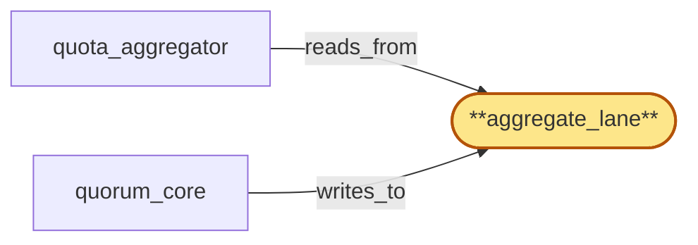

# aggregate_lane

> Build the aggregate lane:

## Properties

| Field | Value |
| --- | --- |
| Task | `aggregate_lane` |
| Scope | `region_coordinator` |
| Node | `aggregate_lane` |
| Node type | `Log` |
| Dependencies | `0` |
| Wave | `1` |

## Architecture

## Implementation summary

- Build the aggregate lane: Raft log for cross-region quota aggregations
- retention class = recent-window
- consumed by quota_aggregator.

## Node definition (`aggregate_lane` — Log)

- Per-(tenant, plan_version, tenant_cluster) rolling global aggregated counters for rate, cost, concurrent subscriptions, and other plan-bounded resources.
- Bursty during metering.
- Compaction folds time-period aggregates into per-period summaries
- raw deltas are not retained. Carries HLC stamps and schema_version tags.

## Requirements

### `r1` — SR1-log-retention-classes

**Summary:** Every log entry kind declares an explicit retention class with documented compaction semantics (latest-only, bounded-history, periodic-summary, full-history-with-snapshot); each lane (tombstone, tip, aggregate, control) implements compaction per the kinds it carries.

- Origin: `stressor:1:s-log-unbounded`
- Targets: `tombstone_lane`, `tip_lane`, `aggregate_lane`, `control_lane`
- Matched via: `aggregate_lane`
- Verifications:
  - Test lanes/aggregate/retention_class.rs asserts recent-window retention.

### `r2` — SR1-write-class-lanes

**Summary:** The committed log is partitioned into write-class lanes — tombstone_lane (latency-critical), tip_lane (high-frequency), aggregate_lane (bursty), control_lane (low-frequency) — each with reserved consensus throughput and head-of-line isolation to its own lane.

- Origin: `stressor:1:s-hot-write-contention`
- Targets: `tombstone_lane`, `tip_lane`, `aggregate_lane`, `control_lane`
- Matched via: `aggregate_lane`
- Verifications:
  - Test lanes/aggregate/write_class.rs asserts admission gate.

### `r3` — SR1-cross-lane-ordering

**Summary:** Cross-lane causal ordering relevant to consumers (e.g. a revocation that must precede an attestation) is resolved via HLC stamps captured at write time so consumers can reconstruct happens-before across lanes.

- Origin: `stressor:1:s-hot-write-contention`
- Targets: `tombstone_lane`, `tip_lane`, `aggregate_lane`, `control_lane`
- Matched via: `aggregate_lane`
- Verifications:
  - Test lanes/aggregate/cross_lane_ordering.rs asserts HLC ordering.

### `r4` — SR1-schema-tagged-entries

**Summary:** Every log entry across all lanes is tagged with the schema_version that produced it; consumers reject entries with schema_version higher than they support.

- Origin: `stressor:1:s-schema-evolution`
- Targets: `tombstone_lane`, `tip_lane`, `aggregate_lane`, `control_lane`
- Matched via: `aggregate_lane`
- Verifications:
  - Test lanes/aggregate/schema_tagged.rs asserts entry versioning.

## Outputs

| Path | Purpose |
| --- | --- |
| `crates/region_coordinator/src/lanes/aggregate.rs` | Lane state machine |

## Stack details

- openraft state machine 'aggregate_lane'; retention class = recent-window; schema-tagged

## Acceptance criteria

### SR1-log-retention-classes

- Test lanes/aggregate/retention_class.rs asserts recent-window retention.

### SR1-write-class-lanes

- Test lanes/aggregate/write_class.rs asserts admission gate.

### SR1-cross-lane-ordering

- Test lanes/aggregate/cross_lane_ordering.rs asserts HLC ordering.

### SR1-schema-tagged-entries

- Test lanes/aggregate/schema_tagged.rs asserts entry versioning.

## Related tasks (graph neighbours)

- [quorum_core](quorum_core.md)
- [quota_aggregator](quota_aggregator.md)

---

_Source of truth: `archi plan task show aggregate_lane`. Regenerate with `python3 tasks/_generate.py`._
