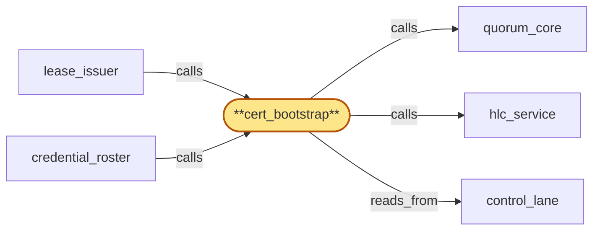

# cert_bootstrap

> Build the OOB cert-bootstrap subservice:

## Properties

| Field | Value |
| --- | --- |
| Task | `cert_bootstrap` |
| Scope | `region_coordinator` |
| Node | `cert_bootstrap` |
| Node type | `Subservice` |
| Dependencies | `0` |
| Wave | `1` |

## Architecture

## Implementation summary

- Build the OOB cert-bootstrap subservice: emergency cert recovery rooted in an out-of-band hardware-anchored quorum (cloud KMS keys held by M-of-N custodians)
- periodic anchor-heartbeat liveness
- anchor rotation/replacement procedure.

## Node definition (`cert_bootstrap` — Subservice)

- Out-of-band cert-bootstrap surface enumerated in cert-inventory: emergency cert recovery for the case where the inter-region channel cert has effectively expired before in-band rotation could commit and consensus over the channel itself is therefore unavailable.
- Rooted in an OOB trust anchor distinct from the inter-region channel cert chain: the anchor is itself an M-of-N quorum of hardware-rooted material (offline keys / hardware-rooted root-of-trust) distributed across geographically and organizationally distinct custodians.
- Continuous per-anchor liveness monitoring (not just test cadence): each anchor custodian publishes a heartbeat-attestation to control_lane on a documented sub-test-cadence interval (per-anchor-element heartbeat)
- cert_bootstrap maintains a per-anchor liveness state in control_lane
- on missing heartbeat for documented intervals, the anchor element is marked anchor-unhealthy and an alarm is raised. M-of-N threshold counts only anchor-healthy elements (anchor-healthy count)
- anchor-healthy count below M raises anchor-quorum-degraded PROACTIVELY before any emergency arises. anchor-availability-test cadence remains as defense-in-depth against heartbeat falsification.
- Compromise or loss of an anchor element is recoverable under the remaining healthy quorum via a documented anchor-rotation procedure: anchor rotation is admitted by lifecycle_gate as a first-class lifecycle event subject to bounded-batching
- replacement anchors join under the still-reachable elevated M-of-N applied against anchor-healthy count.
- Emergency recovery thresholds are explicitly named and cannot be silently weakened: cert re-rooting and roster-bootstrap require elevated-tier-A
- emergency lease re-bootstrap requires elevated-tier-B
- both tiers reference M-of-N applied against anchor-healthy count, never against total anchor count, so degradation is monotonic — an anchor failure cannot accidentally lower the quorum requirement. cert recovery requires human authorization under the same M-of-N operator-credential model with elevated-tier-A threshold consulted via credential_roster's published roster (read from control_lane). credential_roster's cold-start / post-full-revocation re-bootstrap consults this anchor under elevated-tier-A to root the bootstrap roster, since no in-band roster exists at that moment.
- Every recovery operation, anchor rotation, anchor-availability-test result, and missed-heartbeat alarm writes a typed entry to compliance_audit (parent) via compliance_audit_owner.
- The OOB surface is intentionally narrow: admits only (a) cert re-rooting under elevated-tier-A
- (b) roster-bootstrap publishing under elevated-tier-A
- (c) anchor rotation under elevated-tier-A
- (d) emergency lease re-bootstrap under elevated-tier-B (narrowly scoped to lease re-bootstrap)
- nothing else. (Realizes inherited r-s4-oob-anchor-quorum at zoom
- supports r-s5-lease-issuance-availability emergency re-bootstrap
- satisfies bubble-region_coordinator-6 at zoom
- addresses zoom stressor s3-anchor-quorum-silent-failure via continuous heartbeat-attestation and anchor-healthy quorum.)

## Requirements

### `r1` — r-zoom-rc-cert-bootstrap-anchor

**Summary:** cert_bootstrap's OOB trust anchor is M-of-N hardware-rooted material across geographically and organizationally distinct custodians with anchor-rotation procedure committed via quorum_core, anchor-availability-test cadence committed via control_lane; emergency cert recovery, roster-bootstrap, anchor rotation, and emergency lease re-bootstrap require human authorization under M-of-N with elevated threshold for cert re-rooting and roster-bootstrap; every operation writes a typed entry to compliance_audit via compliance_audit_owner.

- Origin: `freestanding`
- Targets: `cert_bootstrap`
- Matched via: `cert_bootstrap`
- Verifications:
  - Test cert_bootstrap/anchor.rs asserts the OOB anchor is hardware-rooted and signs only when M-of-N custodians authorize.

### `r2` — r-zoom-rc-anchor-heartbeat

**Summary:** cert_bootstrap maintains continuous per-anchor-element liveness state in control_lane via custodian-published heartbeat-attestations on a documented sub-test-cadence interval; missing heartbeat for documented intervals marks the anchor element anchor-unhealthy and raises an alarm. M-of-N counts only anchor-healthy elements; anchor-healthy count below M raises anchor-quorum-degraded proactively before any emergency. anchor-availability-tests remain as defense-in-depth against heartbeat falsification.

- Origin: `stressor:3:s3-anchor-quorum-silent-failure`
- Targets: `cert_bootstrap`
- Matched via: `cert_bootstrap`
- Verifications:
  - Test cert_bootstrap/heartbeat.rs asserts periodic anchor-heartbeat liveness check emits an availability metric.

### `r3` — r-zoom-rc-anchor-rotation-replacement

**Summary:** Anchor rotation (replacing a failed anchor element) is admitted by lifecycle_gate as a first-class lifecycle event subject to bounded-batching; replacement anchors join under the still-reachable elevated M-of-N applied against anchor-healthy count. Emergency recovery thresholds (elevated-tier-A for cert re-rooting/roster-bootstrap, elevated-tier-B for emergency lease re-bootstrap) reference M-of-N against anchor-healthy count, never against total anchor count, so degradation is monotonic.

- Origin: `stressor:3:s3-anchor-quorum-silent-failure`
- Targets: `cert_bootstrap`
- Matched via: `cert_bootstrap`
- Verifications:
  - Test cert_bootstrap/rotation_replacement.rs asserts anchor rotation/replacement is supported via documented procedure with elevated threshold.

## Outputs

| Path | Purpose |
| --- | --- |
| `crates/region_coordinator/src/cert_bootstrap.rs` | OOB cert bootstrap orchestrator |

## Stack details

- Rust module 'region_coordinator::cert_bootstrap' integrating with cloud KMS (AWS KMS / GCP Cloud KMS) for hardware-rooted signatures; M-of-N custodian quorum with elevated threshold for cert re-rooting
- Out-of-band channel distinct from inter-region cert chain; every recovery audit-logged

## Acceptance criteria

### r-zoom-rc-cert-bootstrap-anchor

- Test cert_bootstrap/anchor.rs asserts the OOB anchor is hardware-rooted and signs only when M-of-N custodians authorize.

### r-zoom-rc-anchor-heartbeat

- Test cert_bootstrap/heartbeat.rs asserts periodic anchor-heartbeat liveness check emits an availability metric.

### r-zoom-rc-anchor-rotation-replacement

- Test cert_bootstrap/rotation_replacement.rs asserts anchor rotation/replacement is supported via documented procedure with elevated threshold.

## Related tasks (graph neighbours)

- [control_lane](control_lane.md)
- [credential_roster](credential_roster.md)
- [hlc_service](hlc_service.md)
- [lease_issuer](lease_issuer.md)
- [quorum_core](quorum_core.md)

---

_Source of truth: `archi plan task show cert_bootstrap`. Regenerate with `python3 tasks/_generate.py`._
