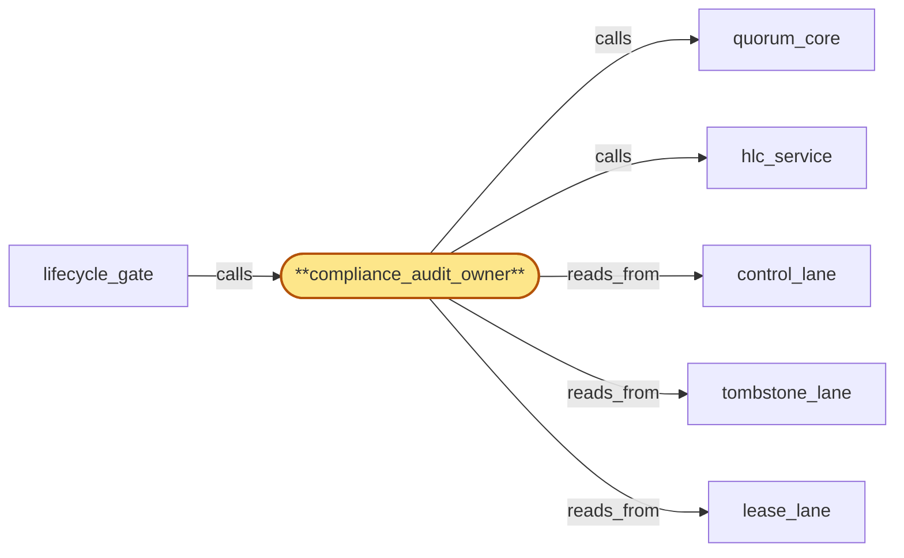

# compliance_audit_owner

> Build the compliance_audit owner subservice:

## Properties

| Field | Value |
| --- | --- |
| Task | `compliance_audit_owner` |
| Scope | `region_coordinator` |
| Node | `compliance_audit_owner` |
| Node type | `Subservice` |
| Dependencies | `3` |
| Wave | `4` |

## Architecture

## Implementation summary

- Build the compliance_audit owner subservice: orchestrates audit-key destruction sequencing
- tenant-scoped cutoff HLC
- cutoff-after-handoff-resolved invariant
- cert audit acceptance
- cross-version audit acceptance.

## Node definition (`compliance_audit_owner` — Subservice)

- Owns the schema and admission contract for region_coordinator's writes to compliance_audit (parent Store).
- Maintains a typed audit-record schema registry (operator-override admission, OOB-anchor use, cert re-rooting, offboarding attestation, residency policy_version 2PC PREPARE/COMMIT/ABORT, roster mutation, compromise-revocation reaffirmation-or-reissue decision, anchor rotation, anchor-availability-test, anchor-heartbeat, lease issuance, lease handoff-fence, audit-key DESTROYED, certificate-of-deletion (with deletion_status enum CLEAN | PARTIAL_HANDOFF_LOSS | RESIDENCY_ABORTED | AUDIT_KEY_PHASE_A_PENDING | COMPOUND, plus terminal-fact roll-up), drain-fence broadcast, drain-ack, drain-ack-pause-deferred, drain-ack-handoff with handoff-flushed/handoff-overdue/resolved-with-loss-attestation and roster_version + rotation-activation-HLC stamps, prepared-orphan, classification-pending, partial-trust-routing-applied, decommission-handoff-transfer, broadcast-pipeline deferral, bulk-wave start/end marker (with marker-class tag), lease-reissue back-pressure, rotation-activation-HLC, region-set-failover, hlc-service-mode-transition, estimated-affected-broadcast-count emission, operator-pool-throughput sample, operator-pool-saturation, audit-mode-classification, audit-pending durable record, audit-back-pressure, drain-ack-resign-request, drain-ack-resigned, drain-ack-resign-failed) committed via quorum_core into control_lane
- schema_version-tagged so cross-component schema evolution is itself a quorum-committed config entry.
- AUDIT-MODE CLASSIFICATION PROTOCOL (bubble-lifecycle_gate-4): compliance_audit_owner exposes a per-event-class audit-mode classification — INLINE-AUDIT vs DEFERRED-AUDIT.
- INLINE-AUDIT events MUST atomically co-commit with the originating operational CAS through ext_quorum_core: the operational CAS proposal carries the audit payload as part of its precondition+payload bundle
- quorum_core admits the bundle only when both halves succeed
- rejection of the audit half rolls back the operational decision deterministically.
- Inline-audit failure is returned as a CAS-distinguishable deny class (audit-inline-rejected) distinct from operational-rejection (precondition-violation, leader-change, budget-exceeded), so subsystems can roll back deterministically without ambiguity about whether the operational state changed.
- DEFERRED-AUDIT events emit an audit-pending durable record on control_lane referencing the operational entry by (lane, lane_head_hlc, entry_id)
- a background flush drains audit-pending into compliance_audit (parent). The classification of every audit-record kind in the schema registry MUST name its audit-mode (inline | deferred) explicitly
- new schema_version admission rejects records lacking the classification.
- AUDIT-PENDING BACK-PRESSURE: compliance_audit_owner publishes per-subsystem audit-pending counts to control_lane on a documented cadence and on edge-triggered crossings of configurable thresholds.
- Drain priority across deferred-audit producers is computed from the published counts (highest backlog drains first within bounded fairness).
- On saturation — audit-pending count crosses upper threshold or background flush latency exceeds SLO — compliance_audit_owner surfaces an audit-back-pressure event on control_lane carrying (subsystem_id, audit-pending count, age-of-oldest-pending HLC, expected-recovery-bound).
- Subsystems consuming the event MUST throttle deferred-audit producers (lifecycle_gate's bulk_admitter is the named primary consumer) until a corresponding audit-back-pressure-cleared event is emitted. audit-back-pressure entries are themselves inline-audit (self-reference): saturation cannot defer its own back-pressure announcement.
- Arbitrates audit-key destruction sequencing as PHASE B counterpart to lifecycle_gate's PHASE A: publishes the write-delivery-grace bound (compliance_audit's inbound-queue residence time bound) and exposes a tenant-key-scoped late-write-rejection contract: when lifecycle_gate's audit-key DESTROYED entry commits to lease_lane, compliance_audit_owner installs a tenant-key-scoped late-write cutoff for tenant T at compliance_audit
- any writer that ever held an active or prepared lease for T at any HLC up to t_destroy is bounded
- subsequent writes naming tenant T from any writer (including writers spawned post-DESTROYED, or writers whose handoff-record buffer attempts a late flush) are rejected at admission and surfaced to the protocol-violation log.
- The cutoff is tenant-key-scoped, NOT (writer_id, encrypted-at-HLC)-scoped, so successor writers and handed-off-buffer writers cannot evade the cutoff by virtue of distinct writer_ids.
- The cutoff is installed only after every drain-ack-handoff record for T has reached handoff-flushed terminal state OR has been explicitly resolved-with-loss-attestation under operator M-of-N (declaring residual writes lost-and-accepted).
- PHASE B audit-key DESTROYED commits before handoff resolution only when every handoff record for T carries the no-residual-writes-expected flag.
- Two-tier audit material discipline: TIER 1 per-tenant-key shredded ciphertext payload
- TIER 2 organizational-long-lived structural witness (event type, HLC, originating component, hash commitment to Tier-1 payload) under OOB-anchor key hierarchy provided by cert_bootstrap
- certificate-of-deletion vouches for Tier-2 witnesses post-shred.
- Certificate-of-deletion admission contract (s4-1): compliance_audit_owner MUST reject any certificate-of-deletion that lacks the required deletion_status enum or terminal-fact roll-up (per-component phase markers, residency 2PC outcome, audit-key destruction phase, drain-ack-handoff record SLA terminal state per (offboarding_id, tenant_id, component_id)), or that references a resolved-with-loss-attestation override not actually recorded in control_lane
- rejected certificates are recorded as audit-rejection entries in control_lane and trigger paging on-call.
- Cross-version chain-of-custody acceptance (s4-7): compliance_audit_owner MUST accept chain-of-custody records signed under V_old as long as the rotation-activation-HLC and V_old verification key are within the bounded retention window declared by credential_roster (at least max(residency-2PC-in-flight-lock max-window, drain-ack-handoff record SLA max-window) past activation)
- records outside the window are flagged audit-key-expired-cannot-verify and routed to manual review rather than silently rejected.
- Reads tombstone_lane (erasure-tombstone for tenant T to begin the fence sequence), control_lane (audit schema registry, audit-key destruction state, drain-ack-handoff records and their resolution state, anchor-healthy count, active roster_version, rotation-activation-HLC retention window, audit-pending counts, hlc-service-mode-transition events for inline-audit rejection envelope), lease_lane (DESTROYED events sequenced with lease handoff).
- Writes typed audit-schema-registry entries, audit-key destruction-state entries, late-write cutoff installation entries, audit-rejection entries, audit-key-expired-cannot-verify entries, audit-mode-classification entries, audit-pending durable records, audit-back-pressure / audit-back-pressure-cleared entries, and partial-trust-routing-applied entries to control_lane
- writes typed certificate-of-deletion records and protocol-violation-log entries to compliance_audit (parent).
- Consults credential_roster's published active roster_version on every schema-mutation and certificate-of-deletion issuance (M-of-N authorized via control_lane reads).
- (Realizes inherited r-s5-audit-key-destruction-fence at zoom, the two-tier audit-material discipline
- addresses zoom stressors s6-lease-handoff-vs-destroy via tenant-key-scoped cutoff, s3-handoff-record-orphan via cutoff-installed-only-after-handoff-resolved
- addresses s4-1 via certificate admission contract, s4-7 via cross-version chain-of-custody acceptance window
- satisfies bubble-lifecycle_gate-4 via inline-vs-deferred audit-mode classification, atomic CAS co-commit through ext_quorum_core for inline-audit, CAS-distinguishable inline-audit-rejected deny class, audit-pending durable records and audit-back-pressure events on control_lane.)

## Requirements

### `r1` — r-zoom-rc-audit-key-destruction

**Summary:** Audit-key destruction is two-phase clock-skew-bounded fence: (PHASE A) drain-fence broadcast carries fence-HLC f_T; every writer must ack drain-of-in-flight-audit-writes-for-T at writer-local HLC >= f_T + skew_bound where skew_bound is hlc_service's degraded-mode bound. (PHASE B) lifecycle_gate's audit-key DESTROYED event for T is issued at HLC t_destroy >= max(observed_ack_hlc, f_T + skew_bound) + write-delivery-grace; compliance_audit_owner publishes write-delivery-grace and installs late-write-rejection cutoff at compliance_audit on DESTROYED commit. Late writes after the cutoff are rejected at admission and surfaced to a protocol-violation log.

- Origin: `freestanding`
- Targets: `compliance_audit_owner`
- Matched via: `compliance_audit_owner`
- Verifications:
  - Test audit_owner/key_destruction.rs asserts audit-key destruction follows two-phase clock-skew-bounded fence.

### `r2` — r-zoom-rc-tenant-scoped-cutoff

**Summary:** compliance_audit_owner's late-write cutoff is tenant-key-scoped: any writer with active or prepared lease for T at any HLC up to t_destroy is bounded; late writes from any writer for T after DESTROYED are rejected at admission regardless of writer_id and surfaced to the protocol-violation log.

- Origin: `stressor:3:s6-lease-handoff-vs-destroy`
- Targets: `compliance_audit_owner`
- Matched via: `compliance_audit_owner`
- Verifications:
  - Test audit_owner/tenant_scoped_cutoff.rs asserts cutoff HLC is per-tenant; one tenant's cutoff doesn't affect another's.

### `r3` — r-zoom-rc-cutoff-after-handoff-resolved

**Summary:** compliance_audit_owner installs the tenant-key-scoped late-write cutoff for T only after every handoff record for T has reached handoff-flushed terminal state OR has been explicitly resolved-with-loss-attestation under operator M-of-N. PHASE B audit-key DESTROYED commits before handoff resolution only when every handoff record for T carries a no-residual-writes-expected flag (writer's flush-then-ack-then-teardown completed without unflushed writes; the handoff is a no-op audit record).

- Origin: `stressor:3:s3-handoff-record-orphan`
- Targets: `compliance_audit_owner`
- Matched via: `compliance_audit_owner`
- Verifications:
  - Test audit_owner/cutoff_after_handoff.rs asserts cutoff is only finalized after handoff resolution.

### `r4` — r-s4-1-cert-audit-acceptance

**Summary:** compliance_audit_owner MUST reject any certificate-of-deletion lacking the required deletion_status roll-up or referencing an unrecorded resolved-with-loss-attestation; rejected certificates are recorded as audit-rejection entries in control_lane and trigger paging on-call.

- Origin: `stressor:4:s4-triple-cluster-collision`
- Targets: `compliance_audit_owner`
- Matched via: `compliance_audit_owner`
- Verifications:
  - Test audit_owner/cert_audit_acceptance.rs asserts certificates-of-deletion are accepted into the audit chain only with all required attestations.

### `r5` — r-s4-7-cross-version-audit-acceptance

**Summary:** compliance_audit_owner MUST accept chain-of-custody records signed under V_old as long as the activation HLC and V_old verification key are within the bounded retention window declared by credential_roster; records outside the window MUST be flagged audit-key-expired-cannot-verify and routed to manual review.

- Origin: `stressor:4:s4-cluster-double-fence`
- Targets: `compliance_audit_owner`
- Matched via: `compliance_audit_owner`
- Verifications:
  - Test audit_owner/cross_version_audit_acceptance.rs asserts audit entries from a previous schema_version are accepted under documented compatibility rules.

## Outputs

| Path | Purpose |
| --- | --- |
| `crates/region_coordinator/src/audit_owner.rs` | Audit ownership orchestrator |

## Stack details

- Rust module 'region_coordinator::audit_owner' coordinating with tenant_store.audit_encryption_key_register and compliance_audit's admission_gate

## Acceptance criteria

### r-zoom-rc-audit-key-destruction

- Test audit_owner/key_destruction.rs asserts audit-key destruction follows two-phase clock-skew-bounded fence.

### r-zoom-rc-tenant-scoped-cutoff

- Test audit_owner/tenant_scoped_cutoff.rs asserts cutoff HLC is per-tenant; one tenant's cutoff doesn't affect another's.

### r-zoom-rc-cutoff-after-handoff-resolved

- Test audit_owner/cutoff_after_handoff.rs asserts cutoff is only finalized after handoff resolution.

### r-s4-1-cert-audit-acceptance

- Test audit_owner/cert_audit_acceptance.rs asserts certificates-of-deletion are accepted into the audit chain only with all required attestations.

### r-s4-7-cross-version-audit-acceptance

- Test audit_owner/cross_version_audit_acceptance.rs asserts audit entries from a previous schema_version are accepted under documented compatibility rules.

## Related tasks (graph neighbours)

- [control_lane](control_lane.md)
- [hlc_service](hlc_service.md)
- [lease_lane](lease_lane.md)
- [lifecycle_gate](lifecycle_gate.md)
- [quorum_core](quorum_core.md)
- [tombstone_lane](tombstone_lane.md)

---

_Source of truth: `archi plan task show compliance_audit_owner`. Regenerate with `python3 tasks/_generate.py`._
