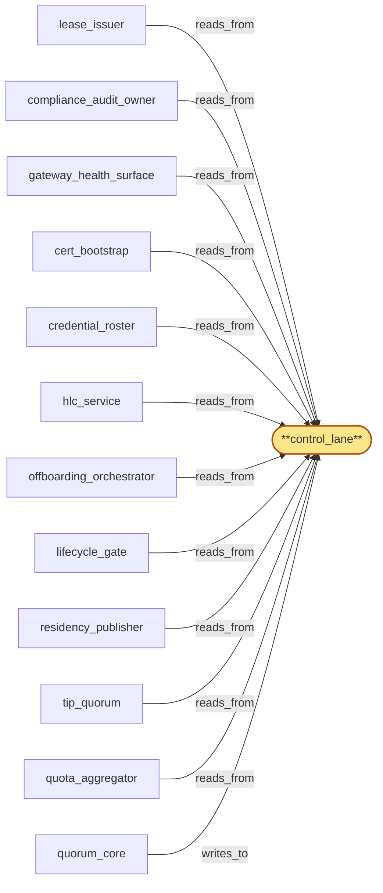

# control_lane

> Build the control lane:

## Properties

| Field | Value |
| --- | --- |
| Task | `control_lane` |
| Scope | `region_coordinator` |
| Node | `control_lane` |
| Node type | `Log` |
| Dependencies | `0` |
| Wave | `1` |

## Architecture

## Implementation summary

- Build the control lane: Raft log carrying control-plane messages (cert rotation, residency-policy activation, named-roster mutations) consumed by every subservice
- long-retention with snapshot truncation.

## Node definition (`control_lane` — Log)

- Tenant residency policies (versioned with effective-from HLC stamps
- 2PC PREPARE/COMMIT/ABORT entries with prepared-V+1, prepared-ack-from-tenant-store, activate-V+1, abort-V+1 idempotent on (tenant_key, V+1, attempt_id), prepared-orphan)
- rotation schedule (cert/origin/pool/region-drain entries
- rotation-in-progress and drain-in-progress tags)
- pause-in-progress entries
- schema-version capability config entries
- offboarding attestations including 'complete-with-exceptions' state and exception register
- per-(offboarding_id, component_id) durable phase markers (RECEIVED, FLUSH-IN-PROGRESS, FLUSH-COMPLETE, ACK-EMITTED, ATTESTATION-WRITTEN, TERMINAL)
- flag-applied attestations from flag_propagator
- pre-warm-stalled and pre-warm-deferred consumer state
- operator-credential roster entries (versioned roster_version with HLC publication, per-credential issuance/expiry HLC validity windows, scheduled rotation entries
- 2PC rotation-prepare and rotation-activate entries
- compromise-revocation entries with retroactive-as-of-HLC)
- cert-bootstrap state (anchor-availability-test results, anchor-rotation entries, emergency-recovery events)
- audit schema registry from compliance_audit_owner
- classification entries from gateway_health_surface (cross-witness-pending, classification-active, operator-driven-Subrole-transitions)
- compromise-revoked credential set
- emergency-cert-recovery events. Rotation events compact post-completion
- attestations compact after forwarding to metrics_store
- residency policies retain version history under snapshot
- roster history retained in full through snapshots so revocation semantics survive compaction. Carries HLC stamps and schema_version tags.

## Requirements

### `r1` — SR1-log-retention-classes

**Summary:** Every log entry kind declares an explicit retention class with documented compaction semantics (latest-only, bounded-history, periodic-summary, full-history-with-snapshot); each lane (tombstone, tip, aggregate, control) implements compaction per the kinds it carries.

- Origin: `stressor:1:s-log-unbounded`
- Targets: `tombstone_lane`, `tip_lane`, `aggregate_lane`, `control_lane`
- Matched via: `control_lane`
- Verifications:
  - Test lanes/control/retention_class.rs asserts long-with-snapshot retention.

### `r2` — SR1-write-class-lanes

**Summary:** The committed log is partitioned into write-class lanes — tombstone_lane (latency-critical), tip_lane (high-frequency), aggregate_lane (bursty), control_lane (low-frequency) — each with reserved consensus throughput and head-of-line isolation to its own lane.

- Origin: `stressor:1:s-hot-write-contention`
- Targets: `tombstone_lane`, `tip_lane`, `aggregate_lane`, `control_lane`
- Matched via: `control_lane`
- Verifications:
  - Test lanes/control/write_class.rs asserts admission gate enforced.

### `r3` — SR1-cross-lane-ordering

**Summary:** Cross-lane causal ordering relevant to consumers (e.g. a revocation that must precede an attestation) is resolved via HLC stamps captured at write time so consumers can reconstruct happens-before across lanes.

- Origin: `stressor:1:s-hot-write-contention`
- Targets: `tombstone_lane`, `tip_lane`, `aggregate_lane`, `control_lane`
- Matched via: `control_lane`
- Verifications:
  - Test lanes/control/cross_lane_ordering.rs asserts HLC ordering vs lease_lane and tombstone_lane.

### `r4` — SR1-schema-tagged-entries

**Summary:** Every log entry across all lanes is tagged with the schema_version that produced it; consumers reject entries with schema_version higher than they support.

- Origin: `stressor:1:s-schema-evolution`
- Targets: `tombstone_lane`, `tip_lane`, `aggregate_lane`, `control_lane`
- Matched via: `control_lane`
- Verifications:
  - Test lanes/control/schema_tagged.rs asserts entry versioning.

## Outputs

| Path | Purpose |
| --- | --- |
| `crates/region_coordinator/src/lanes/control.rs` | Lane state machine |

## Stack details

- openraft state machine 'control_lane'; retention class = long-with-snapshot; schema-tagged

## Acceptance criteria

### SR1-log-retention-classes

- Test lanes/control/retention_class.rs asserts long-with-snapshot retention.

### SR1-write-class-lanes

- Test lanes/control/write_class.rs asserts admission gate enforced.

### SR1-cross-lane-ordering

- Test lanes/control/cross_lane_ordering.rs asserts HLC ordering vs lease_lane and tombstone_lane.

### SR1-schema-tagged-entries

- Test lanes/control/schema_tagged.rs asserts entry versioning.

## Related tasks (graph neighbours)

- [cert_bootstrap](cert_bootstrap.md)
- [compliance_audit_owner](compliance_audit_owner.md)
- [credential_roster](credential_roster.md)
- [gateway_health_surface](gateway_health_surface.md)
- [hlc_service](hlc_service.md)
- [lease_issuer](lease_issuer.md)
- [lifecycle_gate](lifecycle_gate.md)
- [offboarding_orchestrator](offboarding_orchestrator.md)
- [quorum_core](quorum_core.md)
- [quota_aggregator](quota_aggregator.md)
- [residency_publisher](residency_publisher.md)
- [tip_quorum](tip_quorum.md)

---

_Source of truth: `archi plan task show control_lane`. Regenerate with `python3 tasks/_generate.py`._
