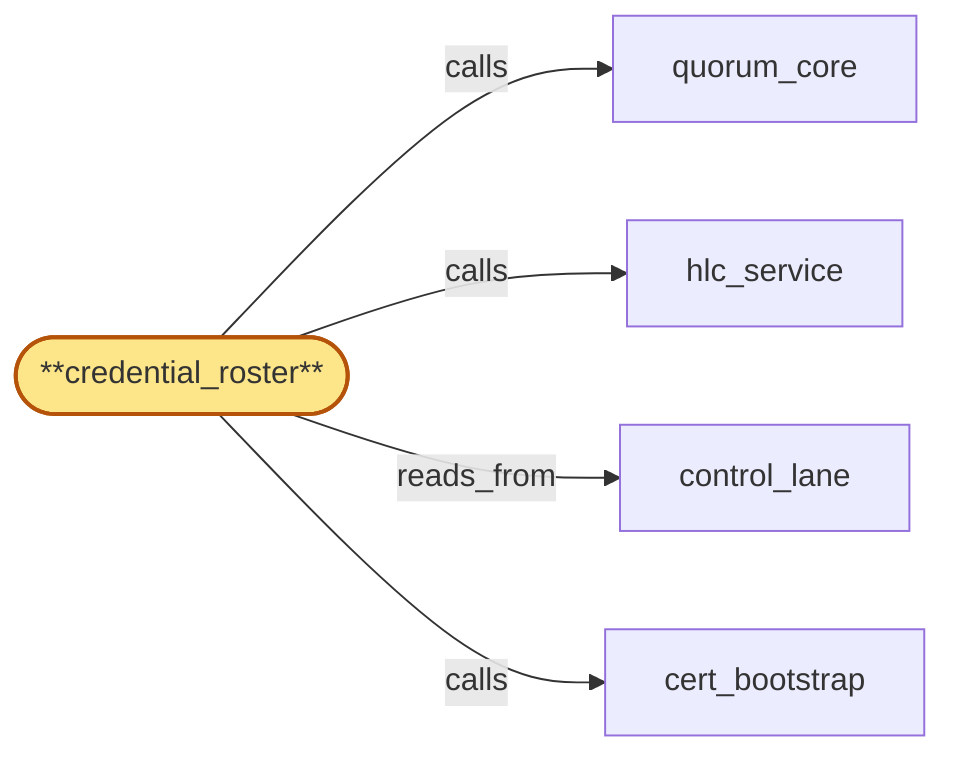

# credential_roster

> Build the operator credential roster subservice:

## Properties

| Field | Value |
| --- | --- |
| Task | `credential_roster` |
| Scope | `region_coordinator` |
| Node | `credential_roster` |
| Node type | `Subservice` |
| Dependencies | `2` |
| Wave | `3` |

## Architecture

## Implementation summary

- Build the operator credential roster subservice: M-of-N-authorized roster mutations via 2PC + cross-region quorum-witnessed CAS
- on-demand named-roster lookup endpoint with rate limits and HLC-bounded budget
- reaffirmation/reissue flow
- residency-2PC roster pin.

## Node definition (`credential_roster` — Subservice)

- Owns the operator-credential roster published to all override-admission consumers.
- Maintains versioned roster entries (roster_version, HLC-stamped publication timestamp, per-credential issuance/expiry HLC validity windows) committed via quorum_core into control_lane.
- Roster mutations (issue, rotate, revoke) are themselves M-of-N-authorized CAS proposals through quorum_core
- credential issuance uses the elevated-threshold tier consistent with cert re-rooting (elevated-tier-A from cert_bootstrap).
- Cold-start and post-full-revocation re-bootstrap of the roster is rooted in cert_bootstrap's OOB anchor under elevated-tier-A applied against anchor-healthy count (calls cert_bootstrap before publishing any new roster_version when no prior roster exists or the prior roster is fully compromise-revoked).
- Roster rotation is itself a 2PC: rotation-prepare commits a prepared-V+1 entry to control_lane and broadcasts to every override-admission consumer (carrying current roster_version and prepared roster_version)
- collects per-consumer ack on the documented push-and-acknowledge channel
- rotation-activate is M-of-regions quorum-witnessed and only executes once the per-region ack quorum is met.
- Rotation-activate is sequenced by lifecycle_gate: lifecycle_gate admits rotation-activate ONLY AFTER all in-flight residency 2PCs have reached terminal state under the prior roster (COMMIT, ABORT, or PREPARED-ORPHAN), OR the rotation-activate explicitly carries a residency-2PC-cancel-and-abort directive (elevated-tier-A) that issues idempotent abort-V+1 entries for every in-flight residency 2PC under the prior roster atomically before activation.
- Rotation-activate records a rotation-activation-HLC in control_lane (s4-7)
- credential_roster MUST retain V_old as verifiable for at least max(residency-2PC-in-flight-lock max-window, drain-ack-handoff record SLA max-window) past activation, so chain-of-custody records signed under V_old remain verifiable for cross-version audit.
- Consumers consult active roster_version on every commit so a laggard consumer cannot admit a proposal that the activated roster has invalidated.
- In-flight override proposals at rotation-activate HLC are cancel-by-roster-version atomically with the activation broadcast: lifecycle_gate, tip_quorum, residency_publisher, lease_issuer must CAS-reject any pending override commit whose signing roster_version predates the active roster_version.
- Compromise-revocation events carry retroactive-as-of-HLC field (usually equal to the revocation HLC
- may be set earlier under elevated-tier-A when forensics establish compromise predates discovery).
- COMPROMISE-REVOCATION BROADCAST CONTRACT (bubble-lifecycle_gate-1): every compromise-revocation broadcast committed to control_lane MUST carry, in addition to retroactive-as-of-HLC, an estimated-affected-broadcast-count field — credential_roster computes this estimate at broadcast-emission time by counting (a) override-admission consumers that have ack-readied the compromised roster_version, (b) lease entries on lease_lane bound to the compromised roster_version observed up to the broadcast HLC, (c) in-flight residency 2PCs and drain-ack records signed under the compromised roster_version.
- The count is an upper-bound estimate (not exact)
- credential_roster names a freshness window for the inputs and stamps the count with the input-snapshot HLC. lifecycle_gate's broadcast_pipeline consumes this count to pre-compute its re-emission burst budget and to raise re-emission-burst-pending events on control_lane
- bulk_admitter consults the count to decide when to defer new-wave admission. The estimate field is mandatory
- broadcasts lacking it are rejected at quorum_core admission.
- On compromise-revocation, credential_roster's broadcast carries an explicit per-tenant reaffirmation-or-reissue decision tree based on offboarding_orchestrator's phase marker state: tenants whose phase markers are ack-completed (FLUSH-COMPLETE, ACK-EMITTED, ATTESTATION-WRITTEN, TERMINAL) under the old signature receive a reaffirmation entry that updates the broadcast's signing roster_version in the phase marker without resetting the ack window
- tenants whose markers are not yet ack-completed receive a reissue with fresh ack window.
- Lease reissue emission (s4-5): for tenants whose lease was bound to the compromised roster_version and whose decision-tree path is reissue, credential_roster directs lease_issuer to emit reissue work into lease_lane's lease-reissue sub-stream (NOT lease-revoke-priority and NOT lease-prepared)
- reissue entries are HLC-ordered after the originating compromise-revocation broadcast HLC and MUST NOT commit before any lease-revoke for the same tenant. lease-reissue throughput is bounded by the sub-stream's dedicated budget
- if reissue lag accumulates beyond a configurable horizon, lifecycle_gate surfaces a back-pressure signal to operators. compliance_audit_owner records the per-tenant reaffirmation-or-reissue decision in the typed audit log so the certificate-of-deletion vouches for the signature transition unambiguously.
- OPERATOR-POOL THROUGHPUT SIGNAL (bubble-lifecycle_gate-2): credential_roster publishes a SEPARATE, INDEPENDENT operator-pool throughput signal onto control_lane (distinct entry kind from roster-version state) — operator-pool-throughput entries carry (window_hlc, pool_capacity, pool_admitted_rate, pool_rejected_rate, override-channel-saturation flag, originating-cause-class) and are emitted on a documented cadence plus on saturation transitions.
- Saturation transitions surface as edge-triggered operator-pool-saturation entries. lifecycle_gate's credential_validator subscribes to this signal to attribute override-channel back-pressure to its true cause (operator-pool rate-limit vs validator throughput vs roster_version churn) so the validator sheds load without starving high-priority overrides.
- The operator-pool-throughput entry is independent of roster_version state — it is emitted whether or not roster_version is changing, so saturation in one dimension does not require crossing the other dimension's update path.
- Per-target_consumer ack-tracking is monotonic per (consumer, roster_version): a consumer that missed activation-window for V+1 falls to deny-by-default for further override admissions until it ack-readies a strictly newer roster_version
- late-arriving acks for an already-activated version do not flip producer-side decisions back.
- Every roster mutation, rotation step, compromise-revocation, reaffirmation-or-reissue decision, lease-reissue direction, rotation-activation-HLC entry, V_old retention-window expiry, estimated-affected-broadcast-count emission, and operator-pool-throughput / operator-pool-saturation entry writes a typed entry to compliance_audit (parent) via compliance_audit_owner.
- (Realizes inherited r-s5-roster-rotation-uniform-ordering, r-s5-broadcast-self-contained-credential, r-s4-roster-staleness-bound, r-s4-roster-rotation-race, r-s4-credential-issuance-provenance
- addresses zoom stressors s6-policy-roster-coactivation via lifecycle_gate-sequenced rotation-activate, s3-resign-rebroadcast-storm via reaffirmation-or-reissue decision tree
- addresses s4-5 via lease-reissue sub-stream direction, s4-7 via V_old retention window past rotation-activation-HLC
- satisfies bubble-lifecycle_gate-1 via estimated-affected-broadcast-count contract on compromise-revocation broadcast, bubble-lifecycle_gate-2 via independent operator-pool-throughput signal on control_lane.)

## Requirements

### `r1` — r-zoom-rc-roster-2pc

**Summary:** credential_roster rotation is 2PC at zoom: rotation-prepare commits prepared-V+1 entry to control_lane and broadcasts to override-admission consumers; rotation-activate is M-of-regions quorum-witnessed; consumers consult active roster_version on every commit; in-flight override proposals at activate-HLC are cancel-by-roster-version atomically with the activation broadcast. Compromise-revocation carries retroactive-as-of-HLC; broadcasts whose emit-HLC >= retroactive-as-of-HLC become invalid and lifecycle_gate re-signs and re-broadcasts within bounded-batching.

- Origin: `freestanding`
- Targets: `credential_roster`
- Matched via: `credential_roster`
- Verifications:
  - Test credential_roster/2pc.rs asserts roster mutations require 2PC + M-of-N signatures.

### `r2` — r-zoom-rc-credential-roster-extracted

**Summary:** credential_roster is the single owner of operator-credential roster publication and consumer-ack tracking; lifecycle_gate, tip_quorum, residency_publisher, lease_issuer, flag_propagator, offboarding_orchestrator, compliance_audit_owner, cert_bootstrap consume the active roster_version via control_lane (committed by credential_roster through quorum_core) and CAS-reject any override commit whose effective roster_version is below active roster_version. credential_roster's cold-start / post-full-revocation re-bootstrap is rooted in cert_bootstrap's OOB anchor.

- Origin: `freestanding`
- Targets: `credential_roster`
- Matched via: `credential_roster`
- Verifications:
  - Test credential_roster/extracted.rs asserts the roster is its own subservice (extracted from lifecycle_gate per zoom resolution).

### `r3` — r-zoom-rc-residency-2pc-roster-pin

**Summary:** residency_publisher pins active roster_version at PREPARE; COMMIT and ABORT proposals carry the pinned roster_version, not the current one. lifecycle_gate sequences roster rotation-activate only after in-flight residency 2PCs reach terminal state under the prior roster, OR the rotation-activate carries a residency-2PC-cancel-and-abort directive (elevated M-of-N) that issues idempotent abort-V+1 entries for every in-flight 2PC before the activation commits.

- Origin: `stressor:3:s6-policy-roster-coactivation`
- Targets: `credential_roster`
- Matched via: `credential_roster`
- Verifications:
  - Test credential_roster/residency_2pc_pin.rs asserts every residency 2PC pins the roster_version active at PREPARE.

### `r4` — r-zoom-rc-reaffirmation-reissue

**Summary:** credential_roster's compromise-revocation broadcast carries an explicit per-tenant reaffirmation-or-reissue decision tree based on phase marker state: ack-completed -> reaffirmation entry (signature update only); not-yet-ack-completed -> reissue with fresh ack window. compliance_audit_owner records the per-tenant decision in the typed audit log; certificate-of-deletion vouches for the signature transition unambiguously.

- Origin: `stressor:3:s3-resign-rebroadcast-storm`
- Targets: `credential_roster`
- Matched via: `credential_roster`
- Verifications:
  - Test credential_roster/reaffirmation_reissue.rs asserts reaffirmation produces a re-issue substream entry without resetting the roster version monotonicity.

## Outputs

| Path | Purpose |
| --- | --- |
| `crates/region_coordinator/src/credential_roster.rs` | Roster manager + lookup endpoint |

## Stack details

- Rust module 'region_coordinator::credential_roster' running 2PC roster-mutation gate; PREPARE requires distinct M-of-N signers; lookup endpoint over cert-bearing surface, rate-limited per (caller, region)
- Lifecycle-gate-signed responses for the lookup endpoint; bulk-wave-coalesced fetch under HLC budget tighter than per-tenant drain-fence ack window

## Acceptance criteria

### r-zoom-rc-roster-2pc

- Test credential_roster/2pc.rs asserts roster mutations require 2PC + M-of-N signatures.

### r-zoom-rc-credential-roster-extracted

- Test credential_roster/extracted.rs asserts the roster is its own subservice (extracted from lifecycle_gate per zoom resolution).

### r-zoom-rc-residency-2pc-roster-pin

- Test credential_roster/residency_2pc_pin.rs asserts every residency 2PC pins the roster_version active at PREPARE.

### r-zoom-rc-reaffirmation-reissue

- Test credential_roster/reaffirmation_reissue.rs asserts reaffirmation produces a re-issue substream entry without resetting the roster version monotonicity.

## Related tasks (graph neighbours)

- [cert_bootstrap](cert_bootstrap.md)
- [control_lane](control_lane.md)
- [hlc_service](hlc_service.md)
- [quorum_core](quorum_core.md)

---

_Source of truth: `archi plan task show credential_roster`. Regenerate with `python3 tasks/_generate.py`._
