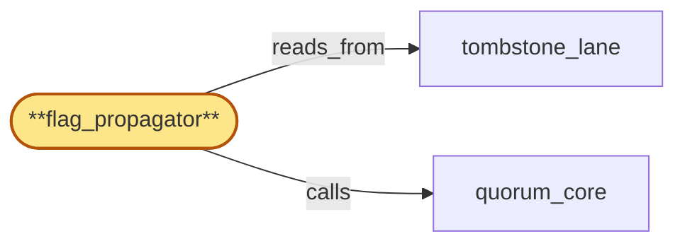

# flag_propagator

> Build the throttle-flag fast-path propagator:

## Properties

| Field | Value |
| --- | --- |
| Task | `flag_propagator` |
| Scope | `region_coordinator` |
| Node | `flag_propagator` |
| Node type | `Subservice` |
| Dependencies | `3` |
| Wave | `3` |

## Architecture

## Implementation summary

- Build the throttle-flag fast-path propagator: pushes per-tenant throttle flags from quota aggregation into every region's auth_cache ahead of fine-grained counter replication
- deny-during-propagation pending markers
- flag-applied attestation
- pending-marker rate-limit + bound.

## Node definition (`flag_propagator` — Subservice)

- Watches tombstone_lane for committed flags (throttle, plan-change, cluster-suspended, key-revocation, preservation-hold, erasure-tombstone) and writes them to every region's auth_cache (parent) via the unified fast-path.
- The fast-path has a documented per-region delivery SLO monitored independently of bulk propagation rate
- SLO breach raises an alert.
- For high-severity flags (cluster-suspended, key-revocation, erasure-tombstone), publishes a deny-during-propagation pending-marker to every region's auth_cache before the per-region apply lands so the flag-affected identity cannot serve traffic in the propagation window.
- Pending-markers carry an originating-proposal-id and an HLC expiry bound
- flag_propagator rejects any pending-marker publication that is not tied to an in-flight or committed tombstone proposal in tombstone_lane, and enforces a per-target_identity rate limit on pending-marker publication.
- Pending-markers beyond the rate are dropped with a metric and the originating proposer is flagged
- the per-target_identity rate limit is independent of the unified fast-path's per-region delivery SLO so DoS attempts via pending-markers cannot also starve legitimate flag delivery.
- On HLC expiry the marker auto-clears in auth_cache without explicit retraction, so a stalled or rejected proposal cannot indefinitely deny traffic.
- Per-region apply produces a flag-applied attestation written back through quorum_core into control_lane
- a flag is globally-active only after attestations from every region land. Lagging regions surface as alerts. (Realizes IR-flag-fast-path and the cluster-suspension-race derivations.)

## Requirements

### `r1` — IR-flag-fast-path

**Summary:** Tombstoned flags (throttle, plan-change, cluster-suspended, key-revocation, preservation-hold, erasure-tombstone) propagate to every region's auth_cache via a single unified fast-path that runs ahead of fine-grained counter replication, with global ordering preserved.

- Origin: `initial`
- Targets: `flag_propagator`
- Matched via: `flag_propagator`
- Verifications:
  - Test flag_propagator/fast_path.rs asserts throttle flags reach every region's auth_cache before fine-grained replication.

### `r2` — SR1-fast-path-slo

**Summary:** flag_propagator has a documented per-region delivery SLO for the unified fast-path; the SLO is monitored independently of bulk propagation rate and breach raises an alert.

- Origin: `stressor:1:s-cluster-suspension-race`
- Targets: `flag_propagator`
- Matched via: `flag_propagator`
- Verifications:
  - Test flag_propagator/slo.rs asserts SLO bound on propagation latency (p99 < documented value).

### `r3` — SR1-deny-during-propagation

**Summary:** For high-severity flags (cluster-suspended, key-revocation, erasure-tombstone), flag_propagator publishes a pending-marker to every region's auth_cache before the per-region apply lands; auth_cache treats the pending marker as deny-during-propagation so the affected cluster_id cannot serve traffic in the propagation window.

- Origin: `stressor:1:s-cluster-suspension-race`
- Targets: `flag_propagator`
- Matched via: `flag_propagator`
- Verifications:
  - Test flag_propagator/deny_during_propagation.rs asserts pending markers cause auth_cache to deny by default during propagation.

### `r4` — SR1-flag-applied-attestation

**Summary:** Per-region apply of a fast-path flag produces a flag-applied attestation written back through quorum_core; a flag is globally-active only after attestations from every region land, and lagging regions are flagged in alerts.

- Origin: `stressor:1:s-cluster-suspension-race`
- Targets: `flag_propagator`
- Matched via: `flag_propagator`
- Verifications:
  - Test flag_propagator/applied_attestation.rs asserts each region writes a flag-applied attestation to compliance_audit.

### `r5` — SR2-pending-marker-rate-limit

**Summary:** flag_propagator enforces a per-target_identity rate limit on pending-marker publication. Pending-markers beyond the rate are dropped with a metric and the originating proposer is flagged; the rate limit is independent of the unified fast-path's per-region delivery SLO so DoS attempts on pending-markers cannot also starve legitimate flag delivery.

- Origin: `stressor:2:pending-marker-dos`
- Targets: `flag_propagator`
- Matched via: `flag_propagator`
- Verifications:
  - Test flag_propagator/pending_marker_rate_limit.rs asserts pending-marker writes are rate-limited per tenant to prevent flooding.

### `r6` — SR2-pending-marker-bound

**Summary:** Pending-markers carry an originating-proposal-id and an HLC expiry bound. A pending-marker without a corresponding in-flight or committed tombstone proposal in tombstone_lane is rejected; on expiry the marker auto-clears in auth_cache, so a stalled or rejected proposal cannot indefinitely deny traffic.

- Origin: `stressor:2:pending-marker-dos`
- Targets: `flag_propagator`
- Matched via: `flag_propagator`
- Verifications:
  - Test flag_propagator/pending_marker_bound.rs asserts pending markers carry HLC expiry bound; auto-clear without explicit retraction.

## Outputs

| Path | Purpose |
| --- | --- |
| `crates/region_coordinator/src/flag_propagator.rs` | Flag propagator |

## Stack details

- Rust module 'region_coordinator::flag_propagator' subscribed to tombstone_lane; for each new throttle-flag entry, pushes to every region's auth_cache and waits for ack
- Pending markers: HLC-bounded entries written to auth_cache during propagation; rate-limited per tenant

## Acceptance criteria

### IR-flag-fast-path

- Test flag_propagator/fast_path.rs asserts throttle flags reach every region's auth_cache before fine-grained replication.

### SR1-fast-path-slo

- Test flag_propagator/slo.rs asserts SLO bound on propagation latency (p99 < documented value).

### SR1-deny-during-propagation

- Test flag_propagator/deny_during_propagation.rs asserts pending markers cause auth_cache to deny by default during propagation.

### SR1-flag-applied-attestation

- Test flag_propagator/applied_attestation.rs asserts each region writes a flag-applied attestation to compliance_audit.

### SR2-pending-marker-rate-limit

- Test flag_propagator/pending_marker_rate_limit.rs asserts pending-marker writes are rate-limited per tenant to prevent flooding.

### SR2-pending-marker-bound

- Test flag_propagator/pending_marker_bound.rs asserts pending markers carry HLC expiry bound; auto-clear without explicit retraction.

## Related tasks (graph neighbours)

- [quorum_core](quorum_core.md)
- [tombstone_lane](tombstone_lane.md)

---

_Source of truth: `archi plan task show flag_propagator`. Regenerate with `python3 tasks/_generate.py`._
