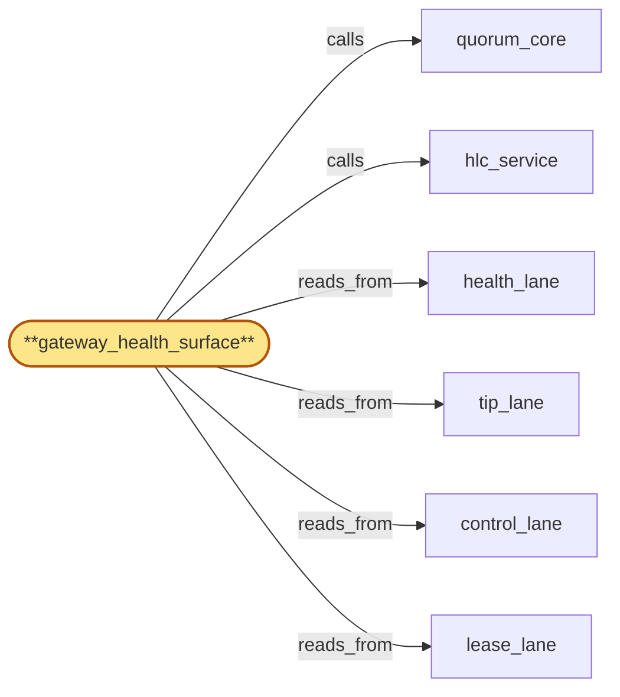

# gateway_health_surface

> Build the gateway health surface subservice:

## Properties

| Field | Value |
| --- | --- |
| Task | `gateway_health_surface` |
| Scope | `region_coordinator` |
| Node | `gateway_health_surface` |
| Node type | `Subservice` |
| Dependencies | `3` |
| Wave | `3` |

## Architecture

## Implementation summary

- Build the gateway health surface subservice: aggregates per-region per-Subrole liveness (incl. fanout-suspended, fork-transition-pending) on health_lane
- cross-witnessed by edge with monotonic freshness
- cause-class tagging
- bulk-wave aggregated SLO
- region-set failover detection.

## Node definition (`gateway_health_surface` — Subservice)

- Per-region per-Subrole liveness publisher consumed by edge (parent) for residency-aware routing and reconnect-storm hints.
- Subroles include: gateway-active, fanout-suspended, chain_router-pool-rotating, address_index-tombstoning, usage_meter-degraded, region-coordinator-skew-degraded.
- Each Subrole sample carries a monotonic freshness signal (freshness_seq, sampled_hlc) so stale surfaces are detectable.
- The freshness window is bounded by hlc_service's skew_bound + an inter-region propagation budget
- hlc_service skew-degraded mode triggers a wider window with explicit annotation.
- Routing-affecting classifications are subject to an asymmetric partial-trust policy: SAFETY-DIRECTION transitions (more conservative, e.g. gateway-active -> fanout-suspended, healthy -> skew-degraded) are applied immediately under partial-trust upon a single-region observation
- gateway_health_surface publishes the classification-pending entry to health_lane with the single observing region named and a 'partial-trust-routing-active' annotation
- edge applies the classification immediately for routing safety with a 'partial-trust-routing-active' header on outgoing requests so downstream observers can correlate.
- PERMISSIVE-DIRECTION transitions (less conservative, e.g. fanout-suspended -> gateway-active, skew-degraded -> healthy) require full cross-witness from at least two regions agreeing within the documented cross-witness window before applying
- single-region permissive-direction observations are held probationary in classification-pending state and never applied at edge until cross-witness lands.
- Lease cross-witness barrier (s4-3): every safety-direction partial-trust transition for region R is stamped with a lease_lane-cross-witnessed-up-to HLC
- the transition MUST NOT be published until lease_lane has been observed up to that HLC at the publisher, with the value recorded in the health_lane entry.
- Cross-witness window expiry without second witness for permissive-direction transitions escalates to operator-attention rather than silent rejection: gateway_health_surface writes a classification-witness-timeout entry to control_lane that pages the on-call rotation. lifecycle_gate may issue an operator-override classification (under M-of-N from credential_roster's published roster, elevated-tier-A) that promotes a single-region classification past the cross-witness window with operator attribution recorded into health_lane and audited via compliance_audit_owner.
- Originating-cause-class tagging (s4-6): every classification-pending and partial-trust-transition entry written to health_lane is tagged with an originating-cause-class (operator-bulk-wave, regional-network, internal-degradation, unknown) sourced from lifecycle_gate's bulk-wave context (correlated by wave_id observed in control_lane).
- DUAL WAVE-MARKER CLASS HANDLING (bubble-lifecycle_gate-5): gateway_health_surface honors the two distinct end markers carried on health_lane — bulk-wave-emit-end and bulk-wave-finalized — and MUST accept and propagate the marker-class tag on the degradation-envelope expectation.
- Classification entries correlated by wave_id are compared against the emit-end-window envelope until bulk-wave-finalized commits
- afterward they are compared against the finalized-window envelope. Late drain-ack and PHASE B entries arriving before bulk-wave-finalized remain correlated to the wave_id under the in-progress envelope
- entries arriving after bulk-wave-finalized are classified by gateway_health_surface as late-finalization (orphan candidate) and elevate to operator-attention via a classification-late-finalization control_lane entry.
- Bulk-wave aggregation SLO: entries tagged operator-bulk-wave are subject to a separate, longer classification-witness-timeout SLO
- per-entry pages are suppressed and replaced by a single bulk-wave-health-summary published once per wave by gateway_health_surface
- the summary names BOTH the emit-end-window deviations and the finalized-window deviations from the wave's expected health envelope (declared by lifecycle_gate's bulk-wave-start marker) so operators see the two windows distinctly
- only deviations from the envelope page on-call.
- Region-set-failover detection (s4-8): gateway_health_surface monitors the dependency graph of in-flight partial-trust transitions and detects cross-witness deadlocks (where region A's transition cross-witnesses lease_lane up to an HLC that depends on entries originating from region B and vice versa).
- On detection, the simultaneously-failing regions are classified as a region-set-failover (not independent transitions)
- a single coordinated transition is issued whose lease_lane-cross-witnessed-up-to HLC is computed against quorum_core's quorum-observed lease_lane HLC, not either region's local witness
- the transition is published as an explicit region-set-failover entry kind on health_lane with the union region-set.
- Operator-driven Subrole transitions (manual force-suspend) are admitted via lifecycle_gate's CAS path and carry operator attribution end-to-end into health_lane.
- Reads tip_lane to correlate Subrole pool tip-staleness with chain_router-pool Subroles.
- Reads lease_lane head HLC to compute lease_lane-cross-witnessed-up-to stamps and to feed region-set-failover detection.
- Writes Subrole-transition events, classification-pending, classification-witness-timeout, partial-trust-routing-applied, bulk-wave-health-summary, classification-late-finalization, and region-set-failover events to compliance_audit (parent) via compliance_audit_owner.
- (Realizes inherited r-s4-gateway-health-integrity zoom-level concerns: freshness window, cross-witness construction, stale-surface fallback policy
- addresses zoom stressor s3-cross-witness-partition via asymmetric safety-vs-permissive partial-trust policy
- addresses s4-3 via lease-cross-witness barrier, s4-6 via bulk-wave aggregation and originating-cause-class tagging, s4-8 via region-set-failover detection and quorum-observed cross-witness barrier
- satisfies bubble-lifecycle_gate-5 by honoring dual marker classes — emit-end vs finalized — when comparing classification entries against the right window and emitting classification-late-finalization for orphan candidates.)

## Requirements

### `r1` — r-zoom-rc-health-freshness

**Summary:** gateway_health_surface publishes per-(region, Subrole) liveness samples carrying monotonic freshness signal (freshness_seq, sampled_hlc); freshness window is bounded by hlc_service skew_bound + inter-region propagation budget with wider window under skew-degraded; routing-affecting classifications require cross-witness from at least two regions agreeing within the documented cross-witness window; single-region classifications held probationary; stale-surface fallback at edge: residency-pinned operations deny-by-default, residency-neutral operations continue under last-observed liveness.

- Origin: `freestanding`
- Targets: `gateway_health_surface`
- Matched via: `gateway_health_surface`
- Verifications:
  - Test health_surface/freshness.rs asserts every emitted view carries a monotonic freshness signal.

### `r2` — r-zoom-rc-health-partial-trust

**Summary:** gateway_health_surface publishes single-region routing-affecting classifications to health_lane with the single observing region named and an explicit cross-witness-pending annotation; edge applies a partial-trust routing policy: safety-direction transitions (more conservative, e.g. fanout-suspended) are applied immediately under partial-trust with a 'partial-trust-routing-active' header on outgoing requests; permissive-direction transitions (less conservative) require full cross-witness before applying. Cross-witness window expiry without second witness escalates to operator-attention rather than silent rejection.

- Origin: `stressor:3:s3-cross-witness-partition`
- Targets: `gateway_health_surface`
- Matched via: `gateway_health_surface`
- Verifications:
  - Test health_surface/partial_trust.rs asserts un-cross-witnessed entries surface only partial trust to consumers.

### `r3` — r-s4-3-cross-witness-barrier

**Summary:** gateway_health_surface MUST stamp every partial-trust safety-direction transition for a region R with a lease_lane-cross-witnessed-up-to HLC; the transition MUST NOT be published until lease_lane has been observed up to that HLC at the publisher and the value is recorded in the health_lane entry.

- Origin: `stressor:4:s4-health-lease-witness-race`
- Targets: `gateway_health_surface`
- Matched via: `gateway_health_surface`
- Verifications:
  - Test health_surface/cross_witness_barrier.rs asserts a barrier prevents cross-region promotion until cross-witness confirms.

### `r4` — r-s4-6-cause-class-tagging

**Summary:** gateway_health_surface MUST tag every classification-pending and partial-trust-transition entry written to health_lane with originating-cause-class (operator-bulk-wave, regional-network, internal-degradation, unknown), sourced from lifecycle_gate's bulk-wave context when applicable.

- Origin: `stressor:4:s4-health-bulk-witness-storm`
- Targets: `gateway_health_surface`
- Matched via: `gateway_health_surface`
- Verifications:
  - Test health_surface/cause_class_tagging.rs asserts each degraded transition carries a cause-class tag.

### `r5` — r-s4-6-bulk-wave-aggregated-slo

**Summary:** Entries tagged operator-bulk-wave MUST be subject to a separate, longer classification-witness-timeout SLO; per-entry pages MUST be suppressed and replaced by a single bulk-wave-health-summary published once per wave by gateway_health_surface; only deviations from the wave's expected health envelope page on-call.

- Origin: `stressor:4:s4-health-bulk-witness-storm`
- Targets: `gateway_health_surface`
- Matched via: `gateway_health_surface`
- Verifications:
  - Test health_surface/bulk_wave_slo.rs asserts bulk-wave aggregated SLO is computed and surfaced.

### `r6` — r-s4-8-region-set-failover-detect

**Summary:** gateway_health_surface MUST detect cross-witness deadlock between simultaneous partial-trust transitions; on detection, the affected regions MUST be classified as a region-set-failover and a single coordinated transition issued whose lease_lane-cross-witnessed-up-to HLC is computed against quorum_core's quorum-observed lease_lane HLC, not either region's local witness.

- Origin: `stressor:4:s4-dual-failover-cross-witness-deadlock`
- Targets: `gateway_health_surface`
- Matched via: `gateway_health_surface`
- Verifications:
  - Test health_surface/region_set_failover_detect.rs asserts region-set failover is detected and emitted as a distinct event.

## Outputs

| Path | Purpose |
| --- | --- |
| `crates/region_coordinator/src/health_surface.rs` | Health surface aggregator |

## Stack details

- Rust module 'region_coordinator::health_surface' applying health_lane entries; surfaces to edge for residency-aware traffic shifting

## Acceptance criteria

### r-zoom-rc-health-freshness

- Test health_surface/freshness.rs asserts every emitted view carries a monotonic freshness signal.

### r-zoom-rc-health-partial-trust

- Test health_surface/partial_trust.rs asserts un-cross-witnessed entries surface only partial trust to consumers.

### r-s4-3-cross-witness-barrier

- Test health_surface/cross_witness_barrier.rs asserts a barrier prevents cross-region promotion until cross-witness confirms.

### r-s4-6-cause-class-tagging

- Test health_surface/cause_class_tagging.rs asserts each degraded transition carries a cause-class tag.

### r-s4-6-bulk-wave-aggregated-slo

- Test health_surface/bulk_wave_slo.rs asserts bulk-wave aggregated SLO is computed and surfaced.

### r-s4-8-region-set-failover-detect

- Test health_surface/region_set_failover_detect.rs asserts region-set failover is detected and emitted as a distinct event.

## Related tasks (graph neighbours)

- [control_lane](control_lane.md)
- [health_lane](health_lane.md)
- [hlc_service](hlc_service.md)
- [lease_lane](lease_lane.md)
- [quorum_core](quorum_core.md)
- [tip_lane](tip_lane.md)

---

_Source of truth: `archi plan task show gateway_health_surface`. Regenerate with `python3 tasks/_generate.py`._
