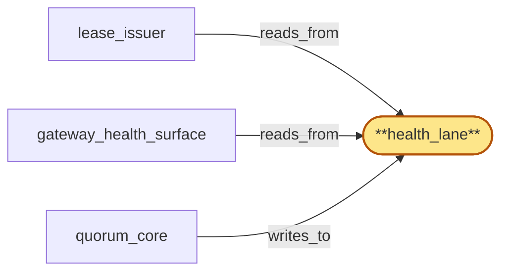

# health_lane

> Build the health lane:

## Properties

| Field | Value |
| --- | --- |
| Task | `health_lane` |
| Scope | `region_coordinator` |
| Node | `health_lane` |
| Node type | `Log` |
| Dependencies | `0` |
| Wave | `1` |

## Architecture

## Implementation summary

- Build the health lane: Raft log for gateway_health_surface entries cross-witnessed by edge/region peers
- degraded-mode entries
- region-set failover entry class.

## Node definition (`health_lane` — Log)

- Per-(region, Subrole) liveness sample lane carrying monotonic freshness signals (freshness_seq, sampled_hlc) for gateway-active, fanout-suspended, chain_router-pool-rotating, address_index-tombstoning, usage_meter-degraded, region-coordinator-skew-degraded Subroles.
- Routing-affecting classification entries are committed only after cross-witness from at least two regions agreeing within the documented cross-witness window
- classification-pending entries are admissible and explicitly annotated.
- Reserved consensus throughput separate from tip_lane so tip-frequency does not crowd health-frequency.
- Partial-trust safety-direction transitions for region R are stamped (s4-3) with a lease_lane-cross-witnessed-up-to HLC supplied by gateway_health_surface
- consumers (e.g., edge) MUST refuse to apply partial-trust headers for R until they have observed lease_lane up to that HLC, so cross-lane revocation/health races cannot leak partial-trust admission of already-revoked leases.
- Classification-pending and partial-trust-transition entries carry an originating-cause-class tag (operator-bulk-wave, regional-network, internal-degradation, unknown) sourced from lifecycle_gate's bulk-wave context (s4-6)
- operator-bulk-wave-tagged entries are subject to a longer classification-witness-timeout SLO at gateway_health_surface and are aggregated into a single bulk-wave-health-summary per wave rather than producing per-entry pages, so bulk-offboarding waves do not flood on-call.
- DUAL WAVE-MARKER CLASSES (bubble-lifecycle_gate-5): bulk-wave markers carried on health_lane are typed with an explicit marker-class field — bulk-wave-emit-end (lifecycle_gate's bulk_admitter has stopped emitting new wave entries
- in-flight drain-acks and PHASE B entries may still be arriving) vs bulk-wave-finalized (every drain-ack and PHASE B CAS commit for the wave has reached terminal state at the audit_destruct_sequencer).
- Health_lane carries both kinds for each wave_id
- the marker-class tag is mandatory and is propagated on every degradation-envelope expectation entry (the envelope declares which marker the entry is correlated against).
- Late drain-ack and PHASE B entries arriving after bulk-wave-emit-end but before bulk-wave-finalized remain correlated to the wave_id under the in-progress envelope
- entries arriving after bulk-wave-finalized are tagged late-finalization for orphan detection by gateway_health_surface and elevate to operator-attention.
- Consumers (gateway_health_surface, downstream edge/gateway reporters) MUST honor the marker-class tag and compare classification entries against the right window — emit-end-window for envelope-pending entries and finalized-window for closed-wave entries.
- Region-set-failover entry kind (s4-8): health_lane carries an explicit region-set-failover entry whose payload includes the union region-set, the coordinated lease_lane-cross-witnessed-up-to HLC computed against quorum_core's quorum view, and the originating-cause-class
- consumers MUST apply a single barrier per region-set-failover rather than per-region barriers when this entry kind is present.
- HLC-degraded mode handling (s4-4): partial-trust-transition entries emitted while quorum_core is HLC-degraded MUST be downgraded to safety-direction-only and carry an hlc-degraded-source flag
- consumers treat the cross-witness stamp as provisional and MUST NOT relax safety guards on its basis. classification-pending, partial-trust-transition, classification-witness-timeout, anchor-quorum-degraded, and bulk-wave markers (both emit-end and finalized classes) are classified as security-critical for quorum_core's HLC-degraded interlock.
- Compaction retains only the latest committed sample per (region, Subrole) plus the trailing classification-history within the cross-witness window plus any classification-pending probationary entries plus active region-set-failover records plus open bulk-wave markers (both classes) until their finalized counterpart commits
- older samples drop at snapshot. Carries HLC stamps and schema_version tags. (Satisfies bubble-lifecycle_gate-5 via mandatory marker-class tag on bulk-wave markers and degradation-envelope expectations.)

## Requirements

### `r1` — r-s4-3-edge-cross-witness-honor

**Summary:** Consumers of health_lane partial-trust transitions (e.g., edge) MUST refuse to apply the partial-trust header for region R until they have also observed lease_lane up to the lease_lane-cross-witnessed-up-to HLC carried in the transition.

- Origin: `stressor:4:s4-health-lease-witness-race`
- Targets: `health_lane`
- Matched via: `health_lane`
- Verifications:
  - Test lanes/health/edge_cross_witness_honor.rs asserts entries from edge are honored only when cross-witnessed by another region.

### `r2` — r-s4-4-health-lane-degraded-mode

**Summary:** health_lane partial-trust transitions emitted under HLC-degraded mode MUST be downgraded to safety-direction-only (no permissive direction) and MUST carry an hlc-degraded-source flag; consumers MUST treat the cross-witness stamp as provisional and MUST NOT relax safety guards on its basis.

- Origin: `stressor:4:s4-quorum-lane-interlock`
- Targets: `health_lane`
- Matched via: `health_lane`
- Verifications:
  - Test lanes/health/degraded_mode.rs asserts degraded-mode entries set a tag observable to consumers.

### `r3` — r-s4-8-region-set-failover-entry

**Summary:** health_lane MUST carry an explicit region-set-failover entry kind with the union region-set, the coordinated cross-witness HLC, and the originating-cause-class; consumers MUST apply a single barrier per region-set-failover rather than per-region barriers in such cases.

- Origin: `stressor:4:s4-dual-failover-cross-witness-deadlock`
- Targets: `health_lane`
- Matched via: `health_lane`
- Verifications:
  - Test lanes/health/region_set_failover_entry.rs asserts a distinct entry class for region-set failover detection.

## Outputs

| Path | Purpose |
| --- | --- |
| `crates/region_coordinator/src/lanes/health.rs` | Lane state machine |

## Stack details

- openraft state machine 'health_lane'; supports cross-witness verification before commit; degraded-mode tagged entries

## Acceptance criteria

### r-s4-3-edge-cross-witness-honor

- Test lanes/health/edge_cross_witness_honor.rs asserts entries from edge are honored only when cross-witnessed by another region.

### r-s4-4-health-lane-degraded-mode

- Test lanes/health/degraded_mode.rs asserts degraded-mode entries set a tag observable to consumers.

### r-s4-8-region-set-failover-entry

- Test lanes/health/region_set_failover_entry.rs asserts a distinct entry class for region-set failover detection.

## Related tasks (graph neighbours)

- [gateway_health_surface](gateway_health_surface.md)
- [lease_issuer](lease_issuer.md)
- [quorum_core](quorum_core.md)

---

_Source of truth: `archi plan task show health_lane`. Regenerate with `python3 tasks/_generate.py`._
