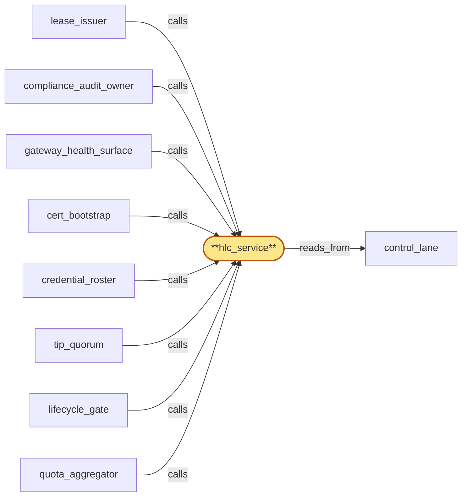

# hlc_service

> Build the HLC (hybrid logical clock) service:

## Properties

| Field | Value |
| --- | --- |
| Task | `hlc_service` |
| Scope | `region_coordinator` |
| Node | `hlc_service` |
| Node type | `Subservice` |
| Dependencies | `1` |
| Wave | `2` |

## Architecture

## Implementation summary

- Build the HLC (hybrid logical clock) service: provides bounded-sample HLC ticks to gateway and other consumers
- multi-peer consensus
- auto-degraded mode on skew
- pause-aware HLC.

## Node definition (`hlc_service` — Subservice)

- Distributes a hybrid-logical clock to subscribers (gateway, fanout, region_coordinator subservices) for time-bucketed enforcement and ordering.
- Cross-region samples are exchanged out-of-band over the cert-bearing inter-region channel — not via consensus (HLC samples do not enter the lanes
- consensus needs HLC, so the dependency cannot be inverted).
- Samples beyond a documented max-allowed-delta from the local HLC are discarded and the source is flagged but does not advance the local clock.
- Local HLC is computed from a multi-peer median (N >= 3 peer samples). hlc_service consults control_lane for pause-in-progress entries scoped to its region
- while a pause-in-progress entry covers its region, sample-vs-median delta is evaluated against a wider pause-mode bound and the region does not auto-trip skew-degraded mode for delta excursions explainable by the pause.
- On pause-end, hlc_service re-syncs from multi-peer median and only then resumes normal max-allowed-delta enforcement, so legitimate operational pauses (VM live migration and successor pause classes) do not cascade into avoidable skew-degraded windows.
- A region whose hlc_service cannot agree with multi-peer median within max-allowed-delta for a documented window outside any covering pause is automatically forced into the parent-defined skew-degraded mode and stops accepting writes that depend on time-bucketed enforcement.
- PER-REGION MODE-TRANSITION EVENTS (bubble-lifecycle_gate-3): every per-region hlc_service mode change (healthy ↔ skew-degraded ↔ pause) is emitted as a typed hlc-service-mode-transition event committed via quorum_core into control_lane carrying (region_id, leaving_mode, entering_mode, transition_hlc, originating-cause-class — observed-skew, pause-cover-start, pause-cover-end, operator-forced, recovered-from-skew).
- The events are HLC-stamped at the transitioning region's hlc_service at transition time and are emitted unconditionally on every transition (no edge-coalescing across modes).
- Consumers — in particular lifecycle_gate's audit_destruct_sequencer — use the event stream on control_lane to deterministically detect mode regressions occurring between drain-ack emit and PHASE B CAS commit (a transition from healthy back to skew-degraded or pause within the [drain-ack-HLC, PHASE-B-commit-HLC] window indicates the chain-of-custody premise was violated mid-fence and PHASE B must be aborted-and-retried under the new mode).
- Pause-cover-start/end transitions are emitted in addition to skew transitions so consumers can distinguish operational pauses from genuine skew degradation.
- Transition events lacking required fields are rejected at quorum_core admission.
- Replay-safe: idempotent on (region_id, transition_hlc).
- Compaction retains transition history within the bounded retention window declared for cross-version chain-of-custody.
- (Realizes IR-hlc-distribution and the hlc-poisoning derivations
- satisfies bubble-lifecycle_gate-3 via per-region mode-transition events on control_lane.)

## Requirements

### `r1` — IR-hlc-distribution

**Summary:** A hybrid-logical clock is distributed to subscribers (gateway, fanout, internal subservices) with bounded inter-region skew; observed skew above threshold puts the affected region into the documented degraded mode.

- Origin: `initial`
- Targets: `hlc_service`
- Matched via: `hlc_service`
- Verifications:
  - Test hlc/distribution.rs asserts every consumer receives HLC ticks within bounded sample window.

### `r2` — SR1-hlc-bounded-sample

**Summary:** HLC samples beyond a documented max-allowed-delta from the local HLC are discarded; the offending source is flagged but does not advance the local clock.

- Origin: `stressor:1:s-hlc-poisoning`
- Targets: `hlc_service`
- Matched via: `hlc_service`
- Verifications:
  - Test hlc/bounded_sample.rs asserts the sample window is honored; samples beyond window are rejected.

### `r3` — SR1-hlc-multi-peer-consensus

**Summary:** Cross-region HLC distribution computes the local HLC from a multi-peer median (N >= 3) rather than trusting any single peer; a single misbehaving peer cannot drag the cluster off-time.

- Origin: `stressor:1:s-hlc-poisoning`
- Targets: `hlc_service`
- Matched via: `hlc_service`
- Verifications:
  - Test hlc/multi_peer_consensus.rs asserts the consensus algorithm picks the safe maximum across peers.

### `r4` — SR1-hlc-auto-degraded

**Summary:** A region whose hlc_service cannot agree with multi-peer median within max-allowed-delta for a documented window is automatically forced into the skew-degraded mode (parent R-bounded-clock-skew) and stops accepting writes that depend on time-bucketed enforcement.

- Origin: `stressor:1:s-hlc-poisoning`
- Targets: `hlc_service`
- Matched via: `hlc_service`
- Verifications:
  - Test hlc/auto_degraded.rs asserts skew-threshold breach triggers degraded mode and emits the degraded signal.

### `r5` — SR2-pause-aware-hlc

**Summary:** hlc_service consults control_lane for pause-in-progress entries; while a pause-in-progress entry covers its region, sample-vs-median delta is evaluated against a wider pause-mode bound and the region does not auto-trip skew-degraded mode for delta excursions explainable by the pause. On pause-end, hlc_service re-syncs from multi-peer median and only then resumes normal max-allowed-delta enforcement.

- Origin: `stressor:2:hlc-pause-false-degraded`
- Targets: `hlc_service`
- Matched via: `hlc_service`
- Verifications:
  - Test hlc/pause_aware.rs asserts on cluster pause, HLC consumption pauses without monotonicity violation.

## Outputs

| Path | Purpose |
| --- | --- |
| `crates/region_coordinator/src/hlc.rs` | HLC service |

## Stack details

- Rust crate 'crates/region_coordinator' module 'hlc' implementing HLC tick + bounded sample (sample_window_ms config); multi-peer consensus = max(local, peer1, peer2, ...) + 1 with skew check
- Auto-degraded mode triggered when peer skew exceeds threshold; pauses HLC advance and emits degraded signal consumed by gateway

## Acceptance criteria

### IR-hlc-distribution

- Test hlc/distribution.rs asserts every consumer receives HLC ticks within bounded sample window.

### SR1-hlc-bounded-sample

- Test hlc/bounded_sample.rs asserts the sample window is honored; samples beyond window are rejected.

### SR1-hlc-multi-peer-consensus

- Test hlc/multi_peer_consensus.rs asserts the consensus algorithm picks the safe maximum across peers.

### SR1-hlc-auto-degraded

- Test hlc/auto_degraded.rs asserts skew-threshold breach triggers degraded mode and emits the degraded signal.

### SR2-pause-aware-hlc

- Test hlc/pause_aware.rs asserts on cluster pause, HLC consumption pauses without monotonicity violation.

## Related tasks (graph neighbours)

- [cert_bootstrap](cert_bootstrap.md)
- [compliance_audit_owner](compliance_audit_owner.md)
- [control_lane](control_lane.md)
- [credential_roster](credential_roster.md)
- [gateway_health_surface](gateway_health_surface.md)
- [lease_issuer](lease_issuer.md)
- [lifecycle_gate](lifecycle_gate.md)
- [quota_aggregator](quota_aggregator.md)
- [tip_quorum](tip_quorum.md)

---

_Source of truth: `archi plan task show hlc_service`. Regenerate with `python3 tasks/_generate.py`._
