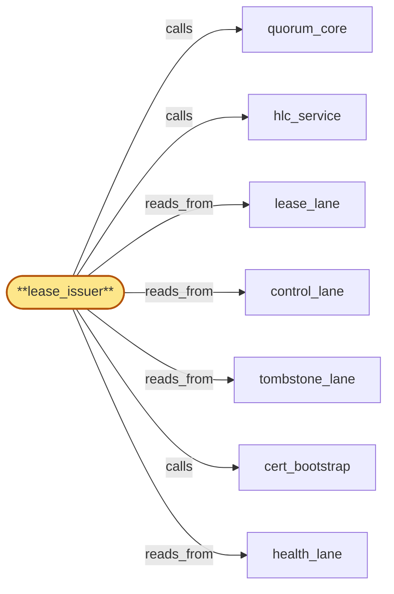

# lease_issuer

> Build the per-tenant lease-token issuer:

## Properties

| Field | Value |
| --- | --- |
| Task | `lease_issuer` |
| Scope | `region_coordinator` |
| Node | `lease_issuer` |
| Node type | `Subservice` |
| Dependencies | `3` |
| Wave | `3` |

## Architecture

## Implementation summary

- Build the per-tenant lease-token issuer: HLC-bounded TTL, M-of-regions quorum-witnessed activation, OOB-anchor-rooted emergency re-bootstrap, HLC-stamped handoff-fence at tenant_store
- quiescent state
- revoke sub-budget
- prepared-orphan handling
- lease region stamp
- revoke under quorum witness.

## Node definition (`lease_issuer` — Subservice)

- Issues per-tenant single-writer lease tokens consumed by tenant_store (parent) for CAS-on-(record_version, lease_id). Lease tokens carry HLC-bounded TTL and a monotonic lease_id within (tenant_key)
- successor leases supersede prior leases via lease_id ordering, never via wall-clock.
- Issuance is M-of-regions quorum-witnessed: lease_issuer commits a lease-prepared entry to lease_lane's lease-prepared sub-stream via quorum_core, broadcasts to peer regions, collects M-of-regions acks, then commits a lease-activated entry
- tenant_store accepts only writes under an activated lease_id. lease-prepared entries carry an admission-deadline-HLC and the originating-region-set of the lease (s4-3)
- expired entries become prepared-expired and are reaped. Renewal: a lease holder may request TTL extension before TTL expiry
- lease_issuer commits a lease-renewed entry to lease_lane under the same lease_id with extended HLC TTL bound, M-of-regions quorum-witnessed.
- Revocation: lease holder may relinquish, or lifecycle_gate (during offboarding) may force-revoke
- force-revoke writes a lease-revoked entry to the lease-revoke-priority sub-stream of lease_lane and a corresponding tombstone-style entry to tombstone_lane so flag_propagator surfaces the revocation. lease-revoke (and lease-revoke-during-erasure) entries are stamped with the originating-region-set of the lease (s4-3) so health_lane consumers can identify which leases are within scope of a region-down partial-trust transition.
- Prepared-orphan on force-revoke (s4-2): when a force-revoke or lease-revoke-during-erasure supersedes an in-flight lease-prepared for the same tenant, lease_issuer emits a prepared-orphan record bound-reaped under a per-tenant cap so prepared-orphan backlog is bounded.
- Prepared-revoked (s4-5): on receipt of a compromise-revocation broadcast from credential_roster, lease_issuer atomically invalidates all lease-prepared entries bound to the compromised roster_version by transitioning each to prepared-revoked (a state distinct from prepared-orphan and prepared-expired)
- prepared-revoked entries MUST NOT commit even if late M-of-regions acks arrive afterward, and are reaped on a bounded schedule.
- Region-set-failover handling (s4-8): when gateway_health_surface signals a region-set-failover, lease_issuer emits lease-revoke entries for tenants whose leases name any region in the region-set under quorum_core's commit witness (not under either failing region's local witness), so cross-region cross-witness deadlocks are broken by relying on the consensus quorum's view rather than per-region local views.
- Handoff: when lease ownership transfers to a successor writer (region failover, planned migration), lease_issuer issues lease_v_new only AFTER receiving a handoff-recorded ack from tenant_store: writes an HLC-stamped handoff-fence entry to lease_lane, calls tenant_store's handoff-fence acknowledgement endpoint at parent, awaits ack confirming the fence is observable to all subsequent writes for that tenant key, then commits lease-activated for lease_v_new.
- Without ack, lease_v_new MUST NOT be issued
- ack audited via compliance_audit_owner.
- Per-tenant lease-quiescent flag: lease_issuer publishes a lease-quiescent(T) state to control_lane that flips to lease-quiescent=true only when no active or prepared lease for T exists AND no in-flight handoff-fence for T is outstanding. lifecycle_gate's PHASE B audit-key destruction CAS proposal includes lease-quiescent(T) as a precondition.
- On observing erasure-tombstone in tombstone_lane for tenant T, lease_issuer immediately force-revokes any active lease for T as part of the drain-fence broadcast pipeline AND refuses any further handoff-fence requests for T (handoff during erasure is invalid by construction)
- existing in-flight handoffs for T are aborted — abort-handoff is committed atomically with force-revoke. lease-quiescent(T) flips to true only after force-revoke commits and any in-flight handoff has reached completed-or-aborted terminal state.
- Emergency re-bootstrap: when all lease_issuer regions are simultaneously unavailable (full lease-issuer-plane outage), lease re-bootstrap is rooted in cert_bootstrap's OOB anchor under elevated-tier-B (M-of-N applied against anchor-healthy count) narrowly scoped to lease re-bootstrap
- no arbitrary lease issuance through this path.
- CAS budget: lease_issuer reserves a dedicated lease-revoke-during-erasure CAS sub-budget within its per-proposer in-flight CAS budget that is not consumable by routine lease ops
- both the routine-budget headroom and the dedicated-sub-budget headroom are published separately to control_lane so lifecycle_gate's bulk-offboarding wave admission can precondition-check against the dedicated sub-budget — routine lease churn does not starve erasure-driven force-revocations.
- Issuance, renewal, revocation, handoff-fence-ack, force-revoke, abort-handoff, emergency re-bootstrap operations are credentialed: lease_issuer reads active roster_version from control_lane (published by credential_roster) and CAS-rejects any operation whose effective roster_version is below the active roster_version.
- Lease-stale, lease-superseded, residency-miss are three distinct deny classes returned to tenant_store at admission.
- Reads lease_lane (own state), tombstone_lane (erasure-tombstone for tenant invalidation), control_lane (residency policy, current roster_version, anchor-healthy count, region availability for M-of-regions calculation, region-set-failover entries on health_lane via correlated reads).
- Issuer-plane availability target documented separately from inter-region channel itself.
- (Realizes inherited r-s5-lease-issuance-availability, r-s5-lease-handoff-fence-ack
- addresses zoom stressors s6-lease-handoff-vs-destroy via lease-quiescent flag and force-revoke-on-erasure, s3-bulk-lease-revoke-budget via dedicated sub-budget
- addresses s4-2 via prepared-orphan-on-force-revoke, s4-3 via originating-region-set stamping on lease-revoke entries, s4-5 via prepared-revoked invalidation on compromise-revocation, s4-8 via region-set-failover revoke under quorum_core's commit witness.)

## Requirements

### `r1` — r-zoom-rc-lease-issuance

**Summary:** lease_issuer issues per-tenant single-writer lease tokens with HLC-bounded TTL via M-of-regions quorum-witnessed activation pattern (lease-prepared then lease-activated); supports renewal under same lease_id with extended TTL; supports revocation; emergency lease re-bootstrap when all lease_issuer regions are simultaneously unavailable is rooted in cert_bootstrap's OOB anchor under elevated M-of-N narrowly scoped to lease re-bootstrap. Issuer-plane availability target documented separately from inter-region channel.

- Origin: `freestanding`
- Targets: `lease_issuer`
- Matched via: `lease_issuer`
- Verifications:
  - Test lease_issuer/issuance.rs asserts every issuance is HLC-bounded and quorum-witnessed.

### `r2` — r-zoom-rc-lease-handoff-fence

**Summary:** lease_issuer requires HLC-stamped handoff-fence ack from tenant_store before issuing lease_v_new: writes handoff-fence to lease_lane, calls tenant_store's handoff-fence acknowledgement endpoint, awaits ack confirming fence is observable to all subsequent writes for the tenant key, then commits lease-activated for lease_v_new. Without ack, lease_v_new MUST NOT be issued. Ack is audited via compliance_audit_owner.

- Origin: `freestanding`
- Targets: `lease_issuer`
- Matched via: `lease_issuer`
- Verifications:
  - Test lease_issuer/handoff_fence.rs asserts an HLC-stamped handoff fence at tenant_store gates the new lease activation.

### `r3` — r-zoom-rc-lease-quiescent

**Summary:** lifecycle_gate's PHASE B audit-key destruction CAS proposal includes a lease-quiescent precondition for tenant T (no active or prepared lease for T, no in-flight handoff-fence for T). lease_issuer publishes the per-tenant lease-quiescent flag to control_lane. On erasure-tombstone for T, lease_issuer force-revokes any active lease for T as part of the drain-fence broadcast pipeline and refuses further handoff-fence requests for T. The flag flips only after force-revocation commits and any in-flight handoff is completed or aborted.

- Origin: `stressor:3:s6-lease-handoff-vs-destroy`
- Targets: `lease_issuer`
- Matched via: `lease_issuer`
- Verifications:
  - Test lease_issuer/quiescent.rs asserts no leases issued during quiescent state.

### `r4` — r-zoom-rc-lease-revoke-sub-budget

**Summary:** lease_issuer reserves a dedicated lease-revoke-during-erasure CAS sub-budget within its per-proposer budget that is not consumable by routine lease ops; published separately to control_lane so bulk-admission precondition checks against the dedicated sub-budget headroom — routine lease churn does not starve erasure-driven force-revocations.

- Origin: `stressor:3:s3-bulk-lease-revoke-budget`
- Targets: `lease_issuer`
- Matched via: `lease_issuer`
- Verifications:
  - Test lease_issuer/revoke_sub_budget.rs asserts revoke operations honor a sub-budget under bulk-wave conditions.

### `r5` — r-s4-2-prepared-orphan-on-force-revoke

**Summary:** lease_issuer MUST emit a prepared-orphan record when a force-revoke or lease-revoke-during-erasure supersedes an in-flight lease-prepared for the same tenant; prepared-orphan entries MUST be bounded-reaped with a per-tenant cap to prevent unbounded backlog.

- Origin: `stressor:4:s4-lease-lane-hol`
- Targets: `lease_issuer`
- Matched via: `lease_issuer`
- Verifications:
  - Test lease_issuer/prepared_orphan_on_force_revoke.rs asserts force-revoke during a prepared window leaves a documented prepared-orphan record.

### `r6` — r-s4-3-lease-region-stamp

**Summary:** lease_issuer MUST stamp lease-revoke (and lease-revoke-during-erasure) entries with the originating-region-set of the lease so health_lane and consumers can determine which leases are within scope of a region-down partial-trust transition.

- Origin: `stressor:4:s4-health-lease-witness-race`
- Targets: `lease_issuer`
- Matched via: `lease_issuer`
- Verifications:
  - Test lease_issuer/region_stamp.rs asserts every lease record carries the issuing region stamp.

### `r7` — r-s4-5-prepared-revoked-state

**Summary:** lease_issuer MUST introduce a prepared-revoked state for lease-prepared entries bound to a compromised roster_version on receipt of compromise-revocation broadcast; such entries MUST transition atomically and MUST NOT commit even if late M-of-regions acks arrive. prepared-revoked entries are recorded in lease_lane and reaped on a bounded schedule.

- Origin: `stressor:4:s4-compromise-revoke-lease-storm`
- Targets: `lease_issuer`
- Matched via: `lease_issuer`
- Verifications:
  - Test lease_issuer/prepared_revoked_state.rs asserts prepared-revoked is a distinct state with documented terminal.

### `r8` — r-s4-8-revoke-under-quorum-witness

**Summary:** lease_issuer MUST emit lease-revoke entries for tenants whose leases name any region in a region-set-failover under quorum_core's commit witness, not under either failing region's local witness, breaking cross-region deadlock cycles.

- Origin: `stressor:4:s4-dual-failover-cross-witness-deadlock`
- Targets: `lease_issuer`
- Matched via: `lease_issuer`
- Verifications:
  - Test lease_issuer/revoke_under_quorum_witness.rs asserts revoke operations are quorum-witnessed (no single-region revoke).

## Outputs

| Path | Purpose |
| --- | --- |
| `crates/region_coordinator/src/lease_issuer.rs` | Lease issuer |

## Stack details

- Rust module 'region_coordinator::lease_issuer' applying lease_lane entries; coordinates with tenant_store's CAS-on-(record_version, lease_id) gate

## Acceptance criteria

### r-zoom-rc-lease-issuance

- Test lease_issuer/issuance.rs asserts every issuance is HLC-bounded and quorum-witnessed.

### r-zoom-rc-lease-handoff-fence

- Test lease_issuer/handoff_fence.rs asserts an HLC-stamped handoff fence at tenant_store gates the new lease activation.

### r-zoom-rc-lease-quiescent

- Test lease_issuer/quiescent.rs asserts no leases issued during quiescent state.

### r-zoom-rc-lease-revoke-sub-budget

- Test lease_issuer/revoke_sub_budget.rs asserts revoke operations honor a sub-budget under bulk-wave conditions.

### r-s4-2-prepared-orphan-on-force-revoke

- Test lease_issuer/prepared_orphan_on_force_revoke.rs asserts force-revoke during a prepared window leaves a documented prepared-orphan record.

### r-s4-3-lease-region-stamp

- Test lease_issuer/region_stamp.rs asserts every lease record carries the issuing region stamp.

### r-s4-5-prepared-revoked-state

- Test lease_issuer/prepared_revoked_state.rs asserts prepared-revoked is a distinct state with documented terminal.

### r-s4-8-revoke-under-quorum-witness

- Test lease_issuer/revoke_under_quorum_witness.rs asserts revoke operations are quorum-witnessed (no single-region revoke).

## Related tasks (graph neighbours)

- [cert_bootstrap](cert_bootstrap.md)
- [control_lane](control_lane.md)
- [health_lane](health_lane.md)
- [hlc_service](hlc_service.md)
- [lease_lane](lease_lane.md)
- [quorum_core](quorum_core.md)
- [tombstone_lane](tombstone_lane.md)

---

_Source of truth: `archi plan task show lease_issuer`. Regenerate with `python3 tasks/_generate.py`._
