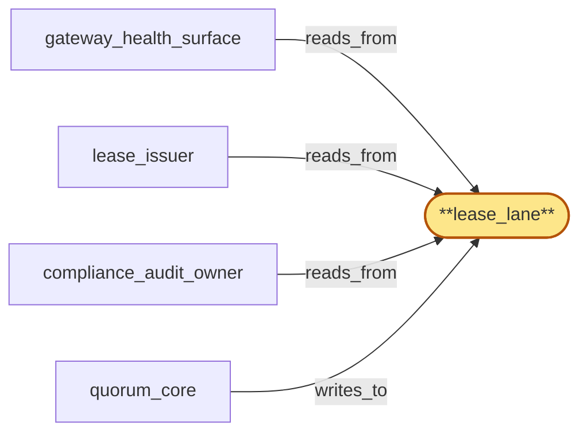

# lease_lane

> Build the lease lane:

## Properties

| Field | Value |
| --- | --- |
| Task | `lease_lane` |
| Scope | `region_coordinator` |
| Node | `lease_lane` |
| Node type | `Log` |
| Dependencies | `0` |
| Wave | `1` |

## Architecture

## Implementation summary

- Build the lease lane: Raft log for per-tenant lease issuance, prepared-window markers, lease re-issue substream events
- priority lane (preempts normal traffic when lease handoff active).

## Node definition (`lease_lane` — Log)

- Per-(tenant_key) lease state lane: lease-prepared, lease-activated, lease-renewed, lease-revoked, lease-superseded entries for each (tenant_key, lease_id)
- HLC-stamped handoff-fence records committed when ownership transfers
- audit-key DESTROYED events for tenant T committed by lifecycle_gate (PHASE B).
- Reserved consensus throughput sized for per-tenant lease ops including renewal cadence and bulk-offboarding revocation waves.
- Within reserved consensus throughput, lease_lane is partitioned into THREE priority sub-streams (s4-2, s4-5): (1) lease-revoke-priority sub-stream carrying lease-revoked, lease-revoke-during-erasure, force-revoke entries — a lease-revoke for tenant T MUST commit ahead of any lease-prepared for T regardless of arrival order
- cross-tenant entries preserve FIFO within sub-stream
- (2) lease-prepared sub-stream serializing M-of-regions ack-collection — entries carry an admission-deadline-HLC
- expired prepared entries MUST transition to prepared-expired, be reaped from lane head, and emit a prepared-expired audit entry referencing the originating M-of-regions ack window
- (3) lease-reissue sub-stream (introduced for compromise-revocation reissue work) carrying reissued lease-prepared and lease-activated entries on behalf of credential_roster's per-tenant reaffirmation-or-reissue tree — lease-reissue entries MUST be HLC-ordered after the originating compromise-revocation broadcast HLC and MUST NOT commit before any lease-revoke for the same tenant
- lease-reissue has its own bounded budget independent of lease-revoke-priority and lease-prepared. prepared-orphan and prepared-revoked terminal markers are also carried on the lease-prepared sub-stream (prepared-revoked is the s4-5 state denoting compromise-revocation invalidation atomic with the broadcast).
- Compaction retains the latest committed lease entry per (tenant_key) plus the trailing handoff-fence and any DESTROYED entry
- superseded lease history compacts at snapshot. Carries HLC stamps and schema_version tags.

## Requirements

### `r1` — r-s4-2-lease-lane-priority

**Summary:** lease_lane MUST provide two priority sub-streams within its reserved consensus throughput: a lease-revoke-priority sub-stream carrying lease-revoked, lease-revoke-during-erasure, and force-revoke entries, and a lease-prepared sub-stream carrying M-of-regions ack-collection. A lease-revoke for tenant T MUST commit ahead of any lease-prepared for T regardless of arrival order; cross-tenant entries preserve FIFO within sub-stream.

- Origin: `stressor:4:s4-lease-lane-hol`
- Targets: `lease_lane`
- Matched via: `lease_lane`
- Verifications:
  - Test lanes/lease/priority.rs asserts lease entries preempt normal traffic when handoff active.

### `r2` — r-s4-2-prepared-deadline-hlc

**Summary:** lease-prepared entries MUST carry an admission-deadline-HLC; expired prepared entries MUST transition to prepared-expired, be reaped from lane head, and emit a prepared-expired audit entry referencing the originating M-of-regions ack window.

- Origin: `stressor:4:s4-lease-lane-hol`
- Targets: `lease_lane`
- Matched via: `lease_lane`
- Verifications:
  - Test lanes/lease/prepared_deadline_hlc.rs asserts every prepared-window has an HLC deadline; expiry transitions to documented terminal.

### `r3` — r-s4-5-lease-reissue-substream

**Summary:** lease_lane MUST provide a third priority sub-stream lease-reissue (distinct from lease-revoke-priority and lease-prepared) with its own bounded budget; lease-reissue entries MUST be HLC-ordered after the compromise-revocation broadcast HLC and MUST NOT commit before any lease-revoke for the same tenant.

- Origin: `stressor:4:s4-compromise-revoke-lease-storm`
- Targets: `lease_lane`
- Matched via: `lease_lane`
- Verifications:
  - Test lanes/lease/reissue_substream.rs asserts re-issue events form a distinct substream with their own apply ordering.

## Outputs

| Path | Purpose |
| --- | --- |
| `crates/region_coordinator/src/lanes/lease.rs` | Lane state machine |

## Stack details

- openraft state machine 'lease_lane'; priority queueing; HLC-bounded prepared deadlines

## Acceptance criteria

### r-s4-2-lease-lane-priority

- Test lanes/lease/priority.rs asserts lease entries preempt normal traffic when handoff active.

### r-s4-2-prepared-deadline-hlc

- Test lanes/lease/prepared_deadline_hlc.rs asserts every prepared-window has an HLC deadline; expiry transitions to documented terminal.

### r-s4-5-lease-reissue-substream

- Test lanes/lease/reissue_substream.rs asserts re-issue events form a distinct substream with their own apply ordering.

## Related tasks (graph neighbours)

- [compliance_audit_owner](compliance_audit_owner.md)
- [gateway_health_surface](gateway_health_surface.md)
- [lease_issuer](lease_issuer.md)
- [quorum_core](quorum_core.md)

---

_Source of truth: `archi plan task show lease_lane`. Regenerate with `python3 tasks/_generate.py`._
