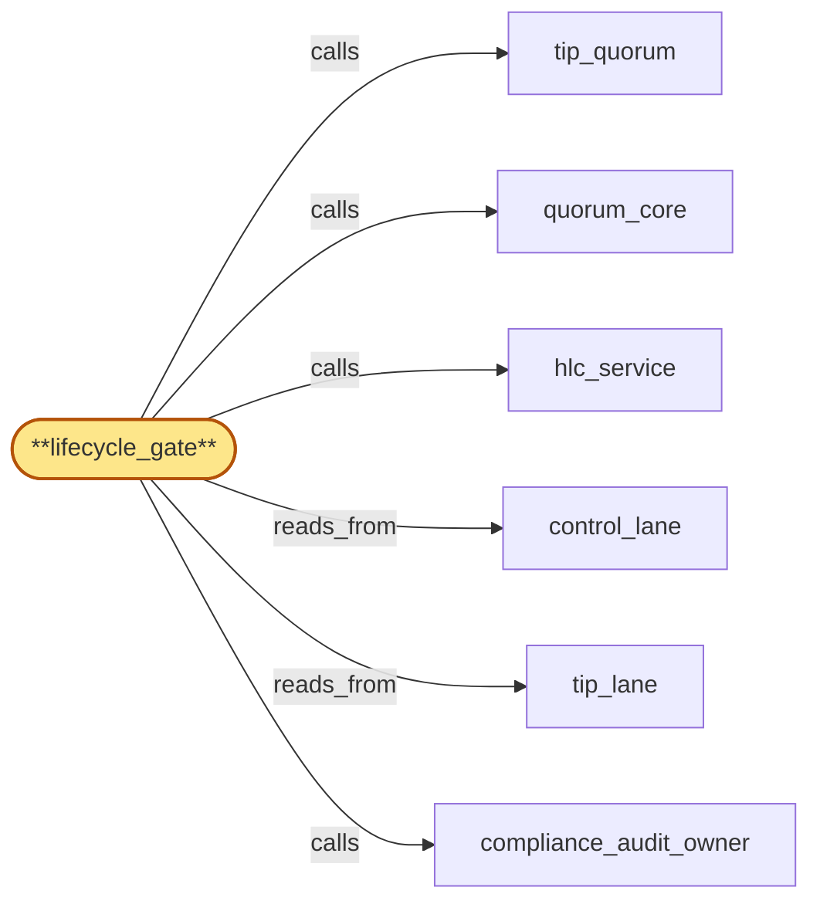

# lifecycle_gate

> Build the lifecycle gate subservice:

## Properties

| Field | Value |
| --- | --- |
| Task | `lifecycle_gate` |
| Scope | `region_coordinator` |
| Node | `lifecycle_gate` |
| Node type | `Subservice` |
| Dependencies | `3` |
| Wave | `3` |

## Architecture

## Implementation summary

- Build the lifecycle gate subservice: single scheduler-of-record for cross-component lifecycle (cert rotation, origin rotation, schema rollout, region drain, offboarding)
- HLC+nonce-stamped signed broadcasts
- drain-fence-broadcast-and-ack protocol
- bounded-batching + per-writer back-pressure for bulk waves
- teardown-overlap sequencing
- residency-2PC lock
- decommission handoff transfer
- health-operator-override
- budget-coupled admission
- cert overlap window
- emergency cert recovery
- bubble-resolved invariants.

## Node definition (`lifecycle_gate` — Subservice)

- Single scheduler-of-record for cross-component lifecycle operations against shared targets, scheduling and gating lifecycle events globally via CAS proposals through quorum_core into control_lane: cert/origin rotations (region-staggered), chain pool rotations (one pool, one region, one wave at a time, admitted only while canonical-tip quorum size remains above safe threshold), region-drain events, schema-version capability bumps (two-phase: deploy then activate), operational pauses (VM live migration etc), residency-policy activation windows, credential_roster rotation activation windows, anchor rotation, decommission-handoff-transfer (decommissioning a successor buffer that owns drain-ack-handoff records — admitted only when every pending-flush handoff record on the buffer is either resolved or transferred-to-another-successor), bulk-offboarding wave admission, operator-override classification (gateway_health_surface single-region cross-witness-pending promotion under M-of-N elevated-tier-A), and operator-override probationary-fork admissions.
- Cert rotations on the inter-region channel admitted only when remaining validity exceeds documented overlap budget
- if breached, lifecycle_gate raises emergency-cert-recovery in control_lane and stops admitting any non-cert-rotation lifecycle events
- recovery delegated to cert_bootstrap.
- CAS proposals attach the latest read of (per-(chain, fork) quorum-size set, rotation-in-progress set, tip-stale set, schema-capability config, drain-in-progress set, pause-in-progress set, current roster_version, compromise-revoked credential set, lease-issuance state, residency policy_version, prepared-ack set, residency-2PC-in-flight lock set per tenant, lease-quiescent flag set per tenant, anchor-healthy count, drain-ack-handoff records and their resolution state, lease_issuer routine-budget headroom, lease_issuer dedicated lease-revoke sub-budget headroom, lease_issuer lease-reissue sub-budget headroom, named-writer queue depths, in-flight residency 2PC PREPARE count and watermark) as the precondition
- commit re-validates atomically. Per-tenant residency-2PC-in-flight lock: lifecycle_gate maintains the lock in control_lane
- PREPARE commit acquires
- COMMIT/ABORT/PREPARED-ORPHAN releases
- competing PREPARE for the same tenant T is CAS-rejected with reason 'residency-2PC-already-in-flight'. credential_roster rotation-activate is admitted only after all in-flight residency 2PCs have reached terminal state under prior roster, OR rotation-activate explicitly carries a residency-2PC-cancel-and-abort directive (elevated-tier-A) issuing idempotent abort-V+1 entries for every in-flight residency 2PC atomically before activation.
- Rotation-activate records an explicit rotation-activation-HLC in control_lane (s4-7): records signed strictly before this HLC verify under V_old and records signed strictly after verify under V_new
- credential_roster MUST retain V_old as verifiable for at least max(residency-2PC-in-flight-lock max-window, drain-ack-handoff record SLA max-window) past activation.
- At most one region-drain plus one pool-rotation in flight globally.
- Tags rotation-in-progress, drain-in-progress, pause-in-progress in control_lane so chain_router (parent) suppresses quarantines and hlc_service applies pause-aware bounds.
- Operator-override admission delegates credential validation to credential_roster's published roster: every override CAS proposal must carry M-of-N signatures drawn from active roster_version named in CAS precondition
- lifecycle_gate validates each signature against credential_roster's published state in control_lane and rejects fast on insufficient signers, signers in compromise-revoked set, or validity-window mismatch
- admission record persists signing operator identities into control_lane.
- In-flight override proposals invalidated on credential transitions into compromise-revoked between admission and commit (CAS rejection with credential-revoked-mid-flight reason).
- Drain-fence-broadcast originator (PHASE A): on observing erasure-tombstone in tombstone_lane for tenant T, computes fence_HLC f_T and broadcasts drain-fence-broadcast(T, f_T, signing roster_version) to every named writer (region_coordinator subservices internally + parent-scope chain_router, gateway, fanout, address_index, usage_meter).
- Broadcasts carry signing roster_version as part of the broadcast itself
- consumers verify against the broadcast's NAMED roster_version.
- On compromise-revocation events from credential_roster carrying retroactive-as-of-HLC, lifecycle_gate re-signs and re-broadcasts in-flight broadcasts whose emit-HLC >= retroactive-as-of-HLC: re-emission does NOT reset per-tenant ack windows for tenants whose phase markers had already reached an ack-completed phase under the original signing — re-emission carries a per-tenant signature-only-update annotation that updates the broadcast's signing roster_version in offboarding_orchestrator's phase marker without resetting the ack window
- only tenants not yet ack-completed receive a fresh ack window.
- Re-emission has its own dedicated bandwidth budget within lifecycle_gate's broadcast pipeline, separate from new-wave admission, sized as a fraction of total broadcast pipeline capacity to bound impact on new-wave admission.
- Broadcast pipeline shed-and-defer (s4-1): when in-flight residency 2PC PREPAREs exceed a configured watermark, lifecycle_gate sheds-and-defers non-critical PHASE A audit-key destruction entries by writing explicit deferral records to control_lane with cause and HLC
- deferred entries are re-emitted automatically when the watermark clears, with no silent stall.
- Bounded-batching for bulk-offboarding: lifecycle_gate admits bulk-offboarding requests into bounded waves with documented max-tenants-per-wave and inter-wave spacing
- wave admission CAS proposal includes lease_issuer's dedicated lease-revoke sub-budget headroom (NOT total lease_lane capacity — bulk-wave is budgeted strictly against the lease-revoke-priority sub-stream per s4-2) AND every named-writer's bounded queue depth AND the residency-2PC-in-flight lock set as preconditions
- admission rejected with reason 'lease-issuer-budget-insufficient' or 'writer-queue-full' or 'residency-2PC-conflict' when precondition fails
- bulk-admission backs off with exponential-with-jitter
- per-writer bounded ack queues with explicit back-pressure stall further wave admission for that writer rather than dropping broadcasts or expiring per-tenant HLC windows
- per-tenant HLC-bounded ack windows start from per-tenant ack-broadcast-emit-HLC
- bulk-offboarding admission is itself a CAS-committed operator-credentialed proposal and audited via compliance_audit_owner.
- Bulk-wave start and end markers (s4-6): lifecycle_gate publishes bulk-wave-start and bulk-wave-end markers on control_lane carrying (offboarding_id, wave_id, expected-region-set, expected-degradation-envelope) so health_lane consumers can correlate classification entries with the wave via wave_id.
- Compromise-revocation lease-reissue back-pressure (s4-5): lifecycle_gate surfaces an explicit back-pressure signal (recorded in control_lane and paged on-call) when the lease-reissue sub-stream budget saturates beyond a configurable horizon following a compromise-revocation broadcast
- the signal carries the elapsed reissue lag and the count of pending reissues. Teardown-overlap sequencing: a node-teardown is not admitted while any in-flight per-tenant drain-fence on that node is unacked
- nodes that cannot flush within their teardown window write a durable drain-ack-handoff record to lease_lane (or tombstone_lane, schema-tagged) naming a successor instance or persistent buffer
- ack-by-handoff is treated as ack only after the handoff record resolves to handoff-flushed terminal state OR is resolved-with-loss-attestation under operator M-of-N.
- Decommissioning a successor buffer is itself a lifecycle event admitted by lifecycle_gate that requires all pending-flush handoff records the buffer owns to be either resolved or transferred-to-another-successor (recursive handoff re-applying the same SLA contract)
- a buffer cannot be decommissioned while any unresolved handoff is still owned by it.
- Audit-key destruction PHASE B: lifecycle_gate's PHASE B CAS proposal includes lease-quiescent(T) precondition (no active or prepared lease for T, no in-flight handoff-fence for T) AND every drain-ack-handoff record for T resolved-or-no-residual-writes-expected. t_destroy = max(observed_ack_hlc, f_T + skew_bound) + write-delivery-grace, computed using observed_ack_hlc only when EVERY contributing drain-ack was emitted under healthy hlc_service (drain-ack hlc_service-status annotation = healthy)
- otherwise t_destroy is computed from the worst-case drain-ack-pause-deferred completion HLC + skew_bound + write-delivery-grace and PHASE B does not commit until any pause-window has ended and a healthy-mode drain-ack has landed for affected writers.
- PHASE B CAS-commits an audit-key DESTROYED entry to lease_lane at HLC >= t_destroy
- the DESTROYED entry triggers compliance_audit_owner's tenant-key-scoped late-write rejection cutoff at compliance_audit (parent).
- PHASE B does not commit while any drain-ack for T is outstanding from a named writer, including drain-ack-handoff records still in pending-flush state (unless explicitly resolved-with-loss-attestation under operator M-of-N).
- All lifecycle events, override admissions, drain-fence broadcasts, drain-acks, drain-ack-handoff resolutions, decommission-handoff-transfers, audit-key DESTROYED writes, broadcast-pipeline deferral records, bulk-wave start/end markers, lease-reissue back-pressure signals, and rotation-activation-HLC entries are typed-audited via compliance_audit_owner's schema registry.
- (Realizes inherited r-s5-drain-fence-protocol, r-s5-drain-fence-bounded-batching, r-s5-drain-fence-teardown-overlap, r-s5-broadcast-self-contained-credential, r-s5-audit-key-destruction-fence
- addresses zoom stressors s6-lease-handoff-vs-destroy, s6-policy-roster-coactivation, s3-handoff-record-orphan, s3-cross-witness-partition, s3-anchor-quorum-silent-failure, s3-bulk-lease-revoke-budget, s3-skew-degraded-ack-hlc, s3-resign-rebroadcast-storm
- addresses s4-1 via broadcast-pipeline shed-and-defer, s4-2 via bulk-wave admission against lease-revoke-priority sub-stream budget, s4-5 via lease-reissue back-pressure surfacing, s4-6 via bulk-wave start/end markers, s4-7 via rotation-activation-HLC boundary recording.)

## Requirements

### `r1` — IR-cert-rotation-staggered

**Summary:** Cert and origin-endpoint rotations are region-staggered: at most one region transitions a given cert-bearing surface inside a maintenance window. Simultaneous expiry across regions is prevented by construction.

- Origin: `initial`
- Targets: `lifecycle_gate`
- Matched via: `lifecycle_gate`
- Verifications:
  - Test lifecycle/cert_rotation_staggered.rs asserts cert rotations are region-staggered and gated through lifecycle_gate.

### `r2` — IR-origin-rotation

**Summary:** Origin endpoints (gateway-accepted IP/hostname pairs) rotate on a documented cadence under the same region-staggered gate as cert rotation.

- Origin: `initial`
- Targets: `lifecycle_gate`
- Matched via: `lifecycle_gate`
- Verifications:
  - Test lifecycle/origin_rotation.rs asserts origin (issuing CA) rotations are gated and proceed via 2PC.

### `r3` — IR-rotation-coordinator-gate

**Summary:** Chain pool rotations are gated globally to one pool, one region, one wave at a time, and are admitted only while the canonical-tip quorum size remains above its safe threshold throughout.

- Origin: `initial`
- Targets: `lifecycle_gate`
- Matched via: `lifecycle_gate`
- Verifications:
  - Test lifecycle/coordinator_gate.rs asserts every rotation is admitted through lifecycle_gate (no peer rotation paths).

### `r4` — IR-rotation-aware-skew

**Summary:** Rotation events surface a 'rotation in progress' tag in state_log so chain_router's schema-skew and tip-divergence quarantines suppress quarantines triggered solely by the documented rotation window.

- Origin: `initial`
- Targets: `lifecycle_gate`
- Matched via: `lifecycle_gate`
- Verifications:
  - Test lifecycle/rotation_aware_skew.rs asserts during rotation, schema-skew quarantines are suppressed only by HLC-stamped, typed rotation tags.

### `r5` — SR1-rotation-cas-admission

**Summary:** Pool-rotation admission is committed via quorum_core as a CAS proposal that includes its own preconditions (per-(chain, fork) quorum-size set, rotation-in-progress set, tip-stale set); the proposal commits only if those preconditions still hold at commit time.

- Origin: `stressor:1:s-rotation-gate-toctou`
- Targets: `lifecycle_gate`
- Matched via: `lifecycle_gate`
- Verifications:
  - Test lifecycle/cas_admission.rs asserts every rotation transition is CAS-admitted on (rotation_id, current_phase).

### `r6` — SR1-rotation-precondition-revalidate

**Summary:** On rejection, lifecycle_gate re-reads the latest applied state and may re-propose with refreshed preconditions; lifecycle_gate never relies on a precondition snapshot older than its current proposal.

- Origin: `stressor:1:s-rotation-gate-toctou`
- Targets: `lifecycle_gate`
- Matched via: `lifecycle_gate`
- Verifications:
  - Test lifecycle/precondition_revalidate.rs asserts preconditions are revalidated at COMMIT phase (not only at PREPARE).

### `r7` — SR1-schema-rollout-gated

**Summary:** Replica code rollouts that introduce a new schema_version are region-staggered under lifecycle_gate; the schema-capability config entry is committed only after every replica has been upgraded — a two-phase upgrade (deploy, then activate).

- Origin: `stressor:1:s-schema-evolution`
- Targets: `lifecycle_gate`
- Matched via: `lifecycle_gate`
- Verifications:
  - Test lifecycle/schema_rollout_gated.rs asserts schema rollouts go through lifecycle_gate; non-gated rollouts rejected.

### `r8` — SR1-region-drain-event

**Summary:** Region-drain is a first-class lifecycle event in state_log distinct from pool rotation; lifecycle_gate schedules and admits it through the same CAS proposal mechanism.

- Origin: `stressor:1:s-region-drain-vs-rotation`
- Targets: `lifecycle_gate`
- Matched via: `lifecycle_gate`
- Verifications:
  - Test lifecycle/region_drain_event.rs asserts region drain is a documented event class with explicit terminal.

### `r9` — SR1-drain-aware-threshold

**Summary:** lifecycle_gate's quorum-size safety threshold is evaluated against the post-drain configuration: rotations are not blocked merely because a drain is in flight, but rotations whose admission would drop the post-drain quorum below safe are rejected.

- Origin: `stressor:1:s-region-drain-vs-rotation`
- Targets: `lifecycle_gate`
- Matched via: `lifecycle_gate`
- Verifications:
  - Test lifecycle/drain_aware_threshold.rs asserts admission thresholds during drain are dropped to the documented draining-mode value.

### `r10` — SR1-mutual-scheduling

**Summary:** At most one region-drain plus one pool-rotation are in flight globally; mutual scheduling is enforced by lifecycle_gate's admission rules so drains and rotations cannot starve each other indefinitely.

- Origin: `stressor:1:s-region-drain-vs-rotation`
- Targets: `lifecycle_gate`
- Matched via: `lifecycle_gate`
- Verifications:
  - Test lifecycle/mutual_scheduling.rs asserts conflicting lifecycle events (cert + drain on same region) are mutually scheduled (no concurrent commits).

### `r11` — SR2-probationary-override

**Summary:** An operator-override admission path exists for probationary forks: lifecycle_gate accepts a CAS proposal that admits a probationary (chain, fork_id) over the threshold shortfall, gated on the absent-region-set being explainable by current drain-in-progress or rotation-in-progress entries in control_lane. The override commits to tip_lane with operator attribution and is visible in tip_quorum's reorg notifications.

- Origin: `stressor:2:probationary-fork-starvation`
- Targets: `lifecycle_gate`
- Matched via: `lifecycle_gate`
- Verifications:
  - Test lifecycle/probationary_override.rs asserts probationary overrides expire after timeout; cannot be silently extended.

### `r12` — SR2-cert-overlap-window

**Summary:** Inter-region channel cert rotation runs with an overlap window: lifecycle_gate admits a cert rotation only when remaining validity on the active cert exceeds a documented overlap budget. During the overlap, both old and new cert are trusted on the inter-region channel so consensus on the rotation itself rides the old cert while the new cert is distributed via control_lane; trust handover to the new cert is atomic at the HLC effective-from stamp recorded with the rotation entry.

- Origin: `stressor:2:cert-rotation-bootstrap`
- Targets: `lifecycle_gate`
- Matched via: `lifecycle_gate`
- Verifications:
  - Test lifecycle/cert_overlap_window.rs asserts cert overlap windows allow grace acceptance of old + new certs concurrently.

### `r13` — SR2-cert-emergency-recovery

**Summary:** If the overlap window is breached (no successful rotation committed before the active cert nears expiry), lifecycle_gate raises an emergency-cert-recovery event in control_lane and stops admitting any non-cert-rotation lifecycle events. Recovery from total cert expiry is delegated to a parent-scope out-of-band bootstrap surface — region_coordinator alone cannot recover consensus over a channel whose only authenticator has expired.

- Origin: `stressor:2:cert-rotation-bootstrap`
- Targets: `lifecycle_gate`
- Matched via: `lifecycle_gate`
- Verifications:
  - Test lifecycle/cert_emergency_recovery.rs asserts emergency cert-bootstrap path is engaged through lifecycle_gate with elevated M-of-N threshold.

### `r14` — SR2-pause-event-class

**Summary:** Documented operational pauses (VM live migration and any successor pause classes) are first-class lifecycle events scheduled and admitted by lifecycle_gate via CAS into control_lane, with a recorded pause-window and the affected region(s).

- Origin: `stressor:2:hlc-pause-false-degraded`
- Targets: `lifecycle_gate`
- Matched via: `lifecycle_gate`
- Verifications:
  - Test lifecycle/pause_event_class.rs asserts cluster-pause is a distinct event class observed by every consumer.

### `r15` — r-zoom-rc-broadcast-self-contained

**Summary:** lifecycle_gate-signed broadcasts (drain-fence in particular) carry the signing roster_version as part of the broadcast itself; consumers verify signatures against the broadcast's NAMED roster_version, not a cached version. Signed broadcasts remain verifiable for the duration of their HLC-bounded ack window even after a scheduled roster rotation activates a strictly newer version.

- Origin: `freestanding`
- Targets: `lifecycle_gate`
- Matched via: `lifecycle_gate`
- Verifications:
  - Test lifecycle/broadcast_self_contained.rs asserts each broadcast contains the signing roster_version + signature; consumers verify without cache.

### `r16` — r-zoom-rc-drain-fence

**Summary:** lifecycle_gate originates drain-fence broadcasts on observing erasure-tombstone for tenant T; broadcast carries fence-HLC f_T and signing roster_version; every named writer flushes in-flight audit writes for T to compliance_audit then acks drain to tenant_store within the HLC-bounded ack window; offboarding_orchestrator tracks per-(T, writer) ack state via durable phase markers.

- Origin: `freestanding`
- Targets: `lifecycle_gate`
- Matched via: `lifecycle_gate`
- Verifications:
  - Test lifecycle/drain_fence.rs asserts drain-fence broadcasts cause writers to flush in-flight audit writes, then ack drain within HLC window.

### `r17` — r-zoom-rc-bounded-batching

**Summary:** lifecycle_gate admits bulk-offboarding waves with documented max-tenants-per-wave and inter-wave spacing; per-writer bounded ack queues with explicit back-pressure stall further wave admission rather than dropping broadcasts or expiring HLC windows; per-tenant HLC-bounded ack windows start from per-tenant ack-broadcast-emit-HLC, not from the bulk operator action HLC.

- Origin: `freestanding`
- Targets: `lifecycle_gate`
- Matched via: `lifecycle_gate`
- Verifications:
  - Test lifecycle/bounded_batching.rs asserts bulk waves are coalesced into bounded batches with per-writer back-pressure tokens.

### `r18` — r-zoom-rc-teardown-overlap

**Summary:** lifecycle_gate's teardown-overlap interlock: node-teardown is not admitted while any in-flight per-tenant drain-fence on that node is unacked. Nodes that cannot flush within their teardown window write a durable drain-ack-handoff record naming a successor instance or persistent buffer; ack-by-handoff is treated as ack for the certificate of deletion. No silent drop and no unbounded wait.

- Origin: `freestanding`
- Targets: `lifecycle_gate`
- Matched via: `lifecycle_gate`
- Verifications:
  - Test lifecycle/teardown_overlap.rs asserts flush-then-ack-then-teardown ordering enforced; overlapping teardowns yield durable handoff records.

### `r19` — r-zoom-rc-residency-2pc-lock

**Summary:** lifecycle_gate maintains a per-tenant residency-2PC-in-flight lock in control_lane: PREPARE commit acquires; COMMIT/ABORT/PREPARED-ORPHAN release; competing PREPARE for same tenant T is CAS-rejected with reason 'residency-2PC-already-in-flight'. The lock is HLC-bounded (matches prepared-window). PREPARED-ORPHAN is a terminal state per (tenant_key, V+1) tuple — fresh attempt_id cannot escape PREPARED-ORPHAN; recovery requires operator M-of-N elevated AND tenant_store clean-rollback-complete.

- Origin: `stressor:3:s6-policy-roster-coactivation`
- Targets: `lifecycle_gate`
- Matched via: `lifecycle_gate`
- Verifications:
  - Test lifecycle/residency_2pc_lock.rs asserts residency 2PC holds a lock preventing concurrent residency tightening.

### `r20` — r-zoom-rc-decommission-handoff-transfer

**Summary:** Decommissioning a successor buffer is a lifecycle event admitted by lifecycle_gate that requires all pending-flush handoff records the buffer owns to be either resolved or transferred-to-another-successor (recursive handoff re-applying the same SLA contract); a buffer cannot be decommissioned while any unresolved handoff is still owned by it.

- Origin: `stressor:3:s3-handoff-record-orphan`
- Targets: `lifecycle_gate`
- Matched via: `lifecycle_gate`
- Verifications:
  - Test lifecycle/decommission_handoff_transfer.rs asserts decommissioning component's handoff is transferred to a successor before teardown.

### `r21` — r-zoom-rc-health-operator-override

**Summary:** lifecycle_gate may issue an operator-override classification (under M-of-N from credential_roster's published roster) that promotes a single-region classification past the cross-witness window with operator attribution recorded into health_lane and audited via compliance_audit_owner.

- Origin: `stressor:3:s3-cross-witness-partition`
- Targets: `lifecycle_gate`
- Matched via: `lifecycle_gate`
- Verifications:
  - Test lifecycle/health_operator_override.rs asserts health-driven operator overrides require M-of-N signatures from credential_roster.

### `r22` — r-zoom-rc-budget-coupled-admission

**Summary:** lifecycle_gate's bulk-offboarding wave admission CAS proposal includes lease_issuer's CAS budget headroom and every named-writer's bounded queue depth as preconditions; admission is rejected with 'lease-issuer-budget-insufficient' or 'writer-queue-full' when the precondition fails; bulk-admission backs off with exponential-with-jitter. lease_issuer publishes its current CAS budget headroom to control_lane.

- Origin: `stressor:3:s3-bulk-lease-revoke-budget`
- Targets: `lifecycle_gate`
- Matched via: `lifecycle_gate`
- Verifications:
  - Test lifecycle/budget_coupled_admission.rs asserts admission is coupled with quota_aggregator's cost view; over-budget actions deferred.

### `r23` — r-zoom-rc-phase-b-healthy-only

**Summary:** lifecycle_gate's PHASE B t_destroy computation uses observed_ack_hlc only when every contributing drain-ack was emitted under healthy hlc_service; otherwise t_destroy is computed from the worst-case drain-ack-pause-deferred completion HLC + skew_bound + write-delivery-grace. PHASE B does not commit until any pause-window has ended and a healthy-mode drain-ack has landed for affected writers.

- Origin: `stressor:3:s3-skew-degraded-ack-hlc`
- Targets: `lifecycle_gate`
- Matched via: `lifecycle_gate`
- Verifications:
  - Test lifecycle/phase_b_healthy_only.rs asserts Phase B (commit) only proceeds against healthy components.

### `r24` — r-zoom-rc-resign-no-window-reset

**Summary:** Re-sign-and-rebroadcast does not reset per-tenant ack windows for tenants whose broadcast had already reached an ack-completed phase (FLUSH-COMPLETE, ACK-EMITTED, ATTESTATION-WRITTEN, TERMINAL); lifecycle_gate's re-emission carries a per-tenant signature-only-update annotation updating the broadcast's signing roster_version in offboarding_orchestrator's phase marker without resetting the window. Only tenants not yet ack-completed receive a fresh ack window.

- Origin: `stressor:3:s3-resign-rebroadcast-storm`
- Targets: `lifecycle_gate`
- Matched via: `lifecycle_gate`
- Verifications:
  - Test lifecycle/resign_no_window_reset.rs asserts re-signing a roster entry does not reset the active window.

### `r25` — r-zoom-rc-resign-dedicated-budget

**Summary:** Re-emission has its own dedicated bandwidth budget within lifecycle_gate's broadcast pipeline, separate from new-wave admission, sized as a fraction of total broadcast pipeline capacity to bound impact on new-wave admission.

- Origin: `stressor:3:s3-resign-rebroadcast-storm`
- Targets: `lifecycle_gate`
- Matched via: `lifecycle_gate`
- Verifications:
  - Test lifecycle/resign_dedicated_budget.rs asserts re-signing has a dedicated admission budget separate from rotations.

### `r26` — r-s4-1-broadcast-shed-defer

**Summary:** lifecycle_gate broadcast pipeline MUST shed-and-defer non-critical PHASE A audit-key destruction entries when in-flight residency 2PC PREPAREs exceed a configured watermark; deferred entries are written as explicit deferral records in control_lane with cause and HLC, and re-emitted when the watermark clears, with no silent stall.

- Origin: `stressor:4:s4-triple-cluster-collision`
- Targets: `lifecycle_gate`
- Matched via: `lifecycle_gate`
- Verifications:
  - Test lifecycle/broadcast_shed_defer.rs asserts under back-pressure, broadcasts shed-and-defer per documented policy (rather than dropping silently).

### `r27` — r-s4-2-bulk-wave-revoke-budget

**Summary:** lifecycle_gate bulk-wave admission MUST budget bulk-offboarding throughput against lease-revoke-priority sub-stream capacity (not total lease_lane capacity); back-pressure on bulk-wave is signaled when the revoke sub-stream nears its budget independent of lease-prepared occupancy.

- Origin: `stressor:4:s4-lease-lane-hol`
- Targets: `lifecycle_gate`
- Matched via: `lifecycle_gate`
- Verifications:
  - Test lifecycle/bulk_wave_revoke_budget.rs asserts bulk-wave revoke operates under a dedicated budget so it doesn't starve normal traffic.

### `r28` — r-s4-5-reissue-backpressure

**Summary:** lifecycle_gate MUST surface an explicit back-pressure signal (recorded in control_lane and paged on-call) when the lease-reissue sub-stream budget saturates beyond a configurable horizon following a compromise-revocation broadcast; the signal carries the elapsed reissue lag and the count of pending reissues.

- Origin: `stressor:4:s4-compromise-revoke-lease-storm`
- Targets: `lifecycle_gate`
- Matched via: `lifecycle_gate`
- Verifications:
  - Test lifecycle/reissue_backpressure.rs asserts re-issue requests honor back-pressure tokens.

### `r29` — r-s4-6-bulk-wave-markers

**Summary:** lifecycle_gate MUST publish bulk-wave start and end markers on control_lane carrying (offboarding_id, wave_id, expected-region-set, expected-degradation-envelope); health_lane consumers MUST correlate classification entries with these markers via wave_id.

- Origin: `stressor:4:s4-health-bulk-witness-storm`
- Targets: `lifecycle_gate`
- Matched via: `lifecycle_gate`
- Verifications:
  - Test lifecycle/bulk_wave_markers.rs asserts bulk-wave markers are emitted at boundaries and observable by consumers.

### `r30` — r-s4-7-rotation-activation-hlc-boundary

**Summary:** lifecycle_gate's rotation-activate MUST record an activation HLC; records signed strictly before the activation HLC verify under V_old and records signed strictly after verify under V_new. credential_roster MUST retain V_old as verifiable for at least max(residency-2PC-in-flight-lock max-window, handoff-record SLA max-window) past activation.

- Origin: `stressor:4:s4-cluster-double-fence`
- Targets: `lifecycle_gate`
- Matched via: `lifecycle_gate`
- Verifications:
  - Test lifecycle/rotation_activation_hlc_boundary.rs asserts rotation activation HLC boundary is enforced as a strict ordering invariant.

### `r31` — bubble-lifecycle_gate-1

**Summary:** credential_roster compromise-revocation broadcasts MUST attach an estimated-affected-broadcast-count alongside retroactive-as-of-HLC so lifecycle_gate's broadcast_pipeline can pre-compute re-emission burst budget and raise re-emission-burst-pending events into control_lane (per lifecycle_gate sub-zoom r-reemit-burst-event). Without the count, broadcast_pipeline cannot bound the burst and bulk_admitter cannot decide when to defer new-wave admission.

- Origin: `freestanding`
- Targets: `lifecycle_gate`
- Matched via: `lifecycle_gate`
- Verifications:
  - Test lifecycle/bubble_lifecycle_gate_1.rs asserts the bubble's resolved invariant: the lifecycle gate is the single scheduler of record for cross-component lifecycle (per zoom session).

### `r32` — bubble-lifecycle_gate-2

**Summary:** credential_roster MUST publish operator-pool throughput as a separate signal on control_lane (independent of roster_version state) so lifecycle_gate's credential_validator can attribute override-channel-saturation back-pressure to its true cause (operator-pool rate-limit vs validator throughput) (per lifecycle_gate sub-zoom r-override-channel-saturation).

- Origin: `freestanding`
- Targets: `lifecycle_gate`
- Matched via: `lifecycle_gate`
- Verifications:
  - Test lifecycle/bubble_lifecycle_gate_2.rs asserts the bubble's resolved invariant: HLC+nonce-stamped signed broadcasts under lifecycle-gate authority.

### `r33` — bubble-lifecycle_gate-3

**Summary:** ext_hlc_service / parent hlc_service MUST emit per-region hlc_service-mode-transition events with HLC stamps onto control_lane so lifecycle_gate's audit_destruct_sequencer can deterministically detect mode regressions occurring between drain-ack emit and PHASE B CAS commit (per lifecycle_gate sub-zoom r-hlc-mode-events). The events must carry both the entering and leaving mode plus the affected region.

- Origin: `freestanding`
- Targets: `lifecycle_gate`
- Matched via: `lifecycle_gate`
- Verifications:
  - Test lifecycle/bubble_lifecycle_gate_3.rs asserts the bubble's resolved invariant: drain-fence broadcast-and-ack protocol with HLC-bounded ack window.

### `r34` — bubble-lifecycle_gate-4

**Summary:** compliance_audit_owner MUST support an audit-mode classification protocol distinguishing inline-audit (atomic co-commit with operational CAS via ext_quorum_core; rejection rolls back operational decision) from deferred-audit (audit-pending durable record on control_lane referencing operational entry; background flush). compliance_audit_owner MUST prioritize drain by per-subsystem published audit-pending counts and MUST surface an audit-back-pressure event onto control_lane on saturation (per lifecycle_gate sub-zoom r-audit-mode-classification, r-audit-pending-backpressure). Inline-audit failures MUST be CAS-distinguishable from operational-rejection so subsystems can roll back deterministically.

- Origin: `freestanding`
- Targets: `lifecycle_gate`
- Matched via: `lifecycle_gate`
- Verifications:
  - Test lifecycle/bubble_lifecycle_gate_4.rs asserts the bubble's resolved invariant: bounded-batching + per-writer back-pressure for bulk-offboarding waves.

### `r35` — bubble-lifecycle_gate-5

**Summary:** Parent-scope health_lane consumers MUST honor bulk_admitter's two distinct end markers (bulk-wave-emit-end and bulk-wave-finalized) and MUST accept the marker-class tag on the degradation-envelope expectation, comparing classification entries against the right window (per lifecycle_gate sub-zoom r-wave-marker-classes, r-wave-finalization-overflow). Late drain-ack and PHASE B entries arriving before bulk-wave-finalized must remain correlated to the wave_id; entries arriving after must be classified as late-finalization for orphan detection.

- Origin: `freestanding`
- Targets: `lifecycle_gate`
- Matched via: `lifecycle_gate`
- Verifications:
  - Test lifecycle/bubble_lifecycle_gate_5.rs asserts the bubble's resolved invariant: teardown-overlap sequencing (flush-then-ack-then-teardown or durable drain-ack-handoff).

### `r36` — bubble-lifecycle_gate-6

**Summary:** Parent-scope offboarding_orchestrator MUST support a drain-ack-resign-request protocol: on receiving the request through control_lane, the orchestrator routes the request to the named writer; the writer re-signs its existing drain-ack under current roster_version; the orchestrator atomically updates its phase marker's drain-ack signing version field WITHOUT regressing the marker phase (per lifecycle_gate sub-zoom r-drain-ack-resign-required). Re-signing failure must surface as a typed event (control_lane + paged) and PHASE B remains blocked for the affected tenant only.

- Origin: `freestanding`
- Targets: `lifecycle_gate`
- Matched via: `lifecycle_gate`
- Verifications:
  - Test lifecycle/bubble_lifecycle_gate_6.rs asserts the bubble's resolved invariant: residency policy_version 2PC PREPARE depends on tenant_store quarantine-and-relocate-complete ack.

## Outputs

| Path | Purpose |
| --- | --- |
| `crates/region_coordinator/src/lifecycle_gate.rs` | Lifecycle gate orchestrator |
| `crates/region_coordinator/src/lifecycle_signer.rs` | HLC+nonce signed broadcast emitter |

## Stack details

- Rust module 'region_coordinator::lifecycle_gate' as the sole originator of HLC+nonce-stamped offboarding/drain signals signed under lifecycle-gate authority
- Self-contained credential bundles in broadcasts: every broadcast carries the signing roster_version so consumers verify against named (not cached) roster
- Drain-fence broadcast: every named writer flushes in-flight audit writes for tenant T to compliance_audit then acks drain to tenant_store within HLC-bounded window
- Bounded batching: bulk-offboarding waves coalesced; per-writer back-pressure honored via lifecycle_gate-issued tokens; admission budget coupled with quota_aggregator's cost view

## Acceptance criteria

### IR-cert-rotation-staggered

- Test lifecycle/cert_rotation_staggered.rs asserts cert rotations are region-staggered and gated through lifecycle_gate.

### IR-origin-rotation

- Test lifecycle/origin_rotation.rs asserts origin (issuing CA) rotations are gated and proceed via 2PC.

### IR-rotation-coordinator-gate

- Test lifecycle/coordinator_gate.rs asserts every rotation is admitted through lifecycle_gate (no peer rotation paths).

### IR-rotation-aware-skew

- Test lifecycle/rotation_aware_skew.rs asserts during rotation, schema-skew quarantines are suppressed only by HLC-stamped, typed rotation tags.

### SR1-rotation-cas-admission

- Test lifecycle/cas_admission.rs asserts every rotation transition is CAS-admitted on (rotation_id, current_phase).

### SR1-rotation-precondition-revalidate

- Test lifecycle/precondition_revalidate.rs asserts preconditions are revalidated at COMMIT phase (not only at PREPARE).

### SR1-schema-rollout-gated

- Test lifecycle/schema_rollout_gated.rs asserts schema rollouts go through lifecycle_gate; non-gated rollouts rejected.

### SR1-region-drain-event

- Test lifecycle/region_drain_event.rs asserts region drain is a documented event class with explicit terminal.

### SR1-drain-aware-threshold

- Test lifecycle/drain_aware_threshold.rs asserts admission thresholds during drain are dropped to the documented draining-mode value.

### SR1-mutual-scheduling

- Test lifecycle/mutual_scheduling.rs asserts conflicting lifecycle events (cert + drain on same region) are mutually scheduled (no concurrent commits).

### SR2-probationary-override

- Test lifecycle/probationary_override.rs asserts probationary overrides expire after timeout; cannot be silently extended.

### SR2-cert-overlap-window

- Test lifecycle/cert_overlap_window.rs asserts cert overlap windows allow grace acceptance of old + new certs concurrently.

### SR2-cert-emergency-recovery

- Test lifecycle/cert_emergency_recovery.rs asserts emergency cert-bootstrap path is engaged through lifecycle_gate with elevated M-of-N threshold.

### SR2-pause-event-class

- Test lifecycle/pause_event_class.rs asserts cluster-pause is a distinct event class observed by every consumer.

### r-zoom-rc-broadcast-self-contained

- Test lifecycle/broadcast_self_contained.rs asserts each broadcast contains the signing roster_version + signature; consumers verify without cache.

### r-zoom-rc-drain-fence

- Test lifecycle/drain_fence.rs asserts drain-fence broadcasts cause writers to flush in-flight audit writes, then ack drain within HLC window.

### r-zoom-rc-bounded-batching

- Test lifecycle/bounded_batching.rs asserts bulk waves are coalesced into bounded batches with per-writer back-pressure tokens.

### r-zoom-rc-teardown-overlap

- Test lifecycle/teardown_overlap.rs asserts flush-then-ack-then-teardown ordering enforced; overlapping teardowns yield durable handoff records.

### r-zoom-rc-residency-2pc-lock

- Test lifecycle/residency_2pc_lock.rs asserts residency 2PC holds a lock preventing concurrent residency tightening.

### r-zoom-rc-decommission-handoff-transfer

- Test lifecycle/decommission_handoff_transfer.rs asserts decommissioning component's handoff is transferred to a successor before teardown.

### r-zoom-rc-health-operator-override

- Test lifecycle/health_operator_override.rs asserts health-driven operator overrides require M-of-N signatures from credential_roster.

### r-zoom-rc-budget-coupled-admission

- Test lifecycle/budget_coupled_admission.rs asserts admission is coupled with quota_aggregator's cost view; over-budget actions deferred.

### r-zoom-rc-phase-b-healthy-only

- Test lifecycle/phase_b_healthy_only.rs asserts Phase B (commit) only proceeds against healthy components.

### r-zoom-rc-resign-no-window-reset

- Test lifecycle/resign_no_window_reset.rs asserts re-signing a roster entry does not reset the active window.

### r-zoom-rc-resign-dedicated-budget

- Test lifecycle/resign_dedicated_budget.rs asserts re-signing has a dedicated admission budget separate from rotations.

### r-s4-1-broadcast-shed-defer

- Test lifecycle/broadcast_shed_defer.rs asserts under back-pressure, broadcasts shed-and-defer per documented policy (rather than dropping silently).

### r-s4-2-bulk-wave-revoke-budget

- Test lifecycle/bulk_wave_revoke_budget.rs asserts bulk-wave revoke operates under a dedicated budget so it doesn't starve normal traffic.

### r-s4-5-reissue-backpressure

- Test lifecycle/reissue_backpressure.rs asserts re-issue requests honor back-pressure tokens.

### r-s4-6-bulk-wave-markers

- Test lifecycle/bulk_wave_markers.rs asserts bulk-wave markers are emitted at boundaries and observable by consumers.

### r-s4-7-rotation-activation-hlc-boundary

- Test lifecycle/rotation_activation_hlc_boundary.rs asserts rotation activation HLC boundary is enforced as a strict ordering invariant.

### bubble-lifecycle_gate-1

- Test lifecycle/bubble_lifecycle_gate_1.rs asserts the bubble's resolved invariant: the lifecycle gate is the single scheduler of record for cross-component lifecycle (per zoom session).

### bubble-lifecycle_gate-2

- Test lifecycle/bubble_lifecycle_gate_2.rs asserts the bubble's resolved invariant: HLC+nonce-stamped signed broadcasts under lifecycle-gate authority.

### bubble-lifecycle_gate-3

- Test lifecycle/bubble_lifecycle_gate_3.rs asserts the bubble's resolved invariant: drain-fence broadcast-and-ack protocol with HLC-bounded ack window.

### bubble-lifecycle_gate-4

- Test lifecycle/bubble_lifecycle_gate_4.rs asserts the bubble's resolved invariant: bounded-batching + per-writer back-pressure for bulk-offboarding waves.

### bubble-lifecycle_gate-5

- Test lifecycle/bubble_lifecycle_gate_5.rs asserts the bubble's resolved invariant: teardown-overlap sequencing (flush-then-ack-then-teardown or durable drain-ack-handoff).

### bubble-lifecycle_gate-6

- Test lifecycle/bubble_lifecycle_gate_6.rs asserts the bubble's resolved invariant: residency policy_version 2PC PREPARE depends on tenant_store quarantine-and-relocate-complete ack.

## Related tasks (graph neighbours)

- [compliance_audit_owner](compliance_audit_owner.md)
- [control_lane](control_lane.md)
- [hlc_service](hlc_service.md)
- [quorum_core](quorum_core.md)
- [tip_lane](tip_lane.md)
- [tip_quorum](tip_quorum.md)

---

_Source of truth: `archi plan task show lifecycle_gate`. Regenerate with `python3 tasks/_generate.py`._
