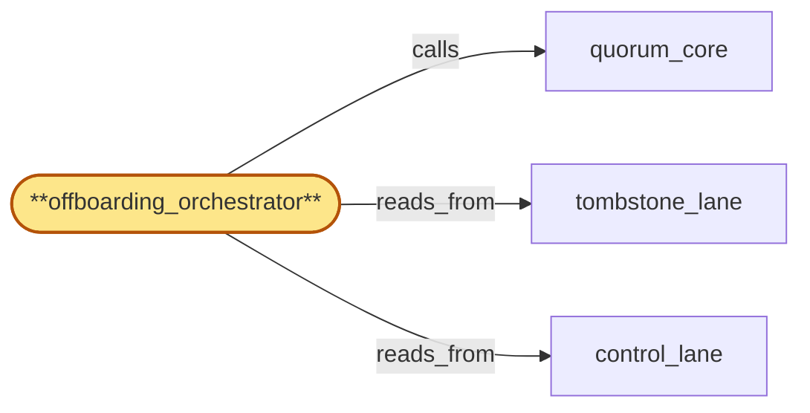

# offboarding_orchestrator

> Build the offboarding orchestrator:

## Properties

| Field | Value |
| --- | --- |
| Task | `offboarding_orchestrator` |
| Scope | `region_coordinator` |
| Node | `offboarding_orchestrator` |
| Node type | `Subservice` |
| Dependencies | `3` |
| Wave | `3` |

## Architecture

## Implementation summary

- Build the offboarding orchestrator: drives tenant teardown across components with idempotency keys, attestation timeouts, complete-with-exceptions semantics, erasure-vs-preservation precedence, dedup, component outage breaker, durable phase markers, handoff-record SLA, ack-HLC status, cert-of-deletion handling.

## Node definition (`offboarding_orchestrator` — Subservice)

- Driven by erasure-tombstone entries in tombstone_lane. Originates per-component offboarding signals to downstream parent components (gateway, fanout, address_index, chain_router, usage_meter) in a documented order
- signals are signed by lifecycle_gate's signing authority (carrying the broadcast's named roster_version) and rejected by parent components if they lack a current valid signature.
- Each signal carries an idempotency key (offboarding_id, component_id, attempt_id) committed via quorum_core into tombstone_lane so the canonical signal record survives leader change.
- Downstream components return the same attestation for the same key (cached) and dedupe by idempotency key.
- Maintains a durable per-(offboarding_id, component_id) apply-state phase marker on control_lane progressing through RECEIVED, FLUSH-IN-PROGRESS, FLUSH-COMPLETE, ACK-EMITTED, ATTESTATION-WRITTEN, TERMINAL
- never retracts a drain-ack already emitted
- missing intermediate phase implies re-emit not retraction. drain-acks carry the writer's hlc_service status (healthy / skew-degraded / pause-mode) at ack-emission time as a typed annotation, signed by the writer's hlc_service over the cert-bearing inter-region channel
- offboarding_orchestrator REJECTS drain-acks emitted under skew-degraded mode (treats as not-acked-yet
- writer must re-ack after returning to healthy state). Pause-mode writers emit drain-ack-pause-deferred records carrying pause-window HLC bounds
- ack-by-handoff with pause-window-end as deferred-completion HLC. drain-ack-handoff records are first-class durable obligations: pending-flush state with HLC-bounded flush deadline at commit
- named successor writes handoff-accepted entry referencing record-id
- on flush completion successor commits handoff-flushed entry containing flushed-write attestation
- on deadline expiry without handoff-flushed, lifecycle_gate raises handoff-overdue alarm and the certificate-of-deletion exception register entry escalates from handoff-pending to handoff-overdue-investigation-required
- resolution-with-loss-attestation requires operator M-of-N. drain-ack-handoff records additionally embed the roster_version under which they were signed AND the rotation-activation-HLC observed at signing time, so cross-version verification on replay (across roster rotation activation boundaries) is unambiguous (s4-7).
- DRAIN-ACK-RESIGN-REQUEST PROTOCOL (bubble-lifecycle_gate-6): when a retroactive compromise-revocation invalidates the signature on an already-emitted drain-ack (lifecycle_gate observes the revocation's retroactive-as-of-HLC <= drain-ack emit-HLC and the drain-ack signing roster_version is in the compromised set), lifecycle_gate publishes a typed drain-ack-resign-request entry on control_lane naming (offboarding_id, tenant_id, component_id, named-writer, current roster_version). offboarding_orchestrator consumes the request and routes it to the named writer through the same push-and-acknowledge channel used for drain-fence broadcasts.
- The writer re-signs its EXISTING drain-ack under the current roster_version (no flush re-execution
- the structural ack was correct, only the signature is restated) and returns a drain-ack-resigned response carrying the new signature and the originating drain-ack's content-hash for binding. offboarding_orchestrator commits a drain-ack-resigned entry on control_lane and atomically updates the per-(offboarding_id, component_id) phase marker's drain-ack signing version field to current roster_version WITHOUT regressing the marker phase — phase remains at ACK-EMITTED or further (ATTESTATION-WRITTEN, TERMINAL)
- this is a signature-only-update on the marker, never a phase rewind.
- Re-signing failure (writer unavailable beyond a documented re-sign window, signer no longer authorized under current roster, content-hash mismatch) surfaces a typed drain-ack-resign-failed event on BOTH control_lane and the on-call paged channel
- for the affected (offboarding_id, tenant_id) PHASE B audit-key destruction remains blocked at the tenant_id granularity ONLY (other tenants' PHASE B unaffected) until either the writer re-signs successfully OR an operator-attested resolved-with-loss-attestation override (elevated-tier-A from credential_roster's active roster_version) is recorded in control_lane referencing the failed re-sign event.
- The re-sign protocol is idempotent on (offboarding_id, component_id, drain-ack content-hash, target roster_version): a duplicate request is satisfied by the existing drain-ack-resigned record, not by re-asking the writer. drain-ack-handoff records also support re-sign: when the underlying drain-ack is re-signed, the embedded roster_version on the handoff record is updated as a signature-only-update with no change to handoff lifecycle state.
- Each component has a documented attestation SLO
- on timeout, offboarding_orchestrator records a best-effort attestation with evidence and escalation owner instead of waiting indefinitely. Tracks per-downstream-component best-effort-attestation rate
- crossing a documented breaker threshold opens a component-outage state for that component: new offboarding signals are suspended, an alert is raised, erasure tombstones touching that component are held in queued-pending-component-recovery state in tombstone_lane.
- Breaker closes when the component's attestation SLO is again being met for a documented recovery window
- queued-pending entries drain via normal offboarding flow. Bulk-offboarding waves are admitted from lifecycle_gate's bounded-batching pipeline
- offboarding_orchestrator consumes from per-writer back-pressure-aware queue and stalls further wave admission for that writer rather than dropping broadcasts or expiring HLC windows
- per-tenant HLC-bounded ack windows start from per-tenant ack-broadcast-emit-HLC.
- Drain-fence-coordinator role: for each drain-fence broadcast(T, f_T, signing roster_version) issued by lifecycle_gate, offboarding_orchestrator tracks per-(T, named-writer) ack state, surfaces unacked writers into the certificate-of-deletion exception register, ensures writer's flush-then-ack-then-teardown ordering by consulting lifecycle_gate's teardown-admission interlock.
- Certificate-of-deletion structure (s4-1): each issued certificate-of-deletion is a structured record carrying a deletion_status enum value drawn from {CLEAN, PARTIAL_HANDOFF_LOSS, RESIDENCY_ABORTED, AUDIT_KEY_PHASE_A_PENDING, COMPOUND} together with a required terminal-fact roll-up over (per-component phase markers, residency 2PC outcome from residency_publisher's control_lane records, audit-key destruction phase observed in control_lane, drain-ack-handoff record SLA terminal state per (offboarding_id, tenant_id, component_id))
- the enum reflects the worst-class terminal fact (COMPOUND when more than one non-CLEAN class applies). offboarding_orchestrator MUST refuse to issue a certificate-of-deletion while ANY drain-ack-handoff record SLA for the (offboarding_id, tenant_id) is non-terminal, unless an explicit operator-attested resolved-with-loss-attestation override (signed under elevated-tier-A drawn from credential_roster's active roster_version) is recorded in control_lane and referenced by the certificate.
- The aggregate certificate is issued in 'complete-with-exceptions' state when every component has timely attestation or recorded best-effort attestation with evidence
- exceptions are tracked in a separate exception register on control_lane with their own SLA on resolution.
- Where a preservation hold (parent R-preservation-hold) covers a data class that erasure would touch, the affected component returns 'preservation-blocked' attestation — a recognized terminal state.
- Incoming attestations dedupe by idempotency key.
- Once a writer ack reaches FLUSH-COMPLETE on its phase marker, offboarding_orchestrator updates control_lane atomically
- observed_ack_hlc for the slowest writer is consumed by lifecycle_gate's PHASE B audit-key destruction t_destroy computation only when EVERY contributing drain-ack was emitted under healthy hlc_service.
- (Realizes IR-offboarding-teardown and the stalled-offboarding / attestation-replay derivations
- integrates Session 5 drain-fence pipeline contracts r-s5-drain-fence-protocol, r-s5-drain-fence-bounded-batching, r-s5-drain-fence-teardown-overlap, and the per-(offboarding_id, component_id) durable phase marker contract with no-retract semantics
- addresses zoom stressors s3-handoff-record-orphan via handoff-record SLA lifecycle, s3-skew-degraded-ack-hlc via hlc_service-status annotations on drain-acks
- addresses s4-1 via structured certificate-of-deletion with deletion_status enum and handoff-non-terminal block, s4-7 via roster_version + rotation-activation-HLC stamping on handoff records
- satisfies bubble-lifecycle_gate-6 via drain-ack-resign-request protocol with signature-only-update on phase markers, idempotent on (offboarding_id, component_id, drain-ack content-hash, target roster_version), and per-tenant PHASE B blocking on re-sign failure.)

## Requirements

### `r1` — IR-offboarding-teardown

**Summary:** Tenant offboarding triggers an end-to-end teardown sequence: gateway closes subscriptions with structured reason, fanout drops them, address_index tombstones watch claims, chain_router cancels in-flight long-RPCs, usage_meter freezes the cost record. Per-component offboarding attestations are collected into the compliance audit trail.

- Origin: `initial`
- Targets: `offboarding_orchestrator`
- Matched via: `offboarding_orchestrator`
- Verifications:
  - Test offboarding/teardown.rs asserts teardown drives every component to terminal phase and writes the certificate-of-deletion to compliance_audit.

### `r2` — SR1-attestation-timeout

**Summary:** Each downstream component participating in offboarding teardown has a documented attestation SLO; on timeout, offboarding_orchestrator records a best-effort attestation with evidence and escalation owner instead of waiting indefinitely.

- Origin: `stressor:1:s-stalled-offboarding`
- Targets: `offboarding_orchestrator`
- Matched via: `offboarding_orchestrator`
- Verifications:
  - Test offboarding/attestation_timeout.rs asserts attestation timeout per component; on expiry, complete-with-exceptions path engaged.

### `r3` — SR1-complete-with-exceptions

**Summary:** The aggregate certificate of deletion can be issued in a documented 'complete-with-exceptions' state where every component has either a timely attestation or a recorded best-effort attestation with evidence; exceptions are tracked in a separate register with their own SLA on resolution.

- Origin: `stressor:1:s-stalled-offboarding`
- Targets: `offboarding_orchestrator`
- Matched via: `offboarding_orchestrator`
- Verifications:
  - Test offboarding/complete_with_exceptions.rs asserts partial-with-witnesses certificate is produced when some components miss attestation.

### `r4` — SR1-erasure-preservation-precedence

**Summary:** Where a preservation hold (parent R-preservation-hold) covers a data class that erasure would touch, the affected component returns a 'preservation-blocked' attestation with the hold reference; this is a recognized terminal state for that component's attestation rather than a stall.

- Origin: `stressor:1:s-stalled-offboarding`
- Targets: `offboarding_orchestrator`
- Matched via: `offboarding_orchestrator`
- Verifications:
  - Test offboarding/erasure_preservation_precedence.rs asserts preservation-hold blocks erasure cascade; documented terminal recorded.

### `r5` — SR1-idempotency-keys

**Summary:** Every offboarding signal from offboarding_orchestrator to a downstream component carries an idempotency key (offboarding_id, component_id, attempt_id) committed via quorum_core's tombstone-lane so the signal survives leader change.

- Origin: `stressor:1:s-attestation-replay`
- Targets: `offboarding_orchestrator`
- Matched via: `offboarding_orchestrator`
- Verifications:
  - Test offboarding/idempotency_keys.rs asserts every signal carries (offboarding_id, component_id, attempt_id) and is deduped.

### `r6` — SR1-attestation-dedup

**Summary:** offboarding_orchestrator dedupes incoming attestations by idempotency key before aggregating into the certificate of deletion; duplicate attestations land but only the first is counted.

- Origin: `stressor:1:s-attestation-replay`
- Targets: `offboarding_orchestrator`
- Matched via: `offboarding_orchestrator`
- Verifications:
  - Test offboarding/attestation_dedup.rs asserts duplicate attestations are deduped without breaking the chain.

### `r7` — SR2-component-outage-breaker

**Summary:** offboarding_orchestrator tracks per-downstream-component best-effort-attestation rate. Crossing a documented breaker threshold opens a component-outage state: new offboarding signals for that component are suspended, a component-outage alert is raised, and erasure tombstones that would touch the component's data class are held in a queued-pending-component-recovery state in tombstone_lane rather than rapidly accumulating best-effort attestations.

- Origin: `stressor:2:best-effort-cascade`
- Targets: `offboarding_orchestrator`
- Matched via: `offboarding_orchestrator`
- Verifications:
  - Test offboarding/component_outage_breaker.rs asserts a circuit-breaker engages for outaged components.

### `r8` — r-zoom-rc-phase-markers

**Summary:** offboarding_orchestrator maintains per-(offboarding_id, component_id) durable phase markers (RECEIVED, FLUSH-IN-PROGRESS, FLUSH-COMPLETE, ACK-EMITTED, ATTESTATION-WRITTEN, TERMINAL) in control_lane; never retracts a drain-ack already emitted for that key; observed_ack_hlc for the slowest writer is consumed by lifecycle_gate's PHASE B audit-key destruction t_destroy computation.

- Origin: `freestanding`
- Targets: `offboarding_orchestrator`
- Matched via: `offboarding_orchestrator`
- Verifications:
  - Test offboarding/phase_markers.rs asserts durable per-(offboarding_id, component_id) phase markers.

### `r9` — r-zoom-rc-handoff-record-sla

**Summary:** drain-ack-handoff records are first-class durable obligations with their own SLA-tracked lifecycle: pending-flush state with HLC-bounded flush deadline at commit; named successor writes handoff-accepted entry referencing record-id; on flush completion successor commits handoff-flushed entry containing flushed-write attestation; on deadline expiry without handoff-flushed, lifecycle_gate raises handoff-overdue alarm and certificate-of-deletion exception register entry escalates from handoff-pending to handoff-overdue-investigation-required.

- Origin: `stressor:3:s3-handoff-record-orphan`
- Targets: `offboarding_orchestrator`
- Matched via: `offboarding_orchestrator`
- Verifications:
  - Test offboarding/handoff_record_sla.rs asserts handoff records meet documented SLA.

### `r10` — r-zoom-rc-ack-hlc-status

**Summary:** drain-acks carry the writer's hlc_service status (healthy / skew-degraded / pause-mode) at ack-emission time as a typed annotation, signed by the writer's hlc_service over the cert-bearing inter-region channel. offboarding_orchestrator rejects drain-acks emitted under skew-degraded; writer must re-ack after returning to healthy state. Pause-mode writers emit drain-ack-pause-deferred records carrying pause-window HLC bounds; ack-by-handoff with pause-window-end as deferred-completion HLC.

- Origin: `stressor:3:s3-skew-degraded-ack-hlc`
- Targets: `offboarding_orchestrator`
- Matched via: `offboarding_orchestrator`
- Verifications:
  - Test offboarding/ack_hlc_status.rs asserts every ack carries HLC + status (RECEIVED, FLUSH-IN-PROGRESS, FLUSH-COMPLETE, ACK-EMITTED, ATTESTATION-WRITTEN, TERMINAL).

### `r11` — r-s4-1-cert-of-deletion-status

**Summary:** offboarding_orchestrator's certificate-of-deletion MUST include a structured deletion_status enum (CLEAN | PARTIAL_HANDOFF_LOSS | RESIDENCY_ABORTED | AUDIT_KEY_PHASE_A_PENDING | COMPOUND) with terminal-fact roll-up over per-component phase markers, residency 2PC outcome, audit-key destruction phase, and handoff-record SLA terminal state per (offboarding_id, tenant_id, component_id).

- Origin: `stressor:4:s4-triple-cluster-collision`
- Targets: `offboarding_orchestrator`
- Matched via: `offboarding_orchestrator`
- Verifications:
  - Test offboarding/cert_of_deletion_status.rs asserts the cert-of-deletion has explicit status enum (full-ack / partial-with-witnesses / erasure-incomplete).

### `r12` — r-s4-1-cert-handoff-block

**Summary:** offboarding_orchestrator MUST refuse to issue a certificate-of-deletion while any handoff-record SLA for the (offboarding_id, tenant_id) is non-terminal, unless an explicit operator-attested resolved-with-loss-attestation override (signed under elevated-tier-A) is recorded in control_lane and referenced in the certificate.

- Origin: `stressor:4:s4-triple-cluster-collision`
- Targets: `offboarding_orchestrator`
- Matched via: `offboarding_orchestrator`
- Verifications:
  - Test offboarding/cert_handoff_block.rs asserts cert handoff is blocked until all expected acks land or attestation timeout fires.

### `r13` — r-s4-7-handoff-record-roster-stamp

**Summary:** drain-ack-handoff records MUST embed the roster_version under which they were signed AND the rotation-activation-HLC observed at signing time, so cross-version verification is unambiguous on replay.

- Origin: `stressor:4:s4-cluster-double-fence`
- Targets: `offboarding_orchestrator`
- Matched via: `offboarding_orchestrator`
- Verifications:
  - Test offboarding/handoff_record_roster_stamp.rs asserts handoff records carry the signing roster_version stamp.

## Outputs

| Path | Purpose |
| --- | --- |
| `crates/region_coordinator/src/offboarding.rs` | Orchestrator |

## Stack details

- Rust module 'region_coordinator::offboarding' issuing lifecycle-gate-signed offboarding signals; awaits per-(offboarding_id, component_id) acks within HLC window

## Acceptance criteria

### IR-offboarding-teardown

- Test offboarding/teardown.rs asserts teardown drives every component to terminal phase and writes the certificate-of-deletion to compliance_audit.

### SR1-attestation-timeout

- Test offboarding/attestation_timeout.rs asserts attestation timeout per component; on expiry, complete-with-exceptions path engaged.

### SR1-complete-with-exceptions

- Test offboarding/complete_with_exceptions.rs asserts partial-with-witnesses certificate is produced when some components miss attestation.

### SR1-erasure-preservation-precedence

- Test offboarding/erasure_preservation_precedence.rs asserts preservation-hold blocks erasure cascade; documented terminal recorded.

### SR1-idempotency-keys

- Test offboarding/idempotency_keys.rs asserts every signal carries (offboarding_id, component_id, attempt_id) and is deduped.

### SR1-attestation-dedup

- Test offboarding/attestation_dedup.rs asserts duplicate attestations are deduped without breaking the chain.

### SR2-component-outage-breaker

- Test offboarding/component_outage_breaker.rs asserts a circuit-breaker engages for outaged components.

### r-zoom-rc-phase-markers

- Test offboarding/phase_markers.rs asserts durable per-(offboarding_id, component_id) phase markers.

### r-zoom-rc-handoff-record-sla

- Test offboarding/handoff_record_sla.rs asserts handoff records meet documented SLA.

### r-zoom-rc-ack-hlc-status

- Test offboarding/ack_hlc_status.rs asserts every ack carries HLC + status (RECEIVED, FLUSH-IN-PROGRESS, FLUSH-COMPLETE, ACK-EMITTED, ATTESTATION-WRITTEN, TERMINAL).

### r-s4-1-cert-of-deletion-status

- Test offboarding/cert_of_deletion_status.rs asserts the cert-of-deletion has explicit status enum (full-ack / partial-with-witnesses / erasure-incomplete).

### r-s4-1-cert-handoff-block

- Test offboarding/cert_handoff_block.rs asserts cert handoff is blocked until all expected acks land or attestation timeout fires.

### r-s4-7-handoff-record-roster-stamp

- Test offboarding/handoff_record_roster_stamp.rs asserts handoff records carry the signing roster_version stamp.

## Related tasks (graph neighbours)

- [control_lane](control_lane.md)
- [quorum_core](quorum_core.md)
- [tombstone_lane](tombstone_lane.md)

---

_Source of truth: `archi plan task show offboarding_orchestrator`. Regenerate with `python3 tasks/_generate.py`._
