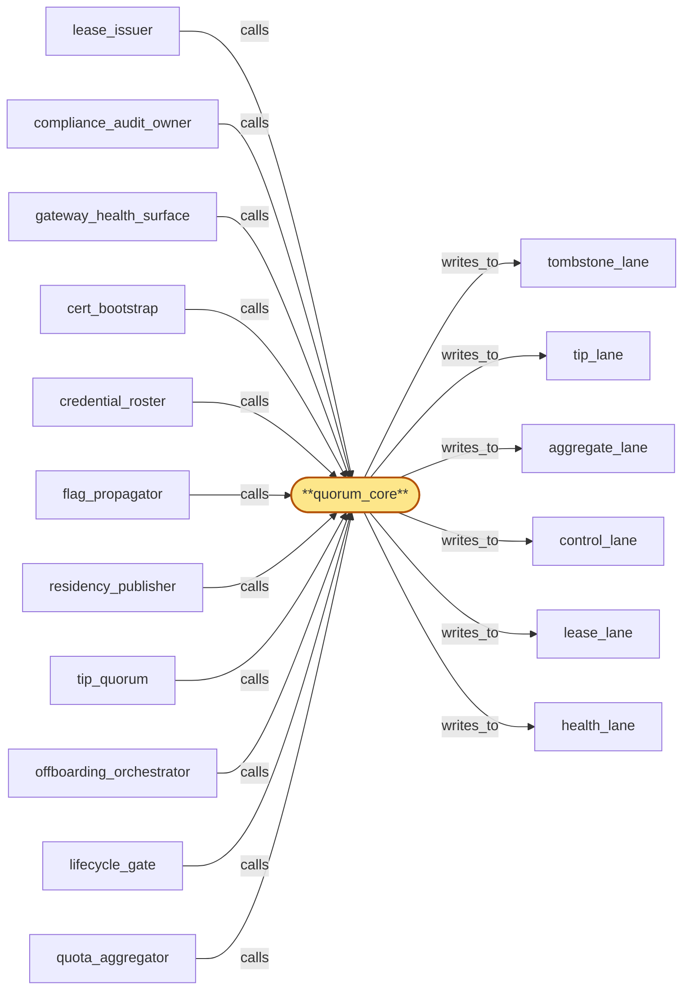

# quorum_core

> Build the openraft cluster core:

## Properties

| Field | Value |
| --- | --- |
| Task | `quorum_core` |
| Scope | `region_coordinator` |
| Node | `quorum_core` |
| Node type | `Subservice` |
| Dependencies | `6` |
| Wave | `2` |

## Architecture

## Implementation summary

- Build the openraft cluster core: leader election, log replication, snapshot install, partition handling, CAS admission/back-off, HLC-stamp validation, snapshot atomicity. Surfaces a per-lane apply pipeline.

## Node definition (`quorum_core` — Subservice)

- Consensus engine (Raft/multi-Paxos style) deployed as a quorum across regions
- provides the not-itself-a-SPOF property of region_coordinator.
- Maintains separate write-class lanes (tombstone_lane, tip_lane, aggregate_lane, control_lane, lease_lane, health_lane) each with reserved consensus throughput and a documented per-class SLO so head-of-line blocking is contained within a lane.
- Proposals are CAS: callers attach a precondition payload (latest-applied lane heads, or named state-snapshot keys)
- commit succeeds only if preconditions still hold at commit time.
- CAS rejection on precondition-violation and CAS rejection on leader-change are returned as distinct error codes — proposers (lifecycle_gate, quota_aggregator, tip_quorum, residency_publisher, flag_propagator, offboarding_orchestrator, lease_issuer, gateway_health_surface) apply exponential backoff with jitter on either, and treat leader-change as transient rather than immediately re-proposing with stale preconditions. quorum_core enforces a per-proposer in-flight CAS budget and a global CAS admission rate so a thrashing proposer cannot saturate consensus throughput
- over-budget proposals are rejected fast with a retryable-with-backoff signal. Entries are tagged with schema_version
- admission of a new schema_version is itself a quorum-committed capability config entry into control_lane — leaders restrict writes to the previous schema_version until that config commits.
- Every lane entry carries an HLC stamp captured at write time
- quorum_core validates the stamp at commit time and rejects entries whose stamp is missing or beyond max-allowed-delta from the current HLC, so lane consumers can rely on stamps for cross-lane happens-before reconstruction.
- While the leader's hlc_service is in skew-degraded mode, quorum_core suspends admission of entry kinds that participate in security-critical cross-lane happens-before reconstruction (revocation-then-attestation, erasure-tombstone-then-offboarding-attestation, fast-path flag-applied attestations).
- HLC-degraded interlock classification (s4-4) extended to the new lanes: lease_lane entries {lease-prepared, lease-revoke, lease-revoke-during-erasure, force-revoke, prepared-orphan, prepared-expired, prepared-revoked, lease-reissue} and health_lane entries {partial-trust-transition, classification-pending, classification-witness-timeout, anchor-quorum-degraded, region-set-failover} are classified as security-critical.
- Under HLC-degraded mode, security-critical entries on these lanes are suspended (NOT committed) and a deferral record is written to control_lane. lease-revoke (and lease-revoke-during-erasure) entries retain their lease-revoke-priority semantics and are not subject to the suspension as a class but MUST be HLC-stamp-revalidated against hlc_service immediately before commit
- revalidation failure transitions the entry to revoke-pending-hlc-recovery and emits a deferral record.
- Other admissions carry an HLC-degraded annotation visible to consumers.
- Snapshot+truncate at watermark intervals: replicas catch up via snapshot transfer plus log-tail rather than full-log replay.
- Snapshot install on a replica is atomic via an intent-then-commit protocol: the replica writes a snapshot-installing intent marker before any state mutation, replaces state files, then writes a snapshot-commit marker
- on restart, an intent without matching commit forces full discard of partial snapshot state and re-fetch from quorum.
- A replica with an in-progress or failed snapshot install enters a NEEDS_SNAPSHOT state visible to the quorum: it does not vote, does not serve reads (including partition-stale reads), and does not count toward the quorum-size threshold until snapshot install commits and log-tail catch-up completes.
- On network partition, minority-region quorum_core replicas reject proposals fast with a retryable-on-quorum-region signal and serve reads from locally-applied lane state with a partition-stale freshness annotation
- bounded-watermark input buffers absorb non-discardable inputs (with overflow policy: drop-with-loss-attestation for low-severity, alert-escalation for high-severity)
- on heal, buffered work is replayed via quorum_core with idempotency keys so duplicates land but only commit once. Inter-region channel is a cert-bearing surface (parent R-cert-inventory).

## Requirements

### `r1` — IR-not-spof

**Summary:** region_coordinator is logically a single global service but physically deployed as a quorum across regions: failure of any single region or replica does not cause loss of canonical state or progress, as long as a quorum survives.

- Origin: `initial`
- Targets: `quorum_core`
- Matched via: `quorum_core`
- Verifications:
  - Test quorum_core/not_spof.rs asserts the cluster tolerates loss of any single region; quorum holds.

### `r2` — SR1-partition-degraded-read

**Summary:** On a network partition, minority-region subservices serve reads from locally-applied state_log with an explicit 'partition-stale' freshness annotation; clients distinguish locally-fresh from globally-fresh state.

- Origin: `stressor:1:s-quorum-partition`
- Targets: `quorum_core`
- Matched via: `quorum_core`
- Verifications:
  - Test quorum_core/partition_degraded_read.rs asserts a partitioned region serves degraded reads from last committed local view.

### `r3` — SR1-partition-proposal-reject

**Summary:** Proposals originating in a minority region are rejected fast with a retryable-on-quorum-region signal rather than buffered indefinitely; upstream uses the signal to shed load.

- Origin: `stressor:1:s-quorum-partition`
- Targets: `quorum_core`
- Matched via: `quorum_core`
- Verifications:
  - Test quorum_core/partition_proposal_reject.rs asserts proposals from minority partition are rejected.

### `r4` — SR1-partition-input-buffer

**Summary:** Inputs that cannot be discarded (usage_meter deltas, chain_router head observations, erasure tombstones) buffer in the minority region under a bounded watermark with an explicit overflow policy (drop-with-loss-attestation for low-severity, alert-escalation for high-severity).

- Origin: `stressor:1:s-quorum-partition`
- Targets: `quorum_core`
- Matched via: `quorum_core`
- Verifications:
  - Test quorum_core/partition_input_buffer.rs asserts inputs during partition land in a documented buffer with bound.

### `r5` — SR1-partition-heal-replay

**Summary:** On partition heal, buffered minority-region work is replayed via quorum_core with idempotency keys so duplicates can land but only commit once; ordering is reconstructed from HLC stamps captured at input time.

- Origin: `stressor:1:s-quorum-partition`
- Targets: `quorum_core`
- Matched via: `quorum_core`
- Verifications:
  - Test quorum_core/partition_heal_replay.rs asserts on heal, buffered inputs replay in HLC order.

### `r6` — SR1-log-snapshot-truncate

**Summary:** quorum_core takes consistent snapshots at watermark intervals and truncates the log prefix; replicas at cold start or far-behind catch up via snapshot transfer plus log tail rather than full-log replay.

- Origin: `stressor:1:s-log-unbounded`
- Targets: `quorum_core`
- Matched via: `quorum_core`
- Verifications:
  - Test quorum_core/snapshot_truncate.rs asserts log snapshot+truncate is atomic.

### `r7` — SR1-schema-capability-negotiation

**Summary:** Admission of a new schema_version is a quorum-committed capability config entry (analogous to Raft membership change); until that config commits, leaders restrict writes to the previous schema_version.

- Origin: `stressor:1:s-schema-evolution`
- Targets: `quorum_core`
- Matched via: `quorum_core`
- Verifications:
  - Test quorum_core/schema_capability_negotiation.rs asserts cluster members negotiate entry-schema capabilities at handshake.

### `r8` — SR2-cas-backoff

**Summary:** CAS proposers (lifecycle_gate, quota_aggregator, tip_quorum, residency_publisher, flag_propagator, offboarding_orchestrator) apply exponential backoff with jitter on CAS rejection; quorum_core surfaces leader-change rejections as a transient-error code distinct from precondition-violation so proposers do not immediately re-propose with stale preconditions

- Origin: `stressor:2:cas-retry-storm`
- Targets: `quorum_core`
- Matched via: `quorum_core`
- Verifications:
  - Test quorum_core/cas_backoff.rs asserts CAS conflicts trigger documented exponential backoff.

### `r9` — SR2-cas-admission

**Summary:** quorum_core enforces a per-proposer in-flight CAS budget and a global CAS admission rate so a thrashing proposer cannot saturate consensus throughput; over-budget proposals are rejected fast with a retryable-with-backoff signal

- Origin: `stressor:2:cas-retry-storm`
- Targets: `quorum_core`
- Matched via: `quorum_core`
- Verifications:
  - Test quorum_core/cas_admission.rs asserts CAS admission gate enforced per lane.

### `r10` — SR2-snapshot-atomic-install

**Summary:** Snapshot install on a replica is atomic via an intent-then-commit protocol: the replica writes a snapshot-installing intent marker before any state mutation, replaces state files, then writes a snapshot-commit marker. On restart, an intent without matching commit forces full discard of partial snapshot state and re-fetch from quorum.

- Origin: `stressor:2:snapshot-half-applied`
- Targets: `quorum_core`
- Matched via: `quorum_core`
- Verifications:
  - Test quorum_core/snapshot_atomic_install.rs asserts snapshot install completes atomically; partial install rolled back.

### `r11` — SR2-needs-snapshot-state

**Summary:** A replica with an in-progress or failed snapshot install enters a NEEDS_SNAPSHOT state visible to the quorum; in that state the replica does not vote, does not serve reads (including partition-stale reads), and does not count toward the quorum-size threshold until snapshot install commits and log-tail catch-up completes.

- Origin: `stressor:2:snapshot-half-applied`
- Targets: `quorum_core`
- Matched via: `quorum_core`
- Verifications:
  - Test quorum_core/needs_snapshot_state.rs asserts the 'needs-snapshot' state surfaces correctly when a follower's log is too far behind.

### `r12` — SR2-hlc-stamp-validated

**Summary:** quorum_core validates the HLC stamp on every lane entry at commit time: missing stamps and stamps beyond max-allowed-delta are rejected. Lane consumers can rely on stamps as monotonic within tolerance for cross-lane happens-before reconstruction.

- Origin: `stressor:2:cross-lane-hlc-skew`
- Targets: `quorum_core`
- Matched via: `quorum_core`
- Verifications:
  - Test quorum_core/hlc_stamp_validated.rs asserts every entry's HLC is validated against monotonic invariants at apply.

### `r13` — SR2-hlc-degraded-interlock

**Summary:** While the leader's hlc_service is in skew-degraded mode, quorum_core suspends admission of entry kinds that participate in security-critical cross-lane happens-before reconstruction (revocation-then-attestation, erasure-tombstone-then-offboarding-attestation, fast-path flag-applied attestations); other admissions carry an HLC-degraded annotation visible to consumers.

- Origin: `stressor:2:cross-lane-hlc-skew`
- Targets: `quorum_core`
- Matched via: `quorum_core`
- Verifications:
  - Test quorum_core/hlc_degraded_interlock.rs asserts on HLC degradation, downstream apply pipelines enter interlock mode (no commits).

### `r14` — r-s4-4-interlock-classify-lanes

**Summary:** quorum_core's HLC-degraded interlock MUST classify the following entries as security-critical: lease_lane {lease-prepared, lease-revoke, lease-revoke-during-erasure, force-revoke, prepared-orphan, prepared-expired}; health_lane {partial-trust-transition, classification-pending, classification-witness-timeout, anchor-quorum-degraded}. Under HLC-degraded mode these are suspended with explicit deferral records.

- Origin: `stressor:4:s4-quorum-lane-interlock`
- Targets: `quorum_core`
- Matched via: `quorum_core`
- Verifications:
  - Test quorum_core/interlock_classify_lanes.rs asserts interlock classification is per-lane (some lanes can pause while others continue).

### `r15` — r-s4-4-revoke-hlc-revalidate

**Summary:** Under HLC-degraded mode, lease-revoke (and lease-revoke-during-erasure) entries retain their lease-revoke-priority semantics but MUST be HLC-stamp-revalidated against hlc_service immediately before commit; revalidation failure transitions the entry to revoke-pending-hlc-recovery and emits a deferral record.

- Origin: `stressor:4:s4-quorum-lane-interlock`
- Targets: `quorum_core`
- Matched via: `quorum_core`
- Verifications:
  - Test quorum_core/revoke_hlc_revalidate.rs asserts HLC revoke triggers revalidation of dependent entries.

## Outputs

| Path | Purpose |
| --- | --- |
| `crates/region_coordinator/src/quorum_core.rs` | openraft node + RaftStorage + apply pipeline |

## Stack details

- openraft 0.9 with custom RaftStorage backed by Postgres for durability; rustls mTLS + tonic for inter-region RPC
- Snapshot install is atomic-then-truncate; degraded-read serves last committed local view during partition; proposals rejected during partition

## Acceptance criteria

### IR-not-spof

- Test quorum_core/not_spof.rs asserts the cluster tolerates loss of any single region; quorum holds.

### SR1-partition-degraded-read

- Test quorum_core/partition_degraded_read.rs asserts a partitioned region serves degraded reads from last committed local view.

### SR1-partition-proposal-reject

- Test quorum_core/partition_proposal_reject.rs asserts proposals from minority partition are rejected.

### SR1-partition-input-buffer

- Test quorum_core/partition_input_buffer.rs asserts inputs during partition land in a documented buffer with bound.

### SR1-partition-heal-replay

- Test quorum_core/partition_heal_replay.rs asserts on heal, buffered inputs replay in HLC order.

### SR1-log-snapshot-truncate

- Test quorum_core/snapshot_truncate.rs asserts log snapshot+truncate is atomic.

### SR1-schema-capability-negotiation

- Test quorum_core/schema_capability_negotiation.rs asserts cluster members negotiate entry-schema capabilities at handshake.

### SR2-cas-backoff

- Test quorum_core/cas_backoff.rs asserts CAS conflicts trigger documented exponential backoff.

### SR2-cas-admission

- Test quorum_core/cas_admission.rs asserts CAS admission gate enforced per lane.

### SR2-snapshot-atomic-install

- Test quorum_core/snapshot_atomic_install.rs asserts snapshot install completes atomically; partial install rolled back.

### SR2-needs-snapshot-state

- Test quorum_core/needs_snapshot_state.rs asserts the 'needs-snapshot' state surfaces correctly when a follower's log is too far behind.

### SR2-hlc-stamp-validated

- Test quorum_core/hlc_stamp_validated.rs asserts every entry's HLC is validated against monotonic invariants at apply.

### SR2-hlc-degraded-interlock

- Test quorum_core/hlc_degraded_interlock.rs asserts on HLC degradation, downstream apply pipelines enter interlock mode (no commits).

### r-s4-4-interlock-classify-lanes

- Test quorum_core/interlock_classify_lanes.rs asserts interlock classification is per-lane (some lanes can pause while others continue).

### r-s4-4-revoke-hlc-revalidate

- Test quorum_core/revoke_hlc_revalidate.rs asserts HLC revoke triggers revalidation of dependent entries.

## Related tasks (graph neighbours)

- [aggregate_lane](aggregate_lane.md)
- [cert_bootstrap](cert_bootstrap.md)
- [compliance_audit_owner](compliance_audit_owner.md)
- [control_lane](control_lane.md)
- [credential_roster](credential_roster.md)
- [flag_propagator](flag_propagator.md)
- [gateway_health_surface](gateway_health_surface.md)
- [health_lane](health_lane.md)
- [lease_issuer](lease_issuer.md)
- [lease_lane](lease_lane.md)
- [lifecycle_gate](lifecycle_gate.md)
- [offboarding_orchestrator](offboarding_orchestrator.md)
- [quota_aggregator](quota_aggregator.md)
- [residency_publisher](residency_publisher.md)
- [tip_lane](tip_lane.md)
- [tip_quorum](tip_quorum.md)
- [tombstone_lane](tombstone_lane.md)

---

_Source of truth: `archi plan task show quorum_core`. Regenerate with `python3 tasks/_generate.py`._
